# Karaoke

# Ru

## 喀秋莎/カチューシャ

- **Расцветали яблони и груши**
- **Ra s-vitali yablani_yi gRushi**
- **正当梨花开遍了天涯**
  >
- **Поплыли туманы над рекой**
- **papli tumani na dRiekoi**
- **河上飘着柔曼的轻纱**

  >

- **Выходила на берег Катюша x2**
- **vihaGila na be Reg katiusha**
- **喀秋莎站在峻峭的岸上**

  >

- **На высокий берег，на крутой x2**
- **na visoki beReg na kRutoi**
- **歌声好像明媚的春光**

  

- **Выходила,песню заводила**
- **vihadila pesniu zavadila**
- **姑娘唱着美妙的歌曲**

  >

- **Про степного，сизого орла**
- **pRasti noba siza vhaRla**
- **她在歌唱草原的雄鹰**

  >

- **Про того，которого любила x2**
- **pRaka go_katoRoba liubila**
- **她在歌唱心爱的人儿**

  >

- **Про того，чьи письма берегла x2**
- **pRa tago Gipssoma beRegla**
- **她还藏着爱人的书信**

 

- **Ой,ты песня，песенка девичья**
- **oi topesn visikaG visha**
- **啊这歌声姑娘的歌声**

  >

- **Ты лети за ясным солнцем вслед**
- **tiu_letize yasni satiusui**
- **跟着光明的太阳飞去吧**

  >

- **И бойцу на дальнем пограничье x2**
- **yibi ci_na dalin pagRanishe**
- **去向远方边疆的战士**

  >

- **От Катюши передай привет x2**
- **a kaqushi peReda pRive**
- **把喀秋莎的问候传达**

  

- **Пусть он вспомнит девушку простую**
- **pust tonni jvishike pRasuyi**
- **驻守边疆年轻的战士**

  >

- **Пусть услышит，как она поёт**
- **pustu srisi kaga napayo**
- **心中怀念遥远的姑娘**

  >

- **Пусть он землю бережёт родную**
- **puston zem beReshod Raluyo**
- **勇敢战斗保卫祖国**

  >

- **А любовь Катюша сбережёт**
- **a liba kaqiusha sbaResho**
- **喀秋莎爱情永远属于他**

  

- **Расцветали яблони и груши**
- **Ra s-vitali yablani_yi gRushi**
- **正当梨花开遍了天涯**

  >

- **Поплыли туманы над рекой**
- **papli tumani na dRiekoi**
- **河上飘着柔曼的轻纱**

  >

- **Выходила на берег Катюша x2**
- **vihaGila na be Reg katiusha**
- **喀秋莎站在峻峭的岸上**

  >

- **На высокий берег，на крутой x2**
- **na visoki beReg na kRutoi**
- **歌声好像明媚的春光**

# Zh

## FLY-飞

**ཚིག ཨ་ནུ་རིང་ལུགས།，དབྱངས ཨ་ནུ་རིང་ལུགས།，གཞས་པ ཨ་ནུ་རིང་ལུགས།，འཕུར，འཕུར་འདོད་དུས།，འཕུར，ལས་དབང་གི་གོ་ཆ་ནས་གྲོལ་ཏེ།，རང་དབང་གི་རིང་ལུགས་ལ་དགའ་ན།，ད་ནས་འཕུར་ཡ་་་་་，ད་ནས་འཕུར་ཡ་་་་་，འཕུར，རང་གི་རྣམ་ཤེས་ངོ་མ་དེ་འཚོལ་བསམ་ན་འཕུར།，རང་གི་ཆེས་ཐོག་མའི་རྨི་ལམ་དེ་འཚོལ་བསམ་ན་འཕུར།，འཕུར་་་་，འཕུར་་ཡ་་་་་་་，མ་འཕུར་ན་མི་ཚེ་ཚར་རྒྱུ་རེད།，མ་འཕུར་ན་རེ་བ་བརླག་རྒྱུ་རེད།，མ་འཕུར་ན་མི་ཚེ་ཚར་རྒྱུ་རེད།，མ་འཕུར་ན་རེ་བ་བརླག་རྒྱུ་རེད།，མ་འཕུར་ན་མི་ཚེ་ཚར་རྒྱུ་རེད།，མ་འཕུར་ན་རེ་བ་བརླག་རྒྱུ་རེད།，དེ་ནས་རང་དབང་གི་གཤོག་པ་དེ་བརྐྱངས་ནས།，དེ་ནས་ངོ་མཚར་གྱི་རྨི་ལམ་དེ་ཁྱེར་ནས།，འཁོར་བའི་རྒྱ་མཚོ་ནས་བརྒལ་ཏེ་བདེ་སྐྱིད་ཀྱི་ཞིང་ཁམས་ལ་འཕུར།，དེ་ནས་ཆེས་ཐོག་མའི་རྣམ་ཤེས་དེ་འཚོལ་ལ་འཕུར།，འཕུར་ར།，མ་འཕུར་ན་རེ་བ་བརླག་རྒྱུ་རེད།，མ་འཕུར་ན་མི་ཚེ་ཚར་རྒྱུ་རེད།，མ་འཕུར་ན་རེ་བ་བརླག་རྒྱུ་རེད།，མ་འཕུར་ན་མི་ཚེ་ཚར་རྒྱུ་རེད།，འཕུར，འཕུར་འདོད་དུས།，འཕུར，ཆོ་མེད་པའི་འཚོ་བ་ནས་ཐར་ཏེ།，ཚེ་སྲོག་གི་ངོ་མཚར་ལ་དད་ན།，ད་ནས་འཕུར་ཡ་་་་་，ད་ནས་འཕུར་ཡ་་་་་，འཕུར，རང་གི་ཆེས་མཛེས་པའི་འཛུམ་མདངས་དེ་འཚོལ་བསམ་ན་འཕུར།，རང་གི་ཆེས་རང་ཉིད་ངོ་མ་དེ་འཚོལ་བསམ་ན་འཕུར།，འཕུར་་་་，འཕུར་ཡ་་་་་་་，མ་འཕུར་ན་མི་ཚེ་ཚར་རྒྱུ་རེད།，མ་འཕུར་ན་རེ་བ་བརླག་རྒྱུ་རེད།，མ་འཕུར་ན་མི་ཚེ་ཚར་རྒྱུ་རེད།，མ་འཕུར་ན་རེ་བ་བརླག་རྒྱུ་རེད།，མ་འཕུར་ན་མི་ཚེ་ཚར་རྒྱུ་རེད།，མ་འཕུར་ན་རེ་བ་བརླག་རྒྱུ་རེད།，ལས་དབང་གི་གོ་ཆ་ནས་གྲོལ་ཏེ།，རང་དབང་གི་རིང་ལུགས་ལ་དགའ་ན་འཕུར་ར།，རང་གི་རྣམ་ཤེས་ངོ་མ་དེ་འཚོལ་བསམ་ན།，རང་གི་ཆེས་ཐོག་མའི་རྨི་ལམ་དེ་འཚོལ་བསམ་ན།，ཆོ་མེད་པའི་འཚོ་བ་ནས་ཐར་ཏེ་ཚེ་སྲོག་གི་ངོ་མཚར་ལ་དད་ན་འཕུར་ར།，རང་གི་ཆེས་མཛེས་པའི་འཛུམ་མདངས་དེ་འཚོལ་བསམ་ན།，མ་འཕུར་ན་མི་ཚེ་ཚར་རྒྱུ་རེད།，མ་འཕུར་ན་རེ་བ་བརླག་རྒྱུ་རེད།，མ་འཕུར་ན་མི་ཚེ་ཚར་རྒྱུ་རེད།，མ་འཕུར་ན་རེ་བ་བརླག་རྒྱུ་རེད།，མ་འཕུར་ན་མི་ཚེ་ཚར་རྒྱུ་རེད།，མ་འཕུར་ན་རེ་བ་བརླག་རྒྱུ་རེད།，མ་འཕུར་ན་མི་ཚེ་ཚར་རྒྱུ་རེད།，མ་འཕུར་ན་རེ་བ་བརླག་རྒྱུ་རེད།**

- per,喷肚嘟,per
- 来旺可阔疆咧拖爹
- 让我看 g 咯那戛纳
- 大你 per 呀 x2
- per
- 让个南新哦骂爹拖撒那 per
- 让个几拖妈妈那癫拖撒那 per
- per~~,per 丫
- 妈 per 那妈鸡塔家利 x3
- 妈 per 那你娃拉吉利 x3
- （嘀哩让我可说挂点疆咧，嘀能嗯塔这妈呐蛋疆咧，郭郭疆拖咧嘎咧爹鸡姐 him 卡那坡）
- 合：嘀哩鸡同妈那 he 弟拖那 per
- per 儿啊~~
- 妈 per 那丽娃拉吉利 x2
- 妈 per 那妈鸡塔家利 x2
- per,per 肚肚,per
- 求 me 吐拖哇咧他爹 点赞！！！
- 铁锁肯恩他那癫那
- 大你 per 呀 x2
- per
- 让个晶晶 per 怎当凸拖撒那 per
- 让个晶让你哦妈铁拖撒那 per
- per 儿 per 呀 妈 per 那妈鸡塔家利
- 妈 per 那丽娃拉吉利 x3
- 妈 per 那妈鸡塔家利 x2
- （累王珂扩疆李拖踢
- 让王珂真龙那戛纳啊 per 那
- 让个南新哦骂爹拖撒那
- 让个鸡托忙妈浪爹拖撒那
- 求咩就拖哇咧他第 t 索棍 wang 他拉爹那 er per 那
- 让个金资本怎当吐撒那
- 妈 per 那丽娃拉吉利 x\*
- 妈 per 那妈鸡塔家利 x\*

# En

## Stay

## Something Just Like This

# Jp

<!-- ## Unravel

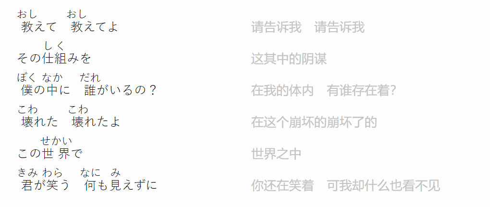
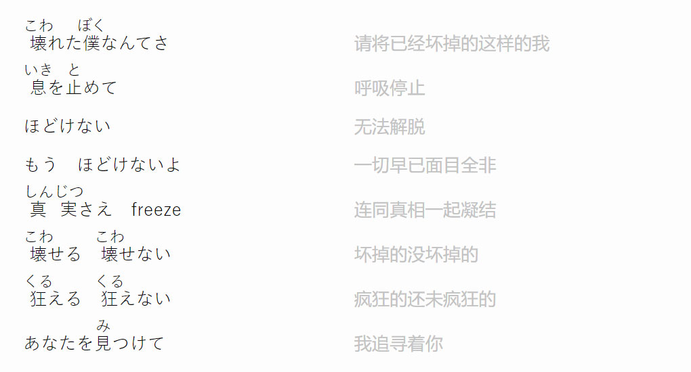
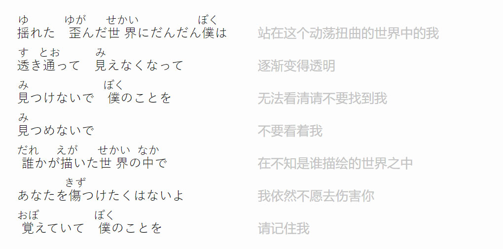

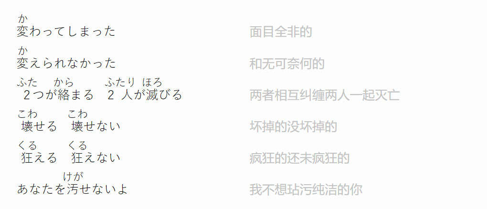
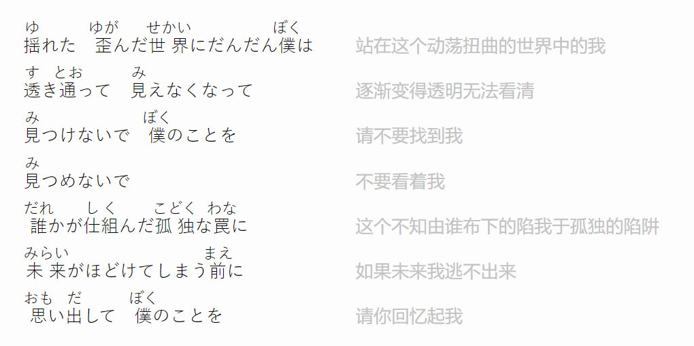
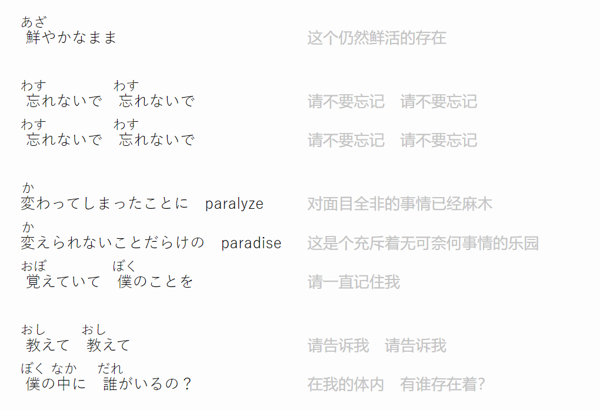

 -->

## 新宝島

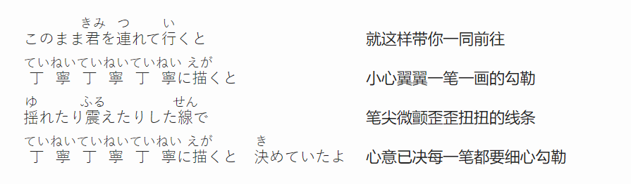

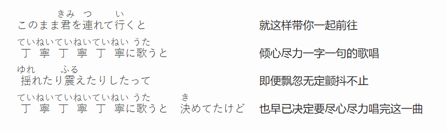
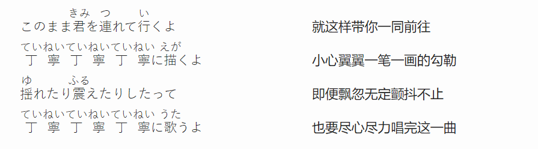
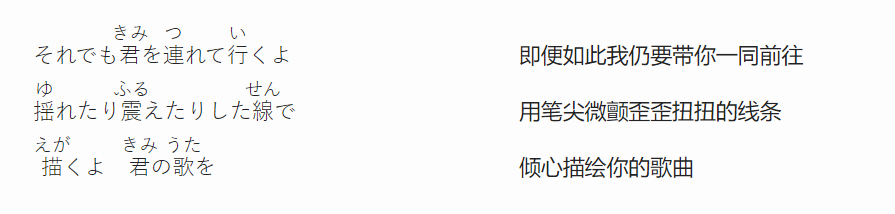

## 恋ひ恋ふ縁

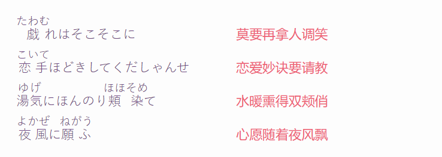
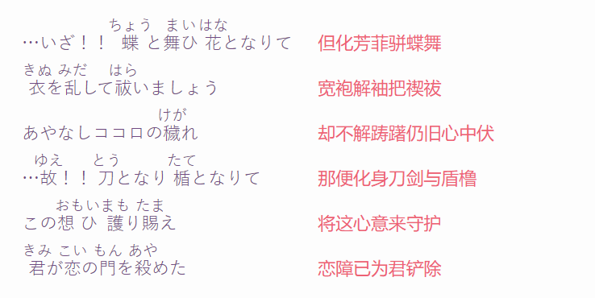

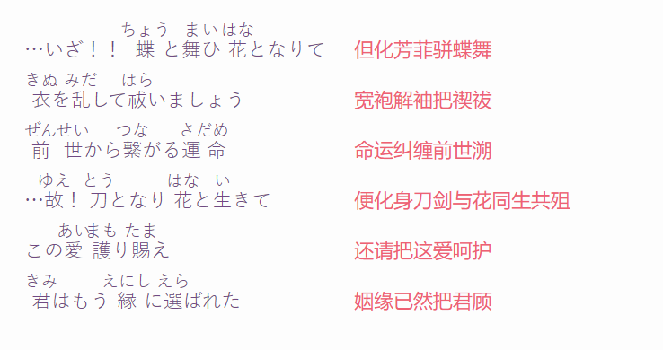

## Bad Apple

