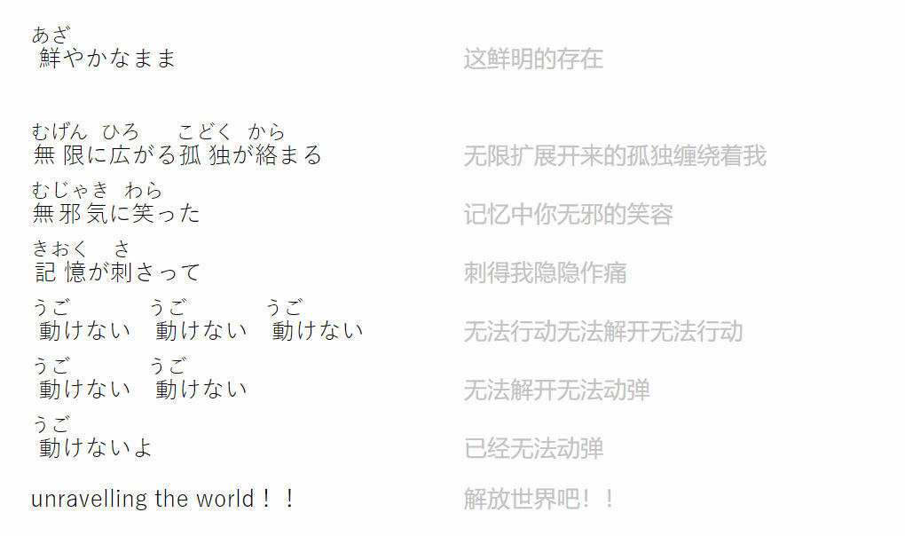
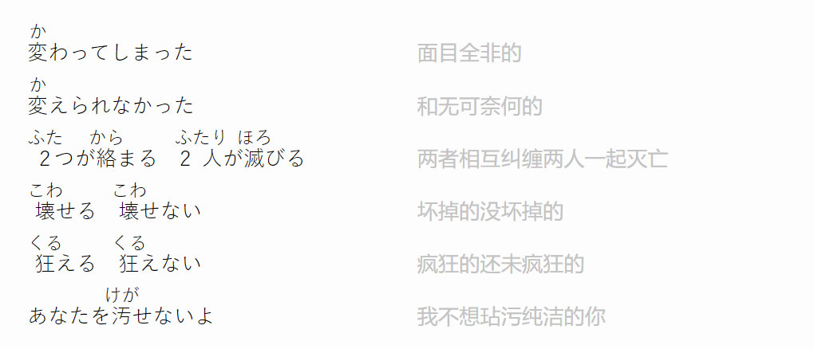
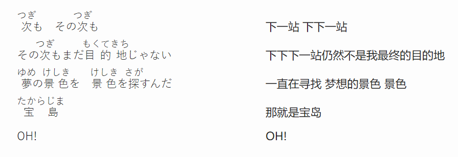
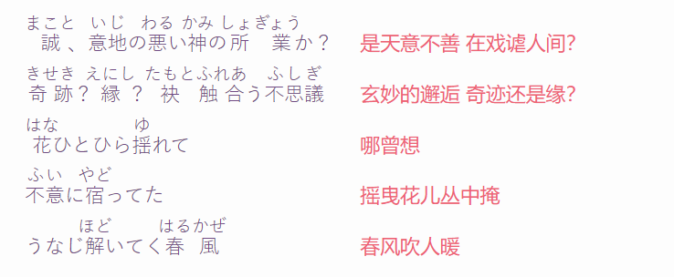
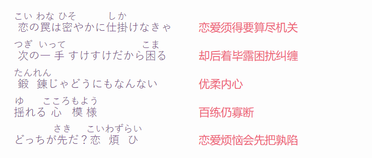

#

# En

## Stay

## Something Just Like This

# Jp

<!-- ## Unravel

 -->

## 新宝島

## 恋ひ恋ふ縁

## Bad Apple

# Ru

## 喀秋莎/カチューシャ

**Расцветали яблони и груши**
**Ra s-vitali yablani_yi gRushi**
**正当梨花开遍了天涯**

**Поплыли туманы над рекой**
**papli tumani na dRiekoi**
**河上飘着柔曼的轻纱**

**Выходила на берег Катюша x2**
**vihaGila na be Reg katiusha**
**喀秋莎站在峻峭的岸上**

**На высокий берег，на крутой x2**
**na visoki beReg na kRutoi**
**歌声好像明媚的春光**

 

**Выходила,песню заводила**
**vihadila pesniu zavadila**
**姑娘唱着美妙的歌曲**

**Про степного，сизого орла**
**pRasti noba siza vhaRla**
**她在歌唱草原的雄鹰**

**Про того，которого любила x2**
**pRaka go_katoRoba liubila**
**她在歌唱心爱的人儿**

**Про того，чьи письма берегла x2**
**pRa tago Gipssoma beRegla**
**她还藏着爱人的书信**

 

**Ой,ты песня，песенка девичья**
**oi topesn visikaG visha**
**啊这歌声姑娘的歌声**

**Ты лети за ясным солнцем вслед**
**tiu_letize yasni satiusui**
**跟着光明的太阳飞去吧**

**И бойцу на дальнем пограничье x2**
**yibi ci_na dalin pagRanishe**
**去向远方边疆的战士**

**От Катюши передай привет x2**
**a kaqushi peReda pRive**
**把喀秋莎的问候传达**

 

**Пусть он вспомнит девушку простую**
**pust tonni jvishike pRasuyi**
**驻守边疆年轻的战士**

**Пусть услышит，как она поёт**
**pustu srisi kaga napayo**
**心中怀念遥远的姑娘**

**Пусть он землю бережёт родную**
**puston zem beReshod Raluyo**
**勇敢战斗保卫祖国**

**А любовь Катюша сбережёт**
**a liba kaqiusha sbaResho**
**喀秋莎爱情永远属于他**

 

**Расцветали яблони и груши**
**Ra s-vitali yablani_yi gRushi**
**正当梨花开遍了天涯**

**Поплыли туманы над рекой**
**papli tumani na dRiekoi**
**河上飘着柔曼的轻纱**

**Выходила на берег Катюша x2**
**vihaGila na be Reg katiusha**
**喀秋莎站在峻峭的岸上**

**На высокий берег，на крутой x2**
**na visoki beReg na kRutoi**
**歌声好像明媚的春光**
