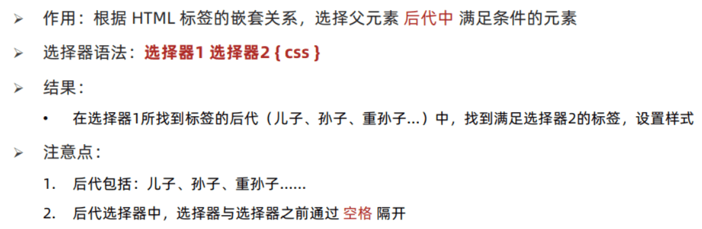
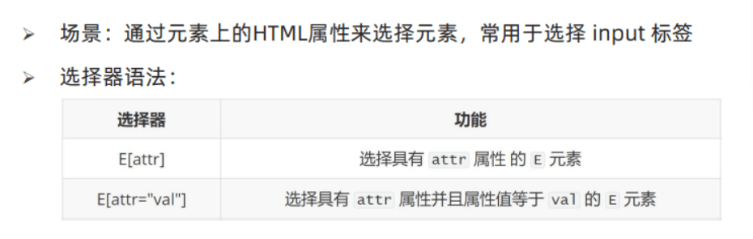
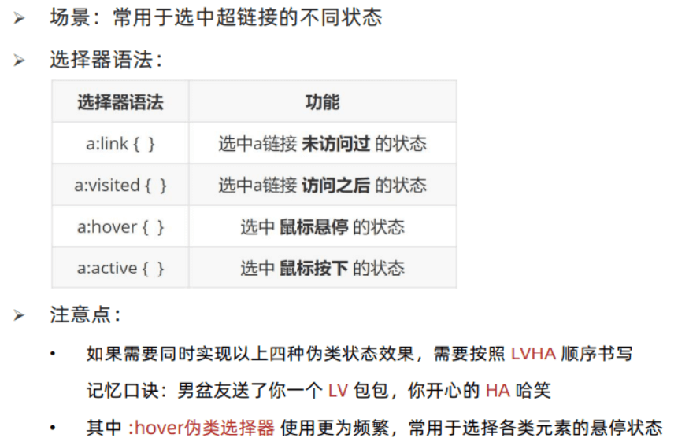
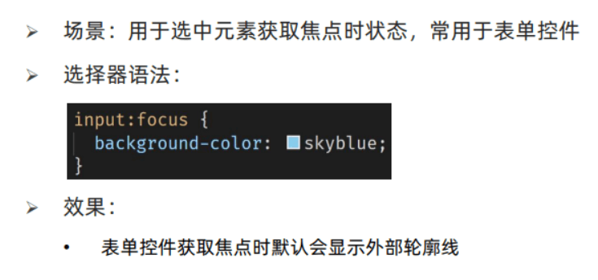
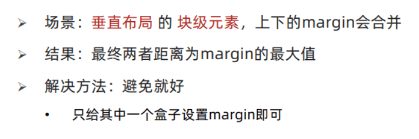
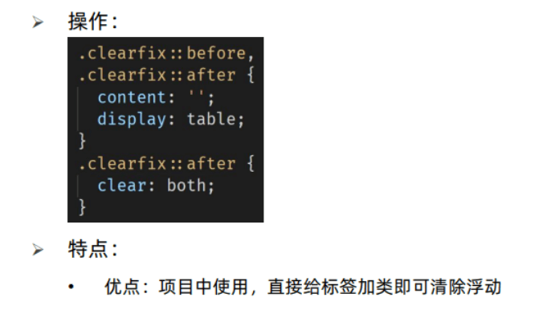
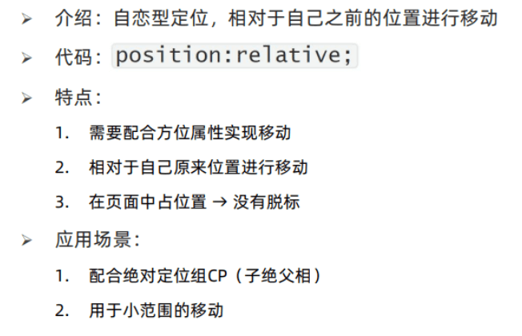
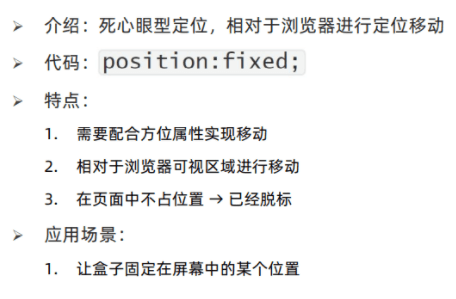
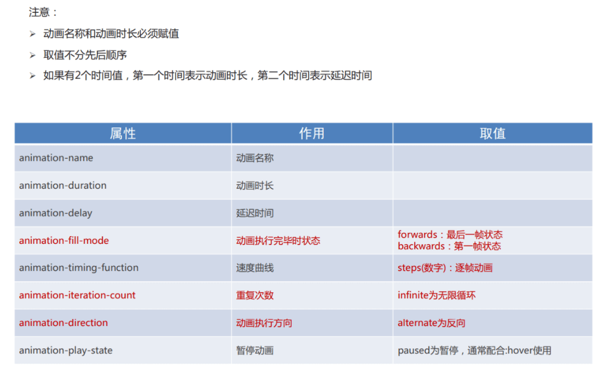

#

# CSS

- 全称： Cascading Style Sheets 层叠样式表

## CSS 引入

| 引入方式 | 书写位置                                      | 作用范围 |
| -------- | --------------------------------------------- | -------- |
| 内嵌式   | CSS 写在 style 标签中                         | 当前页面 |
| 外联式   | CSS 写在单独的 css 文件中，通过 link 标签引入 | 多个页面 |
| 行内式   | CSS 写在标签的 style 属性中                   | 当前标签 |

## CSS 选择器

### 基本选择器


### 后代选择器



### 子代选择器


### 并集选择器


### 属性选择器



### 伪类选择器

#### 结构伪类


#### 链接伪类



#### 焦点伪类



## CSS 三大特性

### 继承性


### 层叠性


### 优先级


### 权重计算


## CSS 盒子模型


### 外边距折叠现象

#### 合并现象



#### 塌陷现象


## CSS 伪元素


## CSS 浮动


### 清除浮动


#### 单伪元素清除


#### 双伪元素清除



## CSS 定位

### 静态定位


### 相对定位



### 绝对定位


### 固定定位



## CSS 平面空间转换

### 过渡


### 位移


### 旋转


### 缩放


### 透视


### 立体呈现


## CSS 动画





## CSS Flex 布局


### 主轴对齐方式


### 侧轴对齐方式


### 主轴方向


### 弹性盒子换行


## CSS 移动端适配

- 常用二倍图

### 媒体查询


```css
@media screen (min-height: 300px) {
  .box {
    color: red;
  }
}
```

### REM

- rem=HTML 标签字号
- 常用 flexible.js

### VW/VH

- vw 为视口宽度 1%
- vh 为视口高度 1%

### 百分比

```css
.box {
  height: 50%;
}
```

## BFC

- BFC 为隔离了的独立容器，容器里面的元素不会在布局上影响到外面的元素，并且 BFC 具有普通容器所没有的一些特性。
- 可以清除浮动，解决 margin 塌陷...


# Less

- Less （Leaner Style Sheets 的缩写） 是一门向后兼容的 CSS 扩展语言。

## 变量（Variables）

```css
@width: 10px;
@height: @width + 10px;

#header {
  width: @width;
  height: @height;
}
/*编译后：*/
#header {
  width: 10px;
  height: 20px;
}
```

## 混合（Mixins）

```css
.bordered {
  border-top: dotted 1px black;
  border-bottom: solid 2px black;
}

#menu a {
  color: #111;
  /*使用bordered的属性*/
  .bordered();
}

.post a {
  color: red;
  /*使用bordered的属性*/
  .bordered();
}
```

## 导入（Importing）

```css
@import "library"; // library.less
@import "typo.css";
```

## 嵌套（Nesting）

```css
.clearfix {
  display: block;
  /*& 表示当前选择器的父级*/
  &:after {
    content: " ";
    display: block;
    visibility: hidden;
  }
  .navigation {
    font-size: 12px;
  }
}
```

### @规则嵌套和冒泡

```css
.component {
  width: 300px;
  @media (min-width: 768px) {
    width: 600px;
    @media (min-resolution: 192dpi) {
      background-image: url(/img/retina2x.png);
    }
  }
  @media (min-width: 1280px) {
    width: 800px;
  }
}
/*编译后：*/
.component {
  width: 300px;
}
@media (min-width: 768px) {
  .component {
    width: 600px;
  }
}
@media (min-width: 768px) and (min-resolution: 192dpi) {
  .component {
    background-image: url(/img/retina2x.png);
  }
}
@media (min-width: 1280px) {
  .component {
    width: 800px;
  }
}
```

## 运算（Operations）

```css
// 所有操作数被转换成相同的单位
@conversion-1: 5cm + 10mm; // 结果是 6cm
@conversion-2: 2 - 3cm - 5mm; // 结果是 -1.5cm

// conversion is impossible
@incompatible-units: 2 + 5px - 3cm; // 结果是 4px

// example with variables
@base: 5%;
@filler: @base * 2; // 结果是 10%
@other: @base + @filler; // 结果是 15%

@base: 2cm * 3mm; // 结果是 6cm

@color: #224488 / 2; //结果是 #112244
background-color: #112244 + #111; // 结果是 #223355
```

## 转义（Escaping）

```css
@min768: (min-width: 768px);
.element {
  @media @min768 {
    font-size: 1.2rem;
  }
}
/*编译后：*/
@media (min-width: 768px) {
  .element {
    font-size: 1.2rem;
  }
}
```

## 函数（Functions）

> https://less.bootcss.com/functions/#less-%E5%87%BD%E6%95%B0

```css
@base: #f04615;
@width: 0.5;

.class {
  width: percentage(@width); // returns `50%`
  color: saturate(@base, 5%);
  background-color: spin(lighten(@base, 25%), 8);
}
```

## 命名空间和访问符

```css
#bundle() {
  .button {
    display: block;
    border: 1px solid black;
    background-color: grey;
    &:hover {
      background-color: white;
    }
  }
  .tab {
    ...;
  }
  .citation {
    ...;
  }
}
#header a {
  color: orange;
  #bundle.button(); // 还可以书写为 #bundle > .button 形式
}
```

## 映射（Maps）

> Less 3.5 版本

```css
#colors() {
  primary: blue;
  secondary: green;
}

.button {
  color: #colors[primary];
  border: 1px solid #colors[secondary];
}

/*编译后*/

.button {
  color: blue;
  border: 1px solid green;
}
```

## 作用域（Scope）

```css
@var: red;

#page {
  @var: white;
  #header {
    color: @var; // white
  }
}
```

# Sass

- Sass (Syntactically Awesome StyleSheets) 强化 CSS 的辅助工具

## 变量（Variables）

```css
$nav-color: #f90;
nav {
  $width: 100px;
  width: $width;
  color: $nav-color;
}

/* 编译后 */

nav {
  width: 100px;
  color: #f90;
}
```

## 嵌套（Nesting）

> 父选择器的标识符&

```css
#content {
  article {
    h1 {
      color: #333;
    }
    p {
      margin-bottom: 1.4em;
    }
  }
  aside {
    background-color: #eee;
  }
}
/* 编译后 */
#content article h1 {
  color: #333;
}
#content article p {
  margin-bottom: 1.4em;
}
#content aside {
  background-color: #eee;
}
```

## 导入（Importing）

```css
@import "colors";
@import "mixins";
@import "grid";
```

## 混合（Mixins）

```css
@mixin rounded-corners {
  -moz-border-radius: 5px;
  -webkit-border-radius: 5px;
  border-radius: 5px;
}

notice {
  background-color: green;
  border: 2px solid #00aa00;
  @include rounded-corners;
}

/*编译后*/

.notice {
  background-color: green;
  border: 2px solid #00aa00;
  -moz-border-radius: 5px;
  -webkit-border-radius: 5px;
  border-radius: 5px;
}
```
