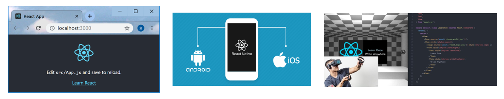
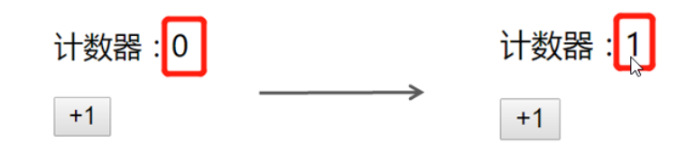
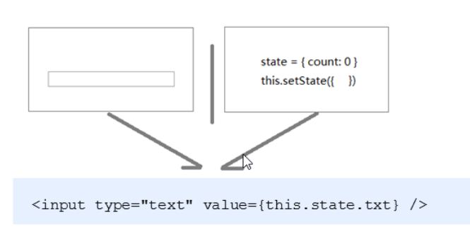
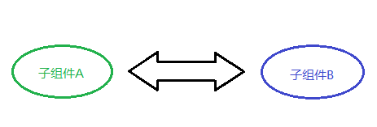
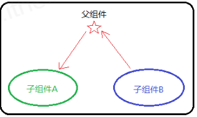
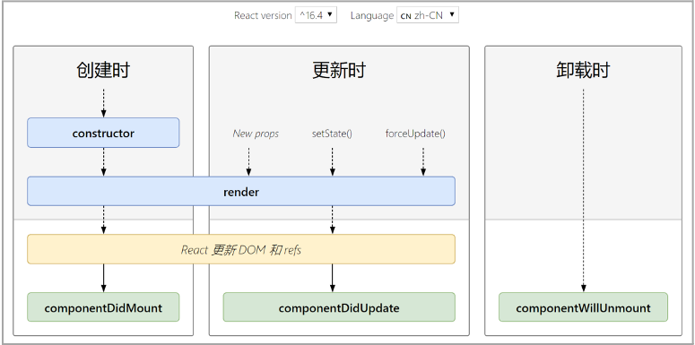
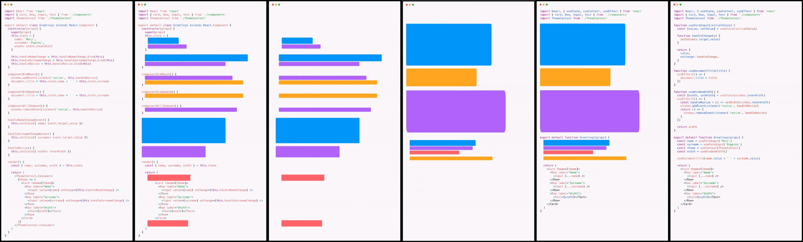
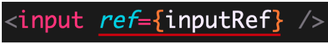
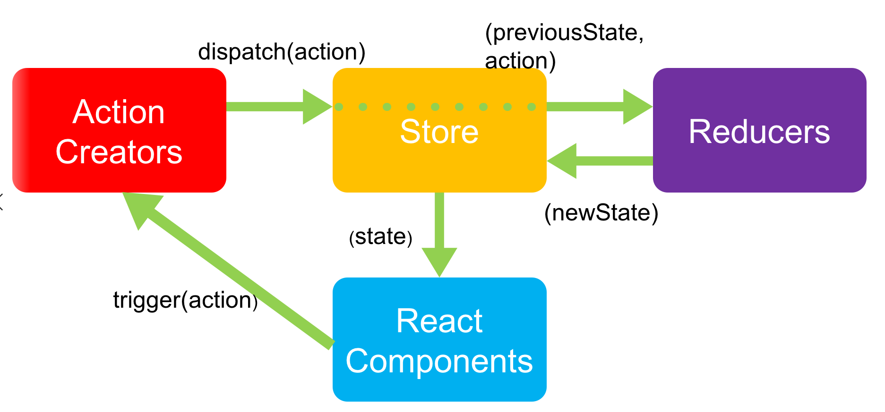

# React


> react 是一个用于构建用户**界面**的 JavaScript 库
>
> react 官网(<https://reactjs.org/>)
>
> react 中文网(https://zh-hans.reactjs.org/)

- React 是一个用于构建用户界面的 JavaScript 库
- 如果从 mvc 的角度来看，React 仅仅是视图层（V）的解决方案。也就是只负责视图的渲染，并非提供了完整了 M 和 C 的功能
- react/react-dom/react-router/redux: 框架
- React 起源于 Facebook 内部项目（News Feed，2011），后又用来架设 Instagram 的网站（2012），并于 2013 年 5 月开源[react 介绍](https://baike.baidu.com/item/react/18077599?fr=aladdin)

- React 是最流行的前端开发框架之一，其他：Vue、Angular 等等[框架对比](https://www.npmtrends.com/react-vs-vue-vs-@angular/core)

## react 特点

### 声明式 UI

你只需要描述 UI（HTML）看起来是什么样的，就跟写 HTML 一样

```js
const jsx = (
  <div className="app">
    <h1>Hello React! 动态数据变化:{count}</h1>
  </div>
);
```

### 组件化

- 组件是 react 中**最重要**的内容
- 组件用于表示页面中的部分内容
- 组合、复用多个组件，就可以实现完整的页面功能


### 学习一次，随处使用

- 使用 react/rect-dom 可以开发 Web 应用
- 使用 react/react-native 可以开发移动端原生应用（react-native） RN 安卓 和 ios 应用 flutter
- 使用 react 可以开发 VR（虚拟现实）应用（react360）



## React CLI

- 命令：`npx create-react-app react-basic`
  - npx create-react-app 是固定命令，`create-react-app` 是 React 脚手架的名称
  - react-basic 表示项目名称，可以修改
- 启动项目：`yarn start` or `npm start`
- `npx` 是 npm v5.2 版本新添加的命令，用来简化 npm 中工具包的使用
  - 原始：
    - 全局安装`npm i -g create-react-app` 2 在通过脚手架的命令来创建 React 项目
  - 现在：
    - npx 调用最新的 create-react-app 直接创建 React 项目

### 基本使用

- 使用步骤

```
- 导入react和react-dom
- 创建react元素(虚拟DOM)
- 渲染react元素到页面中
```

- 导入 react 和 react-dom

```js
// 导入react和react-dom
import React from "react";
import ReactDOM from "react-dom";
```

- 创建 react 元素

```js
// 创建元素
const title = React.createElement("h1", null, "hello react");
```

- 渲染 react 元素到页面

```js
// 渲染react元素
ReactDOM.render(title, document.getElementById("root"));
```

- 使用 sass

```js
// 内置node-sass
npm install sass
```

- CSS IN JS

```js
// 内置CSS Modules
xxx.css改成xxx.module.scss;
import styles from "./index.module.scss";
<div className={styles.fatherBox}></div>;

// 不会被改类名
.fatherBox{
  :global{
    .iconfont{
      color:red;
    }
  }
}
```

## JSX

### JSX 简介

`JSX`是`JavaScript XML`的简写，表示了在 Javascript 代码中写 XML(HTML)格式的代码

优势：声明式语法更加直观，与 HTML 结构相同，降低学习成本，提高开发效率。

**JSX 是 react 的核心内容**

注意：_JSX 不是标准的 JS 语法，是 JS 的语法扩展。脚手架中内置的 [@babel/plugin-transform-react-jsx](@babel/plugin-transform-react-jsx) 包，用来解析该语法。_


### 使用步骤

```
- 导入react和reactDOM包
- 使用jsx语法创建react元素
- 把react元素渲染到页面中
```

- 导入 react 和 reactDOM

```js
// 导入react和react-dom
import React from "react";
import ReactDOM from "react-dom";
```

- 创建 react 元素

```js
// 创建元素
const title = <h1 title="哈哈"></h1>;
```

- 渲染元素

```js
// 渲染元素
ReactDOM.render(title, document.getElementById("root"));
```

### JSX 注意点

- 只有在脚手架中才能使用 jsx 语法
  - 因为 JSX 需要经过 babel 的编译处理，才能在浏览器中使用。脚手架中已经默认有了这个配置。
- JSX 必须要有一个根节点， `<></>` `<React.Fragment></React.Fragment>`
- 没有子节点的元素可以使用`/>`结束

- JSX 中语法更接近与 JavaScript
  - `class` =====> `className`
  - `for`========> `htmlFor`
- JSX 可以换行，如果 JSX 有多行，推荐使用`()`包裹 JSX，防止自动插入分号的 bug

### 嵌入 JavaScript 表达式

> 在 jsx 中可以在`{}`来使用 js 表达式

- 基本使用

```js
const name = "zs";
const age = 18;
const title = (
  <h1>
    姓名：{name}, 年龄：{age}
  </h1>
);
```

- 可以访问对象的属性

```js
const car = {
  brand: "玛莎拉蒂",
};
const title = <h1>汽车：{car.brand}</h1>;
```

- 可以访问数组的下标

```js
const friends = ["张三", "李四"];
const title = <h1>汽车：{friends[1]}</h1>;
```

- 可以使用三元运算符

```js
const gender = 18;
const title = <h1>性别：{age >= 18 ? "是" : "否"}</h1>;
```

- 可以调用方法

```js
function sayHi() {
  return "你好";
}
const title = <h1>姓名：{sayHi()}</h1>;
```

- JSX 本身

```js
const span = <span>我是一个span</span>;
const title = <h1>盒子{span}</h1>;
```

- JSX 中的注释

```js
{/* 这是jsx中的注释 */}   推荐快键键 ctrl + /
```

- 不要出现语句，比如`if` `for`

## 条件/列表渲染

### 条件渲染

> 在 react 中，一切都是 javascript，所以条件渲染完全是通过 js 来控制的

- 通过判断`if/else`控制

```js
const isLoding = false;
const loadData = () => {
  if (isLoding) {
    return <div>数据加载中.....</div>;
  } else {
    return <div>数据加载完成，此处显示加载后的数据</div>;
  }
};

const title = <div>条件渲染：{loadData()}</div>;
```

- 通过三元运算符控制

```js
const isLoding = false;
const loadData = () => {
  return isLoding ? (
    <div>数据加载中.....</div>
  ) : (
    <div>数据加载完成，此处显示加载后的数据</div>
  );
};
```

- 逻辑运算符

```js
const isLoding = false;
const loadData = () => {
  return isLoding && <div>加载中...</div>;
};

const title = <div>条件渲染：{loadData()}</div>;
```

### 列表渲染

> 我们经常需要遍历一个数组来重复渲染一段结构
>
> 在 react 中，通过 map 方法进行列表的渲染

- 列表的渲染

```js
const songs = ["温柔", "倔强", "私奔到月球"];

const list = songs.map((song) => <li>{song}</li>);

const dv = (
  <div>
    <ul>{list}</ul>
  </div>
);
```

- 直接在 JSX 中渲染

```js
const songs = ["温柔", "倔强", "私奔到月球"];

const dv = (
  <div>
    <ul>
      {songs.map((song) => (
        <li>{song}</li>
      ))}
    </ul>
  </div>
);
```

- key 属性的使用

```js
const dv = (
  <div>
    <ul>
      {songs.map((song) => (
        <li key={song}>{song}</li>
      ))}
    </ul>
  </div>
);
```

**注意：列表渲染时应该给重复渲染的元素添加 key 属性，key 属性的值要保证唯一**

**注意：key 值避免使用 index 下标，因为下标会发生改变**

## 样式处理

### 行内样式-style

```js
const dv = (
  <div style={{ color: "red", backgroundColor: "pink" }}>style样式</div>
);
```

### 类名-className

```js
// 导入样式
import "./base.css";
const dv = <div className="title">style样式</div>;
```

base.css 样式文件

```css
.title {
  text-align: center;
  color: red;
  background-color: pink;
}
```

## React 组件

### 函数组件

> 函数组件：使用 JS 的函数或者箭头函数创建的组件

- 为了区分普通标签，函数组件的名称必须`大写字母开头`
- 函数组件`必须有返回值`，表示该组件的结构
- 如果返回值为 null,表示不渲染任何内容

使用函数创建组件

```js
function Hello() {
  return <div>这是我的函数组件</div>;
}
```

使用箭头函数创建组件

```js
const Hello = () => <div>这是一个函数组件</div>;
```

使用组件

```js
ReactDOM.render(<Hello />, document.getElementById("root"));
```

### 类组件

> 类组件：使用 ES6 的 class 语法创建组件

约定 1：类组件的名称必须是大写字母开头

约定 2：类组件应该继承`React.Component`父类，从而可以使用父类中提供的方法或者属性

约定 3：类组件必须提供`render`方法

约定 4：render 方法`必须有返回值`,表示该组件的结构

定义组件

```js
class Hello extends React.Component {
  render() {
    return <div>这是一个类组件</div>;
  }
}
```

使用组件

```js
ReactDOM.render(<Hello />, document.getElementById("root"));
```

### 有状态组件和无状态组件

- 函数组件又叫做**无状态组件** 函数组件是不能自己提供数据【前提：基于 hooks 之前说的】
- 类组件又叫做**有状态组件** 类组件可以自己提供数据，，，，组件内部的状态（数据如果发生了改变，内容会自动的更新）数据驱动视图
- 状态（state）即组件的私有数据，当组件的状态发生了改变，页面结构也就发生了改变。
- 函数组件是没有状态的，只负责页面的展示（静态，不会发生变化）性能比较高
- 类组件有自己的状态，负责**更新 UI**，只要类组件的数据发生了改变，UI 就会发生更新。
- 在复杂的项目中，一般都是由函数组件和类组件共同配合来完成的。【增加了使用者的负担，所以后来有了 hooks】

比如计数器案例，点击按钮让数值+1， 0 和 1 就是不同时刻的状态，当状态从 0 变成 1 之后，UI 也要跟着发生变化。React 想要实现这种功能，就需要使用有状态组件来完成。



### 类组件的状态

- 状态`state`即数据，是组件内部的`私有数据`,只有在组件内部可以使用
- `state的值是一个对象`,表示一个组件中可以有多个数据
- state 的基本使用

```js
class Hello extends React.Component {
  constructor() {
    super();
    // 组件通过state提供数据
    this.state = {
      msg: "hello react",
    };
  }
  render() {
    return <div>state中的数据--{this.state.msg}</div>;
  }
}
```

- 简洁的语法

```js
class Hello extends React.Component {
  state = {
    msg: "hello react",
  };
  render() {
    return <div>state中的数据--{this.state.msg}</div>;
  }
}
```

## 事件处理

### 注册事件

React 注册事件与 DOM 的事件语法非常像

语法`on+事件名=｛事件处理程序｝` 比如`onClick={this.handleClick}`

注意：**React 事件采用驼峰命名法**，比如`onMouseEnter`, `onClick`

```js
class App extends React.Component {
  render() {
    return (
      <div>
        <button onClick={this.handleClick}>点我</button>
      </div>
    );
  }

  handleClick() {
    console.log("点击事件触发了");
  }
}
```

### 事件对象

- 可以通过事件处理程序的参数获取到事件对象

```js
function handleClick(e) {
  e.preventDefault();
  console.log("事件对象", e);
}
<a onClick={this.handleClick}>点我，不会跳转页面</a>;
```

### this 指向问题

> 事件处理程序中的 this 指向的是 undefined
>
> render 方法中的 this 指向的而是当前 react 组件。**只有事件处理程序中的 this 有问题**

```js
class App extends React.Component {
  state = {
    msg: "hello react",
  };
  handleClick() {
    console.log(this.state.msg);
  }
  render() {
    return (
      <div>
        <button onClick={this.handleClick}>点我</button>
      </div>
    );
  }
}
```

### this 指向问题解决方案

```js
方案1：箭头函数
方案2：bind修改this指向
方案3：类实例方法
```

- 在 render 中使用箭头函数

箭头函数的特点：自身没有 this，访问的是外部的 this

方式 1：

```js
class App extends React.Component {
  state = {
    msg: 'hello react'
  }
  render() {
    return (
      <div>
        <button onClick={() => { console.log(this.state.msg) }>点我</button>
      </div>
    )
  }
}
```

缺点：会把大量的 js 处理逻辑放到 JSX 中，将来不容易维护

方式 2

```js
class App extends React.Component {
  state = {
    msg: "hello react",
  };
  handleClick() {
    console.log(this.state.msg);
  }
  render() {
    return (
      <div>
        <button
          onClick={() => {
            this.handleClick();
          }}
        >
          点我
        </button>
      </div>
    );
  }
}
```

缺点：把大量的 js 逻辑写在了 JSX 结构中，不好维护

- 解决方案 2：使用 bind

```js
class App extends React.Component {
  state = {
    msg: "hello react",
  };
  handleClick() {
    console.log(this.state.msg);
  }
  render() {
    return (
      <div>
        <button onClick={this.handleClick.bind(this)}>点我</button>
      </div>
    );
  }
}
```

或者

```js
class App extends React.Component {
  constructor() {
    super();
    this.handleClick = this.handleClick.bind(this);
  }
  state = {
    msg: "hello react",
  };
  handleClick() {
    console.log(this.state.msg);
  }
  render() {
    return (
      <div>
        <button onClick={this.handleClick}>点我</button>
      </div>
    );
  }
}
```

- 解决方案 3：class 实例方法

```js
class App extends React.Component {
  state = {
    msg: "hello react",
  };

  handleClick = () => {
    console.log(this.state.msg);
  };
  render() {
    return (
      <div>
        <button onClick={this.handleClick}>点我</button>
      </div>
    );
  }
}
```

**注意：这个语法是试验性的语法，但是有 babel 的转义，所以没有任何问题**

## 表单处理

> 我们在开发过程中，经常需要操作表单元素，比如获取表单的值或者是设置表单的值。

react 中处理表单元素有两种方式：

- 受控组件
- 非受控组件（DOM 操作）

### 受控组件基本概念

- HTML 中表单元素是可输入的，即表单用户并维护着自己的可变状态（value）。

- 但是在 react 中，可变状态通常是保存在 state 中的，并且要求状态只能通过`setState`进行修改。

- React 中将 state 中的数据与表单元素的 value 值绑定到了一起，`由state的值来控制表单元素的值`
- 受控组件：**value 值受到了 react 控制的表单元素**



### 受控组件使用步骤

1. 在 state 中添加一个状态，作为表单元素的 value 值（控制表单元素的值）
2. 给表单元素添加 change 事件，设置 state 的值为表单元素的值（控制值的变化）

```js
class App extends React.Component {
  state = {
    msg: "hello react",
  };

  handleChange = (e) => {
    this.setState({
      msg: e.target.value,
    });
  };

  render() {
    return (
      <div>
        <input
          type="text"
          value={this.state.msg}
          onChange={this.handleChange}
        />
      </div>
    );
  }
}
```

### 常见的受控组件

- 文本框、文本域、下拉框（操作 value 属性）
- 复选框（操作 checked 属性）

```js
class App extends React.Component {
  state = {
    usernmae: "",
    desc: "",
    city: "2",
    isSingle: true,
  };

  handleName = (e) => {
    this.setState({
      name: e.target.value,
    });
  };
  handleDesc = (e) => {
    this.setState({
      desc: e.target.value,
    });
  };
  handleCity = (e) => {
    this.setState({
      city: e.target.value,
    });
  };
  handleSingle = (e) => {
    this.setState({
      isSingle: e.target.checked,
    });
  };

  render() {
    return (
      <div>
        姓名：
        <input
          type="text"
          value={this.state.username}
          onChange={this.handleName}
        />
        <br />
        描述：<textarea
          value={this.state.desc}
          onChange={this.handleDesc}
        ></textarea>
        <br />
        城市：
        <select value={this.state.city} onChange={this.handleCity}>
          <option value="1">北京</option>
          <option value="2">上海</option>
          <option value="3">广州</option>
          <option value="4">深圳</option>
        </select>
        <br />
        是否单身：
        <input
          type="checkbox"
          checked={this.state.isSingle}
          onChange={this.handleSingle}
        />
      </div>
    );
  }
}
```

### 多表单元素的优化

问题：每个表单元素都需要一个单独的事件处理程序，处理太繁琐

优化：使用一个事件处理程序处理多个表单元素

步骤

- 给表单元素添加 name 属性，名称与 state 属性名相同
- 根据表单元素类型获取对应的值
- 在事件处理程序中通过`[name]`修改对应的 state

```js
class App extends React.Component {
  state = {
    username: "",
    desc: "",
    city: "2",
    isSingle: true,
  };

  handleChange = (e) => {
    let { name, type, value, checked } = e.target;
    console.log(name, type, value, checked);
    value = type === "checkbox" ? checked : value;
    console.log(name, value);
    this.setState({
      [name]: value,
    });
  };
  render() {
    return (
      <div>
        姓名：
        <input
          type="text"
          name="username"
          value={this.state.username}
          onChange={this.handleChange}
        />
        <br />
        描述：<textarea
          name="desc"
          value={this.state.desc}
          onChange={this.handleChange}
        ></textarea>
        <br />
        城市：
        <select
          name="city"
          value={this.state.city}
          onChange={this.handleChange}
        >
          <option value="1">北京</option>
          <option value="2">上海</option>
          <option value="3">广州</option>
          <option value="4">深圳</option>
        </select>
        <br />
        是否单身：
        <input
          type="checkbox"
          name="isSingle"
          checked={this.state.isSingle}
          onChange={this.handleChange}
        />
      </div>
    );
  }
}
```

### 非受控组件-ref

> 非受控组件借助于 ref，使用原生 DOM 的方式来获取表单元素的值

使用步骤

- 调用`React.createRef()`方法创建一个 ref

```js
constructor() {
  super()
  this.txtRef = React.createRef()
}
txtRef = React.createRef()
```

- 将创建好的 ref 对象添加到文本框中

```js
<input type="text" ref={this.txtRef} />
```

- 通过 ref 对象获取文本框的值

```js
handleClick = () => {
  console.log(this.txtRef.current.value);
};
```

非受控组件用的不多，推荐使用受控组件

## 组件通讯

**组件**是独立且封闭的单元，默认情况下，只能使用组件自己的数据。在组件化过程中，我们将一个完整的功能
拆分成多个组件，以更好的完成整个应用的功能。而在这个过程中，多个组件之间不可避免的要共享某些数据
。为了实现这些功能，就需要打破组件的独立封闭性，让其与外界沟通。这个过程就是**组件通讯**。

### props

- 组件是封闭的，要接收外部数据应该通过 props 来实现
- **props 的作用：接收传递给组件的数据**
- 传递数据：给组件标签添加属性
- 接收数据：函数组件通过参数 props 接收数据，类组件通过 this.props 接收数据

### 函数组件通讯

子组件

```js
function Hello(props) {
  console.log(props);
  return <div>接收到数据：{props.name}</div>;
}
```

父组件

```js
<Hello name="jack" age={19} />
```

### 类组件通讯

子组件

```js
class Hello extends React.Component {
  render() {
    return <div>接收到的数据：{this.props.age}</div>;
  }
}
```

父组件

```js
<Hello name="jack" age={19} />
```

### props 的特点

- 可以给组件传递任意类型的数据
- props 是只读的，不允许修改 props 的数据

- 注意：在类组件中使用的时候，**需要把 props 传递给 super()**，否则构造函数无法获取到 props

```js
class Hello extends React.Component {
  constructor(props) {
    // 推荐将props传递给父类构造函数
    super(props);
  }
  render() {
    return <div>接收到的数据：{this.props.age}</div>;
  }
}
```

### 父传子

1. 父组件提供要传递的 state 数据
2. 给子组件标签添加属性，值为 state 中的数据
3. 子组件中通过 props 接收父组件中传递的数据

父组件提供数据并且传递给子组件

```js
class Parent extends React.Component {
  state = { lastName: "王" };
  render() {
    return (
      <div>
        传递数据给子组件：
        <Child name={this.state.lastName} />
      </div>
    );
  }
}
```

子组件接收数据

```js
function Child(props) {
  return <div>子组件接收到数据：{props.name}</div>;
}
```

### 子传父

思路：利用回调函数，父组件提供回调，子组件调用，将要传递的数据作为回调函数的参数。

1. 父组件提供一个回调函数（用于接收数据）
2. 将该函数作为属性的值，传递给子组件
3. 子组件通过 props 调用回调函数
4. 将子组件的数据作为参数传递给回调函数

父组件提供函数并且传递给字符串

```js
class Parent extends React.Component {
  getChildMsg = (msg) => {
    console.log("接收到子组件数据", msg);
  };
  render() {
    return (
      <div>
        子组件：
        <Child getMsg={this.getChildMsg} />
      </div>
    );
  }
}
```

子组件接收函数并且调用

```js
class Child extends React.Component {
    state = { childMsg: 'React' }
    handleClick = () => {
    	this.props.getMsg(this.state.childMsg)
    }
    return (
    	<button onClick={this.handleClick}>点我，给父组件传递数据</button>
    )
}
```

**注意：回调函数中 this 指向问题！**

### 兄弟组件

- 将共享状态提升到最近的公共父组件中，由公共父组件管理这个状态
- 思想：**状态提升**
- 公共父组件职责：
  - 提供共享状态
  - 提供操作共享状态的方法
- 要通讯的子组件只需通过 props 接收状态或操作状态的方法

状态提升前



状态提升之后



### context

- 调用 React. createContext() 创建 Provider（提供数据） 和 Consumer（消费数据） 两个组件。

```js
const { Provider, Consumer } = React.createContext();
```

- 使用 Provider 组件作为父节点。

```js
<Provider>
  <div className="App">
    <Child1 />
  </div>
</Provider>
```

- 设置 value 属性，表示要传递的数据。

```js
<Provider value="pink">
```

- 调用 Consumer 组件接收数据。

```js
<Consumer>{(data) => <span>data参数表示接收到的数据 -- {data}</span>}</Consumer>
```

总结：

1. 如果两个组件是远方亲戚（比如，嵌套多层）可以使用 Context 实现组件通讯
2. Context 提供了两个组件：Provider 和 Consumer
3. Provider 组件：用来提供数据
4. Consumer 组件：用来消费数据

## Props 高级

### children 属性

children 属性：表示该组件的子节点，只要组件有子节点，props 就有该属性

children 属性与普通的 props 一样，值可以是任意值（文本、React 元素、组件，甚至是函数）

```js
function Hello(props) {
  return <div>该组件的子节点：{props.children}</div>;
}

<Hello>我是子节点</Hello>;
```

### Props 校验

2. 导入 prop-types 包
3. 使用组件名.propTypes = {} 来给组件的 props 添加校验规则
4. 校验规则通过 PropTypes 对象来指定

```js
import PropTypes from "prop-types";
function App(props) {
  return <h1>Hi, {props.colors}</h1>;
}
App.propTypes = {
  // 约定colors属性为array类型
  // 如果类型不对，则报出明确错误，便于分析错误原因
  colors: PropTypes.array,
};
```

### 约束规则

1. 常见类型：array、bool、func、number、object、string
2. React 元素类型：element
3. 必填项：isRequired
4. 特定结构的对象：shape({})

```js
// 常见类型
optionalFunc: PropTypes.func,
// 必选
requiredFunc: PropTypes.func.isRequired,
// 特定结构的对象
optionalObjectWithShape: PropTypes.shape({
	color: PropTypes.string,
	fontSize: PropTypes.number
})
```

### Props 默认值

场景：分页组件 每页显示条数
作用：给 props 设置默认值，在未传入 props 时生效

```js
function App(props) {
  return <div>此处展示props的默认值：{props.pageSize}</div>;
}
// 设置默认值
App.defaultProps = {
  pageSize: 10,
};
// 不传入pageSize属性
<App />;
```

### 类的静态属性 static

- 实例成员: 通过实例调用的属性或者方法，，，叫做实例成员（属性或者方法）

- 静态成员：通过类或者构造函数本身才能访问的属性或者方法

```jsx
class Person {
   name = 'zs',
   static age = 18
   sayHi() {
       console.log('哈哈')
   }
   static goodBye() {
       console.log('byebye')
   }
}

const p = new Person()

console.log(p.name)
p.sayHi()

console.log(Person.age)
Person.goodBye()
```

## 组件生命周期

- 意义：组件的生命周期有助于理解组件的运行方式、完成更复杂的组件功能、分析组件错误原因等
- 组件的生命周期：组件从被创建到挂载到页面中运行，再到组件不用时卸载的过程
- 钩子函数的作用：为开发人员在不同阶段操作组件提供了时机。
- **只有 类组件 才有生命周期。**
  <http://projects.wojtekmaj.pl/react-lifecycle-methods-diagram/>



### 挂载阶段

执行时机：组件创建时（页面加载时）

执行顺序：


| 钩子 函数         | 触发时机                    | 作用                                       |
| ----------------- | --------------------------- | ------------------------------------------ |
| constructor       | 创建组件时，最先执行        | 1. 初始化 state 2. 创建 Ref 等             |
| render            | 每次组件渲染都会触发        | 渲染 UI（**注意： 不能调用 setState()** ） |
| componentDidMount | 组件挂载（完成 DOM 渲染）后 | 1. 发送网络请求 2.DOM 操作                 |

### 更新阶段

- 执行时机：1. setState() 2. forceUpdate() 3. 组件接收到新的 props
- 说明：以上三者任意一种变化，组件就会重新渲染
- 执行顺序


| 钩子函数           | 触发时机                    | 作用                                                     |
| ------------------ | --------------------------- | -------------------------------------------------------- |
| render             | 每次组件渲染都会触发        | 渲染 UI（与 挂载阶段 是同一个 render）                   |
| componentDidUpdate | 组件更新（完成 DOM 渲染）后 | DOM 操作，可以获取到更新后的 DOM 内容，不要调用 setState |

### 卸载阶段

- 执行时机：组件从页面中消失

| 钩子函数             | 触发时机                 | 作用                               |
| -------------------- | ------------------------ | ---------------------------------- |
| componentWillUnmount | 组件卸载（从页面中消失） | 执行清理工作（比如：清理定时器等） |

## setState

> setState 本身并不是异步，只是因为 react 的性能优化机制体现为异步。在 react 的生命周期函数或者作用域下为异步，在原生的环境下为同步。

### 修改状态

- 组件中的状态是可变的
- 语法`this.setState({要修改的数据})`
- 注意：不要直接修改 state 中的值，必须通过`this.setState()`方法进行修改
- `setState`的作用

  - 修改 state
  - 更新 UI

- 思想：数据驱动视图

```js
class App extends React.Component {
  state = {
    count: 1,
  };
  handleClick() {
    this.setState({
      count: this.state.count + 1,
    });
  }
  render() {
    return (
      <div>
        <p>次数: {this.state.count}</p>
        <button onClick={this.handleClick.bind(this)}>点我+1</button>
      </div>
    );
  }
}
```

- react 中核心理念：**状态不可变**
  - 不要直接修改 react 中 state 的值，而是提供新的值
  - 直接修改 react 中 state 的值，组件并不会更新

```jsx
state = {
  count: 0,
  list: [],
};
// 直接修改值的操作
this.state.count++;
this.state.list.push("a");

// 创建新的值的操作
this.setState({
  count: this.state.count + 1,
  list: [...this.state.list, "b"],
});
```

### 更新数据

- setState() 是异步更新数据的
- 注意：使用该语法时，后面的 setState() 不要依赖于前面的 setState()

```js
1. 当你调用 setState 的时候，React.js 并不会马上修改 state （为什么）
2. 而是把这个对象放到一个更新队列里面
3. 稍后才会从队列当中把新的状态提取出来合并到 state 当中，然后再触发组件更新。
```

- 可以多次调用 setState() ，只会触发一次重新渲染

```js
this.state = { count: 1 };
this.setState({
  count: this.state.count + 1,
});
console.log(this.state.count); // 1
```

在使用 React.js 的时候，并不需要担心多次进行 `setState` 会带来性能问题。

- 推荐：使用 `setState((preState) => {})` 语法

- 参数 preState: React.js 会把上一个 `setState` 的结果传入这个函数

```js
this.setState((preState) => {
  return {
    count: preState.count + 1,
  };
});
console.log(this.state.count); // 1
```

**这种语法依旧是异步的，但是 state 可以获取到最新的状态，适用于需要调用多次 setState**

### 第二个参数

- 场景：在状态更新（页面完成重新渲染）后立即执行某个操作
- 语法：`setState(updater[, callback])`

```js
this.setState(
  (state) => ({}),
  () => {
    console.log("这个回调函数会在状态更新后立即执行");
  }
);
```

```js
this.setState(
  (state, props) => {},
  () => {
    document.title = "更新state后的标题：" + this.state.count;
  }
);
```

### 组件更新

- setState() 的两个作用： 1. 修改 state 2. 更新组件（UI）
- 过程：父组件重新渲染时，也会重新渲染子组件。但只会渲染当前组件子树（当前组件及其所有子组件）


## 组件性能优化

### 减轻 state

- 减轻 state：只存储跟组件渲染相关的数据（比如：count / 列表数据 / loading 等）
- 注意：不用做渲染的数据不要放在 state 中，比如定时器 id 等
- 对于这种需要在多个方法中用到的数据，应该直接放在 this 中
  - this.xxx = 'bbb'
  - this.xxx

```js
class Hello extends Component {
    componentDidMount() {
        // timerId存储到this中，而不是state中
        this.timerId = setInterval(() => {}, 2000)
    }
    componentWillUnmount() {
    	clearInterval(this.timerId)
    }
    render() { … }
}
```

vue 中不要把和渲染无关的数据放到 data 中

### 避免不必要的重新渲染

- 组件更新机制：父组件更新会引起子组件也被更新，这种思路很清晰
- 问题：子组件没有任何变化时也会重新渲染 （接收到的 props 没有发生任何的改变）
- 如何避免不必要的重新渲染呢？
- 解决方式：使用钩子函数 `shouldComponentUpdate(nextProps, nextState)`

- 作用：通过返回值决定该组件是否重新渲染，返回 true 表示重新渲染，false 表示不重新渲染
- 触发时机：更新阶段的钩子函数，组件重新渲染前执行 （shouldComponentUpdate => render）

```js
class Hello extends Component {
    shouldComponentUpdate() {
        // 根据条件，决定是否重新渲染组件
        return false
    }
    render() {…}
}
```

### 纯组件

- 纯组件：`React.PureComponent` 与 `React.Component `功能相似
- 区别：PureComponent 内部自动实现了 shouldComponentUpdate 钩子，不需要手动比较
- 原理：纯组件内部通过分别 对比 前后两次 props 和 state 的值，来决定是否重新渲染组件

```js
class Hello extends React.PureComponent {
  render() {
    return <div>纯组件</div>;
  }
}
```

**只有在性能优化的时候可能会用到纯组件，不要所有的组件都使用纯组件，因为纯组件需要消耗性能进行对比**

### 纯组件比较-值类型

- 说明：纯组件内部的对比是 shallow compare（浅层对比）

- 对于值类型来说：比较两个值是否相同（直接赋值即可，没有坑）

```js
let number = 0;
let newNumber = number;
newNumber = 2;
console.log(number === newNumber); // false
```

```js
state = { number: 0 };
setState({
  number: Math.floor(Math.random() * 3),
});
// PureComponent内部对比：
最新的state.number === 上一次的state.number; // false，重新渲染组件
```

### 纯组件比较-引用类型

- 说明：纯组件内部的对比是 shallow compare（浅层对比）
- 对于引用类型来说：只比较对象的引用（地址）是否相同

```js
const obj = { number: 0 };
const newObj = obj;
newObj.number = 2;
console.log(newObj === obj); // true
```

```js
state = { obj: { number: 0 } };
// 错误做法
state.obj.number = 2;
setState({ obj: state.obj });
// PureComponent内部比较：
最新的state.obj === 上一次的state.obj; // true，不重新渲染组件
```

纯组件的最佳实践：

注意：state 或 props 中属性值为引用类型时，应该创建新数据，不要直接修改原数据！

```js
// 正确！创建新数据
const newObj = { ...state.obj, number: 2 };
setState({ obj: newObj });
// 正确！创建新数据
// 不要用数组的push / unshift 等直接修改当前数组的的方法
// 而应该用 concat 或 slice 等这些返回新数组的方法
this.setState({
  list: [...this.state.list, { 新数据 }],
});
```

### React.lazy

```jsx
import React from "react";
const Home = React.lazy(() => import("./pages/Home"));

export default function App() {
  return (
    <Router>
      <div className="app">
        <NavLink to={"/login"}>登录</NavLink>
        <NavLink to={"/home"}>首页</NavLink>
        <Suspense fallback={<div>loading...</div>}>
          {/* fallback为加载中默认显示 */}
          <Routes>
            <Route exact path="/" element={<Navigate to="/home" />} />
            <Route path="/login" element={<Login />} />
            <Route path="/home" element={<Home />} />
          </Routes>
        </Suspense>
      </div>
    </Router>
  );
}
```

## Router

### 使用步骤

```js
npm i react-router-dom
```

- `react-router-dom`这个包提供了三个核心的组件

```js
import { HashRouter, Route, Link } from "react-router-dom";
```

- 使用`HashRouter`包裹整个应用，一个项目中只会有一个 Router

```js
<Router>
  <div className="App">// … 省略页面内容</div>
</Router>
```

- 使用 Link 指定导航链接

```js
<Link to="/first">页面一</Link>
<Link to="/two">页面二</Link>
```

- 使用`Route`指定路由规则

```js
// 在哪里写的Route,最终匹配到的组件就会渲染到这
<Route path="/first" component={First}></Route>
```

- Router 组件：包裹整个应用，一个 React 应用只需要使用一次
- 两种常用 Router：`HashRouter` 和 `BrowserRouter`
- HashRouter：使用 URL 的哈希值实现（`localhost:3000/#/first`）

- BrowserRouter：使用 H5 的 history API 实现（`localhost:3000/first`）

```js
import { HashRouter as Router, Route, Link } from "react-router-dom";
```

### Link 与 NavLink

`Link`组件最终会渲染成 a 标签，用于指定路由导航

- to 属性，将来会渲染成 a 标签的 href 属性
- `Link`组件无法实现导航的高亮效果

`NavLink`组件，一个更特殊的`Link`组件，可以用用于指定当前导航高亮

- to 属性，用于指定地址，会渲染成 a 标签的 href 属性
- activeClass: 用于指定高亮的类名，默认`active`
- exact: 精确匹配，表示必须精确匹配类名才生效

### Route

- v6 开始必须被嵌套在`<Routes>`标签内
- 写法：
- ```js
  <Routes>
    <Route></Route>
    <Route></Route>
  </Routes>
  ```

- path 的说明
  - 默认情况下，/能够匹配任意/开始的路径
  - 如果 path 的路径匹配上了，那么就可以对应的组件就会被 render
  - 如果 path 没有匹配上，那么会 render null
  - 如果没有指定 path，那么一定会被渲染
- exact 的说明， exact 表示精确匹配某个路径
  - 一般来说，如果路径配置了 /， 都需要配置 exact 属性

### Switch V5 Routes V6 与 404

> v6 已经把 Switch 移除，改为 Routes
> v6 已经把 component 移除，改为 element，内容为组件标签

- 通常，我们会把`Route`包裹在一个`Switch`组件中

- 在`Switch`组件中，不管有多少个路由规则匹配到了，都只会渲染第一个匹配的组件
- 通过`Switch`组件非常容易的就能实现 404 错误页面的提示
- ```js
  <Switch>
    <Route exact path="/" component={Home} />
    <Route path="/about" component={About} />
    <Route path="/user" component={User} />
    <Route component={NoMatch} />
  </Switch>
  ```

- v6 写法:
- ```js
  <Routes>
    <Route exact path="/" element={<Home />} />
    <Route path="/about" element={<About />} />
    <Route path="/user" element={<User />} />
    <Route element={<NoMatch />} />
  </Routes>
  ```

  ### Redirect V5 Navigate V6

```jsx
<Route path="*" element={<Navigate to="/login" />} />
```

### 编程式导航

> v6 类组件使用 hooks 代替

- 场景：点击登录按钮，登录成功后，通过代码跳转到后台首页，如何实现？
- 编程式导航：通过 JS 代码来实现页面跳转
- history 是 React 路由提供的，用于获取浏览器历史记录的相关信息
- push(path)：跳转到某个页面，参数 path 表示要跳转的路径
- go(n)： 前进或后退到某个页面，参数 n 表示前进或后退页面数量（比如：-1 表示后退到上一页）

```js
class Login extends Component {
    handleLogin = () => {
        // ...
        this.props.history.push('/home')
    }
    render() {...省略其他代码}
}
```

### 动态路由与路由参数获取

> v6 类组件使用 hooks 代替

- 可以使用`:id`的方式来配置动态的路由参数

```js
// 可以匹配 /users/1  /users/2  /users/xxx
<Route path="/users/:id" component={Users} />
```

- 在组件中，通过`props`可以接收到路由的参数

```js
render(){
    console.log(this.props.match.params)
}
```

## 组件复用

- 思考：如果两个组件中的部分功能相似或相同，该如何处理？
- 处理方式：复用相似的功能（联想函数封装）
- 复用什么？1. state 2. 操作 state 的方法 **复用组件的状态和组件的逻辑，组件的 UI 不一样**
- 两种解决方案

  - render-props
  - HOC（高阶组件）

- 注意：这两种方式不是新的 API，而是利用 React 自身特点的编码技巧，演化而成的固定模式（写法）

### mixins（已废弃）

> https://react.docschina.org/blog/2016/07/13/mixins-considered-harmful.html

- mixin 引入了隐式依赖关系
  - 对于组件中的方法和数据的来源不明确，不容易维护
- Mixins 导致名称冲突
- Mixins 导致滚雪球般的复杂性

### render-props

#### 基本使用

- **在使用组件时，添加一个值为函数的 prop，通常把这个 prop 命名为 render，在组件内部调用这个函数。传进来的函数负责渲染 UI**
- 问题 2：如果获取组件内部的状态
- **在组件内部调用方法的时候，把状态当成参数进行传递**

```js
class Mouse extends React.Component {
  // … 省略state和操作state的方法
  render() {
    return this.props.render(this.state);
  }
}
```

```js
<Mouse
  render={(mouse) => (
    <p>
      鼠标当前位置 {mouse.x}，{mouse.y}
    </p>
  )}
/>
```

#### children 代替 render 属性

- 注意：并不是该模式叫 render props 就必须使用名为 render 的 prop，实际上可以使用任意名称的 prop
- 把 prop 是一个函数并且告诉组件要渲染什么内容的技术叫做：render props 模式
- 推荐：使用 children 代替 render 属性

```js
<Mouse>
  {({ x, y }) => (
    <p>
      鼠标的位置是 {x}，{y}
    </p>
  )}
</Mouse>;
// 组件内部：
this.props.children(this.state);
```

```js
// Context 中的用法：
<Consumer>{(data) => <span>data参数表示接收到的数据 -- {data}</span>}</Consumer>
```

#### render-props 优化

- 推荐：给 render props 模式添加 props 校验
- 应该在组件卸载时解除 mousemove 事件绑定

```js
Mouse.propTypes = {
  chidlren: PropTypes.func.isRequired,
};
```

```js
componentWillUnmount() {
 window.removeEventListener('mousemove', this.handleMouseMove)
}
```

封装一个组件，用于提取公共的状态和逻辑，比如鼠标的位置以及鼠标位置的更新，渲染的内容是不确定的，让组件接受一个叫 children 的 prop，而且 children 必须是一个函数

### 高阶组件 HOC higher order component

- 高阶组件（HOC，Higher-Order Component）是一个函数，接收要包装的组件，返回增强后的组件
- 高阶组件的命名： `withMouse` `withRouter` `withXXX`
- 高阶组件内部创建一个类组件，在这个类组件中提供复用的状态逻辑代码，通过 prop 将复用的状态传递给
  被包装组件

```js
const CatWithMouse = withMouse(Cat);
const PositionWithMOuse = withMouse(Position);
```

```js
// 高阶组件内部创建的类组件：
const WithMouse = (Base) => {
  class Mouse extends React.Component {
    // 处理鼠标的位置等操作
    render() {
      return <Base {...this.state} />;
    }
  }
  return Mouse;
};
```

#### 使用步骤

- 创建一个函数，名称约定以 with 开头
- 指定函数参数（作为要增强的组件） 传入的组件只能渲染基本的 UI
- 在函数内部创建一个类组件，**提供复用的状态逻辑代码**，并返回
- 在内部创建的组件的 render 中，需要渲染传入的基本组件，增强功能，通过 props 的方式给基本组件传值
- 调用该高阶组件，传入要增强的组件，通过返回值拿到增强后的组件，并将其渲染到页面中

```js
// 创建组件
const MousePosition = withMouse(Position)

// 渲染组件
<MousePosition />
```

#### 传递 props

- 问题：props 丢失
- 原因：高阶组件没有往下传递 props
- 解决方式：渲染 WrappedComponent 时，将 state 和 this.props 一起传递给组件
- 传递方式：

```js
<WrappedComponent {...this.state} {...this.props} />
```

## Hooks

### 简介

#### Hooks 是什么

- `Hooks`：钩子、钓钩、钩住
- `Hooks` 是 **React v16.8** 中的新增功能
- 作用：为**函数组件**提供状态、生命周期等原本 class 组件中提供的 React 功能
  - 可以理解为通过 Hooks 为函数组件钩入 class 组件的特性
- 注意：**Hooks 只能在函数组件中使用**，自此，函数组件成为 React 的新宠儿

React v16.8 版本前后，组件开发模式的对比：

- React v16.8 以前： class 组件(提供状态) + 函数组件(展示内容)
- React v16.8 及其以后：
  1. class 组件(提供状态) + 函数组件(展示内容)
  2. Hooks(提供状态) + 函数组件(展示内容)
  3. 混用以上两种方式：部分功能用 class 组件，部分功能用 Hooks+函数组件

注意 1：虽然有了 Hooks，但 React 官方并没有计划从 React 库中移除 class。
注意 2：有了 Hooks 以后，不能再把**函数组件**称为无状态组件了，因为 Hooks 为函数组件提供了状态。

#### 为什么要有 Hooks

两个角度：1 组件的状态逻辑复用 2 class 组件自身的问题

1. 组件的状态逻辑复用：

   - 在 Hooks 之前，组件的状态逻辑复用经历了：mixins（混入）、HOCs（高阶组件）、render-props 等模式。
   - （早已废弃）mixins 的问题：1 数据来源不清晰 2 命名冲突。
   - HOCs、render-props 的问题：重构组件结构，导致组件形成 JSX 嵌套地狱问题。

2. class 组件自身的问题：
   - 选择：函数组件和 class 组件之间的区别以及使用哪种组件更合适
   - 需要理解 class 中的 this 是如何工作的
   - 相互关联且需要对照修改的代码被拆分到不同生命周期函数中
     - componentDidMount -> window.addEventListener('resize', this.fn)
     - componentWillUnmount -> window.addEventListener('resize', this.fn)

- 相比于函数组件来说，不利于代码压缩和优化，也不利于 TS 的类型推导

正是由于 React 原来存在的这些问题，才有了 Hooks 来解决这些问题


#### hooks 的优势

由于原来 React 中存在的问题，促使 React 需要一个更好的自带机制来实现组件状态逻辑复用。

1. Hooks 只能在函数组件中使用，避免了 class 组件的问题
2. 复用组件状态逻辑，而无需更改组件层次结构
3. 根据功能而不是基于生命周期方法强制进行代码分割
4. 抛开 React 赋予的概念来说，Hooks 就是一些普通的函数
5. 具有更好的 TS 类型推导
6. tree- - shaking 友 好，打包时去掉未引用的代码
7. 更好的压 缩

项目开发中，Hooks 的采用策略：

- 不推荐直接使用 Hooks 大规模重构现有组件
- 推荐：新功能用 Hooks，复杂功能实现不了的，也可以继续用 class
- 找一个功能简单、非核心功能的组件开始使用 hooks

#### hooks 的使用规则

注意：**React Hooks 只能直接出现在 函数组件 中，不能嵌套在 if/for/其他函数中**！

否则就会报错：React Hook "useState" is called conditionally. React Hooks must be called in the exact same order in every component render

React 的 useState 这个 Hook 被条件性（放在一个条件判断中）的调用了。

React Hooks 必须要每次组件渲染时，按照**相同的顺序**来调用所有的 Hooks。

- 为什么会有这样的规则？ 因为 React 是按照 Hooks 的调用顺序来识别每一个 Hook，如果每次调用的顺序不同，导致 React 无法知道是哪一个 Hook

### useState Hook

#### 概述

问题：Hook 是什么? 一个 Hook 就是一个特殊的函数，让你在函数组件中获取状态等 React 特性
使用模式：函数组件 + Hooks
特点：从名称上看，Hook 都以 use 开头

#### 的基本使用

- 使用场景：当你想要在**函数组件中，使用组件状态时**，就要使用 **useState** Hook 了
- 作用：为函数组件提供状态（state）
- 使用步骤：
  1. 导入 `useState` 函数
  2. 调用 `useState` 函数，并传入状态的初始值
  3. 从 `useState` 函数的返回值中，拿到状态和修改状态的函数
  4. 在 JSX 中展示状态
  5. 在按钮的点击事件中调用修改状态的函数，来更新状态

```js
import { useState } from "react";

const Count = () => {
  // 返回值是一个数组
  const stateArray = useState(0);

  // 状态值 -> 0
  const state = stateArray[0];
  // 修改状态的函数
  const setState = stateArray[1];

  return (
    <div>
      {/* 展示状态值 */}
      <h1>useState Hook -> {state}</h1>
      {/* 点击按钮，让状态值 +1 */}
      <button onClick={() => setState(state + 1)}>+1</button>
    </div>
  );
};
```

- 参数：**状态初始值**。比如，传入 0 表示该状态的初始值为 0
  - 注意：此处的状态可以是任意值（比如，数值、字符串等），而 class 组件中的 state 必须是对象
- 返回值：数组，包含两个值：1 状态值（state） 2 修改该状态的函数（setState）

#### 使用数组解构简化

比如，要获取数组中的元素：

1. 原始方式：索引访问

```js
const arr = ["aaa", "bbb"];

const a = arr[0]; // 获取索引为 0 的元素
const b = arr[1]; // 获取索引为 1 的元素
```

2. 简化方式：数组解构
   - 相当于创建了两个变量（可以是任意的变量名称）分别获取到对应索引的数组元素

```js
const arr = ["aaa", "bbb"];

const [a, b] = arr;
// a => arr[0]
// b => arr[1]

const [state, setState] = arr;
```

- 使用数组解构简化 `useState` 的使用
  - 约定：**修改状态的函数名称以 set 开头，后面跟上状态的名称**

```js
// 解构出来的名称可以是任意名称

const [state, setState] = useState(0);
const [age, setAge] = useState(0);
const [count, setCount] = useState(0);
```

#### 状态的读取和修改

状态的使用：1 读取状态 2 修改状态

1. 读取状态：该方式提供的状态，是函数内部的局部变量，可以在函数内的任意位置使用

2. 修改状态：

- `setCount(newValue)` 是一个函数，参数表示：**新的状态值**
- 调用该函数后，将**使用新的状态值`替换`旧值**
- 修改状态后，因为状态发生了改变，所以，该组件会重新渲染

#### 组件的更新过程

函数组件使用 **useState** hook 后的执行过程，以及状态值的变化：

- 组件第一次渲染：

  1. 从头开始执行该组件中的代码逻辑
  2. 调用 `useState(0)` 将传入的参数作为状态初始值，即：0
  3. 渲染组件，此时，获取到的状态 count 值为： 0

- 组件第二次渲染：
  1. 点击按钮，调用 `setCount(count + 1)` 修改状态，因为状态发生改变，所以，该组件会重新渲染
  2. 组件重新渲染时，会再次执行该组件中的代码逻辑
  3. 再次调用 `useState(0)`，此时 **React 内部会拿到最新的状态值而非初始值**，比如，该案例中最新的状态值为 1
  4. 再次渲染组件，此时，获取到的状态 count 值为：1

注意：**useState 的初始值(参数)只会在组件第一次渲染时生效**。

也就是说，以后的每次渲染，useState 获取到都是最新的状态值。React 组件会记住每次最新的状态值!

#### 为函数组件添加多个状态

问题：如果一个函数组件需要多个状态，该如何处理?
回答：调用 `useState` Hook 多次即可，每调用一次 useState Hook 可以提供一个状态。
注意：useState Hook 多次调用返回的 [state, setState] 相互之间，互不影响。

### useEffect Hook

1. side effect - 副作用
2. useEffect 的基本使用
3. useEffect 的依赖
4. useEffect 发送请求

#### side effect - 副作用

使用场景：当你想要在函数组件中，**处理副作用（side effect）时**，就要使用 **useEffect** Hook 了
作用：**处理函数组件中的副作用（side effect）**

问题：副作用（side effect）是什么?
回答：在计算机科学中，如果一个函数或其他操作修改了其局部环境之外的状态变量值，那么它就被称为有副作用
类比，对于 999 感冒灵感冒药来说：

- （**主**）作用：用于感冒引起的头痛，发热，鼻塞，流涕，咽痛等
- 副作用：可见困倦、嗜睡、口渴、虚弱感

理解：副作用是相对于主作用来说的，一个功能（比如，函数）除了主作用，其他的作用就是副作用
对于 React 组件来说，**主作用就是根据数据（state/props）渲染 UI**，除此之外都是副作用（比如，手动修改 DOM）

React 组件的公式：**UI = f(state)**

常见的副作用（side effect）

- 数据（Ajax）请求、手动修改 DOM、localStorage 操作等

```js
// 不带副作用的情况：
// 该函数的（主）作用：计算两个数的和
function fn(a, b) {
  return a + b;
}

// 带副作用的情况：
let c = 1;
function fn(a, b) {
  // 因为此处修改函数外部的变量值，而这一点不是该函数的主作用，因此，就是：side effect（副作用）
  c = 2;
  return a + b;
}

// 带副作用的情况：
function fn(a, b) {
  // 因为 console.log 会导致控制台打印内容，所以，也是对外部产生影响，所以，也是：副作用
  console.log(a);
  return a + b;
}

// 没有副作用：
function fn(obj) {
  return obj.name;
}

// 有副作用：
function fn(obj) {
  // 此处直接修改了参数的值，也是一个副作用
  obj.name = "大飞哥";
  return obj.name;
}
const o = { name: "小马哥" };
fn(o);
```

#### useEffect 的基本使用

使用场景：当你想要在函数组件中，处理副作用（side effect）时，就要使用 useEffect Hook 了
作用：处理函数组件中的副作用（side effect）
注意：在实际开发中，副作用是不可避免的。因此，react 专门提供了 **useEffect** Hook **来处理函数组件中的副作用**

```js
import { useEffect } from "react";

useEffect(function effect() {
  document.title = `当前已点击 ${count} 次`;
});

useEffect(() => {
  document.title = `当前已点击 ${count} 次`;
});
```

解释：

- 参数：回调函数（称为 **effect**），就是**在该函数中写副作用代码**
- 执行时机：该 effect 会在每次组件更新（DOM 更新）后执行

#### useEffect 的依赖

- 问题：如果组件中有另外一个状态，另一个状态更新时，刚刚的 effect 回调，也会执行
- 性能优化：**跳过不必要的执行，只在 count 变化时，才执行相应的 effect**

```js
useEffect(() => {
  document.title = `当前已点击 ${count} 次`;
}, [count]);
```

解释：

- 第二个参数：可选的，可省略；也可以传一个数组，数组中的元素可以成为依赖项（deps）
- 该示例中表示：只有当 count 改变时，才会重新执行该 effect

#### useEffect 的依赖是一个空数组

useEffect 的第二个参数，还可以是一个**空数组（[]）**，表示只在组件第一次渲染后执行 effect
使用场景：1 事件绑定 2 发送请求获取数据 等

```js
useEffect(() => {
  const handleResize = () => {};
  window.addEventListener("resize", handleResize);
}, []);
```

解释：

- 该 effect 只会在组件第一次渲染后执行，因此，可以执行像事件绑定等只需要执行一次的操作
  - 此时，相当于 class 组件的 componentDidMount 钩子函数的作用
- 跟 useState Hook 一样，一个组件中也可以调用 useEffect Hook 多次
- 推荐：一个 useEffect 只处理一个功能，有多个功能时，使用多次 useEffect

#### 总结 useEffect 的使用

```js
// 触发时机：1 第一次渲染会执行 2 每次组件重新渲染都会再次执行
useEffect(() => {});

// 触发时机：只在组件第一次渲染时执行
useEffect(() => {}, []);

// 触发时机：1 第一次渲染会执行 2 当 count 变化时会再次执行
useEffect(() => {}, [count]);
```

---

#### useEffect 组件卸载时

问题：如何在组件卸载时，解绑事件？此时，就用到 effect 的返回值了

```js
useEffect(() => {
  const handleResize = () => {};
  window.addEventListener("resize", handleResize);
  return () => window.removeEventListener("resize", handleResize);
}, []);
```

解释：

- effect 的返回值也是可选的，可省略。也可以返回一个清理函数，用来执行事件解绑等清理操作
- 清理函数的执行时机：1【空数组没有依赖】组件卸载时 2 【有依赖项】effect 重新执行前（暂时知道即可）
  - 此时，相当于 class 组件的 componentWillUnmount 钩子函数的作用
- 推荐：一个 useEffect 只处理一个功能，有多个功能时，使用多次 useEffect
- 优势：根据业务逻辑来拆分，相同功能的业务逻辑放在一起，而不是根据生命周期方法名称来拆分代码
- 编写代码时，关注点集中；而不是上下翻滚来查看代码

#### useEffect 发送请求

在组件中，使用 useEffect Hook 发送请求获取数据（side effect）：

```js
useEffect(() => {
  const loadData = async () => {};
  loadData();
}, []);
```

解释：

- 注意：**effect 只能是一个同步函数，不能使用 async**
- 因为 effect 的返回值应该是一个清理函数，React 会在组件卸载或者 effect 的依赖项变化时重新执行
- 但如果 effect 是 async 的，此时返回值是 Promise 对象。这样的话，就无法保证清理函数被立即调用
- 如果延迟调用清理函数，也就没有机会忽略过时的请求结果或取消请求
- **为了使用 async/await 语法，可以在 effect 内部创建 async 函数，并调用**

```js
// 错误演示：

// 不要给 effect 添加 async
useEffect(async () => {}, []);
```

### 自定义 hooks

除了使用内置的 Hooks 之外，还可以创建自己的 Hooks（自定义 Hooks）。

使用场景：**将组件状态逻辑提取到可重用的函数（自定义 Hooks）中，实现状态逻辑复用。**

内置 Hooks 为函数组件赋予了 class 组件的功能；在此之上，自定义 Hooks 针对不同组件实现不同状态逻辑复用。

- 自定义 Hooks 是一个函数，**约定函数名称必须以 use 开头，React 就是通过函数名称是否以 use 开头来判断是不是 Hooks**

- Hooks 只能在函数组件中或其他自定义 Hooks 中使用，否则，会报错！
- 自定义 Hooks 用来提取组件的状态逻辑，根据不同功能可以有不同的参数和返回值（就像使用普通函数一样）

### useRef hook

使用场景：在 React 中进行 DOM 操作时，用来获取 DOM

作用：**返回一个带有 current 属性的可变对象，通过该对象就可以进行 DOM 操作了。**

```jsx
const inputRef = useRef(null);
```

解释：

- 参数：在获取 DOM 时，一般都设置为 null
- 返回值：包含 current 属性的对象。



- 注意：只要在 React 中进行 DOM 操作，都可以通过 useRef Hook 来获取 DOM（比如，获取 DOM 的宽高等）。

- 注意：useRef 不仅仅可以用于操作 DOM，还可以操作组件

### useContext hooks

#### context 基础

使用场景：跨组件共享数据。

Context 作用：实现跨组件传递数据，而不必在每个级别手动传递 props，简化组件之间的数据传递过程


Context 对象包含了两个组件

- <Context.Provider value>：通过 value 属性提供数据。

- <Context.Consumer>：通过 render-props 模式，在 JSX 中获取 Context 中提供的数据。


注意：

1. 如果提供了 Provider 组件，Consumer 获取到的是 Provider 中 value 属性的值。
2. 如果没有提供 Provider 组件，Consumer 获取到的是 createContext(defaultValue) 的 defaultValue 值。

#### useContext 使用

作用：在函数组件中，获取 Context 中的值。要配合 Context 一起使用。

useContext Hook 与 <Context.Consumer> 的区别：获取数据的位置不同，

- <Context.Consumer>：在 JSX 中获取 Context 共享的数据。
- useContext：在 JS 代码中获取 Context 的数据。


解释：

- useContext 的参数：Context 对象，即：通过 createContext 函数创建的对象。
- useContext 的返回值：Context 中提供的 value 数据。

### React.memo 高阶组件

#### 介绍

React.memo 高阶组件的使用场景说明：

React 组件更新机制：只要父组件状态更新，子组件就会无条件的一起更新。

- 子组件 props 变化时更新过程：组件代码执行 -> JSX Diff（配合虚拟 DOM）-> 渲染（变化后的内容）【 DOM 操作】。
- 子组件 props 无变化更新过程：组件代码执行 -> JSX Diff（配合虚拟 DOM）【无 DOM 操作】。

注意：此处更新指的是组件代码执行、JSX 进行 Diff 操作（纯 JS 的操作，速度非常快，不会对性能产生太多影响）。

- 如果组件 props 改变了，那么，该组件就必须要更新，才能接收到最新的 props。
- 但是，如果组件 props 没有改变时，组件也要进行一次更新。实际上，这一次更新是没有必要的。

如果要避免组件 props 没有变化而进行的不必要更新（Diff），这种情况下，就要使用 React.memo 高阶组件。

注：`对于 class 组件来说，可以使用 PureComponent 或 shouldComponentUpdate 钩子函数来实现`。

```jsx
import { useState } from "react";
import ReactDOM from "react-dom";

const Child2 = ({ count }) => {
  console.log("Child2 子组件代码执行了");
  return <div style={{ backgroundColor: "#abc" }}>子组件2：{count}</div>;
};

const Child1 = () => {
  console.log("Child1 子组件代码执行了");
  return <div style={{ backgroundColor: "#def" }}>子组件1</div>;
};

const App = () => {
  const [count, setCount] = useState(0);

  return (
    <div style={{ backgroundColor: "pink", padding: 10 }}>
      <h1>计数器：{count}</h1>
      <button onClick={() => setCount(count + 1)}>+1</button>
      <hr />

      {/* 子组件 */}
      <Child1 />
      <br />
      <Child2 count={count} />
    </div>
  );
};

ReactDOM.render(<App />, document.getElementById("root"));
```

#### 语法

使用场景：当你想要避免函数组件 props 没有变化而产生的不必要更新时，就要用到 React.memo 了。

作用：**记忆组件上一次的渲染结果，在 props 没有变化时复用该结果，避免函数组件不必要的更新**。


解释：

- React.memo 是一个高阶组件，用来记忆（memorize）组件。
- 参数（Child）：需要被记忆的组件，或者说是需要避免不必要更新的组件。
- 返回值（MemoChild）：React 记住的 Child 组件。

原理：通过对比检查更新前后 props 是否相同，来决定是否复用上一次的渲染结果，

- 如果相同，复用上一次的渲染结果；
- 如果不同，重新渲染组件。

**并不是所有的组件都适合使用 memo，比如 child2 组件，每次都需要重新渲染，使用 memo 反而会使性能变得更低，逻辑也变得更复杂**

#### 浅层对比

默认情况下，React.memo 只会对更新前后的 props 进行浅对比（shallow compare）与 PureComponent 相同。

也就是说，对于对象类型的 prop 来说，只会比较引用

- 如果更新前后的引用相同，复用上一次的渲染结果（不会重新渲染该组件）。
- 如果更新前后的引用不同，重新渲染该组件。

如果你要手动控制比较过程，可以使用 React.memo 的第二个参数：


解释：

- 第二个参数：用来比较更新前后 props 的函数。
- 返回值：如果返回 true，表示记住（不重新渲染）该组件；如果返回 false，表示重新渲染该组件。

### useCallback hook

#### 使用场景

在使用 React.memo 时，对于对象类型的 props，只会比较引用（浅对比）。

但是，因为**组件每次更新都会创建新的 props 值**，比如，新的对象、事件处理程序等（函数组件的特性）。

这就导致：React.memo 在处理对象类型的 props 时，会失效（每次的 props 都是新对象）。

但是，我们还是想让 React.memo 在处理对象类型的 props 时，也有效。

为了让 React.memo 处理对象类型的 props 有效，只要在*组件更新期间保持对象类型引用相*等，就可以了。

这时候，就要用到以下两个 Hooks：

- `useCallback` Hook：记住函数的引用，在组件每次更新时返回相同引用的函数。
- `useMemo` Hook：记住任意数据（数值、对象、函数等），在组件每次更新时返回相同引用的数据【功能之一】

#### 基本使用

使用场景：在使用 React.memo 时，为了组件每次更新时都能获取到相同引用的函数，就要用到 useCallback Hook

注意：**需要配合 React.memo 高阶函数一起使用**。

作用：记忆传入的回调函数，这个被记住的回调函数会一直生效，直到依赖项发生改变


解释：

- 第一个参数：必选，需要被记忆的回调函数。
- 第二个参数：必选，依赖项数组，用于指定回调函数中依赖（用到）的数据（类似于 useEffect 的第二个参数）。
- 即使没有依赖，也得传入空数组（[]），此时，useCallback 记住的回调函数就会一直生效。
- 返回值：useCallback 记住的回调函数。
- useCallback 记住的回调函数会一直生效（或者说会一直返回同一个回调函数），直到依赖项发生改变。

```jsx
import { useState, memo, useCallback } from "react";
import ReactDOM from "react-dom";

const App = () => {
  const [count, setCount] = useState(0);
  const [money, setMoney] = useState(1000);

  const help = useCallback(() => {
    setCount(count - 1);
  }, [count]);
  return (
    <div>
      <h1>计数器</h1>
      <div>豆豆被打了{count}次</div>
      <div>金钱：{money}</div>
      <button onClick={() => setCount(count + 1)}>打豆豆</button>
      <button onClick={() => setMoney(money + 100)}>加钱</button>
      <hr />
      {count < 5 ? <DouDou count={count} help={help}></DouDou> : "豆豆被打死了"}
    </div>
  );
};

const DouDou = memo(({ count, help }) => {
  console.log("豆豆组件渲染");
  return (
    <div>
      <h3>我是豆豆组件{count}</h3>
      <button onClick={help}>续命</button>
    </div>
  );
});

ReactDOM.render(<App />, document.getElementById("root"));
```

**useCallback 需要配置 React.memo 使用才有意义，不然反而性能更低，因为 useCallback 来包裹函数也是需要开销的**

### useMemo hook

使用场景：类似于 useCallback，可以在组件更新期间保持任意数据引用相等，一般用来处理对象类型的数据

对比：useCallback 只能记忆函数，而 useMemo 可以记忆任意数据。

作用：**记忆任意数据，这个被记住的数据会一直生效，直到依赖项发生改变 1**。


语法

- 第一个参数：必选，回调函数。注意：**该回调函数会被调用，并通过返回值指定需要被记住的数据**。
- 第二个参数：必选，依赖项数组，用于指定回调函数中依赖（用到）的数据。同样，没有依赖项时，传入空数组（[]）。
- 返回值：useMemo 记住的数据
- useMemo 记住的数据会一直生效（或者说会一直返回同一个数据），直到依赖项发生改变。

如何选择使用哪一个？

- 如果处理的是函数，推荐使用 useCallback Hook。
- 如果处理的是其他数据（比如，对象），推荐使用 useMemo Hook。

#### 模拟 useCallback 的用法

> `useCallback(fn, deps)` 相当于 `useMemo(() => fn, deps)`。

```jsx
const help = useCallback(() => {
  setCount(count - 1);
}, [count]);

const help = useMemo(() => {
  return () => {
    setCount(count - 1);
  };
}, [count]);
```

#### 避免昂贵的计算（计算属性）

```js
const memoizedValue = useMemo(() => computeExpensiveValue(a, b), [a, b]);
```

# Redux


## 基本介绍

> 概念

Redux 是 react 中最流行的状态管理工具之一 。

> 起源

React 只是 DOM 的一个抽象层（UI 库），并不是 Web 应用的完整解决方案。因此 react 在涉及到数据的处理以及组件之间的通信时会比较

- 对于大型的复杂应用来说，这两方面恰恰是最关键的。因此，只用 React，写大型应用比较吃力。
- 2014 年 Facebook 提出了 Flux 架构的概念，引发了很多的实现。
- 2015 年，Redux 出现，将 Flux 与函数式编程（reducer）结合一起，很短时间内就成为了最热门的前端架构。
- Flux 是最早的状态管理 工具，它提供了状态管理的思想，也提供对应的实现
- 除了 Flux、Redux 之外，还有：Mobx 等状态管理工具

> 什么时候使用 redux

- 如果你不知道是否需要 Redux，那就是不需要它。
- 只有遇到 React 实在解决不了的问题，你才需要 Redux

> 为什么需要 redux

集中的方式统一管理所有的共享数据

> react 技术栈

- react 核心 react hooks
- react-router（react-router-dom）
- 状态管理： mobx（简单）/ redux（复杂） ----中间件： redux-thunk redux-saga

## redux 安装

1. redux 的作用：[redux 中文文档](https://www.cntofu.com/book/4/README.md) [redux 官网（英文）](https://redux.js.org/introduction/getting-started)
2. redux 安装（在 react 项目中）

```shell
npm i redux react-redux redux-thunk redux-devtools-extension
```

```js
// store
import { createStore, applyMiddleware } from "redux";
import thunk from "redux-thunk";
import { composeWithDevTools } from "redux-devtools-extension";
import reducer from "./reducers";

const store = createStore(reducer, composeWithDevTools(applyMiddleware(thunk)));

export default store;
```

```jsx
// index
import ReactDOM from "react-dom";
import App from "./App";
import "./assets/styles/index.scss";
import { Provider } from "react-redux";
import store from "./store";

ReactDOM.render(
  <Provider store={store}>
    <App></App>
  </Provider>,
  document.getElementById("root")
);
```

redux 和 react 没有任何关系，是一个为 JS 应用程序提供的状态管理工具

## redux 管理流程

`目标`：明确 redux 的状态管理流程



### 理解三个核心概念

- 核心概念：`store`、`action`、`reducer`
  - `store`：仓库，存储了数据，管理者，管理 action 和 reducer
  - `action`：“专家”，只提想法不干活
  - `reducer`：劳动者，搬砖的人

```js
store: redux的仓库
	1. 提供了state与操作state的方法
	2. 一个redux项目中，只有一个store
    3. 是整个redux应用的管理者，指挥action和reducer干活的
action: 表示一个动作（添加内容，删除内容等）
	1. action描述了需要做一件什么样的事情（不执行）
    2. "专家": 只提想法，不干活
reducer: 劳动者
	1. 根据action来完成这个动作
    2. 实际干活的人
    3. reducer不会主动完成action，需要store控制
```

## redux-state 初始数据

`目标`：在非 react 开发环境下先测试 redux 的基本用法，这里先准备数据 state

`内容`：通过文档学习 state 的设计

`要点`：所有的 state 都被保存在一个单一对象中

`核心代码`

```js
// test.html/script
const initState = {
  count: 1,
};
```

## redux-action 基本用法

`目标`：定义一个最基本的 action

`内容`：

1.  actions 只是描述了*有事情发生了*这一事实，而不是真正修改数据的位置
2.  action 是任务的抽象，视图中的每个用户交互都是一个 action，比如：添加任务、删除任务、登录、加入购物车 等
3.  Action 本质上是 JavaScript 普通对象
4.  action 内必须使用一个字符串类型的 `type` 字段来表示将要执行的动作
5.  action 如果数量过多，将来会采用模块化管理的方式，这里先写简单的

`核心代码`

```js
1. action是一个js对象
2. action必须提供type属性，表示动作的类型
3. type属性的值是一个字符串，采用全大写字母表示，多个单词使用_连接
{
	type: "INCREMENT"
}
4. action中除了type，还可以指定动作需要的其他数据
{
	type: "ADD_TODO",
	todoName: '学习redux'
}
5. 将来要完成的所有功能，都抽象成了一个个的动作
```

`注意`：

1. 以上是过程性代码，还没有写完，不能测试
2. action 的编写要点是记住各种规则

## redux-action creator 创建函数

`目标`：使用函数去创建一个 action

`内容`：

1.  直接使用对象来创建 action 不灵活，参数写死了。一般会使用函数来创建 action，我们把创建 action 的函数叫做 actionCreator
2.  action creator 创建函数只是简单的返回一个 action
3.  action creator 创建函数的好处是更容易被移植和测试

`核心代码`

```js
// test.html/script
const increment = {
  type: "INCREMENT",
};
const increment = () => {
  return {
    type: "INCREMENT",
  };
};
const increment = () => ({
  type: "INCREMENT",
});

// 使用action创建函数：（添加任务）
const addTodo = {
  type: "ADD_TODO",
  text: "加班",
};

const addTodo = (text) => ({
  type: "ADD_TODO",
  text,
});
addTodo("加班"); // {type: '', text: ''}
addTodo("下课");
```

`注意`：

1. action 创建函数只是为了易移植

## redux-reducer 函数

`目标`：state、action 都书写完毕，但二者目前没任何关系，通过学习 reducer 将二者产生联系

`内容`：

1. **Reducers** 指定了应用状态的变化如何响应 [actions](https://www.cntofu.com/book/4/docs/basics/Actions.md) 并发送到 store 的（reducer 来根据 action 更新 state 的用法）
2. reducer 就是一个`纯函数`，接收旧的 state 和 action，返回新的 state
3. 不要在 reducer 函数内部直接修改 state（纯函数的要求）

```
1. reducer需要是一个纯函数
2. reducer不能修改传入进来的参数（state），应该根据传入的参数返回新的数据（state)
3. 伪代码语法： (prevState, action) => newState   根据传入的状态和action，完成对应的动作，返回新的状态

注意：
	1. 在reducer中不能修改传入的state状态，保证数据的不可变性（immutability）
    2. 如果有reducer处理不了的任务，需要返回默认的state
```

`核心代码`

```js
// 处理ADD_TODO动作的reducer：
const todos = (state = [], action) => {
  switch (action.type) {
    case 'ADD_TODO':
      // 返回新的state
      return [
        ...state,
        {
          text: action.text,
          completed: false
        }
      ]
  }
  default:
    return state
}

```

`注意`：

1. 要保证 reducer 函数的传函数特点，不要直接修改 state
2. 遇到未知的 action 时，一定要返回旧的 `state`。

### reducer 纯函数的说明

- 特点：只要是固定的输入，必定得到固定的输出
- 原则：（一定要遵守！！！）
  - 不得改写参数
  - 不能调用 Date.now()或者 Math.random()等不纯的方法，因为每次会得到不一样的结果
  - 不能使用全局变量
- 1 reducer 必须是一个纯函数
- 2 纯函数主要的含义就是它不可以修改影响输入值
- 3 没有副作用，副作用指的是例如函数中一些异步调用或者会影响函数作用域之外的变量一类的操作

```js
let num = 1;
// 不要进行以下操作：
function todos() {
  // 1 不要调用以下方法：
  // Date.now()
  // Math.random()
  //
  // 2 ajax 请求之类的操作
  //
  // 3 不要尝试修改作用域外的数据
  // num = 3
}
```

## redux-store 状态管理

`目标`：state、action、reducer 都书写完毕，但目前三者还没联系，reducer 函数没有调用，通过 store 进行使用打通数据管理

`内容`：

1. **Store** 是把 actioin、reducer 联系到一起的对象 => 利用 Redux 的 API 进行创建 createStore()
2. 提供 [`getState()`](https://www.cntofu.com/book/4/docs/api/Store.md#getState) 方法获取 state
3. 提供 [`dispatch(action)`](https://www.cntofu.com/book/4/docs/api/Store.md#dispatch) 方法更新 state；
4. 通过 [`subscribe(listener)`](https://www.cntofu.com/book/4/docs/api/Store.md#subscribe) 注册监听器;
5. 通过 [`subscribe(listener)`](https://www.cntofu.com/book/4/docs/api/Store.md#subscribe) 返回的函数注销监听器。

`核心代码`

```js
//   创建store
const { createStore } = window.Redux;
//   createStore(reducer函数,可选=>state初始值)
let store = createStore(addReducer);
// 打印初始状态
console.log(store.getState()); // {count: 1}
// 每次 state 更新时，打印日志
// 注意 subscribe() 返回一个函数用来注销监听器
const unsubscribe = store.subscribe(() => console.log(store.getState()));

// 发起一系列 action
store.dispatch(add(2));
store.dispatch(add(4));
// 停止监听 state 更新
unsubscribe();
```

`注意`：

1. 注意代码顺序：先创建 store，启动监听，修改数据时自动在监听里面获取最新数据
2. 总结梳理整个流程

## react-redux

`目标`：在脚手架创建的 react 项目中使用最基本的 redux

`内容`：

1. 把 redux 的基本代码该写在 react 项目中的对应文件
2. 考虑代码的模块化和基本拆分

`核心代码`

`store/actions.js`

```js
export const add = (count) => {
  return {
    type: "ADD",
    count,
  };
};
```

`store/reducers.js`

```js
export const addReducer = (
  state = {
    count: 1,
  },
  action
) => {
  switch (action.type) {
    case "ADD":
      return Object.assign({}, state, { count: action.count });
    default:
      return state;
  }
};
```

`index.js`

```js
import ReactDOM from "react-dom";
import App from "./App.js";
import { createStore } from "redux";
import { addReducer } from "./store/reducers";
let store = createStore(addReducer);
ReactDOM.render(<App store={store}></App>, document.querySelector("#root"));
store.subscribe(() => {
  ReactDOM.render(<App store={store}></App>, document.querySelector("#root"));
});
```

`App.js`

```js
import { add } from "./store/actions";
const App = (props) => {
  const {
    store: { getState, dispatch },
  } = props;
  const { count } = getState();
  return (
    <div>
      <h3>App</h3>
      <p>{count}</p>
      <button
        onClick={() => {
          dispatch(add(2));
        }}
      >
        点我+2
      </button>
    </div>
  );
};

export default App;
```

## react-redux 包的基本使用

`目标`：使用[react-redux](https://react-redux.js.org/introduction/getting-started)简化 redux 在 react 项目中的使用

`内容`：

1. 介绍 react-redux => yarn add react-redux
2. 安装并且配置 react-redux => 参考文档
3. 优化刚才的代码

`核心代码`

`store/store.js`

```js
import { createStore } from "redux";
import { addReducer } from "./reducers.js";
let store = createStore(addReducer);
export default store;
```

`store/reducers.js`

```js
export const addReducer = (
  state = {
    count: 1,
  },
  action
) => {
  switch (action.type) {
    case "ADD":
      return Object.assign({}, state, { count: action.count });
    default:
      return state;
  }
};
```

`index.js`

```js
import ReactDOM from "react-dom";
import App from "./App.js";
import store from "./store/store.js";
import { Provider } from "react-redux";
ReactDOM.render(
  <Provider store={store}>
    <App />
  </Provider>,
  document.querySelector("#root")
);
```

`App.js`

```js
import { add } from "./store/actions";
import { connect } from "react-redux";
const App = (props) => {
  console.log(props);
  const { count, dispatch1 } = props;
  return (
    <div>
      <h3>App</h3>
      <p>{count}</p>
      <button
        onClick={() => {
          dispatch1();
        }}
      >
        点我+2
      </button>
    </div>
  );
};

const mapStateToProps = (state, ownProps) => {
  const { count } = state;
  return {
    count,
  };
};
const mapDispatchToProps = (dispatch, ownProps) => {
  return {
    dispatch1: () => {
      dispatch(add(2));
    },
  };
};

export default connect(mapStateToProps, mapDispatchToProps)(App);
```

`要点`：

1. react-redux 只是简化了在 react 项目中使用 redux 的过程
2. redux 和 react-redux 两个包都需要安装和使用，各司其职
3. 需要知道 Provider 和 connect 的作用
4. connect 是高阶组件 => 把 redux 里面数据和修改数据的方法映射到组件中为了使用方便

## react-redux useSelector

`目标`：结合 hooks 使用 react-redux

`内容`：

1. react-redux 提供了 useSelector
2. useSelector： 从 Redux 的 store 中获取 状态(state) 数据。
3. selector 函数应该是个纯函数

`App.js`

```js
// import { add, addAfterOneSecond } from './store/actions'
import { useSelector } from "react-redux";

const App = () => {
  const count = useSelector((state) => state.count);
  return (
    <div>
      <h3>App</h3>
      <p>{count}</p>
      <button
        onClick={() => {
          // dispatch(add(2))
        }}
      >
        点我+2
      </button>
      <button
        onClick={() => {
          // dispatch(addAfterOneSecond(2))
        }}
      >
        点我1s后+2
      </button>
    </div>
  );
};

export default App;
```

`要点`：

- Provider 组件依然需要使用

## react-redux useDispatch

`目标`：结合 hooks 使用 react-redux，修改数据

`内容`：

1. react-redux 提供了 useDispatch
2. useDispatch：修改数据的 hooks

`App.js`

```js
import { add, addAfterOneSecond } from "./store/actions";
import { useSelector, useDispatch } from "react-redux";

const App = () => {
  const count = useSelector((state) => state.count);
  const dispatch = useDispatch();
  return (
    <div>
      <h3>App</h3>
      <p>{count}</p>
      <button
        onClick={() => {
          dispatch(add(2));
        }}
      >
        点我+2
      </button>
      <button
        onClick={() => {
          dispatch(addAfterOneSecond(2));
        }}
      >
        点我1s后+2
      </button>
    </div>
  );
};

export default App;
```

`要点`：无

## redux 异步 action 中间件 redux-thunk

`目标`：如何处理异步的 action 呢？比如点击按钮，1s 后+1

`内容`：

1. [redux-thunk](https://github.com/reduxjs/redux-thunk)的介绍，安装
2. 配置 redux-thunk
3. 编写异步 action
4. App.js 中测试

`核心代码`

`store/reducers.js` 不变

`index.js`不变

`store/store.js`

```js
import { createStore, applyMiddleware } from "redux";
import thunk from "redux-thunk";
import { addReducer } from "./reducers.js";

// let store = createStore(addReducer)
const store = createStore(addReducer, applyMiddleware(thunk));
export default store;
```

`store/actions.js`

```js
export const add = (count) => {
  return {
    type: "ADD",
    count,
  };
};

export const addAfterOneSecond = (count) => {
  return (dispatch) => {
    // console.log(dispatch)
    setTimeout(() => {
      dispatch(add(count));
    }, 1000);
  };
};
```

`App.js`

```js
import { add, addAfterOneSecond } from "./store/actions";
// import { add } from './store/actions'

const App = (props) => {
  const {
    store: { getState, dispatch },
  } = props;
  const { count } = getState();
  return (
    <div>
      <h3>App</h3>
      <p>{count}</p>
      <button
        onClick={() => {
          dispatch(add(2));
        }}
      >
        点我+2
      </button>
      <button
        onClick={() => {
          dispatch(addAfterOneSecond(2));
        }}
      >
        点我1s后+2
      </button>
    </div>
  );
};

export default App;
```

`注意`：

1. redux-thunk 是专门处理 redux 中异步 action 的中间件
2. 当要异步操作数据变化时，需要用 redux-thunk 包
3. 常见的异步：定时器，ajax，注册事件

## redux-devtools-extension 的使用

`目标`：模拟 vue 的 devtools，开发 react 项目时，通过 chrome 开发者工具调试跟踪 redux 状态

`步骤`：

1. 通过包管理器在项目中安装 yarn add redux-devtools-extension
2. 在 index.js 中进行配置和导入
3. 安装 chrome 浏览器插件
4. 启动 react 项目，打开 chrome 开发者工具，测试

`文档` [redux-devtools-exension](https://www.npmjs.com/package/redux-devtools-extension)
