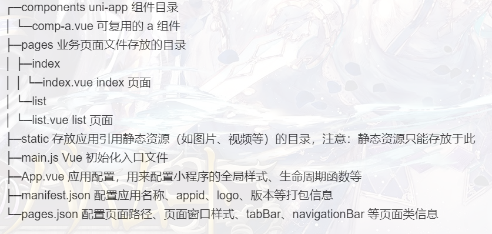

# Uni-App

> uni-app 是一个使用 Vue.js 开发所有前端应用的框架，开发者编写一套代码，可发布到 iOS、Android、Web（响应式）、以及各种小程序（微信/支付宝/百度/头条/飞书/QQ/快手/钉钉/淘宝）、快应用等多个平台。
> 官方文档：https://uniapp.dcloud.io/
> 与 vue 的区别：https://segmentfault.com/a/1190000015684864


## 新建项目

- 全局安装 vue-cli
  `npm install -g @vue/cli`

- 创建 uni-app 正式版
  `vue create -p dcloudio/uni-preset-vue my-project`
- 安装组件语法提示
  `npm i @dcloudio/uni-helper-json`
- 安装 uni-app 语法提示
  `npm i @types/uni-app @types/html5plus -D`
- 在 manifest.json 文件中填写 appid
  ```json
  "mp-weixin": {
     "appid": "-------------", // 填写 appid
     "setting": {
       "urlCheck": false,
       "checkSiteMap": false // 关闭消息提示
     },
     "usingComponents": true
  },
  ```
- 运行、发布 uni-app

  ```
  npm run dev:%PLATFORM%
  npm run build:%PLATFORM%
  ```

  | %PLATFORM%              | 平台                 |
  | ----------------------- | -------------------- |
  | app-plus                | app 平台生成打包资源 |
  | h5                      | H5                   |
  | mp-alipay               | 支付宝小程序         |
  | mp-baidu                | 百度小程序           |
  | mp-weixin               | 微信小程序           |
  | mp-toutiao              | 字节跳动小程序       |
  | mp-lark                 | 飞书小程序           |
  | mp-qq                   | qq 小程序            |
  | mp-360                  | 360 小程序           |
  | mp-kuaishou             | 快手小程序           |
  | quickapp-webview        | 快应用(webview)      |
  | quickapp-webview-union  | 快应用联盟           |
  | quickapp-webview-huawei | 快应用华为           |

- **目录树**
  
