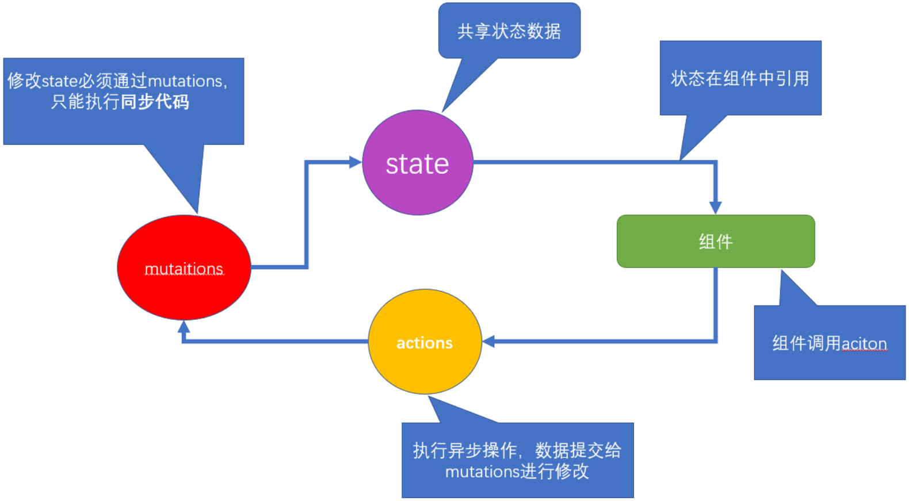

# Vue

> Vue (读音 /vjuː/，类似于 view) 是一套用于构建用户界面的渐进式框架。
> 作者: 尤雨溪

# MVVM 设计模式

- MVVM，一种软件架构模式，决定了写代码的思想和层次
  - M： model 数据模型 (data 里定义)
  - V： view 视图 （html 页面）
  - VM： ViewModel 视图模型 (vue.js 源码)

* MVVM 通过`数据双向绑定`让数据自动地双向同步 **不再需要操作 DOM**
  - V（修改视图） -> M（数据自动同步）
  - M（修改数据） -> V（视图自动同步）


# 插值表达式

> 语法: {{ 表达式 }}

```html
template>
  <div>
    <h1>{{ msg }}</h1>
    <h2>{{ obj.name }}</h2>
    <h3>{{ obj.age > 18 ? '成年' : '未成年' }}</h3>
  </div>
</template>

<script>
export default {
  data() { // 格式固定, 定义vue数据之处
    return {  // key相当于变量名
      msg: "hello, vue",
      obj: {
        name: "小vue",
        age: 5
      }
    }
  }
}
</script>

<style>
</style>
```

# Vue2

## Vue Cli

> @vue/cli 是 Vue 官方提供的一个全局模块包

### 基本使用

- 全局安装

```javascript
npm install -g @vue/cli
```

- 创建项目

```javascript
vue create vuecli-demo
```

- 启动服务

```javascript
npm run serve
```

- Vue 文件

```html
<!-- template必须, 只能有一个根标签, 影响渲染到页面的标签结构 -->
<template>
  <div>欢迎使用vue</div>
</template>

<!-- js相关 -->
<script>
  export default {
    name: "App",
  };
</script>

<!-- 当前组件的样式, 设置scoped, 可以保证样式只对当前页面有效 -->
<!-- 在style上加入scoped属性, 就会在此组件的标签上加上一个随机生成的data-v开头的属性 -->
<style scoped></style>
```

## Vue 指令

### v-bind

> 语法：v-bind:属性名="vue 变量"
> 简写：:属性名="vue 变量"

```html
<!-- vue指令-v-bind属性动态赋值 -->
<a v-bind:href="url">我是a标签</a>

```

### v-on

> 语法
> v-on:事件名="要执行的==少量代码=="
> v-on:事件名="methods 中的函数"
> v-on:事件名="methods 中的函数(实参)"
> 简写: @事件名="methods 中的函数"

```html
<!-- vue指令:   v-on事件绑定-->
<p>你要买商品的数量: {{count}}</p>
<button v-on:click="count = count + 1">增加1</button>
<button v-on:click="addFn">增加1个</button>
<button v-on:click="addCountFn(5)">一次加5件</button>

<button @click="subFn">减少</button>

<script>
  export default {
    // ...其他省略
    methods: {
      addFn() {
        // this代表export default后面的组件对象(下属有data里return出来的属性)
        this.count++;
      },
      addCountFn(num) {
        this.count += num;
      },
      subFn() {
        this.count--;
      },
    },
  };
</script>
```

#### 事件对象

> 语法:
> 无传参, 通过形参直接接收
> 传参, 通过$event 指代事件对象传给事件处理函数

```html
<template>
  <div>
    <a @click="one" href="http://www.baidu.com">阻止百度</a>
    <hr />
    <a @click="two(10, $event)" href="http://www.baidu.com">阻止去百度</a>
  </div>
</template>

<script>
  export default {
    methods: {
      one(e) {
        e.preventDefault();
      },
      two(num, e) {
        e.preventDefault();
      },
    },
  };
</script>
```

### v-model

> 语法: v-model="vue 数据变量"
> 双向数据绑定
> 数据变化 -> 视图自动同步
> 视图变化 -> 数据自动同步

```html
<template>
  <div>
    <!-- 
        v-model:是实现vuejs变量和表单标签value属性, 双向绑定的指令
    -->
    <div>
      <span>用户名:</span>
      <input type="text" v-model="username" />
    </div>
    <div>
      <span>密码:</span>
      <input type="password" v-model="pass" />
    </div>
    <div>
      <span>来自于: </span>
      <!-- 下拉菜单要绑定在select上 -->
      <select v-model="from">
        <option value="北京市">北京</option>
        <option value="南京市">南京</option>
        <option value="天津市">天津</option>
      </select>
    </div>
    <div>
      <!-- (重要)
      遇到复选框, v-model的变量值
      非数组 - 关联的是复选框的checked属性
      数组   - 关联的是复选框的value属性
       -->
      <span>爱好: </span>
      <input type="checkbox" v-model="hobby" value="抽烟" />抽烟
      <input type="checkbox" v-model="hobby" value="喝酒" />喝酒
      <input type="checkbox" v-model="hobby" value="写代码" />写代码
    </div>
    <div>
      <span>性别: </span>
      <input type="radio" value="男" name="sex" v-model="gender" />男
      <input type="radio" value="女" name="sex" v-model="gender" />女
    </div>
    <div>
      <span>自我介绍</span>
      <textarea v-model="intro"></textarea>
    </div>
  </div>
</template>

<script>
  export default {
    data() {
      return {
        username: "",
        pass: "",
        from: "",
        hobby: [],
        sex: "",
        intro: "",
      };
      // 总结:
      // 特别注意: v-model, 在input[checkbox]的多选框状态
      // 变量为非数组, 则绑定的是checked的属性(true/false) - 常用于: 单个绑定使用
      // 变量为数组, 则绑定的是他们的value属性里的值 - 常用于: 收集勾选了哪些值
    },
  };
</script>
```

### v-text/v-html

> 语法:
> v-text="vue 数据变量"
> v-html="vue 数据变量"
> 注意: 会覆盖插值表达式

```html
<template>
  <div>
    <p v-text="str"></p>
    <p v-html="str"></p>
  </div>
</template>

<script>
  export default {
    data() {
      return {
        str: "<span>我是一个span标签</span>",
      };
    },
  };
</script>
```

### v-show/v-if

> 语法:
> v-show="vue 变量"
> v-if="vue 变量"
> 原理
> v-show 用的 display:none 隐藏 (频繁切换使用)
> v-if 直接从 DOM 树上移除

```html
<template>
  <div>
    <h1 v-show="isOk">v-show的盒子</h1>
    <h1 v-if="isOk">v-if的盒子</h1>

    <div>
      <p v-if="age > 18">我成年了</p>
      <p v-else>还得多吃饭</p>
    </div>
  </div>
</template>

<script>
  export default {
    data() {
      return {
        isOk: true,
        age: 15,
      };
    },
  };
</script>
```

> Vue 处理指令时，v-for 比 v-if 具有更高的优先级, 虽然用起来也没报错好使, 但是性能不高

### v-for

> 语法
> v-for="(值, 索引) in 目标结构"
> v-for="值 in 目标结构"
> 目标结构:
> 可以遍历数组 / 对象 / 数字 / 字符串 (可遍历结构)

```html
<template>
  <div id="app">
    <div id="app">
      <!-- v-for 把一组数据, 渲染成一组DOM -->
      <!-- 口诀: 让谁循环生成, v-for就写谁身上 -->
      <p>学生姓名</p>
      <ul>
        <li v-for="(item, index) in arr" :key="item">
          {{ index }} - {{ item }}
        </li>
      </ul>

      <p>学生详细信息</p>
      <ul>
        <li v-for="obj in stuArr" :key="obj.id">
          <span>{{ obj.name }}</span>
          <span>{{ obj.sex }}</span>
          <span>{{ obj.hobby }}</span>
        </li>
      </ul>

      <!-- v-for遍历对象(了解) -->
      <p>老师信息</p>
      <div v-for="(value, key) in tObj" :key="value">
        {{ key }} -- {{ value }}
      </div>

      <!-- v-for遍历整数(了解) - 从1开始 -->
      <p>序号</p>
      <div v-for="i in count" :key="i">{{ i }}</div>
    </div>
  </div>
</template>

<script>
  export default {
    data() {
      return {
        arr: ["小明", "小欢欢", "大黄"],
        stuArr: [
          {
            id: 1001,
            name: "孙悟空",
            sex: "男",
            hobby: "吃桃子",
          },
          {
            id: 1002,
            name: "猪八戒",
            sex: "男",
            hobby: "背媳妇",
          },
        ],
        tObj: {
          name: "小黑",
          age: 18,
          class: "1期",
        },
        count: 10,
      };
    },
  };
</script>
```

> Vue 处理指令时，v-for 比 v-if 具有更高的优先级, 虽然用起来也没报错好使, 但是性能不高

- 这些方法会触发数组改变, v-for 会监测到并更新页面
  - push()
  - pop()
  - shift()
  - unshift()
  - splice()
  - sort()
  - reverse()
- 这些方法不会触发 v-for 更新
  - slice()
  - filter()
  - concat()

### v-cloak

- 本质是一个特殊属性，Vue 实例创建完毕并接管容器后，会删掉 v-cloak 属性。
- 使用:

```html
<style>
  [v-cloak] {
    display: none;
  }
</style>
```

- 配合 `v-cloak `可以解决网速慢时页面展示出{{xxx}}的问题。

### v-once

- `v-once`所在节点在初次动态渲染后，就视为静态内容了。
- 以后数据的改变不会引起`v-once`所在结构的更新，可以用于优化性能。

### v-pre

- 跳过其所在节点的编译过程。
- 可利用它跳过:没有使用指令语法、没有使用插值语法的节点，会加快编译。

## 虚拟 DOM

> vue 文件中的 template 里写的标签, 都是模板, 都要被 vue 处理成虚拟 DOM 对象, 才会渲染显示到真实 DOM 页面上

```html
<template>
  <div id="box">
    <p class="my_p">123</p>
  </div>
</template>
<!-- 虚拟DOM -->
<script>
  const dom = {
    type: "div",
    attributes: [{ id: "box" }],
    children: {
      type: "p",
      attributes: [{ class: "my_p" }],
      text: "123",
    },
  };
</script>
```

### Diff 算法

- 根元素变了, 删除重建

```html
<div id="box">
  <p class="my_p">123</p>
</div>
<ul id="box">
  <li class="my_p">123</li>
</ul>
```

- 根元素没变, 属性改变, ==元素复用==, 更新属性

```html
<div id="box">
  <p class="my_p">123</p>
</div>
<div id="myBox" title="标题">
  <p class="my_p">123</p>
</div>
```

- 根元素没变, 子元素没变, 元素内容改变
- v-for 不会移动 DOM, 而是尝试复用, 就地更新

<br>

- 有 key - 值为索引
- 因为新旧虚拟 DOM 对比, key 存在就复用此标签更新内容, 如果不存在就直接建立一个新的

### 自定义指令

#### 注册

- 局部注册

```html
<script>
  // 目标: 创建 "自定义指令", 让输入框自动聚焦
  // 1. 创建自定义指令
  // 全局 / 局部
  // 2. 在标签上使用自定义指令  v-指令名
  // 注意:
  // inserted方法 - 指令所在标签, 被插入到网页上触发(一次)
  // update方法 - 指令对应数据/标签更新时, 此方法执行
  export default {
    data() {
      return {
        colorStr: "red",
      };
    },
    directives: {
      focus: {
        inserted(el) {
          el.focus();
        },
      },
    },
  };
</script>
```

- 全局注册

```javascript
// 全局指令 - 到处"直接"使用
Vue.directive("gfocus", {
  inserted(el) {
    el.focus(); // 触发标签的事件方法
  },
});
```

#### 传值

```javascript
// 目标: 自定义指令传值
Vue.directive("color", {
  inserted(el, binding) {
    el.style.color = binding.value;
  },
  update(el, binding) {
    el.style.color = binding.value;
  },
});
```

## Vue 修饰符

> 事件修饰符

1. `prevent: `阻止默认事件（常用）;
2. `stop: `阻止事件冒泡（常用）;
3. `once: `事件只触发一次（常用）;
4. `capture:` 使用事件的捕获模式;
5. `self:` 只有 event.target 是当前操作的元素时才触发事件:
6. `passive: `事件的默认行为立即执行,无需等待事件回调执行完毕;

> 按键修饰符

. Vue 中常用的按键别名:

- 回车 => `enter`
- 删除 => `delete `(捕获“删除”和“退格”键)
- 退出 => `esc`
- 空格 => `space`
- 换行 => `tab `(特殊,必须配合 keydown 去使用)
- 上 => `up`
- 下 => `down`
- 左 => `left`
- 右 => `right`

2. Vue 未提供别名的按健，可以使用按健原始的 key 值去绑定，但注意要转为 kebab-case(短横线命名）
3. 系统修饰键（用法特殊）:ctrl、alt、shift、meta
   (1).配合 keyup 使用:按下修饰健的同时，再按下其他键，随后释放其他健，事件才被触发。
   (2).配合 keydown 使用:正常触发事件。
4. 也可以使用 keyCode 去指定具体的按键（不推荐)
5. Vue.config. keyCodes.自定义键名=键码,可以去定制按键别名

## 动态样式

### 动态 class

> 语法:
> :class="{类名: 布尔值}"

```html
template>
  <div>
    <!-- 语法:
      :class="{类名: 布尔值}"
      使用场景: vue变量控制标签是否应该有类名
     -->
    <p :class="{red_str: bool}">动态class</p>
  </div>
</template>

```

### 动态 style

> 语法
> :style="{css 属性: 值}"

```html
<template>
  <div>
    <!-- 动态style语法
      :style="{css属性名: 值}"
     -->
    <p :style="{backgroundColor: colorStr}">动态style</p>
  </div>
</template>
```

## Options ApI

### Vue 过滤器

> 语法:
> Vue.filter("过滤器名", (值) => {return "返回处理后的值"})
> filters: {过滤器名字: (值) => {return "返回处理后的值"}

```html
<template>
  <div>
    <p>原来的样子: {{ msg }}</p>
    <!-- 2. 过滤器使用
      语法: {{ 值 | 过滤器名字 }}
     -->
    <p>使用翻转过滤器: {{ msg | reverse }}</p>
    <p :title="msg | toUp">鼠标长停</p>
  </div>
</template>

<script>
  export default {
    data() {
      return {
        msg: "Hello, Vue",
      };
    },
    // 方式2: 局部 - 过滤器
    // 只能在当前vue文件内使用
    /*
     语法: 
     filters: {
       过滤器名字 (val) {
         return 处理后的值
       }
     }
  */
    filters: {
      toUp(val) {
        return val.toUpperCase();
      },
    },
  };
</script>
```

> 语法:
> 过滤器传参: vue 变量 | 过滤器(实参)
> 多个过滤器: vue 变量 | 过滤器 1 | 过滤器 2

```html
<template>
  <div>
    <p>原来的样子: {{ msg }}</p>
    <!-- 1.
      给过滤器传值
      语法: vue变量 | 过滤器名(值)
     -->
    <p>使用翻转过滤器: {{ msg | reverse('|') }}</p>
    <!-- 2.
      多个过滤利使用
      语法: vue变量 | 过滤器1 | 过滤器2
     -->
    <p :title="msg | toUp | reverse('|')">鼠标长停</p>
  </div>
</template>

<script>
  export default {
    data() {
      return {
        msg: "Hello, Vue",
      };
    },
    filters: {
      toUp(val) {
        return val.toUpperCase();
      },
    },
  };
</script>
```

### Vue 计算属性

> 计算属性是基于它们的依赖项的值结果进行缓存的，只要依赖的变量不变, 都直接从缓存取结果

```javascript
computed: {
    "计算属性名" () {
        return "值"
    }
}
computed: {
    num(){
      return this.a + this.b
    }
  }
// 完整写法
computed: {
    "属性名": {
        set(值){

        },
        get() {
            return "值"
        }
    }
}
```

### Vue 侦听器

> 可以侦听 data/computed 属性值改变

```html
<script>
  export default {
    data() {
      return {
        name: "",
      };
    },
    // 目标: 侦听到name值的改变
    /*
  语法:
    watch: {
      变量名 (newVal, oldVal){
        // 变量名对应值改变这里自动触发
      }
    }
  */
    watch: {
      // newVal: 当前最新值
      // oldVal: 上一刻值
      name(newVal, oldVal) {
        console.log(newVal, oldVal);
      },
    },
  };
</script>
```

> 深度侦听和立即执行

```javascript
watch: {
    "要侦听的属性名": {
        immediate: true, // 立即执行
        deep: true, // 深度侦听复杂类型内变化
        handler (newVal, oldVal) {

        }
    }
}
```

## Vue 组件

### 注册组件

- 全局注册

```javascript
// 1. 创建组件 - 文件名.vue
// 2. 引入组件
import Pannel from "./components/Pannel";
// 3. 全局 - 注册组件
/*
  语法: 
  Vue.component("组件名", 组件对象)
*/
Vue.component("PannelG", Pannel);
```

- 局部注册

```javascript
import 组件对象 from "vue文件路径";

export default {
  components: {
    组件名: 组件对象,
  },
};
```

### 组件通信

#### 父向子-props

```html
<!-- 父 -->
<Product title="好吃的口水鸡" price="50" intro="开业大酬宾, 全场8折"></Product>
<!-- 子 -->
<script>
  export default {
    props: ["title", "price", "intro"],
  };
</script>
```

#### 子向父-自定义事件

> 语法:
> 父: @自定义事件名="父 methods 函数"
> 子: this.$emit("自定义事件名", 传值) - 执行父 methods 里函数代码

#### 全局事件总线

- 一种组件间通信的方式，适用于任意组件间通信。
- 安装全局事件总线:
  ```javascript
  new vue(
    { ...... beforeCreate() { Vue.prototype.$bus = this
  //安装全局事件总线，$bus 就是当前应用的 vm }, ...... })
  ```
- 使用事件总线:
  - 接收数据:A 组件想接收数据，则在 A 组件中给 `$bus` 绑定自定义事件，事件的回调留在 A 组件自身。
    ```javascript
    methods(){
      demo(data){......}
      }
      mounted() {
        this.$bus.$on('xxxx',this.demo)
    }
    ```
  - 提供数据: `this.$bus.$emit('xxxx',数据)`
- 最好在 `beforeDestroy `钩子中，用 `$off` 去解绑当前组件所用到的事件。

### 组件缓存

> keep-alive 组件, 可以让包裹的组件保存在内存中不被销毁
> 生命周期:
> activated - 激活
> deactivated - 失去激活状态

```html
<div style="border: 1px solid red;">
  <!-- Vue内置keep-alive组件, 把包起来的组件缓存起来 -->
  <keep-alive>
    <component :is="comName"></component>
  </keep-alive>
</div>
```

### 组件插槽

#### 默认插槽

> 组件内用占位
> 使用组件时夹着的地方, 传入标签替换 slot

```html
<slot>默认内容</slot>
```

#### 具名插槽

> 传入的标签可以分别派发给不同的 slot 位置
> v-slot 可以简化成#使用

```html
<template>
  <div>
    <!-- 按钮标题 -->
    <div class="title">
      <slot name="title"></slot>
      <span class="btn" @click="isShow = !isShow">
        {{ isShow ? "收起" : "展开" }}
      </span>
    </div>
    <!-- 下拉内容 -->
    <div class="container" v-show="isShow">
      <slot name="content"></slot>
    </div>
  </div>
</template>
<template>
  <div id="container">
    <div id="app">
      <h3>案例：折叠面板</h3>
      <Pannel>
        <template v-slot:title>
          <h4>芙蓉楼送辛渐</h4>
        </template>
        <template v-slot:content>
          
          <span>我是内容</span>
        </template>
      </Pannel>
      <Pannel>
        <template #title>
          <span style="color: red;">我是标题</span>
        </template>
        <template #content>
          <p>寒雨连江夜入吴,</p>
          <p>平明送客楚山孤。</p>
          <p>洛阳亲友如相问，</p>
          <p>一片冰心在玉壶。</p>
        </template>
      </Pannel>
    </div>
  </div>
</template>

<script>
  import Pannel from "../components/04/Pannel";
  export default {
    components: {
      Pannel,
    },
  };
</script>
```

#### 作用域插槽

> 子组件里值, 在给插槽赋值时在父组件环境下使用

```html
<template>
  <div>
    <!-- 按钮标题 -->
    <div class="title">
      <h4>芙蓉楼送辛渐</h4>
      <span class="btn" @click="isShow = !isShow">
        {{ isShow ? "收起" : "展开" }}
      </span>
    </div>
    <!-- 下拉内容 -->
    <div class="container" v-show="isShow">
      <slot :row="defaultObj">{{ defaultObj.defaultOne }}</slot>
    </div>
  </div>
</template>

<script>
  // 目标: 作用域插槽
  // 场景: 使用插槽, 使用组件内的变量
  // 1. slot标签, 自定义属性和内变量关联
  // 2. 使用组件, template配合v-slot="变量名"
  // 变量名会收集slot身上属性和值形成对象
  export default {
    data() {
      return {
        isShow: false,
        defaultObj: {
          defaultOne: "无名氏",
          defaultTwo: "小传同学",
        },
      };
    },
  };
</script>
<template>
  <div id="container">
    <div id="app">
      <h3>案例：折叠面板</h3>
      <Pannel>
        <!-- 需求: 插槽时, 使用组件内变量 -->
        <!-- scope变量: {row: defaultObj} -->
        <template v-slot="scope">
          <p>{{ scope.row.defaultTwo }}</p>
        </template>
      </Pannel>
    </div>
  </div>
</template>

<script>
  import Pannel from "../components/05/Pannel";
  export default {
    components: {
      Pannel,
    },
  };
</script>
```

## Vue 生命周期

| 阶段   | 方法名        | 方法名    |
| ------ | ------------- | --------- |
| 初始化 | beforeCreate  | created   |
| 挂载   | beforeMount   | mounted   |
| 更新   | beforeUpdate  | updated   |
| 销毁   | beforeDestroy | destroyed |


### 初始化

1.new Vue() – Vue 实例化(组件也是一个小的 Vue 实例)

2.Init Events & Lifecycle – 初始化事件和生命周期函数

3.beforeCreate – 生命周期钩子函数被执行

4.Init injections&reactivity – Vue 内部添加 data 和 methods 等

5.created – 生命周期钩子函数被执行, 实例创建

6.接下来是编译模板阶段 –开始分析

7.Has el option? – 是否有 el 选项 – 检查要挂到哪里

​ 没有. 调用$mount()方法

​ 有, 继续检查 template 选项

### 挂载

1.template 选项检查

​ 有 - 编译 template 返回 render 渲染函数

​ 无 – 编译 el 选项对应标签作为 template(要渲染的模板)

2.虚拟 DOM 挂载成真实 DOM 之前

3.beforeMount – 生命周期钩子函数被执行

4.Create … – 把虚拟 DOM 和渲染的数据一并挂到真实 DOM 上

5.真实 DOM 挂载完毕

6.mounted – 生命周期钩子函数被执行

### 更新

1.当 data 里数据改变, 更新 DOM 之前

2.beforeUpdate – 生命周期钩子函数被执行

3.Virtual DOM…… – 虚拟 DOM 重新渲染, 打补丁到真实 DOM

4.updated – 生命周期钩子函数被执行

5.当有 data 数据改变 – 重复这个循环

### 销毁

1.当$destroy()被调用 – 比如组件 DOM 被移除(例 v-if)

2.beforeDestroy – 生命周期钩子函数被执行

3.拆卸数据监视器、子组件和事件侦听器

4.实例销毁后, 最后触发一个钩子函数

5.destroyed – 生命周期钩子函数被执行

## \$nextTick 和\$refs

### $refs

```html
<template>
  <div>
    <p>1. 获取原生DOM元素</p>
    <h1 id="h" ref="myH">我是一个孤独可怜又能吃的h1</h1>
  </div>
</template>

<script>
  // 目标: 获取组件对象
  // 1. 创建组件/引入组件/注册组件/使用组件
  // 2. 组件起别名ref
  // 3. 恰当时机, 获取组件对象
  export default {
    mounted() {
      console.log(document.getElementById("h")); // h1
      console.log(this.$refs.myH); // h1
    },
  };
</script>
```

### $nextTick

> Vue 更新 DOM-异步的
> 点击 count++, 马上通过"原生 DOM"拿标签内容, 无法拿到新值

```html
<template>
  <div>
    <p>1. 获取原生DOM元素</p>
    <h1 id="h" ref="myH">我是一个孤独可怜又能吃的h1</h1>
    <p>2. 获取组件对象 - 可调用组件内一切</p>
    <Demo ref="de"></Demo>
    <p>3. vue更新DOM是异步的</p>
    <p ref="myP">{{ count }}</p>
    <button @click="btn">点击count+1, 马上提取p标签内容</button>
  </div>
</template>

<script>
  // 目标: 获取组件对象
  // 1. 创建组件/引入组件/注册组件/使用组件
  // 2. 组件起别名ref
  // 3. 恰当时机, 获取组件对象
  import Demo from "./Child/Demo";
  export default {
    mounted() {
      console.log(document.getElementById("h")); // h1
      console.log(this.$refs.myH); // h1

      let demoObj = this.$refs.de;
      demoObj.fn();
    },
    components: {
      Demo,
    },
    data() {
      return {
        count: 0,
      };
    },
    methods: {
      btn() {
        this.count++; // vue监测数据更新, 开启一个DOM更新队列(异步任务)
        console.log(this.$refs.myP.innerHTML); // 0

        // 原因: Vue更新DOM异步
        // 解决: this.$nextTick()
        // 过程: DOM更新完会挨个触发$nextTick里的函数体
        this.$nextTick(() => {
          console.log(this.$refs.myP.innerHTML); // 1
        });
      },
    },
  };
</script>
```

## Vue 动画

写法：

1.  准备好样式：

    - 元素进入的样式：
      1. v-enter：进入的起点
      2. v-enter-active：进入过程中
      3. v-enter-to：进入的终点
    - 元素离开的样式：
      1. v-leave：离开的起点
      2. v-leave-active：离开过程中
      3. v-leave-to：离开的终点

2.  使用`<transition>`包裹要过度的元素，并配置 name 属性：

    ```vue
    <transition name="hello">
     <h1 v-show="isShow">你好啊！</h1>
    </transition>
    ```

3.  备注：若有多个元素需要过度，则需要使用：`<transition-group>`，且每个元素都要指定`key`值。

## Vue Router

### Vue-router 基本使用

1. 安装 vue-router，命令：`npm i vue-router`

2. 应用插件：`Vue.use(VueRouter)`

3. 编写 router 配置项:

   ```js
   //引入VueRouter
   import VueRouter from "vue-router";
   //引入Luyou 组件
   import About from "../components/About";
   import Home from "../components/Home";

   //创建router实例对象，去管理一组一组的路由规则
   const router = new VueRouter({
     routes: [
       {
         path: "/about",
         component: About,
       },
       {
         path: "/home",
         component: Home,
       },
     ],
   });

   //暴露router
   export default router;
   ```

4. 实现切换（active-class 可配置高亮样式）

   ```vue
   <router-link active-class="active" to="/about">About</router-link>
   ```

5. 指定展示位置

   ```vue
   <router-view></router-view>
   ```

- **几个注意点**
  - 路由组件通常存放在`pages`文件夹，一般组件通常存放在`components`文件夹。
  - 通过切换，“隐藏”了的路由组件，默认是被销毁掉的，需要的时候再去挂载。
  - 每个组件都有自己的`$route`属性，里面存储着自己的路由信息。
  - 整个应用只有一个 router，可以通过组件的`$router`属性获取到。

### 多级路由

1. 配置路由规则，使用 children 配置项：

   ```js
   routes: [
     {
       path: "/about",
       component: About,
     },
     {
       path: "/home",
       component: Home,
       children: [
         //通过children配置子级路由
         {
           path: "news", //此处一定不要写：/news
           component: News,
         },
         {
           path: "message", //此处一定不要写：/message
           component: Message,
         },
       ],
     },
   ];
   ```

2. 跳转（要写完整路径）：

   ```vue
   <router-link to="/home/news">News</router-link>
   ```

### 路由的 query 参数

1. 传递参数

   ```vue
   <!-- 跳转并携带query参数，to的字符串写法 -->
   <router-link :to="/home/message/detail?id=666&title=你好">跳转</router-link>

   <!-- 跳转并携带query参数，to的对象写法 -->
   <router-link
     :to="{
       path: '/home/message/detail',
       query: {
         id: 666,
         title: '你好',
       },
     }"
   >跳转</router-link>
   ```

2. 接收参数：

   ```js
   $route.query.id;
   $route.query.title;
   ```

### 命名路由

1. 作用：可以简化路由的跳转。

2. 如何使用

   1. 给路由命名：

      ```js
      {
       path:'/demo',
       component:Demo,
       children:[
        {
         path:'test',
         component:Test,
         children:[
          {
            name:'hello' //路由命名
            path:'welcome',
            component:Hello,
          }
         ]
        }
       ]
      }
      ```

   2. 简化跳转：

      ```vue
      <!--简化前，需要写完整的路径 -->
      <router-link to="/demo/test/welcome">跳转</router-link>

      <!--简化后，直接通过名字跳转 -->
      <router-link :to="{ name: 'hello' }">跳转</router-link>

      <!--简化写法配合传递参数 -->
      <router-link
        :to="{
          name: 'hello',
          query: {
            id: 666,
            title: '你好',
          },
        }"
      >跳转</router-link>
      ```

### 路由的 params 参数

1. 配置路由，声明接收 params 参数

   ```js
   {
    path:'/home',
    component:Home,
    children:[
     {
      path:'news',
      component:News
     },
     {
      component:Message,
      children:[
       {
        name:'xiangqing',
        path:'detail/:id/:title', //使用占位符声明接收params参数
        component:Detail
       }
      ]
     }
    ]
   }
   ```

2. 传递参数

   ```vue
   <!-- 跳转并携带params参数，to的字符串写法 -->
   <router-link :to="/home/message/detail/666/你好">跳转</router-link>

   <!-- 跳转并携带params参数，to的对象写法 -->
   <router-link
     :to="{
       name: 'xiangqing',
       params: {
         id: 666,
         title: '你好',
       },
     }"
   >跳转</router-link>
   ```

   > 特别注意：路由携带 params 参数时，若使用 to 的对象写法，则不能使用 path 配置项，必须使用 name 配置！

3. 接收参数：

   ```js
   $route.params.id;
   $route.params.title;
   ```

### 路由的 props 配置

​ 作用：让路由组件更方便的收到参数

```js
{
	name:'xiangqing',
	path:'detail/:id',
	component:Detail,

	//第一种写法：props值为对象，该对象中所有的key-value的组合最终都会通过props传给Detail组件
	// props:{a:900}

	//第二种写法：props值为布尔值，布尔值为true，则把路由收到的所有params参数通过props传给Detail组件
	// props:true

	//第三种写法：props值为函数，该函数返回的对象中每一组key-value都会通过props传给Detail组件
	props(route){
		return {
			id:route.query.id,
			title:route.query.title
		}
	}
}
```

### `<router-link>`的 replace 属性

1. 作用：控制路由跳转时操作浏览器历史记录的模式
2. 浏览器的历史记录有两种写入方式：分别为`push`和`replace`，`push`是追加历史记录，`replace`是替换当前记录。路由跳转时候默认为`push`
3. 如何开启`replace`模式：`<router-link replace .......>News</router-link>`

### 编程式路由导航

1. 作用：不借助`<router-link> `实现路由跳转，让路由跳转更加灵活

2. 具体编码：

   ```js
   //$router的两个API
   this.$router.push({
     name: "xiangqing",
     params: {
       id: xxx,
       title: xxx,
     },
   });

   this.$router.replace({
     name: "xiangqing",
     params: {
       id: xxx,
       title: xxx,
     },
   });
   this.$router.forward(); //前进
   this.$router.back(); //后退
   this.$router.go(); //可前进也可后退
   ```

### 缓存路由组件

1. 作用：让不展示的路由组件保持挂载，不被销毁。

2. 具体编码：

   - 缓存单个组件

     ```vue
     <keep-alive include="News"> 
         <router-view></router-view>
     </keep-alive>
     ```

   - 缓存多个组件
     ```vue
     <keep-alive :include="['News', 'Message']">
         <router-view></router-view>
     </keep-alive>
     ```

### 路由组件的生命周期钩子

1. 作用：路由组件所独有的两个钩子，用于捕获路由组件的激活状态。
2. 具体名字：
   1. `activated`路由组件被激活时触发。
   2. `deactivated`路由组件失活时触发。

### 路由守卫

1. 作用：对路由进行权限控制

2. 分类：全局守卫、独享守卫、组件内守卫

3. 全局守卫:

   ```js
   //全局前置守卫：初始化时执行、每次路由切换前执行
   router.beforeEach((to, from, next) => {
     console.log("beforeEach", to, from);
     if (to.meta.isAuth) {
       //判断当前路由是否需要进行权限控制
       if (localStorage.getItem("school") === "atguigu") {
         //权限控制的具体规则
         next(); //放行
       } else {
         alert("暂无权限查看");
         // next({name:'guanyu'})
       }
     } else {
       next(); //放行
     }
   });

   //全局后置守卫：初始化时执行、每次路由切换后执行
   router.afterEach((to, from) => {
     console.log("afterEach", to, from);
     if (to.meta.title) {
       document.title = to.meta.title; //修改网页的title
     } else {
       document.title = "vue_test";
     }
   });
   ```

4. 独享守卫:

   ```js
   beforeEnter(to,from,next){
   	console.log('beforeEnter',to,from)
   	if(to.meta.isAuth){ //判断当前路由是否需要进行权限控制
   		if(localStorage.getItem('school') === 'atguigu'){
   			next()
   		}else{
   			alert('暂无权限查看')
   			// next({name:'guanyu'})
   		}
   	}else{
   		next()
   	}
   }
   ```

5. 组件内守卫：

   ```js
   //进入守卫：通过路由规则，进入该组件时被调用
   beforeRouteEnter (to, from, next) {
   },
   //离开守卫：通过路由规则，离开该组件时被调用
   beforeRouteLeave (to, from, next) {
   }
   ```

### 路由器的两种工作模式

1. 对于一个 url 来说，什么是 hash 值？—— #及其后面的内容就是 hash 值。
2. hash 值不会包含在 HTTP 请求中，即：hash 值不会带给服务器。
3. hash 模式：
   1. 地址中永远带着#号，不美观 。
   2. 若以后将地址通过第三方手机 app 分享，若 app 校验严格，则地址会被标记为不合法。
   3. 兼容性较好。
4. history 模式：
   1. 地址干净，美观 。
   2. 兼容性和 hash 模式相比略差。
   3. 应用部署上线时需要后端人员支持，解决刷新页面服务端 404 的问题。

## Vuex

> uex 是一个专为 Vue.js 应用程序开发的状态管理模式。它采用**集中式存储管理应用的所有组件的状态，并以相应的规则保证状态以一种可预测**的方式发生变化。



### 搭建 Vuex 环境

1. 创建文件：`src/store/index.js`

   ```js
   //引入Vue核心库
   import Vue from "vue";
   //引入Vuex
   import Vuex from "vuex";
   //应用Vuex插件
   Vue.use(Vuex);

   //准备actions对象——响应组件中用户的动作
   const actions = {};
   //准备mutations对象——修改state中的数据
   const mutations = {};
   //准备state对象——保存具体的数据
   const state = {};

   //创建并暴露store
   export default new Vuex.Store({
     actions,
     mutations,
     state,
   });
   ```

2. 在`main.js`中创建 vm 时传入`store`配置项

   ```js
   ......
   //引入store
   import store from './store'
   ......

   //创建vm
   new Vue({
    el:'#app',
    render: h => h(App),
    store
   })
   ```

### Vuex 基本使用

1. 初始化数据、配置`actions`、配置`mutations`，操作文件`store.js`

   ```js
   //引入Vue核心库
   import Vue from "vue";
   //引入Vuex
   import Vuex from "vuex";
   //引用Vuex
   Vue.use(Vuex);

   const actions = {
     //响应组件中加的动作
     jia(context, value) {
       // console.log('actions中的jia被调用了',miniStore,value)
       context.commit("JIA", value);
     },
   };

   const mutations = {
     //执行加
     JIA(state, value) {
       // console.log('mutations中的JIA被调用了',state,value)
       state.sum += value;
     },
   };

   //初始化数据
   const state = {
     sum: 0,
   };

   //创建并暴露store
   export default new Vuex.Store({
     actions,
     mutations,
     state,
   });
   ```

2. 组件中读取 vuex 中的数据：`$store.state.sum`

3. 组件中修改 vuex 中的数据：`$store.dispatch('action中的方法名',数据)` 或 `$store.commit('mutations中的方法名',数据)`

   > 备注：若没有网络请求或其他业务逻辑，组件中也可以越过 actions，即不写`dispatch`，直接编写`commit`

### getters 的使用

1. 概念：当 state 中的数据需要经过加工后再使用时，可以使用 getters 加工。

2. 在`store.js`中追加`getters`配置

   ```js
   ......

   const getters = {
    bigSum(state){
     return state.sum * 10
    }
   }

   //创建并暴露store
   export default new Vuex.Store({
    ......
    getters
   })
   ```

3. 组件中读取数据：`$store.getters.bigSum`

### map 方法的使用

1. <strong>mapState 方法：</strong>用于帮助我们映射`state`中的数据为计算属性

   ```js
   computed: {
       //借助mapState生成计算属性：sum、school、subject（对象写法）
        ...mapState({sum:'sum',school:'school',subject:'subject'}),

       //借助mapState生成计算属性：sum、school、subject（数组写法）
       ...mapState(['sum','school','subject']),
   },
   ```

2. <strong>mapGetters 方法：</strong>用于帮助我们映射`getters`中的数据为计算属性

   ```js
   computed: {
       //借助mapGetters生成计算属性：bigSum（对象写法）
       ...mapGetters({bigSum:'bigSum'}),

       //借助mapGetters生成计算属性：bigSum（数组写法）
       ...mapGetters(['bigSum'])
   },
   ```

3. <strong>mapActions 方法：</strong>用于帮助我们生成与`actions`对话的方法，即：包含`$store.dispatch(xxx)`的函数

   ```js
   methods:{
       //靠mapActions生成：incrementOdd、incrementWait（对象形式）
       ...mapActions({incrementOdd:'jiaOdd',incrementWait:'jiaWait'})

       //靠mapActions生成：incrementOdd、incrementWait（数组形式）
       ...mapActions(['jiaOdd','jiaWait'])
   }
   ```

4. <strong>mapMutations 方法：</strong>用于帮助我们生成与`mutations`对话的方法，即：包含`$store.commit(xxx)`的函数

   ```js
   methods:{
       //靠mapActions生成：increment、decrement（对象形式）
       ...mapMutations({increment:'JIA',decrement:'JIAN'}),

       //靠mapMutations生成：JIA、JIAN（对象形式）
       ...mapMutations(['JIA','JIAN']),
   }
   ```

> 备注：mapActions 与 mapMutations 使用时，若需要传递参数需要：在模板中绑定事件时传递好参数，否则参数是事件对象。

### 模块化+命名空间

1. 目的：让代码更好维护，让多种数据分类更加明确。

2. 修改`store.js`

   ```javascript
   const countAbout = {
     namespaced:true,//开启命名空间
     state:{x:1},
     mutations: { ... },
     actions: { ... },
     getters: {
       bigSum(state){
          return state.sum * 10
       }
     }
   }

   const personAbout = {
     namespaced:true,//开启命名空间
     state:{ ... },
     mutations: { ... },
     actions: { ... }
   }

   const store = new Vuex.Store({
     modules: {
       countAbout,
       personAbout
     }
   })
   ```

3. 开启命名空间后，组件中读取 state 数据：

   ```js
   //方式一：自己直接读取
   this.$store.state.personAbout.list
   //方式二：借助mapState读取：
   ...mapState('countAbout',['sum','school','subject']),
   ```

4. 开启命名空间后，组件中读取 getters 数据：

   ```js
   //方式一：自己直接读取
   this.$store.getters['personAbout/firstPersonName']
   //方式二：借助mapGetters读取：
   ...mapGetters('countAbout',['bigSum'])
   ```

5. 开启命名空间后，组件中调用 dispatch

   ```js
   //方式一：自己直接dispatch
   this.$store.dispatch('personAbout/addPersonWang',person)
   //方式二：借助mapActions：
   ...mapActions('countAbout',{incrementOdd:'jiaOdd',incrementWait:'jiaWait'})
   ```

6. 开启命名空间后，组件中调用 commit

   ```js
   //方式一：自己直接commit
   this.$store.commit('personAbout/ADD_PERSON',person)
   //方式二：借助mapMutations：
   ...mapMutations('countAbout',{increment:'JIA',decrement:'JIAN'}),
   ```

# Vue3

## Vite

> 创建项目 npm init vite-app 项目名称 或者 yarn create vite-app 项目名称
> 安装依赖 npm i 或者 yarn
> 启动项目 npm run dev 或者 yarn dev

## Compositon API

> 官方文档: https://v3.cn.vuejs.org/guide/composition-api-introduction.html

### setup 函数

1. 理解：Vue3.0 中一个新的配置项，值为一个函数。
2. setup 是所有<strong style="color:#DD5145">Composition API（组合 API）</strong><i style="color:gray;font-weight:bold">“ 表演的舞台 ”</i>。
3. 组件中所用到的：数据、方法等等，均要配置在 setup 中。
4. setup 函数的两种返回值：
   1. 若返回一个对象，则对象中的属性、方法, 在模板中均可以直接使用。（重点关注！）
   2. <span style="color:#aad">若返回一个渲染函数：则可以自定义渲染内容。（了解）</span>
5. 注意点：
   1. 尽量不要与 Vue2.x 配置混用
      - Vue2.x 配置（data、methos、computed...）中<strong style="color:#DD5145">可以访问到</strong>setup 中的属性、方法。
      - 但在 setup 中<strong style="color:#DD5145">不能访问到</strong>Vue2.x 配置（data、methos、computed...）。
      - 如果有重名, setup 优先。
   2. setup 不能是一个 async 函数，因为返回值不再是 return 的对象, 而是 promise, 模板看不到 return 对象中的属性。（后期也可以返回一个 Promise 实例，但需要 Suspense 和异步组件的配合）

### ref 函数

- 作用: 定义一个响应式的数据
- 语法: `const xxx = ref(initValue)`
  - 创建一个包含响应式数据的<strong style="color:#DD5145">引用对象（reference 对象，简称 ref 对象）</strong>。
  - JS 中操作数据： `xxx.value`
  - 模板中读取数据: 不需要.value，直接：`<div>{{xxx}}</div>`
- 备注：
  - 接收的数据可以是：基本类型、也可以是对象类型。
  - 基本类型的数据：响应式依然是靠`Object.defineProperty()`的`get`与`set`完成的。
  - 对象类型的数据：内部 <i style="color:gray;font-weight:bold">“ 求助 ”</i> 了 Vue3.0 中的一个新函数—— `reactive`函数。

### reactive 函数

- 作用: 定义一个<strong style="color:#DD5145">对象类型</strong>的响应式数据（基本类型不要用它，要用`ref`函数）
- 语法：`const 代理对象= reactive(源对象)`接收一个对象（或数组），返回一个<strong style="color:#DD5145">代理对象（Proxy 的实例对象，简称 proxy 对象）</strong>
- reactive 定义的响应式数据是“深层次的”。
- 内部基于 ES6 的 Proxy 实现，通过代理对象操作源对象内部数据进行操作。

### reactive 对比 ref

- 从定义数据角度对比：
  - ref 用来定义：<strong style="color:#DD5145">基本类型数据</strong>。
  - reactive 用来定义：<strong style="color:#DD5145">对象（或数组）类型数据</strong>。
  - 备注：ref 也可以用来定义<strong style="color:#DD5145">对象（或数组）类型数据</strong>, 它内部会自动通过`reactive`转为<strong style="color:#DD5145">代理对象</strong>。
- 从原理角度对比：
  - ref 通过`Object.defineProperty()`的`get`与`set`来实现响应式（数据劫持）。
  - reactive 通过使用<strong style="color:#DD5145">Proxy</strong>来实现响应式（数据劫持）, 并通过<strong style="color:#DD5145">Reflect</strong>操作<strong style="color:orange">源对象</strong>内部的数据。
- 从使用角度对比：
  - ref 定义的数据：操作数据<strong style="color:#DD5145">需要</strong>`.value`，读取数据时模板中直接读取<strong style="color:#DD5145">不需要</strong>`.value`。
  - reactive 定义的数据：操作数据与读取数据：<strong style="color:#DD5145">均不需要</strong>`.value`。

### setup 注意点

- setup 执行的时机
  - 在 beforeCreate 之前执行一次，this 是 undefined。
- setup 的参数
  - props：值为对象，包含：组件外部传递过来，且组件内部声明接收了的属性。
  - context：上下文对象
    - attrs: 值为对象，包含：组件外部传递过来，但没有在 props 配置中声明的属性, 相当于 `this.$attrs`。
    - slots: 收到的插槽内容, 相当于 `this.$slots`。
    - emit: 分发自定义事件的函数, 相当于 `this.$emit`。

### computed 函数

- 与 Vue2.x 中 computed 配置功能一致

- 写法

  ```js
  import {computed} from 'vue'

  setup(){
      ...
  	//计算属性——简写
      let fullName = computed(()=>{
          return person.firstName + '-' + person.lastName
      })
      //计算属性——完整
      let fullName = computed({
          get(){
              return person.firstName + '-' + person.lastName
          },
          set(value){
              const nameArr = value.split('-')
              person.firstName = nameArr[0]
              person.lastName = nameArr[1]
          }
      })
  }
  ```

### watch 函数

- 与 Vue2.x 中 watch 配置功能一致

- 两个小“坑”：

  - 监视 reactive 定义的响应式数据时：oldValue 无法正确获取、强制开启了深度监视（deep 配置失效）。
  - 监视 reactive 定义的响应式数据中某个属性时：deep 配置有效。

  ```js
  //情况一：监视ref定义的响应式数据
  watch(
    sum,
    (newValue, oldValue) => {
      console.log("sum变化了", newValue, oldValue);
    },
    { immediate: true }
  );

  //情况二：监视多个ref定义的响应式数据
  watch([sum, msg], (newValue, oldValue) => {
    console.log("sum或msg变化了", newValue, oldValue);
  });

  /* 情况三：监视reactive定义的响应式数据
  			若watch监视的是reactive定义的响应式数据，则无法正确获得oldValue！！
  			若watch监视的是reactive定义的响应式数据，则强制开启了深度监视 
  */
  watch(
    person,
    (newValue, oldValue) => {
      console.log("person变化了", newValue, oldValue);
    },
    { immediate: true, deep: false }
  ); //此处的deep配置不再奏效

  //情况四：监视reactive定义的响应式数据中的某个属性
  watch(
    () => person.job,
    (newValue, oldValue) => {
      console.log("person的job变化了", newValue, oldValue);
    },
    { immediate: true, deep: true }
  );

  //情况五：监视reactive定义的响应式数据中的某些属性
  watch(
    [() => person.job, () => person.name],
    (newValue, oldValue) => {
      console.log("person的job变化了", newValue, oldValue);
    },
    { immediate: true, deep: true }
  );

  //特殊情况
  watch(
    () => person.job,
    (newValue, oldValue) => {
      console.log("person的job变化了", newValue, oldValue);
    },
    { deep: true }
  ); //此处由于监视的是reactive素定义的对象中的某个属性，所以deep配置有效
  ```

### watchEffect 函数

- watch 的套路是：既要指明监视的属性，也要指明监视的回调。

- watchEffect 的套路是：不用指明监视哪个属性，监视的回调中用到哪个属性，那就监视哪个属性。

- watchEffect 有点像 computed：

  - 但 computed 注重的计算出来的值（回调函数的返回值），所以必须要写返回值。
  - 而 watchEffect 更注重的是过程（回调函数的函数体），所以不用写返回值。

  ```js
  //watchEffect所指定的回调中用到的数据只要发生变化，则直接重新执行回调。
  watchEffect(() => {
    const x1 = sum.value;
    const x2 = person.age;
    console.log("watchEffect配置的回调执行了");
  });
  ```

### hook 函数

- 什么是 hook？—— 本质是一个函数，把 setup 函数中使用的 Composition API 进行了封装。

- 类似于 vue2.x 中的 mixin。

- 自定义 hook 的优势: 复用代码, 让 setup 中的逻辑更清楚易懂。

### toRef 函数

- 作用：创建一个 ref 对象，其 value 值指向另一个对象中的某个属性。
- 语法：`const name = toRef(person,'name')`
- 应用: 要将响应式对象中的某个属性单独提供给外部使用时。

- 扩展：`toRefs` 与`toRef`功能一致，但可以批量创建多个 ref 对象，语法：`toRefs(person)`

### shallowReactive 和 shallowRef 函数

- shallowReactive：只处理对象最外层属性的响应式（浅响应式）。
- shallowRef：只处理基本数据类型的响应式, 不进行对象的响应式处理。

- 什么时候使用?
  - 如果有一个对象数据，结构比较深, 但变化时只是外层属性变化 ===> shallowReactive。
  - 如果有一个对象数据，后续功能不会修改该对象中的属性，而是生新的对象来替换 ===> shallowRef。

### readonly 和 shallowReadonly 函数

- readonly: 让一个响应式数据变为只读的（深只读）。
- shallowReadonly：让一个响应式数据变为只读的（浅只读）。
- 应用场景: 不希望数据被修改时。

### toRaw 和 markRaw 函数

- toRaw：
  - 作用：将一个由`reactive`生成的<strong style="color:orange">响应式对象</strong>转为<strong style="color:orange">普通对象</strong>。
  - 使用场景：用于读取响应式对象对应的普通对象，对这个普通对象的所有操作，不会引起页面更新。
- markRaw：
  - 作用：标记一个对象，使其永远不会再成为响应式对象。
  - 应用场景:
    1. 有些值不应被设置为响应式的，例如复杂的第三方类库等。
    2. 当渲染具有不可变数据源的大列表时，跳过响应式转换可以提高性能。

### customRef 函数

- 作用：创建一个自定义的 ref，并对其依赖项跟踪和更新触发进行显式控制。

- 实现防抖效果：

  ```vue
  <template>
    <input type="text" v-model="keyword" />
    <h3>{{ keyword }}</h3>
  </template>

  <script>
  import { ref, customRef } from "vue";
  export default {
    name: "Demo",
    setup() {
      // let keyword = ref('hello') //使用Vue准备好的内置ref
      //自定义一个myRef
      function myRef(value, delay) {
        let timer;
        //通过customRef去实现自定义
        return customRef((track, trigger) => {
          return {
            get() {
              track(); //告诉Vue这个value值是需要被“追踪”的
              return value;
            },
            set(newValue) {
              clearTimeout(timer);
              timer = setTimeout(() => {
                value = newValue;
                trigger(); //告诉Vue去更新界面
              }, delay);
            },
          };
        });
      }
      let keyword = myRef("hello", 500); //使用程序员自定义的ref
      return {
        keyword,
      };
    },
  };
  </script>
  ```

### provide 和 inject


- 作用：实现<strong style="color:#DD5145">祖与后代组件间</strong>通信

- 套路：父组件有一个 `provide` 选项来提供数据，后代组件有一个 `inject` 选项来开始使用这些数据

- 具体写法：

  1. 祖组件中：

     ```js
     setup(){
     	......
         let car = reactive({name:'奔驰',price:'40万'})
         provide('car',car)
         ......
     }
     ```

  2. 后代组件中：

     ```js
     setup(props,context){
     	......
         const car = inject('car')
         return {car}
     	......
     }
     ```

## 响应式数据的判断

- isRef: 检查一个值是否为一个 ref 对象
- isReactive: 检查一个对象是否是由 `reactive` 创建的响应式代理
- isReadonly: 检查一个对象是否是由 `readonly` 创建的只读代理
- isProxy: 检查一个对象是否是由 `reactive` 或者 `readonly` 方法创建的代理

## 生命周期

- 回顾 vue2.x 生命周期钩子函数：
  - beforeCreate
  - created
  - beforeMount
  - mounted
  - beforeUpdate
  - updated
  - beforeDestroy
  - destroyed
- 认识 vue3.0 生命周期钩子函数
  - setup 创建实例前
  - onBeforeMount 挂载 DOM 前
  - onMounted 挂载 DOM 后
  - onBeforeUpdate 更新组件前
  - onUpdated 更新组件后
  - onBeforeUnmount 卸载销毁前
  - onUnmounted 卸载销毁后
    

```html
<template>
  <div class="container">container</div>
</template>
<script>
  import { onBeforeMount, onMounted } from "vue";
  export default {
    setup() {
      onBeforeMount(() => {
        console.log("DOM渲染前", document.querySelector(".container"));
      });
      onMounted(() => {
        console.log("DOM渲染后1", document.querySelector(".container"));
      });
      onMounted(() => {
        console.log("DOM渲染后2", document.querySelector(".container"));
      });
    },
  };
</script>
```

## 父子通讯

> 父传子：在 setup 种使用 props 数据 setup(props){ // props 就是父组件数据 }
> 子传父：触发自定义事件的时候 emit 来自 setup(props,{emit}){ // emit 就是触发事件函数 }
> 在 vue3.0 中 v-model 和 .sync 已经合并成 v-model 指令

### 父传子

```html
<script>
  import { onMounted } from "vue";
  export default {
    name: "Son",
    // 子组件接收父组件数据使用props即可
    props: {
      money: {
        type: Number,
        default: 0,
      },
    },
    setup(props) {
      // 获取父组件数据money
      console.log(props.money);
    },
  };
</script>
```

### 子传父

```html
<script>
  import { onMounted } from 'vue'
  export default {
    name: 'Son',
    // 子组件接收父组件数据使用props即可
    props: {
      money: {
        type: Number,
        default: 0
      }
    },
    // props 父组件数据
    // emit 触发自定义事件的函数
  +  setup (props, {emit}) {
      // 获取父组件数据money
      console.log(props.money)
      // 向父组件传值
  +    const changeMoney = () => {
        // 消费50元
        // 通知父组件，money需要变成50
  +      emit('change-money', 50)
  +    }
  +    return {changeMoney}
    }
  }
</script>
```

## Vuex

### 基础使用

```javascript
vue2.0 创建仓库 new Vuex.Store({})
vue3.0 创建仓库 createStore({})
export default createStore({
  state: {
    username: 'zs'
  },
  getters: {
    newName (state) {
      return state.username + '!!!'
    }
  },
  mutations: {
    updateName (state) {
      state.username = 'ls'
    }
  },
  actions: {
    updateName (ctx) {
      // 发请求
      setTimeout(() => {
        ctx.commit('updateName')
      }, 1000)
    }
  },
  modules: {

  }
})
```

```html
<template>
  <!-- vue2.0需要根元素，vue3.0可以是代码片段 Fragment -->
  <div>
    App
    <!-- 1. 使用根模块state的数据   -->
    <p>{{$store.state.username}}</p>
    <!-- 2. 使用根模块getters的数据   -->
    <p>{{$store.getters['newName']}}</p>
    <button @click="mutationsFn">mutationsFn</button>
  </div>
</template>
<script>
  import { useStore } from "vuex";
  export default {
    name: "App",
    setup() {
      // 使用vuex仓库
      const store = useStore();
      // 1. 使用根模块state的数据
      console.log(store.state.username);
      // 2. 使用根模块getters的数据
      console.log(store.getters.newName);
      const mutationsFn = () => {
        // 3. 提交根模块mutations函数
        // store.commit('updateName')
        // 4. 调用根模块actions函数
        store.dispatch("updateName");
      };
      return { mutationsFn };
    },
  };
</script>
```

### modules (分模块)

> 默认的模块，state 区分模块，其他 getters mutations actions 都在全局。
> 带命名空间 namespaced: true 的模块，所有功能区分模块，更高封装度和复用。

```javascript
import { createStore } from "vuex";

const moduleA = {
  // 子模块state建议写成函数
  state: () => {
    return {
      username: "模块A",
    };
  },
  getters: {
    changeName(state) {
      return state.username + "AAAAAA";
    },
  },
};

const moduleB = {
  // 带命名空间的模块
  namespaced: true,
  // 子模块state建议写成函数
  state: () => {
    return {
      username: "模块B",
    };
  },
  getters: {
    changeName(state) {
      return state.username + "BBBBBB";
    },
  },
  mutations: {
    // 修改名字的mutation
    update(state) {
      state.username = "BBBB" + state.username;
    },
  },
  actions: {
    update({ commit }) {
      // 假设请求
      setTimeout(() => {
        commit("update");
      }, 2000);
    },
  },
};

// 创建vuex仓库并导出
export default createStore({
  state: {
    // 数据
    person: [
      { id: 1, name: "tom", gender: "男" },
      { id: 2, name: "lucy", gender: "女" },
      { id: 3, name: "jack", gender: "男" },
    ],
  },
  mutations: {
    // 改数据函数
  },
  actions: {
    // 请求数据函数
  },
  modules: {
    // 分模块
    a: moduleA,
    b: moduleB,
  },
  getters: {
    // vuex的计算属性
    boys: (state) => {
      return state.person.filter((p) => p.gender === "男");
    },
  },
});
```

## Vue Router

```javascript
import { createRouter, createWebHashHistory } from "vue-router";

const routes = [];

// 创建路由实例
const router = createRouter({
  // 使用hash方式实现路由
  history: createWebHashHistory(),
  // 配置路由规则，写法和之前一样
  routes,
});

export default router;
```

## 其他改变

### 全局 API 的转移

- Vue 2.x 有许多全局 API 和配置。

  - 例如：注册全局组件、注册全局指令等。

    ```js
    //注册全局组件
    Vue.component('MyButton', {
      data: () => ({
        count: 0
      }),
      template: '<button @click="count++">Clicked {{ count }} times.</button>'
    })

    //注册全局指令
    Vue.directive('focus', {
      inserted: el => el.focus()
    }
    ```

- Vue3.0 中对这些 API 做出了调整：

  - 将全局的 API，即：`Vue.xxx`调整到应用实例（`app`）上

    | 2.x 全局 API（`Vue`）    | 3.x 实例 API (`app`)                        |
    | ------------------------ | ------------------------------------------- |
    | Vue.config.xxxx          | app.config.xxxx                             |
    | Vue.config.productionTip | <strong style="color:#DD5145">移除</strong> |
    | Vue.component            | app.component                               |
    | Vue.directive            | app.directive                               |
    | Vue.mixin                | app.mixin                                   |
    | Vue.use                  | app.use                                     |
    | Vue.prototype            | app.config.globalProperties                 |

### 其他

- data 选项应始终被声明为一个函数。

- 过度类名的更改：

  - Vue2.x 写法

    ```css
    .v-enter,
    .v-leave-to {
      opacity: 0;
    }
    .v-leave,
    .v-enter-to {
      opacity: 1;
    }
    ```

  - Vue3.x 写法

    ```css
    .v-enter-from,
    .v-leave-to {
      opacity: 0;
    }

    .v-leave-from,
    .v-enter-to {
      opacity: 1;
    }
    ```

- <strong style="color:#DD5145">移除</strong>keyCode 作为 v-on 的修饰符，同时也不再支持`config.keyCodes`

- <strong style="color:#DD5145">移除</strong>`v-on.native`修饰符

  - 父组件中绑定事件

    ```vue
    <my-component
      v-on:close="handleComponentEvent"
      v-on:click="handleNativeClickEvent"
    />
    ```

  - 子组件中声明自定义事件

    ```vue
    <script>
    export default {
      emits: ["close"],
    };
    </script>
    ```

- <strong style="color:#DD5145">移除</strong>过滤器（filter）

  > 过滤器虽然这看起来很方便，但它需要一个自定义语法，打破大括号内表达式是 “只是 JavaScript” 的假设，这不仅有学习成本，而且有实现成本！建议用方法调用或计算属性去替换过滤器。

- ......

# vue.config.js

```javascript
// const path = require("path");
module.exports = {
  lintOnSave: false, //关闭语法检查
  // 开启代理服务器（方式一）
  /* devServer: {
        proxy: 'http://localhost:5000'
     }, */
  // 开启代理服务器（方式二）
  devServer: {
    proxy: {
      "/wocao": {
        target: "http://localhost:5000",
        pathRewrite: { "^/wocao": "" },
        ws: true, // 用于支持websocket
        // changeOrigin: true // 用于控制请求头中的host值
      },
      "/diao": {
        target: "http://localhost:5001",
        pathRewrite: { "^/diao": "" },
        ws: true, // 用于支持websocket
        // changeOrigin: true // 用于控制请求头中的host值
      },
      // '/foo': {
      //     target: '<other_url>'
      // }
    },
  },
  // build: {
  //   index: path.resolve(__dirname, "../dist/index.html"),
  //   assetsRoot: path.resolve(__dirname, "./dist"),
  //   assetssubDirectory: "static",
  //   assetsPublicPath: "./",
  // },
  // build: {
  //   assetsPublicPath: "./",
  // },
  publicPath: process.env.NODE_ENV === "production" ? "./" : "/",
};
```

# Vue 原理

## 数据响应式

> 对象属性拦截 (vue2.x)
> Object.defineProperty

```javascript
let data = {};
let _name = "柴柴老师";
Object.defineProperty(data, "name", {
  // 访问name属性就会执行此方法 返回值就是获取到的值
  get() {
    console.log("name属性被获取了");
    return _name;
  },
  // 设置新值就会执行此方法 newVal就是设置的新值
  set(newVal) {
    console.log("name属性被设置新值了");
    console.log(newVal);
    _name = newVal;
  },
});
```

> 对象整体代理 (vue3.x)
> Proxy

- 实现原理:

  - 通过 Proxy（代理）: 拦截对象中任意属性的变化, 包括：属性值的读写、属性的添加、属性的删除等。
  - 通过 Reflect（反射）: 对源对象的属性进行操作。
  - MDN 文档中描述的 Proxy 与 Reflect：

    - Proxy：https://developer.mozilla.org/zh-CN/docs/Web/JavaScript/Reference/Global_Objects/Proxy

    - Reflect：https://developer.mozilla.org/zh-CN/docs/Web/JavaScript/Reference/Global_Objects/Reflect

      ```js
      new Proxy(data, {
        // 拦截读取属性值
        get(target, prop) {
          return Reflect.get(target, prop);
        },
        // 拦截设置属性值或添加新属性
        set(target, prop, value) {
          return Reflect.set(target, prop, value);
        },
        // 拦截删除属性
        deleteProperty(target, prop) {
          return Reflect.deleteProperty(target, prop);
        },
      });

      proxy.name = "tom";
      ```

## 数据的变化反应到视图

### 命令式操作视图

> 通过原始的操作 dom 的方式让每一次的 name 的最新值都能显示到 p 元素内部

```html
<div id="app">
  <p></p>
</div>
<script>
  let data = {
    name: "柴柴老师",
    age: 18,
    height: 180,
  };
  // 遍历每一个属性
  Object.keys(data).forEach((key) => {
    // key 属性名
    // data[key] 属性值
    // data 原对象
    defineReactive(data, key, data[key]);
  });
  function defineReactive(data, key, value) {
    Object.defineProperty(data, key, {
      get() {
        return value;
      },
      set(newVal) {
        value = newVal;
        // 数据发生变化,操作dom进行更新
        document.querySelector("#app p").innerHTML = data.name;
      },
    });
  }
  // 首次渲染
  document.querySelector("#app p").innerHTML = data.name;
</script>
```

### 声明式操作视图

> 将 data 中 name 属性的值作为文本渲染到标记了 v-text 的 p 标签内部，在 vue 中，我们把这种标记式的声明式渲染叫做指令

```javascript
<div id="app">
  <p v-text="name"></p>
</div>
<script>
  let data = {
    name: '柴柴老师',
    age: 18,
    height: 180
  }
  // 遍历每一个属性
  Object.keys(data).forEach((key) => {
    // key 属性名
    // data[key] 属性值
    // data 原对象
    defineReactive(data, key, data[key])
  })
  function defineReactive(data, key, value) {
    Object.defineProperty(data, key, {
      get() {
        return value
      },
      set(newVal) {
        value = newVal
        // 数据发生变化,操作dom进行更新
        compile()
      }
    })
  }
  //
  function compile() {
    let app = document.getElementById('app')
    // 1.拿到app下所有的子元素
    const nodes = app.childNodes   //  [text, input, text]
    //2.遍历所有的子元素
    nodes.forEach(node => {
      // nodeType为1为元素节点
      if (node.nodeType === 1) {
        const attrs = node.attributes
        // 遍历所有的attrubites找到 v-model
        Array.from(attrs).forEach(attr => {
          const dirName = attr.nodeName
          const dataProp = attr.nodeValue
          if (dirName === 'v-text') {
            node.innerText = data[dataProp]
          }
        })
      }
    })
  }
  // 首次渲染
  compile()
</script>
```

## 视图的变化反应到数据

> 将 data 中的 message 属性对应的值渲染到 input 上面，同时 input 值发生修改之后，可以反向修改 message 的值，在 vue 系统中，v-model 指令就是干这个事情的

```html
<div id="app">
  <input v-model="name" />
</div>
<script>
  let data = {
    name: "柴柴老师",
    age: 18,
    height: 180,
  };
  // 遍历每一个属性
  Object.keys(data).forEach((key) => {
    // key 属性名
    // data[key] 属性值
    // data 原对象
    defineReactive(data, key, data[key]);
  });
  function defineReactive(data, key, value) {
    Object.defineProperty(data, key, {
      get() {
        return value;
      },
      set(newVal) {
        // 数据发生变化,操作dom进行更新
        if (newVal === value) {
          return;
        }
        value = newVal;
        compile();
      },
    });
  }
  // 编译函数
  function compile() {
    let app = document.getElementById("app");
    // 1.拿到app下所有的子元素
    const nodes = app.childNodes; //  [text, input, text]
    //2.遍历所有的子元素
    nodes.forEach((node) => {
      // nodeType为1为元素节点
      if (node.nodeType === 1) {
        const attrs = node.attributes;
        // 遍历所有的attrubites找到 v-model
        Array.from(attrs).forEach((attr) => {
          const dirName = attr.nodeName;
          const dataProp = attr.nodeValue;
          if (dirName === "v-model") {
            node.value = data[dataProp];
            // 视图变化反应到数据 无非是事件监听反向修改
            node.addEventListener("input", (e) => {
              data[dataProp] = e.target.value;
            });
          }
        });
      }
    });
  }
  // 首次渲染
  compile();
</script>
```
