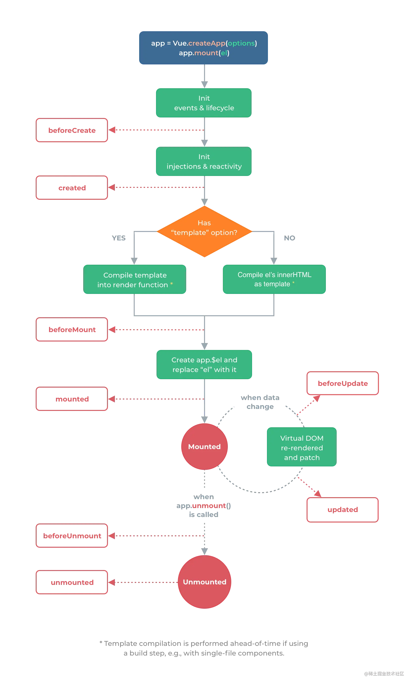

# Vue3.2

- 引入组件自动注册
- 可直接使用 `await` , 但是会变成 `async setup`
- `style` 处使用变量 `v-bind(变量)`
- `style` 处加上 `module` ，可用 `$style` 拿到

## Api

```vue
import { reactive, ref, toRefs } from 'vue'
```

| api                  | tip                     | use                                                                    |
| -------------------- | ----------------------- | ---------------------------------------------------------------------- |
| `getCurrentInstance` | 获取 vm                 | `const _this = getCurrentInstance()')`                                 |
| `reactive`           | 定义引用响应式数据      | `const name = reactive('["Jerry"]')`                                   |
| `ref`                | 定义简单类型响应式数据  | `const name = ref('Jerry')`                                            |
| `toRefs`             | 结构 `reactive` 数据    | `const {name, sex} = toRefs(state)`                                    |
| `computed`           | 计算数据类型            | `const a=computed(()=>a.value*2)`                                      |
| `watch`              | 监视计算属性            | `watch(()=>a,(n,o)=>{ code }),{immediate:true,deep:true})`             |
| `nextTick`           | nextTick                | `nextTick(()=>{})`                                                     |
| `defineExpose`       | 暴露自身属性            | `defineExpose({a,b}); const a = *.value.a`                             |
| `defineProps`        | prop(不需要引入,需配置) | `const props=defineProps({name:{type:string,default:""}})`             |
| `defineEmits`        | emit(不需要引入,需配置) | `const emit = defineEmits(['updateName']); emit('updateName', 'Tom') ` |

```javascript
// .eslintrc.js 文件

module.exports = {
  root: true,
  env: {
    node: true,
  },
  extends: [
    "plugin:vue/vue3-essential",
    "eslint:recommended",
    "@vue/typescript/recommended",
  ],
  parserOptions: {
    ecmaVersion: 2020,
  },
  rules: {
    "no-console": process.env.NODE_ENV === "production" ? "warn" : "off",
    "no-debugger": process.env.NODE_ENV === "production" ? "warn" : "off",
  },
  globals: {
    defineEmits: true,
    defineProps: true,
  },
};
```

## 生命周期

```vue
import { mounted, beforeUnmount } from 'vue'
```

| api             | tip               |
| --------------- | ----------------- |
| `beforeCreate`  | `<script setup/>` |
| `created`       | `<script setup/>` |
| `beforeMount`   | `挂载前`          |
| `mounted`       | `挂载后`          |
| `beforeUpdate`  | `数据更新前`      |
| `updated`       | `数据更新后`      |
| `beforeUnmount` | `卸载前`          |
| `unmount`       | `卸载后`          |



# Router

> https://router.vuejs.org/zh/

```javascript
import { useRoute, useRouter } from "vue-router";
```

| api         | tip      | use                            |
| ----------- | -------- | ------------------------------ |
| `useRoute`  | 获取参数 | `const _route = useRoute();`   |
| `useRouter` | 路由跳转 | `const _router = useRouter();` |

# Pinia

> https://pinia.web3doc.top/

```javascript
import { useStore } from "@/stores/counter";

export default {
  setup() {
    const store = useStore();

    return {
      // 您可以返回整个 store 实例以在模板中使用它
      store,
    };
  },
};
```

```javascript
import { storeToRefs } from "pinia";

export default defineComponent({
  setup() {
    const store = useStore();
    // `name` 和 `doubleCount` 是响应式引用
    // 这也会为插件添加的属性创建引用
    // 但跳过任何 action 或 非响应式（不是 ref/reactive）的属性
    const { name, doubleCount } = storeToRefs(store);

    return {
      name,
      doubleCount,
    };
  },
});
```

# Vite

> https://www.vitejs.net/guide/

# vue.config.js

> https://cli.vuejs.org/zh/config/#vue-config-js

```javascript
const path = require("path");
const resolve = (dir) => path.join(__dirname, dir);
const { defineConfig } = require("@vue/cli-service");
module.exports = defineConfig({
  transpileDependencies: true,
  // 避免Eslint报错
  lintOnSave: false,
  // 设置根路径为@
  chainWebpack: (config) => {
    config.resolve.alias.set("@", resolve("src"));
  },
});
```

# ts.config

- [tsconfig 文档链接](https://www.typescriptlang.org/tsconfig)

```json
{
  // 编译选项
  "compilerOptions": {
    // 生成代码的语言版本：将我们写的 TS 代码编译成哪个版本的 JS 代码
    // 命令行： tsc --target es5 11-测试TS配置文件.ts
    "target": "es5",
    // 指定要包含在编译中的 library
    "lib": ["dom", "dom.iterable", "esnext"],
    // 允许 ts 编译器编译 js 文件
    "allowJs": true,
    // 跳过类型声明文件的类型检查
    "skipLibCheck": true,
    // es 模块 互操作，屏蔽 ESModule 和 CommonJS 之间的差异
    "esModuleInterop": true,
    // 允许通过 import x from 'y' 即使模块没有显式指定 default 导出
    "allowSyntheticDefaultImports": true,
    // 开启严格模式
    "strict": true,
    // 对文件名称强制区分大小写
    "forceConsistentCasingInFileNames": true,
    // 为 switch 语句启用错误报告
    "noFallthroughCasesInSwitch": true,
    // 生成代码的模块化标准
    "module": "esnext",
    // 模块解析（查找）策略
    "moduleResolution": "node",
    // 允许导入扩展名为.json的模块
    "resolveJsonModule": true,
    // 是否将没有 import/export 的文件视为旧（全局而非模块化）脚本文件
    "isolatedModules": true,
    // 编译时不生成任何文件（只进行类型检查）
    "noEmit": true,
    // 指定将 JSX 编译成什么形式
    "jsx": "react-jsx"
  },
  // 指定允许 ts 处理的目录
  "include": ["src"]
}
```
