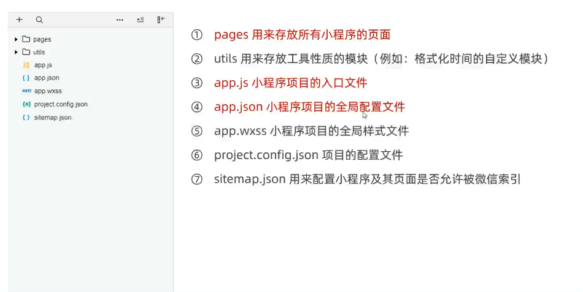
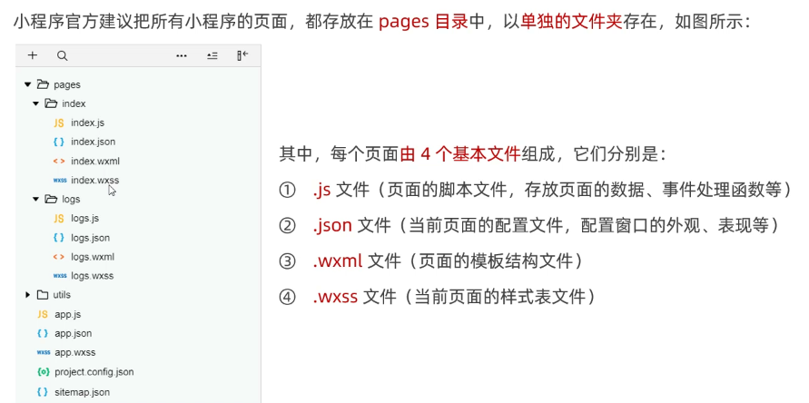
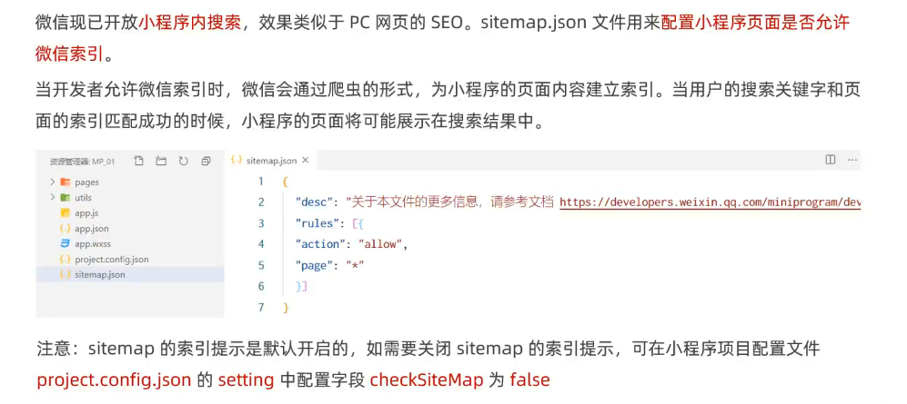
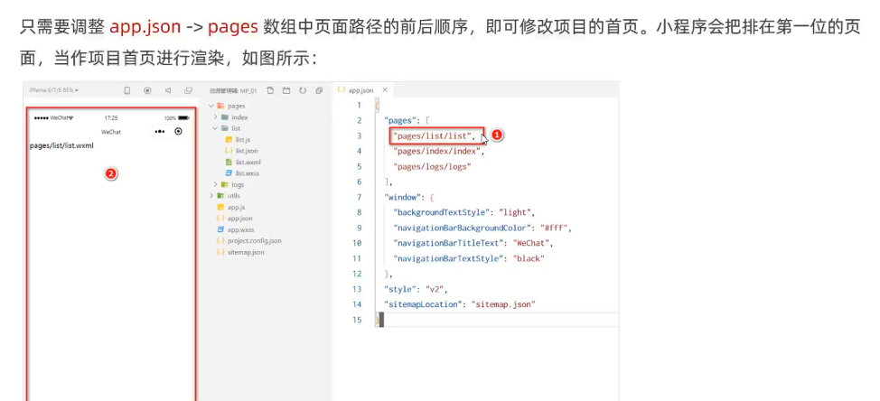

# 小程序简介

- 小程序与普通网页开发的区别

## 项目结构

- 项目的基本组成结构

- 页面的组成部分

## JSON 配置文件

> JSON 是一种数据格式，在实际开发中，JSON 总是以配置文件的形式出现。小程序项目中也不例外：通过不同的 .json 配置文件，可以对小程序项目进行不同级别的配置。

- 小程序项目中有 4 种 json 配置文件，分别是：
  - ① 项目根目录中的 app.json 配置文件
  - ② 项目根目录中的 project.config.json 配置文件
  - ③ 项目根目录中的 sitemap.json 配置文件
  - ④ 每个页面文件夹中的 .json 配置文件

### app.json

### project.config.json

### sitemap.json

### 页面的 .json

### 新建小程序页面

### 修改项目首

## 小程序代码的构成

### WXML

> WXML（WeiXin Markup Language）是小程序框架设计的一套标签语言，用来构建小程序页面的结构，其作用类似于网页开发中的 HTML。

- WXML 和 HTML 的区别
  - 标签名称不同
    - HTML （div, span, img, a）
    - WXML（view, text, image, navigator）
  - 属性节点不同
    - `<a href="#">超链接</a>`
    - `<navigator url="/pages/home/home"></navigator>`
  - 提供了类似于 Vue 中的模板语法
    - 数据绑定
    - 列表渲染
    - 条件渲染

### WXSS

> WXSS (WeiXin Style Sheets)是一套样式语言，用于描述 WXML 的组件样式，类似于网页开发中的 CSS。

- WXSS 和 CSS 的区别
  - 新增了 rpx 尺寸单位
    - CSS 中需要手动进行像素单位换算，例如 rem
    - WXSS 在底层支持新的尺寸单位 rpx，在不同大小的屏幕上小程序会自动进行换算
  - 提供了全局的样式和局部样式
    - 项目根目录中的 app.wxss 会作用于所有小程序页面
    - 局部页面的 .wxss 样式仅对当前页面生效
  - WXSS 仅支持部分 CSS 选择器
    - `.class ` 和 `#id`
    - `element`
    - 并集选择器、后代选择器
    - `::after` 和 `::before` 等伪类选择器

### JS 逻辑交互

- 小程序中的 .js 文件

  - 一个项目仅仅提供界面展示是不够的，在小程序中，我们通过 .js 文件来处理用户的操作。例如：响应用户的点击、获取用户的位置等等。

- 小程序中 .js 文件的分类
  - 小程序中的 JS 文件分为三大类，分别是：
    - app.js
      - 是整个小程序项目的入口文件，通过调用 App() 函数来启动整个小程序
    - 页面的 .js 文件
      - 是页面的入口文件，通过调用 Page() 函数来创建并运行页面
    - 普通的 .js 文件
      - 是普通的功能模块文件，用来封装公共的函数或属性供页面使用
