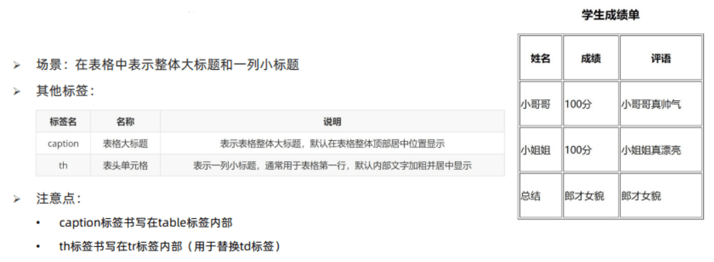
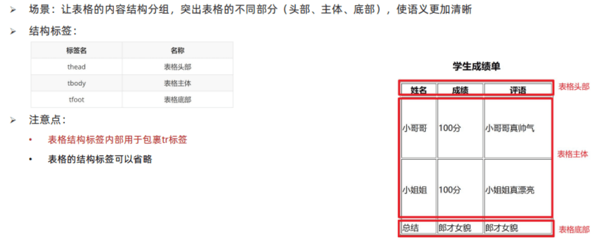

# HTML

- HTML（Hyper Text Markup Language）超文本标记语言

# HTML 骨架结构

| 标签 | 内容       |
| ---- | ---------- |
| html | 网页的整体 |
| head | 网页的头部 |
| body | 网页的身体 |

- 文档版本声明

```html
<!DOCTYPE html>
```

- 网页语言

```html
<html lang="zh-CN"></html>
```

- 字符编码

```html
<meta charset="UTF-8" />
```

- 网页视口

```html
<meta name="viewport" content="width=device-width, initial-scale=1.0" />
```

## SEO

> SEO（Search Engine Optimization）：搜索引擎优化

- 网页标题

```html
<title>Awen - 导航</title>
```

- 网页描述

```html
<meta name="description" content="Awen - Study Notes" />
```

- 网页关键词

```html
<meta name="keywords" content="Awen,awen,YlAwen,ylawen" />
```

- 网页图标

```html
<link rel="shortcut icon" href="./assets//Logo.png" type="image/x-icon" />
```

# HTML 标签

## 语义化标签

> HTML5 新增，特点和 div 一样

| 标签名  | 语义       |
| ------- | ---------- |
| header  | 网页头部   |
| nav     | 网页导航   |
| footer  | 网页底部   |
| aside   | 网页侧边栏 |
| section | 网页区块   |
| article | 网页文章   |


## 标题标签

```html
<h1>1级标题</h1>
<h2>2级标题</h2>
<h3>3级标题</h3>
<h4>4级标题</h4>
<h5>5级标题</h5>
<h6>6级标题</h6>
```

## 段落标签

`<p>文字</p>`

## 换行/水平线标签

```html
<br />
<hr />
```

## 文本格式标签

| 标签   | 说明   |
| ------ | ------ |
| b      | 加粗   |
| u      | 下划线 |
| i      | 倾斜   |
| s      | 删除线 |
| strong | 加粗   |
| ins    | 下划线 |
| em     | 倾斜   |
| del    | 删除线 |

## 音频标签

- 代码：`<audio src="" controls></audio>`
- 常见属性：
  |属性名|功能|
  |---|---|
  |src|音频的路径|
  |controls|显示播放的控件|
  |autoplay|自动播放(部分浏览器不支持)|
  |loop|循环播放|

## 视频标签

- 代码：`<video src="" controls></video>`
- 常见属性：
  |属性名|功能|
  |---|---|
  |src|视频的路径|
  |controls|显示播放的控件|
  |autoplay|自动播放(Chrome 需要配合 muted 实现静音播放)|
  |loop|循环播放|

## 链接标签

- 代码：`<a href="javascript:;">空链接</a>`
- target 属性：
  |取值|效果|
  |---|---|
  |\_self|默认值，在当前窗口中跳转|
  |\_blank|在新窗口中跳转|

## 列表标签

- 无序列表：
- 列表的每一项前默认显示圆点标识
  |标签名|说明|
  |---|---|
  |ul|无序列表的整体|
  |li|无序列表的每一项|

- 有序列表：
- 列表的每一项前默认显示序号标识
  |标签名|说明|
  |---|---|
  |ol|有序列表的整体|
  |li|有序列表的每一项|

- 自定义列表：
- dd 前会默认显示缩进效果
  |标签名|说明|
  |---|---|
  |dl|自定义列表的整体|
  |dt|自定义列表的主题|
  |dd|自定义列表每一项|

## 表格标签

### 基本标签


### 标题/表头单元格标签



### 结构标签



### 合并单元格


## 表单标签


# HTML 字符实体

| 显示结果 | 描述        | 实体名称   | 实体编号          |
| -------- | ----------- | ---------- | ----------------- |
|          | 空格        | `&nbsp; `  | `&#160; `         |
| <        | 小于号      | `&lt; `    | `&#60; `          |
| >        | 大于号      | `&gt; `    | `&#62; `          |
| &        | 和号        | `&amp; `   | `&#38; `          |
| "        | 引号        | `&quot; `  | `&#34; `          |
| '        | 撇号        | `&apos; `  | `&#39;` IE 不支持 |
| ￠       | 分          | `&cent; `  | `&#162; `         |
| £        | 镑          | `&pound; ` | `&#163; `         |
| ¥        | 人民币/日元 | `&yen; `   | `&#165; `         |
| €        | 欧元        | `&euro; `  | `&#8364; `        |
| §        | 小节        | `&sect; `  | `&#167; `         |
| ©        | 版权        | `&copy; `  | `&#169; `         |
| ®        | 注册商标    | `&reg; `   | `&#174; `         |
| ™        | 商标        | `&trade; ` | `&#8482; `        |
| ×        | 乘号        | `&times; ` | `&#215; `         |
| ÷        | 除号        | `&divide;` | `&#247; `         |

# HTML 文档流

## 块级元素


## 行内元素


## 行内块元素


# Emmet 语法


