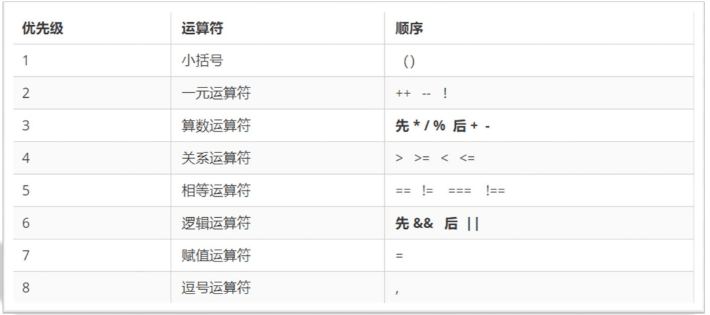
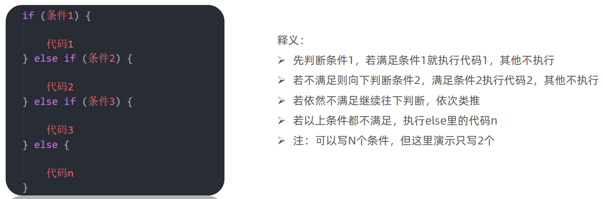
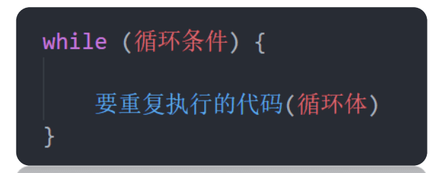
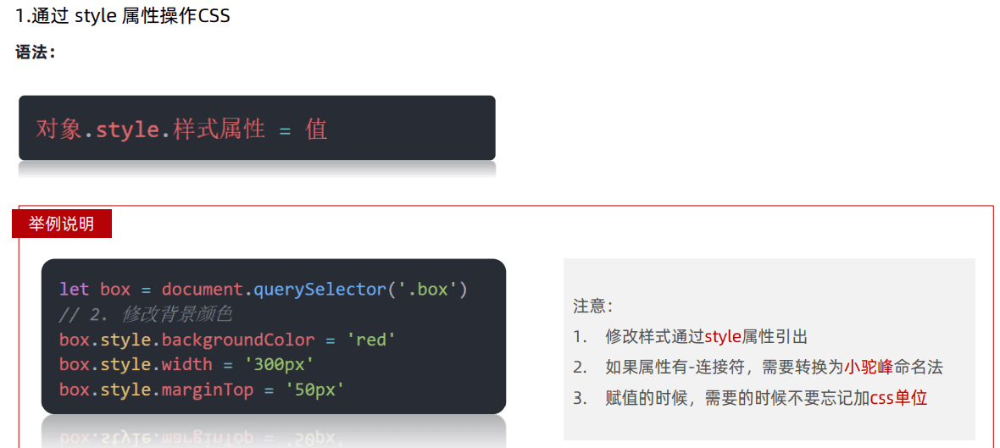
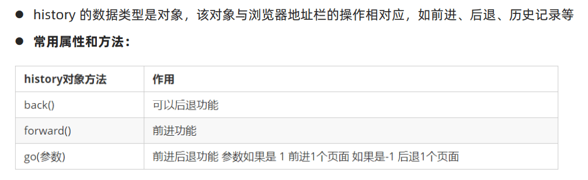
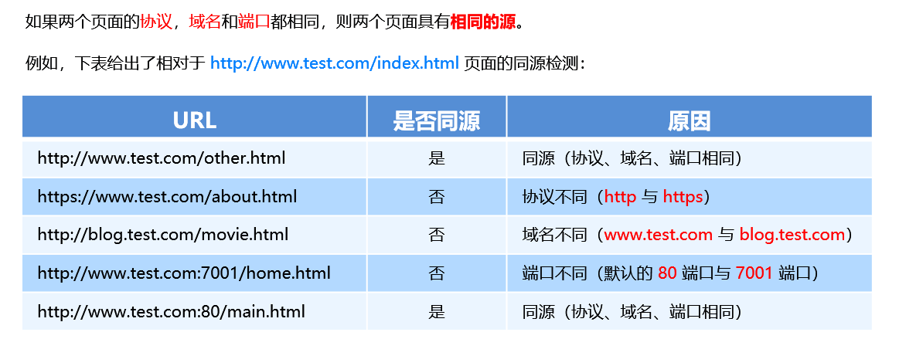
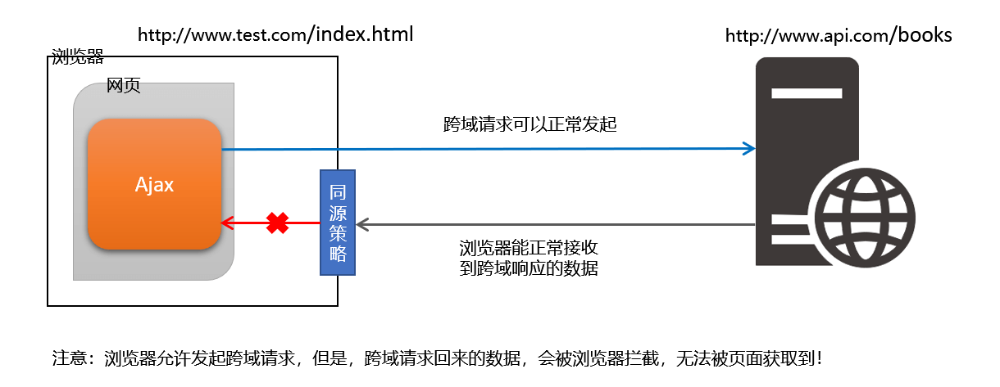
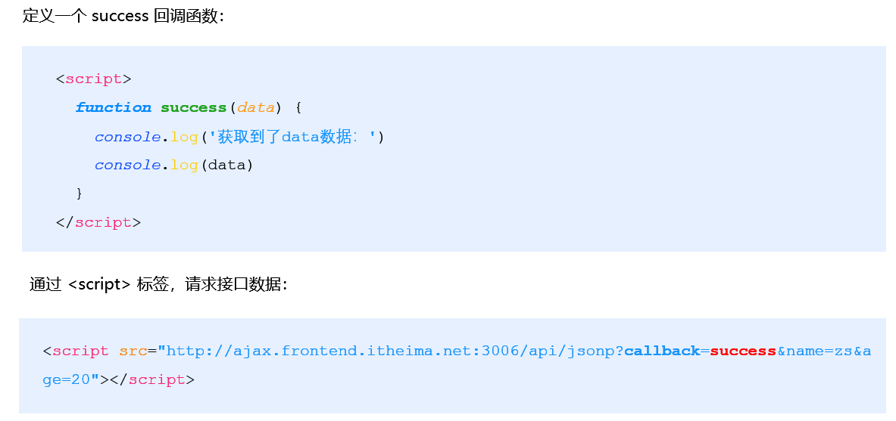
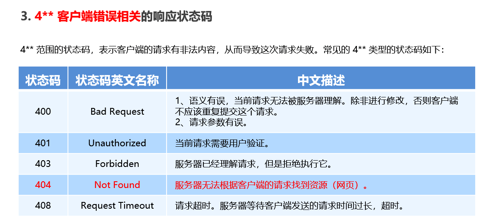

# JavaScript

- 作者：布尔登·艾奇（Brendan Eich）,最初命名 LiveScript

# 变量

> 本质：变量是程序在内存中申请的一块用来存放数据的空间。

| 情况                         | 说明                   | 结果      |
| ---------------------------- | ---------------------- | --------- |
| var age ; console.log (age); | 只声明 不赋值          | undefined |
| console.log(age)             | 不声明 不赋值 直接使用 | 报错      |
| age = 10; console.log (age); | 不声明 只赋值          | 10        |

## 变量命名规范

- 由字母(A-Za-z)、数字(0-9)、下划线(\_)、美元符号( $ )组成 num01, \_name
- 严格区分大小写。var app; 和 var App; 是两个变量
- 不能 以数字开头。 18age 是错误的
- 不能 是关键字、保留字。例如：var、for、while
- 变量名必须有意义。 MMD BBD nl → age
- 遵守驼峰命名法。首字母小写，后面单词的首字母需要大写。

# 数据类型

> Javascript 提供七种不同的数据类型，它们是 undefined（未定义）、null（空）、boolean（布尔型）、string（字符串）、symbol、number（数字）、bigint（可以表示任意大的整数）和 object（对象）。

## 简单数据类型

- 在存储时变量中存储的是值本身.

### Number

```javascript
let score = 100; // 正整数
let price = 12.345; // 小数
let temperature = -40; // 负数
```

### String

```javascript
let user_name = "小明"; // 使用单引号
let gender = "男"; // 使用双引号
let str = "123"; // 看上去是数字，但是用引号包裹了就成了字符串了
let str1 = ""; // 这种情况叫空字符串
```

### Boolean

```javascript
let isCool = true; // 是的，摔死了！
isCool = false; // 不，套马杆的汉子！
```

### undefined

```javascript
// 只声明了变量，并末赋值
let tmp;
document.write(typeof tmp); // 结果为 undefined
```

### null

> 一般认为指向地址 0x00，为空

## 复杂数据类型

在存储时变量中存储的仅仅是地址（引用），通过 new 关键字创建的对象（系统对象、自定义对象）.

### Array

```javascript
var arr = ["aaa", "bbb", "ccc", "ddd"];
arr[0]; // aaa
arr[1]; // bbb
arr.length; // 4
```

#### 增删改查


### Function

```javascript
function a(a, b, ...extra) {
  console.log(a); // 10
  console.log(b); // 是undefined
  // ...extra 剩下的
  return;
}
a(10); // 调用函数
```

#### 命名规范


#### 匿名函数


#### 默认值

```javascript
// 设置参数默认值
function sayHi(name = "小明", age = 18) {
  document.write(`<p>大家好，我叫${name}，我今年${age}岁了。</p>`);
}
// 调用函数
sayHi();
sayHi("小红");
sayHi("小刚", 21);
```

#### 动态参数

> arguments 是函数内部内置的伪数组变量，它包含了调用函数时传入的所有实参。

```javascript
// 求生函数，计算所有参数的和
function sum() {
  // console.log(arguments);
  let s = 0;
  for (let i = 0; i < arguments.length; i++) {
    s += arguments[i];
  }
  console.log(s);
}

// 调用求和函数
sum(5, 10); // 两个参数
sum(1, 2, 4); // 两个参数
```

#### 箭头函数

- 箭头函数属于表达式函数，因此不存在函数提升
- 箭头函数只有一个参数时可以省略圆括号 ()
- 箭头函数函数体只有一行代码时可以省略花括号 {}，并自动做为返回值被返回
- 箭头函数中没有 arguments，只能使用 ... 动态获取实参

```javascript
// 箭头函数
let foo = () => {
  console.log("^_^ 长相奇怪的函数...");
};
// 调用函数
foo();

// 更简洁的语法
let form = document.querySelector("form");
form.addEventListener("click", (ev) => ev.preventDefault());
```

### Object

```javascript
var person = {
  name: "aaa",
  age: 18,
};
person.name; // aaa
person["age"]; // 18

// 遍历对象
for (let k in obj) {
  console.log(k); // 属性名
  console.log(obj[k]); // 属性值
}
```

#### 增删改查


#### 内置对象 Math

> https://developer.mozilla.org/zh-CN/docs/Web/JavaScript/Reference/Global_Objects/Math

- random：生成 0-1 之间的随机数（包含 0 不包括 1）
- ceil：向上取整
- floor：向下取整
- max：找最大数
- min：找最小数
- pow：幂运算
- abs：绝对值

#### 内置对象 Date

> 时间戳 :指 1970 年 01 月 01 日 00 时 00 分 00 秒起至现在的毫秒数

```javascript
// 获得当前时间
let date = new Date();
// 获得指定时间
let date = new Date("1949-10-01");
// 获取时间戳
date.getTime();
+new Date();
Date.now();
```

| 方法          | 作用               | 说明                 |
| ------------- | ------------------ | -------------------- |
| getFullYear() | 获得年份           | 获取四位年份         |
| getMonth()    | 获得月份           | 取值为 0 ~ 11        |
| getDate()     | 获取月份中的每一天 | 不同月份取值也不相同 |
| getDay()      | 获取星期           | 取值为 0 ~ 6         |
| getHours()    | 获取小时           | 取值为 0 ~ 23        |
| getMinutes()  | 获取分钟           | 取值为 0 ~ 59        |
| getSeconds()  | 获取秒             | 取值为 0 ~ 5         |

## 类型转换

### 隐式转换

> 系统内部自动将数据类型进行转换

```javascript
let num = 13; // 数值
let num2 = "2"; // 字符串

// 结果为 132
// 原因是将数值 num 转换成了字符串，相当于 '13'
// 然后 + 将两个字符串拼接到了一起
console.log(num + num2);

// 结果为 11
// 原因是将字符串 num2 转换成了数值，相当于 2
// 然后数值 13 减去 数值 2
console.log(num - num2);
```

### 显式转换

```javascript
let t = "12";
let f = 8;

// 显式将字符串 12 转换成数值 12
t = Number(t);

// 检测转换后的类型
// console.log(typeof t);
console.log(t + f); // 结果为 20

// 并不是所有的值都可以被转成数值类型
let str = "hello";
// 将 hello 转成数值是不现实的，当无法转换成
// 数值时，得到的结果为 NaN （Not a Number）
console.log(Number(str));
```

# 对象类型

## 引用类型

### Object

```javascript
// 通过构造函数创建普通对象
let user = new Object({ name: "小明", age: 15 });

// 这种方式声明的变量称为【字面量】
let student = { name: "杜子腾", age: 21 };

// 对象语法简写
let name = "小红";
let people = {
  // 相当于 name: name
  name,
  // 相当于 walk: function () {}
  walk() {
    console.log("人都要走路...");
  },
};

console.log(student.constructor);
console.log(user.constructor);
console.log(student instanceof Object);
```

- 普通对象数据保存在堆内存之中，栈内存中保存了普通对象在堆内存的地址。
  
- 普通对象数据保存在堆内存之中，栈内存中保存了普通对象在堆内存的地址。
  

<br>

- `Object.assign`静态方法创建新的对象
- `Object.keys `静态方法获取对象中所有属性
- `Object.values `表态方法获取对象中所有属性值

### Array

```javascript
// 构造函数创建数组
let arr = new Array(5, 7, 8);

// 字面量方式创建数组
let list = ["html", "css", "javascript"];

console.log(list.constructor);
console.log(list instanceof Array);
```

- 数组在内存中的存储方式与普通对象一样
  
- 数组在赋值时只是复制了栈内中的地址，而非堆内存中的数据
  

<br>

- 实例方法` forEach` 用于遍历数组，替代 for 循环
- 实例方法` filter` 过滤数组单元值，生成新数组
- 实例方法`map`迭代原数组，生成新数组
- 实例方法`join`数组单元素拼接成了符串
- 实例方法`concat`合并两个数组，生成新数组
- 实例方法`sort`对原数组单元值排序
- 实例方法`splice`删除或替换原数组单元
- 实例方法` indexOf` 检索数组单元值
- 实例方法`reverse`反转数组
- 静态方法` from` 伪数组转成数组

### RegExp

```javascript
// 构造函数创建正则
let reg = new RegExp("d", "i");

// 字面量方式创建正则
// let reg = /(\d)/i;

reg.exec("123");
```

- `test()` 方法 用来查看正则表达式与指定的字符串是否匹配
- `exec() `方法 在一个指定字符串中执行一个搜索匹配

## 包装类型

> 字符串、数值、布尔类型数据是 JavaScript 底层使用 Object 构造函数“包装”来的，被称为包装类型。

### String

```javascript
// 字符串类型
let str = "hello world!";
// 统计字符的长度（字符数量）
console.log(str.length);

// 数值类型
let price = 12.345;
// 保留两位小数
price.toFixed(2);
// 检测是否属于同一个构造函数
console.log(str.constructor === str2.constructor); // true
console.log(str instanceof String); // false
```

- 实例属性 `length` 用来获取字符串的度长
- 实例方法 `split` 用来将字符串拆分成数组
- 实例方法 `toUpperCase `用于将字母转换成大写
- 实例方法 `toLowerCase `用于将字母转换成小写
- 实例方法 `slice `用于字符串截取
- 实例方法 `indexOf `检测是否包含某字符
- 实例方法 `startsWith `检测是否以某字符开头
- 实例方法 `endsWith `检测是否以某字符结尾
- 实例方法 `replace `用于替换字符串，支持正则匹配
- 实例方法 `padStart `固定长度字符开始位置打补丁
- 实例方法 `padEnd `固定长度字符结束位置打补丁
- 实例方法 `match` 用于查找字符串，支持正则匹配

### Number

```javascript
// 使用构造函数创建数值
let x = new Number("10");
let y = new Number(5);

// 字面量创建数值
let z = 20;

// 检测是否属于同一个构造函数
console.log(x.constructor === z.constructor);
```

- 实例方法 `toFixed` 用于设置保留小数位的长度

### Boolean

```javascript
// 使用构造函数创建布尔类型
let locked = new Boolean("10");

// 字面量创建布尔类型
let flag = true;

// 检测是否属于同一个构造函数
console.log(locked.constructor === flag.constructor);
```

## 公共方法

```javascript
// 对象类型数据
let user = { name: "小明", age: 18 };
// 数值类型
let num = 12.345;
// 字符串类型
let str = "hello world!";

str.valueOf(); // 原始值
user.toString(); // 表示该对象的字符串
```

- `valueOf` 方法获取原始值，数据内部运算的基础，很少主动调用该方法
- `toString `方法以字符串形式表示对象

## 深拷贝

```javascript
// 含义：所有层都拷贝的方式
let obj = {
  uname: "张三丰",
  age: 22,
  sex: "男",
  color: ["red", "blue", "yellow", "pink"],
  message: {
    index: 1,
    score: 99,
  },
};

let newObj = {};

function kaobei(newObj, obj) {
  for (let key in obj) {
    if (obj[key] instanceof Array) {
      // obj[key] 是数组
      // obj[key]是数组，遍历
      newObj[key] = [];
      kaobei(newObj[key], obj[key]);
    } else if (obj[key] instanceof Object) {
      // obj[key]是对象
      // obj[key]是对象，遍历
      newObj[key] = {};
      kaobei(newObj[key], obj[key]);
    } else {
      newObj[key] = obj[key];
    }
  }
}

kaobei(newObj, obj);

obj.message.score = 123;

console.log(obj, newObj);
```

# 运算符

## 算术运算符

- 数学运算符也叫算术运算符。
  - +：求和
  - -：求差
  - \*：求积
  - /：求商
  - %：取模（取余数）

## 赋值运算符

- 将等号右边的值赋予给左边, 要求左边必须是一个容器
  - +=
  - -=
  - \*=
  - /=
  - %=

## 一元运算符

> 前置自增：先自加再使用
> 后置自增：先使用再自加

- 自增：
  - 符号：++
  - 作用：让变量的值 +1
- 自减：
  - 符号：--
  - 作用：让变量的值 -1

```javascript
let i = 1;
let j = 1;
console.log(i++); // 1
console.log(++j); // 2
```

## 比较运算符

- 比较运算符：
  - \>： 左边是否大于右边
  - <： 左边是否小于右边
  - \>=： 左边是否大于或等于右边
  - <=： 左边是否小于或等于右边
  - ==： 左右两边是否相等
  - ===： 左右两边是否类型和值都相等
  - !==： 左右两边是否不全等
- 比较结果为 boolean 类型，即只会得到 true 或 false
- 字符串比较，是比较的字符对应的 ASCII 码(从左往右依次比较)
- NaN 不等于任何值，包括它本身
- 不同类型之间比较会发生隐式转换

## 逻辑运算符


## 短路运算符


## 运算符优先级



# 语句

## 分支语句

### If 分支语句



### 三元运算符


### switch 语句


## 循环语句

### for 循环


### while 循环



### do-while 循环

```js
do {
  // 循环体代码 - 条件表达式为 true 时重复执行循环体代码
} while (条件表达式);
```

### 退出循环

- continue：结束本次循环，继续下次循环
- break：跳出所在的循环

# 作用域


## 变量的作用域

> js 不使用严格模式的坑
> 如果函数内部或者块级作用域内部，变量没有声明，直接赋值，也当全局变量看，但是强烈不推荐
> 但是有一种情况，函数内部的形参可以看做是局部变量。


## 作用域链

- 嵌套关系的作用域串联起来形成了作用域链
- 相同作用域链中按着从小到大的规则查找变量
- 子作用域能够访问父作用域，父级作用域无法访问子级作用域（就近原则）

```javascript
// 全局作用域
let a = 1;
let b = 2;

// 局部作用域
function f() {
  let c;
  // 局部作用域
  function g() {
    let d = "yo";
  }
}
```

## 闭包

> 一个作用域有权访问另外一个作用域的局部变量

```javascript
function foo() {
  let i = 0;

  // 函数内部分函数
  function bar() {
    console.log(++i);
  }

  // 将函数做为返回值
  return bar;
}

// fn 即为闭包函数
let fn = foo();

fn(); // 1
```

## 变量提升

- 变量在未声明即被访问时会报语法错误
- 变量在声明之前即被访问，变量的值为 undefined
- let 声明的变量不存在变量提升，推荐使用 let【也有人认为具有提升但是不赋值不能使用】
- 变量提升出现在相同作用域当中

```javascript
  // 访问变量 str
  console.log(str + 'world!');

  // 声明变量 str
  var str = 'hello ';

let和var都有提升，但是let定义的变量没有赋值之前是不可以使用、var可以使用是undefined
```

## 函数提升

- 函数提升能够使函数的声明调用更灵活
- 函数表达式不存在提升的现象
- 函数提升出现在相同作用域当中

```javascript
// 调用函数
foo();

// 声明函数
function foo() {
  console.log("声明之前即被调用...");
}

// 不存在提升现象
bar();
var bar = function () {
  console.log("函数表达式不存在提升现象...");
};
```

# 面向对象

> 一切皆对象

## 构造函数

- 构造函数是专门用于创建对象的函数，如果一个函数使用 new 关键字调用，那么这个函数就是构造函数。
- 使用 new 关键字调用函数的行为被称为实例化
- 实例化构造函数时没有参数时可以省略 ()
- 构造函数的返回值即为新创建的对象
- 构造函数内部的 return 返回的值无效！

```javascript
// 定义函数
function foo() {
  console.log("通过 new 也能调用函数...");
}
// 调用函数
new foo();
```

## 实例成员

- 通过构造函数创建的对象称为实例对象，实例对象中的属性和方法称为实例成员。
- 构造函数内部 this 实际上就是实例对象，为其动态添加的属性和方法即为实例成员
- 为构造函数传入参数，动态创建结构相同但值不同的对象
- 实例对象的 constructor 属性指向了构造函数
- instanceof 用于检测实例对象对应的构造函数

```javascript
// 构造函数
function Person() {
  // 构造函数内部的 this 就是实例对象

  // 实例对象中动态添加属性
  this.name = "小明";
  // 实例对象动态添加方法
  this.sayHi = function () {
    console.log("大家好~");
  };
}

// 实例化，p1 是实例对象
// p1 实际就是 构造函数内部的 this
let p1 = new Person();

console.log(p1);
console.log(p1.name); // 访问实例属性
p1.sayHi(); // 调用实例方法
```

## 静态成员

- 在 JavaScript 中底层函数本质上也是对象类型，因此允许直接为函数动态添加属性或方法，构造函数的属性和方法被称为静态成员。
- 静态成员指的是添加到构造函数本身的属性和方法
- 一般公共特征的属性或方法静态成员设置为静态成员
- 静态成员方法中的 this 指向构造函数本身

```javascript
// 构造函数
function Person(name, age) {
  // 省略实例成员
}

// 静态属性
Person.eyes = 2;
Person.arms = 2;
// 静态方法
Person.walk = function () {
  console.log("^_^人都会走路...");
  // this 指向 Person
  console.log(this.eyes);
};
```

## 封装

### 构造函数

```javascript
function Person() {
this.name = '佚名';
// 设置名字
this.setName = function (name) {
this.name = name;
}
// 读取名字
this.getName = () => {
console.log(this.name);
}
}

// 实例对像，获得了构造函数中封装的所有逻辑
let p1 = new Person();
p1.setName('小明');
console.log(p1.--name);// 小明

// 实例对象
let p2 = new Person();
console.log(p2.name); // 佚名
```

- 构造函数体现了面向对象的封装特性
- 构造函数实例创建的对象彼此独立、互不影响

### 原型对象

> 每一个构造函数都有一个名为 prototype 的属性，译成中文是原型的意思，prototype 的是对象类据类型，称为构造函数的原型对象，每个原型对象都具有 constructor 属性代表了该原型对象对应的构造函数。

```javascript
function Person() {
  // 此处定义同名方法 sayHi
  this.sayHi = function () {
    console.log("嗨!" + this.name);
  };
}

// 为构造函数的原型对象添加方法
Person.prototype.sayHi = function () {
  console.log("Hi~" + this.name);
};
// 在构造函数的原型对象上添加属性
Person.prototype.name = "小明";

let p1 = new Person();
p1.sayHi(); // 输出结果为 嗨!

let p2 = new Person();
p2.sayHi();
```


## 继承

### 原型继承

```javascript
// 所有人
function Person() {
  // 人的特征
  this.arms = 2;
  this.legs = 2;
  this.eyes = 2;

  // 人的行为
  this.walk = function () {};
  this.sing = function () {};
  this.sleep = function () {};
}

// 封装中国人的行为特征
function Chinese() {
  // 中国人的特征
  this.skin = "yellow";
  this.language = "中文";
}

// 封装日本人的行为特征
function Japanese() {
  // 日本人的特征
  this.skin = "yellow";
  this.language = "日文";
}

// human 是构造函数 Person 的实例
let human = new Person();

// 中国人
Chinese.prototype = new Person();
Chinese.prototype.constructor = Chinese;
// 日本人
Japanese.prototype = human;
Japanese.prototype.constructor = Japanese;
```


### 原型链

> 在 JavaScript 对象中包括了一个非标准备的属性 `_proto_` 它指向了构造函数的原型对象


# This 指向

## 普通函数

> 谁调用 this 的值指向谁

```javascript
// 普通函数
function sayHi() {
  console.log(this);
}
// 函数表达式
let sayHello = function () {
  console.log(this);
};

// 函数的调用方式决定了 this 的值
sayHi(); // window
window.sayHi();

// 普通对象

let user = {
  name: "小明",
  walk: function () {
    console.log(this);
  },
};
// 动态为 user 添加方法
user.sayHi = sayHi;
uesr.sayHello = sayHello;

// 函数调用方式，决定了 this 的值
user.sayHi();
user.sayHello();
```

- 普通函数没有明确调用者时 this 值为 window，严格模式下没有调用者时 this 的值为 undefined。

## 箭头函数

> 箭头函数中访问的 this 一般是箭头函数所在作用域的 this 变量。

```javascript
console.log(this); // 此处为 window
// 箭头函数
let sayHi = function () {
  console.log(this); // 该箭头函数中的 this 为函数声明环境中 this 一致
};

// 普通对象
let user = {
  name: "小明",
  // 该箭头函数中的 this 为函数声明环境中 this 一致
  walk: () => {
    console.log(this);
  },

  sleep: function () {
    let str = "hello";
    console.log(this);
    let fn = () => {
      console.log(str);
      console.log(this); // 该箭头函数中的 this 与 sleep 中的 this 一致
    };
    // 调用箭头函数
    fn();
  },
};

// 动态添加方法
user.sayHi = sayHi;

// 函数调用
user.sayHi();
user.sleep();
user.walk();

// DOM 节点
let btn = document.querySelector(".btn");

// 箭头函数 此时 this 指向了 window
btn.addEventListener("click", () => {
  console.log(this);
});

// 普通函数 此时 this 指向了 DOM 对象
btn.addEventListener("click", function () {
  console.log(this);
});

function Person() {}

// 原型对像上添加了箭头函数
Person.prototype.walk = () => {
  console.log("人都要走路...");
  console.log(this); // widow
};

let p1 = new Person();
p1.walk();
```

## 更改 This 指向

```javascript
call：fun.call(this，arg1, arg2,......)
apply：fun.apply(this, [arg1, arg2,......])
bind：fun.bind(this, arg1, arg2,......)

相同点：
都可以用来改变 this 指向，第一个参数都是 this 指向的对象
区别：
call 和 apply：都会使函数执行，但是参数不同
bind：不会使函数执行，参数同 call
```

### call

> 使用 call 方法调用函数，同时指定函数中 this 的值

```javascript
// 普通函数
function sayHi() {
console.log(this);
}

let user = {
name: '小明',
age: 18
}

let student = {
name: '小红',
age: 16，
}

// 调用函数并指定 this 的值
sayHi.call(user); // this 值为 user
sayHi.call(student); // this 值为 student

// 求和函数
function counter(x, y) {
return x + y;
}

// 调用 counter 函数，并传入参数
let result = counter.call(null, 5, 10);
console.log(result);
```

- `call` 方法能够在调用函数的同时指定 `this` 的值
- 使用 `call` 方法调用函数时，第 1 个参数为 `this` 指定的值
- `call` 方法的其余参数会依次自动传入函数做为函数的参数

### apply

```javascript
// 普通函数
function sayHi() {
  console.log(this);
}

let user = {
  name: "小明",
  age: 18,
};

let student = {
  name: "小红",
  age: 16,
};

// 调用函数并指定 this 的值
sayHi.apply(user); // this 值为 user
sayHi.apply(student); // this 值为 student

// 求和函数
function counter(x, y) {
  return x + y;
}

// 调用 counter 函数，并传入参数
let result = counter.apply(null, [5, 10]);
console.log(result);
```

- `apply` 方法能够在调用函数的同时指定 `this` 的值
- 使用 `apply` 方法调用函数时，第 1 个参数为 `this` 指定的值
- `apply` 方法第 2 个参数为数组，数组的单元值依次自动传入函数做为函数的参数

### bind

> 使用 call 方法调用函数，同时指定函数中 this 的值

```javascript
// 普通函数
function sayHi() {
  console.log(this);
}

let user = {
  name: "小明",
  age: 18,
};

// 调用 bind 指定 this 的值
let sayHello = sayHi.bind(user);

// 调用使用 bind 创建的新函数
sayHello();
```

# Web API


## DOM

> DOM（Document Object Model——文档对象模型）是用来呈现以及与任意 HTML 或 XML 文档交互的 API

- DOM 树


### DOM 对象

- document 对象
  - 是 DOM 里提供的一个对象
  - 所以它提供的属性和方法都是用来访问和操作网页内容的
  - 例：document.write()
  - 网页所有内容都在 document 里面

#### 获取 DOM 对象

```javascript
// CSS选择器匹配的第一个元素,一个 HTMLElement对象。
// 如果没有匹配到，则返回null。
document.querySelector("选择器");

// CSS选择器匹配的NodeList 对象集合
document.querySelectorAll("选择器");

// 根据id获取一个元素
document.getElementById("nav");

// 根据标签获取一类元素获取页面所有
divdocument.getElementsByTagName("div");

// 根据类名获取元素获取页面所有类名为w的元素
document.getElementsByClassName("w");
```

#### 设置/修改 DOM 元素

- 修改内容

  ```javascript
  // 永远都只是追加操作，且只能位置</body>前,标签会被解析
  document.write("hello");

  // 将文本内容添加/更新到任意标签位置,标签不会被解析
  let info = document.getElementById("info");
  // intro.innerText ="嗨～我叫李雷!"
  info.innerText = "嗨～我叫李雷!";

  // 将文本内容添加/更新到任意标签位置,标签会被解析
  box.innerHTML = "<h3>前端程序员<br>的头发都很多</h3>";
  ```

- 修改属性
  

- 修改样式
  
  
  

- data-自定义属性
  ```javascript
  getAttribute("属性名"); // 获取自定义属性
  setAttribute("属性名", "属性值"); // 设置自定义属性
  removeAttribute("属性名"); // 删除自定义属性
  ```

#### DOM 查找节点

- `parentNode`
- 最近一级的父节点 找不到返回为 null

  ```javascript
  子元素.parentNode;
  ```

- `childNodes`
- 获得所有子节点、包括文本节点（空格、换行）、注释节点等

  ```javascript
  父元素.childNodes;
  ```

- `children`
- 仅获得所有元素节点,返回的还是一个伪数组

  ```javascript
  父元素.children;
  ```

- `nextElementSibling`
- 下一个兄弟节点

  ```javascript
  element.nextElementSibling;
  ```

- `previousElementSibling`
- 上一个兄弟节点

  ```javascript
  element.previousElementSibling;
  ```

#### DOM 增加节点

- `createElement`
- 创建节点

  ```javascript
  document.createElement("标签名");
  ```

- `appendChild`
- 插入到父元素的最后一个子元素

  ```javascript
  element.appendChild(要插入的元素);
  ```

- `insertBefore`
- 插入到父元素中某个子元素的前面
  ```javascript
  element.insertBefore(要插入的元素，在哪个元素前面)
  ```
- `cloneNode`
- 克隆出一个跟原标签一样的元素，括号内传入布尔值
- 若为 true，则代表克隆时会包含后代节点一起克隆
- 若为 false(默认)，则代表克隆时不包含后代节点
  ```javascript
  element.cloneNode(布尔值);
  ```

#### DOM 删除节点

- removeChild
- 要删除元素必须通过父元素删除
  ```javascript
  父元素.removeChild(要删除的元素);
  ```

### 事件

- `scroll`滚动事件
- `load`加载事件
- `DOMContentLoaded`文档被完全加载


#### 鼠标事件


#### 键盘事件


#### 触屏事件


拖动元素三步曲：

（1） 触摸元素 touchstart：  获取手指初始坐标，同时获得盒子原来的位置

（2） 移动手指 touchmove：  计算手指的滑动距离，并且移动盒子

（3） 离开手指 touchend:

> **注意： 手指移动也会触发滚动屏幕所以这里要阻止默认的屏幕滚动 e.preventDefault();**

#### click 延时解决方案

移动端 click 事件会有 300ms 的延时，原因是移动端屏幕双击会缩放(double tap to zoom) 页面。

解决方案：

​ 1. 禁用缩放。 浏览器禁用默认的双击缩放行为并且去掉 300ms 的点击延迟。

```html
<meta name="viewport" content="user-scalable=no" />
```

​ 2.利用 touch 事件自己封装这个事件解决 300ms 延迟。

​ 原理就是：

1.  当我们手指触摸屏幕，记录当前触摸时间
2.  当我们手指离开屏幕， 用离开的时间减去触摸的时间
3.  如果时间小于 150ms，并且没有滑动过屏幕， 那么我们就定义为点击

代码如下:

```Javascript
//封装tap，解决click 300ms 延时
function tap (obj, callback) {
        var isMove = false;
        var startTime = 0; // 记录触摸时候的时间变量
        obj.addEventListener('touchstart', function (e) {
            startTime = Date.now(); // 记录触摸时间
        });
        obj.addEventListener('touchmove', function (e) {
            isMove = true;  // 看看是否有滑动，有滑动算拖拽，不算点击
        });
        obj.addEventListener('touchend', function (e) {
            if (!isMove && (Date.now() - startTime) < 150) {  // 如果手指触摸和离开时间小于150ms 算点击
                callback && callback(); // 执行回调函数
            }
            isMove = false;  //  取反 重置
            startTime = 0;
        });
}
//调用
  tap(div, function(){   // 执行代码  });

```

3. 使用插件。fastclick 插件解决 300ms 延迟。
   

#### 事件对象


#### 事件流


- 阻止事件流动

```javascript
事件对象.stopPropagation();
```

- 阻止默认行为，比如链接点击不跳转，表单域的不提交

```javascript
e.preventDefault();
```

- `mouseover` 和 `mouseout` 会有冒泡效果
- `mouseenter` 和 `mouseleave` 没有冒泡效果(推荐)

#### 事件委托

- 优点：给父级元素加事件（可以提高性能）
- 原理：事件委托其实是利用事件冒泡的特点， 给父元素添加事件，子元素可以触发
- 实现：事件对象.target 可以获得真正触发事件的元素

### 高阶函数


### 元素大小和位置

#### scroll 家族

- `scroll` 事件
  

#### offset 家族


#### client 家族

- `resize`事件
  

## BOM

> BOM(Browser Object Model ) 是浏览器对象模型

- window 是浏览器内置中的全局对象，我们所学习的所有 Web APIs 的知识内容都是基于 window 对象实现的
- window 对象下包含了 navigator、location、document、history、screen 5 个属性，即所谓的 BOM （浏览器对象模
  型）
- document 是实现 DOM 的基础，它其实是依附于 window 的属性。

### 定时器

```javascript
// 循环执行
setInterval(() => {
  0;
}, interval);

// 计时结束执行
setTimeout(() => {
  0;
}, timeout);
```


### JS 执行机制

> JavaScript 语言的一大特点就是单线程，也就是说，同一个时间只能做一件事。这是因为 Javascript 这门脚本语言诞生的使命所致——JavaScript 是为处理页面中用户的交互，以及操作 DOM 而诞生的。比如我们对某个 DOM 元素进行添加和删除操作，不能同时进行。 应该先进行添加，之后再删除。
> JS 是单线程,单线程就意味着，所有任务需要排队，前一个任务结束，才会执行后一个任务。这样所导致的问题是： 如果 JS 执行的时间过长，这样就会造成页面的渲染不连贯，导致页面渲染加载阻塞的感觉。

#### 同步和异步


### location 对象

- `location` 的数据类型是对象，它拆分并保存了 URL 地址的各个组成部分
- 常用属性和方法：
  - `href` 属性获取完整的 URL 地址，对其赋值时用于地址的跳转
  - `search` 属性获取地址中携带的参数，符号 ？后面部分
  - `hash` 属性获取地址中的啥希值，符号 # 后面部分
  - `reload` 方法用来刷新当前页面，传入参数 true 时表示强制刷新

### navigator 对象

- `navigator` 的数据类型是对象，该对象下记录了浏览器自身的相关信息
- 常用属性和方法：
  - 通过 userAgent 检测浏览器的版本及平台
  ```javascript
  // 检测 userAgent（浏览器信息）
  !(function () {
    const userAgent = navigator.userAgent;
    // 验证是否为Android或iPhone
    const android = userAgent.match(/(Android);?[\s\/]+([\d.]+)?/);
    const iphone = userAgent.match(/(iPhone\sOS)\s([\d_]+)/);
    // 如果是Android或iPhone，则跳转至移动站点
    if (android || iphone) {
      location.href = "http://m.itcast.cn";
    }
  })();
  ```

### histroy 对象



### 本地存储

- JSON 转换

```javascript
// 将复杂数据转换成JSON字符串
JSON.stringify(复杂数据类型);
// 将JSON字符串转换成对象
JSON.parse(JSON字符串);
```

- `localStorage`

  - 生命周期永久生效，除非手动删除 否则关闭页面也会存在
  - 可以多窗口（页面）共享（同一浏览器可以共享）
  - 以键值对的形式存储使用
    ```javascript
    // 存储数据
    localStorage.setItem(key, value);
    // 获取数据
    localStorage.getItem(key);
    // 删除数据
    localStorage.removeItem(key);
    ```

- `sessionStorage`
  - 生命周期为关闭浏览器窗口
  - 在同一个窗口(页面)下数据可以共享
  - 以键值对的形式存储使用
    ```javascript
    // 存储数据
    sessionStorage.setItem(key, value);
    // 获取数据
    sessionStorage.getItem(key);
    // 删除数据
    sessionStorage.removeItem(key);
    ```

# XMLHttpRequest

> XMLHttpRequest（简称 xhr）是浏览器提供的 Javascript 对象，通过它，可以请求服务器上的数据资源。

## Get 请求

```javascript
// 1. 创建 XHR 对象
var xhr = new XMLHttpRequest();
// 2. 调用 open 函数，指定 请求方式 与 URL地址
xhr.open("GET", "http://www.liulongbin.top:3006/api/getbooks");
// 3. 调用 send 函数，发起 Ajax 请求
xhr.send();
// 4. 监听 onreadystatechange 事件
xhr.onreadystatechange = function () {
  // 4.1 监听 xhr 对象的请求状态 readyState ；与服务器响应的状态 status
  if (xhr.readyState === 4 && xhr.status === 200) {
    // 4.2 打印服务器响应回来的数据
    console.log(xhr.responseText);
  }
};
```


## POST 请求

```javascript
// 1. 创建 xhr 对象
var xhr = new XMLHttpRequest();
// 2. 调用 open()
xhr.open("POST", "http://www.liulongbin.top:3006/api/addbook");
// 3. 设置 Content-Type 属性（固定写法）
xhr.setRequestHeader("Content-Type", "application/x-www-form-urlencoded");
// 4. 调用 send()，同时将数据以查询字符串的形式，提交给服务器
xhr.send("bookname=水浒传&author=施耐庵&publisher=天津图书出版社");
// 5. 监听 onreadystatechange 事件
xhr.onreadystatechange = function () {
  if (xhr.readyState === 4 && xhr.status === 200) {
    console.log(xhr.responseText);
  }
};
```

## HTTP 请求时限

```javascript
xhr.timeout = 3000;
xhr.ontimeout = function (event) {
  alert("请求超时！");
};
```

## 上传文件

```javascript
// 1. 创建 xhr 对象
var xhr = new XMLHttpRequest();
// 2. 调用 open 函数，指定请求类型与URL地址。其中，请求类型必须为 POST
xhr.open("POST", "http://www.liulongbin.top:3006/api/upload/avatar");
// 3. 发起请求
xhr.send(fd);

xhr.onreadystatechange = function () {
  if (xhr.readyState === 4 && xhr.status === 200) {
    var data = JSON.parse(xhr.responseText);
    if (data.status === 200) {
      // 上传文件成功
      // 将服务器返回的图片地址，设置为  标签的 src 属性
      document.querySelector("#img").src =
        "http://www.liulongbin.top:3006" + data.url;
    } else {
      // 上传文件失败
      console.log(data.message);
    }
  }
};
```

## 显示文件上传进度

```javascript
// 创建 XHR 对象
var xhr = new XMLHttpRequest();
// 监听 xhr.upload 的 onprogress 事件
xhr.upload.onprogress = function (e) {
  // e.lengthComputable 是一个布尔值，表示当前上传的资源是否具有可计算的长度
  if (e.lengthComputable) {
    // e.loaded 已传输的字节
    // e.total  需传输的总字节
    var percentComplete = Math.ceil((e.loaded / e.total) * 100);
  }
};
```

## 同源策略和跨域







## JSONP

> JSONP (JSON with Padding) 是 JSON 的一种“使用模式”，可用于解决主流浏览器的跨域数据访问的问题。
>  >  > 

# HTTP

## HTTP 协议简介

> 通信协议（Communication Protocol）是指通信的双方完成通信所必须遵守的规则和约定。
> 网页内容又叫做超文本，因此网页内容的传输协议又叫做超文本传输协议（HyperText Transfer Protocol） ，简称 HTTP 协议。

## HTTP 请求消息


## HTTP 响应消息


## HTTP 请求方法


## HTTP 响应状态码

> HTTP 响应状态码（HTTP Status Code），也属于 HTTP 协议的一部分，用来标识响应的状态。
>  >  >  >  > 

# 性能优化

## 防抖和节流

> 防抖：如果事件被频繁触发，防抖能保证只有最有一次触发生效！前面 N 多次的触发都会被忽略！
> 节流：如果事件被频繁触发，节流能够减少事件触发的频率，因此，节流是有选择性地执行一部分事件！

## 图片优化

> 小图使用 base64 格式
> 将多个图标文件整合到一张图片中(精灵图)

## 预渲染

> 可以通过预渲染将下载的文件预先在后台渲染，可以使用以下代码开启预渲染
>
> ` <link rel="prerender" href="http://example.com">`
> 预渲染虽然可以提高页面的加载速度，但是要确保该页面大概率会被用户在之后打开，否则就是白白浪费资源去渲染。

## 懒加载

> 懒加载就是将不关键的资源延后加载。
> 对于图片来说，先设置图片标签的 src 属性为一张占位图，将真实的图片资源放入一个自定义属性中，当进入自定义区域时，就将自定义属性替换为 src 属性，这样图片就会去下载资源，实现了图片懒加载。

# 浏览器工作原理

> 打开浏览器，输入www.ylawen.com发生了什么？
> SYN 是同步的缩写，SYN 段是发送到另一台计算机的 TCP 数据包，请求在它们之间建立连接
> ACK 是“确认”的缩写。 ACK 数据包是任何确认收到一条消息或一系列数据包的 TCP 数据包

- 1.解析域名
  - 本地 hosts 文件
  - DNS 服务器解析 IP
- 2.根据 IP 请求服务器
  - HTTP 默认 80 端口
  - TCP 三次握手
    - 客户端给服务器发送一个 SYN 段(在 TCP 标头中 SYN 位字段为 1 的 TCP/IP 数据包), 该段中也包含客户端的初始序列号(Sequence number = J)。
    - 服务器返回客户端 SYN +ACK 段(在 TCP 标头中 SYN 和 ACK 位字段都为 1 的 TCP/IP 数据包)， 该段中包含服务器的初始序列号(Sequence number = K)；同时使 Acknowledgment number = J + 1 来表示确认已收到客户端的 SYN 段(Sequence number = J)。
    - 客户端给服务器响应一个 ACK 段(在 TCP 标头中 ACK 位字段为 1 的 TCP/IP 数据包), 该段中使 Acknowledgment number = K + 1 来表示确认已收到服务器的 SYN 段(Sequence number = K)。
- 3.服务器根据 url 查找资源，相应给浏览器
  - 解析 html 标签，生成 dom 树，同时解析 css 样式，生成 css 规则
  - dom 树和 css 规则结合生成渲染树
  - Blink 内核将源码交给 V8 引擎进行解析
    - Parse 模块将 js 转换成 AST（抽象语法树）
    - Ignition 解释器将 AST 转换成 ByteCode（字节码）
    - TurboFan 编译器将字节码编译为 CPU 可执行的机器码
  - JS 执行
    - 在堆内存创建全局对象 Global Object (GO)
      - 该对象所有作用域都可以访问
      - 里面会包含 Date，Array，String 等等。。
      - 里面有个 window 属性指向自己
    - 全局代码块 Global Execution Context (GEC) 放入 执行上下文栈 Execution Context Stack (ECS) 执行上下文栈
      - 代码执行前，在 Parser 赚撑 AST 过程中，会将定义的变量，函数等加入 Global Object (GO) 中，也称为变量作用域提升
      - 代码执行中，对变量赋值，或者执行其他函数
      - 遇到函数，更具函数体创建函数执行上下文 Functional Execution Context (FEC) ，并压入 执行上下文栈 Execution Context Stack (ECS) 中
        - 解析函数成 AST 树结构时，会创建 Activation Object (AO)
          - Activation Object (AO) 包含形参，argument，函数定义和指向函数对象、定义的变量
        - 作用域链：由 VO (在函数中就是 AO 对象) 和父级 VO 组成，一层一层查找，最新的 ECMA 标准把 VO 改成了环境变量 VE
        - this 绑定的值
  - 根据样式对渲染树进行布局并渲染
- 4.断开链接
  - TCP 四次挥手
    - 浏览器送 Fin+Ack 报文，并设置发送序号
    - 服务器发送 ACK 保温，并设置发送序号确认序号
    - 服务器发送 Fin+Ack 保温，并置发送序号报文，确认序号
    - 浏览器发送 ACK 报文，并置发送序号报文，确认序号

> 为什么建立连接协议是三次握手，而关闭连接却是四次握手呢？

- 这是因为服务端的 LISTEN 状态下的 SOCKET 当收到 SYN 报文的连接请求后，它可以把 ACK 和 SYN(ACK 起应答作用，而 SYN 起同步作用)放在一个报文里来发送。但关闭连接时，当收到对方的 FIN 报文通知时，它仅仅表示对方没有数据发送给你了；但未必你所有的数据都全部发送给对方了，所以你可能未必会马上会关闭 SOCKET,也即你可能还需要发送一些数据给对方之后，再发送 FIN 报文给对方来表示你

# ECMAScript

> ECMAScript 是一种由 Ecma 国际（前身为欧洲计算机制造商协会，European Computer Manufacturers Association）通过 ECMA-262 标准化的脚本程序设计语言。

## ES5

### 严格模式

```javascript
“use strict”;
```

### Array.forEach()

> 语法：有三个参数，参数一是数组元素，参数二是数组元素的索引，参数三是当前遍历的数组

```javascript
// forEach 迭代(遍历) 数组
var arr = [1, 2, 3];
var sum = 0;
arr.forEach(function (value, index, array) {
  console.log("每个数组元素" + value);
  console.log("每个数组元素的索引号" + index);
  console.log("数组本身" + array);
  sum += value;
});
console.log(sum);
```

### Array.filter()

> 语法：有三个参数，参数一是数组元素，参数二是数组元素的索引，参数三是当前遍历的数组

```javascript
// filter 筛选数组
var arr = [12, 66, 4, 88, 3, 7];
var newArr = arr.filter(function (value, index) {
  // return value >= 20;
  return value % 2 === 0;
});
console.log(newArr);
```

> some（） 查找满足条件的元素是否存在，返回的是一个布尔值，如果查找到第一个满足条件的元素就终止循环
> 语法：有三个参数，参数一是数组元素，参数二是数组元素的索引，参数三是当前遍历的数组

```javascript
// some 查找数组中是否有满足条件的元素
var arr1 = ["red", "pink", "blue"];
var flag1 = arr1.some(function (value) {
  return value == "pink";
});
console.log(flag1);
```

### String.trim()

> trim() 方法并不影响原字符串本身，它返回的是一个新的字符串

```javascript
// trim 方法去除字符串两侧空格
var str = "   an  dy   ";
console.log(str);
var str1 = str.trim();
console.log(str1); // an  dy
```

### Object.keys()

> 方法返回一个对象的所有的属性名并保存到一个数组中

```javascript
// 用于获取对象自身所有的属性
var obj = {
  id: 1,
  pname: "小米",
  price: 1999,
  num: 2000,
};
var arr = Object.keys(obj);
console.log(arr);
arr.forEach(function (value) {
  console.log(value);
});
```

### Object.defineProperty()

> 定义对象中新属性或修改原属性
> 参数设置：
>
> - 参数一是当前设置的对象
> - 参数二是需定义或修改的属性的名字
> - 参数三是一个对象,对象中有多个属性
>   - 属性一是 value:: 设置属性的值
>   - 属性二是 writable: false/true;如果值为 false 不允许修改这个属性值 默认值也是 false
>   - 属性三是 enumerable: false/true;如果值为 false 则不允许遍历, 默认的值是 false
>   - 属性四是 configurable: false/true;如果为 false 则不允许删除这个属性 不允许在修改第三个参数里面的特性 默认为 false

```javascript
// Object.defineProperty() 定义新属性或修改原有的属性
var obj = {
  id: 1,
  pname: "小米",
  price: 1999,
};
Object.defineProperty(obj, "num", {
  value: 1000,
  enumerable: true,
});
console.log(obj);
Object.defineProperty(obj, "price", {
  value: 9.9,
});
console.log(obj);
Object.defineProperty(obj, "id", {
  // 如果值为false 不允许修改这个属性值 默认值也是false
  writable: false,
});
obj.id = 2;
console.log(obj);
Object.defineProperty(obj, "address", {
  value: "中国山东蓝翔技校xx单元",
  // 如果值为false 不允许修改这个属性值 默认值也是false
  writable: false,
  // enumerable 如果值为false 则不允许遍历, 默认的值是 false
  enumerable: false,
  // configurable 如果为false 则不允许删除这个属性 不允许在修改第三个参数里面的特性 默认为false
  configurable: false,
});
console.log(obj);
console.log(Object.keys(obj));
delete obj.address;
console.log(obj);
delete obj.pname;
console.log(obj);
```

### throw

```javascript
function counter(x, y) {
  if (!x || !y) {
    // throw '参数不能为空!';
    throw new Error("参数不能为空!");
  }

  return x + y;
}

counter();
```

- `throw` 抛出异常信息，程序也会终止执行
- `throw` 后面跟的是错误提示信息
- `Error` 对象配合 throw 使用，能够设置更详细的错误信息

### try ... catch

```javascript
function foo() {
  try {
    // 查找 DOM 节点
    var p = docunent.querySelector("p");
  } catch (error) {
    // try 代码段中执行有错误时，会执行 catch 代码段

    // 查看错误信息
    console.log(error.message);

    // 终止代码继续执行
    return;
  }

  // 改变文本样式
  p.style.color = "red";
}

foo();
```

- `try...catch` 用于捕获错误信息
- 将预估可能发生错误的代码写在 `try` 代码段中
- 如果 `try` 代码段中出现错误后，会执行 `catch` 代码段，并截获到错误信息

## ES6

### let

> let 定义变量，变量不可以再次定义，但可以改变其值
> 具有块级作用域。（即大括号）
> 没有变量提升，必须先定义再使用
> let 声明的变量不会压到 window 对象中，是独立的

```javascript
let name = "zhangsan";
name = "lisi";
console.log(name); // lisi
let name = "wangwu"; // 再次定义，报错：Identifier 'name' has already been declared
```

### const

> 使用 const 关键字定义常量
> 常量是不可变的，一旦定义，则不能修改其值
> 初始化常量时，必须给初始值
> 具有块级作用域
> 没有变量提升，必须先定义再使用
> 常量也是独立的，定义后不会压入到 window 对象中

```javascript
// 1. 使用const关键字定义常量，常量名一般大写
// 2. 常量是不可变的，一旦定义，则不能修改其值
const PI = 3.1415926；
PI = 3.14; // 报错，常用一旦被初始化，则不能被修改
```

### 解构赋值

#### 数组解构

- 赋值运算符 = 左侧的 [] 用于批量声明变量，右侧数组的单元值将被赋值给左侧的变量
- 变量的顺序对应数组单元值的位置依次进行赋值操作
- 变量的数量大于单元值数量时，多余的变量将被赋值为 undefined
- 变量的数量小于单元值数量时，可以通过 ... 获取剩余单元值，但只能置于最末位
- 允许初始化变量的默认值，且只有单元值为 undefined 时默认值才会生效

```javascript
// 普通的数组
let arr = [1, 2, 3];
// 批量声明变量 a b c
// 同时将数组单元值 1 2 3 依次赋值给变量 a b c
let [a, b, c] = arr;
console.log(a); // 1
console.log(b); // 2
console.log(c); // 3
```

#### 对象解构

- 赋值运算符 = 左侧的 {} 用于批量声明变量，右侧对象的属性值将被赋值给左侧的变量
- 对象属性的值将被赋值给与属性名相同的变量
- 对象中找不到与变量名一致的属性时变量值为 undefined
- 允许初始化变量的默认值，属性不存在或单元值为 undefined 时默认值才会生效

```javascript
// 普通对象
let user = {
  name: "小明",
  age: 18,
};

// 批量声明变量 name age
// 同时将数组单元值 1 2 3 依次赋值给变量 a b c
let { name, age } = user;

console.log(name); // 小明
console.log(age); // 18
```

### 箭头函数

> 使用箭头定义函数 => goes to，目的是简化函数的定义并且里面的 this 也比较特殊。
> 形参只有一个可以省略小括号
> 函数体只有一句话，可以省略大括号，并且表示返回函数体的内容
> 箭头函数内部没有 arguments
> 箭头函数内部的 this 指向外部作用域中的 this ，或者可以认为箭头函数没有自己的 this
> 箭头函数不能作为构造函数

```javascript
let fn = (x) => {
  return x * 2;
};
let fn = (x, y) => {
  return x + y;
};
let fn = (x, y) => x + y;
let fn = () => {
  console.log(arguments); // 报错，arguments is not defined
};
let Person = () => {};
let obj = new Person(); // 报错，Person is not a constructor
```

### 函数参数

> 参数的默认值

```javascript
function fn(x, y = "world") {
  console.log(x, y);
}
fn(2);
fn(2, 3);
//打印结果
//2 “world”
//2 3
```

> 剩余参数，以 …修饰最后一个参数，把多余的参数都放到一个数组中。可以替代 arguments 的使用。
> rest 参数只能是最后一个参数。

```javascript
function fn(a, b, ...values) {
  console.log(a); // 6
  console.log(b); // 1
  console.log(values); // [100, 9, 10]
}
// 调用
console.log(fn(6, 1, 100, 9, 10)); //undefined
```

### 扩展运算符

> ...可以把数组中的每一项展开

```javascript
// 合并两个数组
let arr1 = [1, 2];
let arr2 = [3, 4];
let arr3 = [...arr1, ...arr2];
console.log(arr3); // [1, 2, 3, 4]
// 把数组展开作为参数，可以替代 apply
// 求数组的最大值
let arr = [6, 99, 10, 1];
let max = Math.max(...arr); // 等同于 Math.max(6, 99, 10, 1);
```

### 模板字符串

> 使用反引号``代替双引号创建字符串

```javascript
let str = `dawdawdawdwa
dawdwadaw${1 + 1}
dwadaw
`;
```

### Array.from()

> 把伪数组转成数组
> 伪数组必须有 length 属性，如果没有将返回一个空数组
> 转换后的数组长度，是根据伪数组的 length 决定的

```javascript
let fakeArr = {
  0: "a",
  1: "b",
  2: "c",
  length: 3,
};
let arr = Array.from(fakeArr);
console.log(arr); // ['a', 'b', 'c']
// 转数组的对象必须有length值，因为得到的数组的成员个数是length指定的个数
// 上例中，如果length为2，则得到的数组为 ['a', 'b']
```

### Array.find()/Array.findIndex()

> 用于查找数组中的值
> 用于查找数组的下标，用法与 find 一样

```javascript
let value = [3, 5, -1, -4, 6].find((item, index, arr) => {
  console.log(item); //表示数组的每个值
  console.log(index); //表示数组的每个下标
  console.log(arr); //表示整个数组
  //如果需要查找，要用到return 条件；
  return item < 0; //find方法会返回第一个满足条件的值，-1
  //如果是findIndex方法，会返回第一个满足条件的值的下标，2
});
console.log(value);
```

### Array.reduce()

### Array.includes()/Array.startsWith()/Array.endsWith()

> includes(str, [position]) 返回布尔值，表示是否找到了参数字符串
> startsWidth(str, [position]) 返回布尔值，表示参数字符串是否在原字符串的头部或指定位置
> endsWith(str, [position]) 返回布尔值，表示参数字符串是否在原字符串的尾部或指定位置。

```javascript
console.log("hello world".includes("e", 2)); // false 从位置2开始查找e，没有找到
console.log("hello world".includes("e")); // true
console.log("hello world".startsWith("h")); // 未指定位置，看开头是否是h，返回true
console.log("hello world".startsWith("l", 2)); // 指定位置的字符是l，返回true
console.log("hello world".endsWith("d")); // 未指定位置，结尾是d，返回true
console.log("hello world".endsWith("r", 9)); // 指定位置的字符是r，返回true
```

### String.repeat()

> repeat 方法返回一个新字符串，表示将原字符串重复 n 次。

```javascript
let html = "<li>itheima</li>";
html = html.repeat(10);
```

### Set 对象

> 数据结构 Set。它类似于数组，但是成员的值都是唯一的，没有重复的值。
> Set 本身是一个构造函数，用来生成 Set 数据结构。
> Set 的特点就是该对象里面的成员不会有重复。
> size：属性，获取 set 中成员的个数，相当于数组中的 length
> add(value)：添加某个值，返回 Set 结构本身。
> delete(value)：删除某个值，返回一个布尔值，表示删除是否成功。
> has(value)：返回一个布尔值，表示该值是否为 Set 的成员。
> clear()：清除所有成员，没有返回值。

```javascript
let set = new Set();
//调用set对象内置的add方法，想set中添加数据。
set.add(3);
set.add(8);
set.add(9);
set.add(3); //添加失败但不报错，set中的成员不能重复
console.log(set); // {3,8,9}
console.log(set.size); //3
```

> 初始化 Set 的时候，也可以为其传入数组或字符串，得到的 Set 对象中的成员不会有重复。根据这个特点可以完成数组或字符串去重。

```javascript
let set = new Set([4, 8, 9, 5, 4, 8, 4, 2]);
console.log(set); //Set(5) {4,8,9,5,2}
let arr = [...set]; //将set中的每个值展开，然后放到数组中
console.log(arr); //(5) [4, 8, 9, 5, 2]
let str = new Set("abcdacbdcbac");
console.log(str); //Set(4) {"a", "b", "c", "d"}
console.log([...str].join("")); //abcd
```

### Map 对象

> map，本质是与 Object 类似的结构。不同在于，Object 强制规定 key 只能是字符串。而 Map 结构的 key 可以是任意对象。即：
> object 是 <string,object>集合
> map 是<object,object>集合

```javascript
// map接收一个数组，数组中的元素是键值对数组
const map = new Map([
  ["key1", "value1"],
  ["key2", "value2"],
]);
// 或者接收一个set
const set = new Set([
  ["key1", "value1"],
  ["key2", "value2"],
]);
const map2 = new Map(set);
// 或者其它map
const map3 = new Map(map);
```

### class 类

#### 封装

##### 实例成员

```javascript
// 创建类
class Person {
  // 实例属性
  name = "小明";

  // 实例方法
  sleep() {
    console.log("sleeping...");
  }
}

// 实例化
let p1 = new Person();
p1.sayHi();
```

- 关键字 `class` 封装了所有的实例属性和方法
- 类中封装的并不是变量和函数，因此不能使用关键字 `let、const` 或 `var`

##### 静态成员

```javascript
// 创建类
class Person {
  // 静态属性
  static version = "1.0.0";

  // 静态方法
  static getVersion = function () {
    console.log(this.version);
  };
}

// 静态方法直接访问
console.log(Person.version);
Person.getVersion();
```

- `static` 关键字用于声明静态属性和方法
- 静态属性和方法直接通过类名进行访问

##### 构造函数

```javascript
class Person {
  // 实例化时 立即执行
  // 构造函数、构造方法、构造器
  constructor(name, age) {
    this.name = name;
    this.age = age;
  }
  // 实例方法
  walk() {
    console.log(this.name + "正在走路...");
  }
}

// 实例化
let p1 = new Person("小明", 18);
p1.walk();
```

- `constructor` 是类中固定的方法名
- `constructor` 方法在实例化时立即执行
- `constructor` 方法接收实例化时传入的参数
- `constructor` 并非是类中必须要存在的方法

#### 继承

##### extends

```javascript
class Person {
  // 父类的属性
  legs = 2;
  arms = 2;
  eyes = 2;
  // 父类的方法
  walk() {
    console.log("人类都会走路...");
  }
  // 父类的方法
  sleep() {
    console.log("人都得要睡觉...");
  }
}

// Chinese 继承了 Person 的所有特征
class Chinese extends Person {}

// 实例化
let c1 = new Chinese();
c1.walk();
```

- `extends` 是专门用于实现继承的语法关键字，`Person` 称为父类、`Chinese` 称为子类。

##### super

```javascript
class Person {
  // 构造函数
  constructor(name, age) {
    this.name = name;
    this.age = age;
  }

  // 父类的属性
  legs = 2;
  arms = 2;

  walk() {
    console.log("人类都会走路...");
  }
}

// 子类 English 继承了父类 Person
class English extends Person {
  // 子类的构造函数
  constructor(name, age) {
    super(name, age);
  }

  // 子类的属性
  skin = "white";
  language = "英文";
}

// 实例化
let e1 = new English("jack", 18);
console.log(e1.name);
```

- 子类构造函数中的 `super` 函数的作用是可以将子类实例化时获得的参数传入父类的构造函数之中。

### 模块化

- 在 ES6 模块化规范诞生之前，Javascript 社区已经尝试并提出了 AMD、CMD、CommonJS 等模块化规范。
- 但是，这些由社区提出的模块化标准，还是存在一定的差异性与局限性、并不是浏览器与服务器通用的模块化标准，例如：
  - AMD 和 CMD 适用于浏览器端的 Javascript 模块化
  - CommonJS 适用于服务器端的 Javascript 模块化
- 太多的模块化规范给开发者增加了学习的难度与开发的成本。因此，大一统的 ES6 模块化规范诞生了！

#### 模块化规范

- ES6 模块化规范是浏览器端与服务器端通用的模块化开发规范。

- ES6 模块化规范中定义：
  - 每个 js 文件都是一个独立的模块
  - 导入其它模块成员使用 import 关键字
  - 向外共享模块成员使用 export 关键字

#### 默认导入/默认导出

- 默认导入的语法： import 接收名称 from '模块标识符'
  
- 默认导入时的接收名称可以任意名称，只要是合法的成员名称即可：
  

  <br>

- 默认导出的语法： export default 默认导出的成员
  
- 每个模块中，只允许使用唯一的一次 export default，否则会报错！
  

#### 按需导入/按需导出

- 按需导入的语法： import { s1 } from '模块标识符'
  

- 按需导出的语法： export 按需导出的成员
  

#### 导入所有

- 导入所有的语法：
  ```js
  import * as myMathModule from "./math_functions.js";
  ```
- 使用的语法:
  ```Javascript
  myMathModule.add(2,3);
  myMathModule.subtract(5,3);
  ```

<br>

- 注意事项
  - 每个模块中可以使用多次按需导出
  - 按需导入的成员名称必须和按需导出的名称保持一致
  - 按需导入时，可以使用 as 关键字进行重命名
  - 按需导入可以和默认导入一起使用

#### 直接导入

- 如果只想单纯地执行某个模块中的代码，并不需要得到模块中向外共享的成员。此时，可以直接导入并执行模块代码，示例代码如下：
  

### Promise

- `Promise` 是一个构造函数
  - 我们可以创建 `Promise` 的实例 `const p = new Promise()`
  - new 出来的 `Promise `实例对象，代表一个异步操作
- `Promise.prototype` 上包含一个 `.then()` 方法
  - 每一次 `new Promise() `构造函数得到的实例对象，
  - 都可以通过原型链的方式访问到 `.then()` 方法，例如 `p.then()`
- `.then()` 方法用来预先指定成功和失败的回调函数
  - `p.then(成功的回调函数，失败的回调函数)`
  - `p.then(result => { }, error => { })`
  - 调用 `.then()` 方法时，成功的回调函数是必选的、失败的回调函数是可选的
- `Promise` 有三个状态：`pending`、`fulfilled` 和 `rejected`。


#### .then()

如果上一个 `.then() `方法中返回了一个新的 Promise 实例对象，则可以通过下一个 `.then()` 继续进行处理。
通过 `.then()` 方法的链式调用，就解决了回调地狱的问题。


#### .catch()


#### .all()


#### .race()


### proxy

> 通过构造函数生成 proxy，target 参数是要拦截的目标对象，handler 参数也是一个对象，用来定制拦截行为。
> get(target, propKey, receiver)
> get 方法，拦截属性的读取操作。
> 对于不可配置（configurable），不可写（writable）的属性，不能被代理，通过 Proxy 访问会报错
> set(target, propKey, value, receiver)
> 拦截属性的赋值操作，返回布尔值。如果某个属性，不可写，不可配置，那么 set 不得改变这个属性的值，只能返回同样的值，否则报错。

```javascript
new Proxy(data, {
  // 拦截读取属性值
  get(target, prop) {
    return Reflect.get(target, prop);
  },
  // 拦截设置属性值或添加新属性
  set(target, prop, value) {
    return Reflect.set(target, prop, value);
  },
  // 拦截删除属性
  deleteProperty(target, prop) {
    return Reflect.deleteProperty(target, prop);
  },
});

proxy.name = "tom";
```

### EventLoop

#### Javascript 是单线程的语言


#### 同步任务和异步任务


#### 同步任务和异步任务的执行过程


#### EventLoop 的基本概念


### 宏任务和微任务


#### 宏任务和微任务的执行顺序


## ES7

### 求幂运算符

```javascript
console.log(3 ** 2);
//9
console.log(2 ** 3);
//8

// 效果同
Math.pow(3, 2);
```

### async await

> 前面使用 await 就会先返回，等到触发的异步操作完成，再接着执行函数体后面是语句

```javascript
const a=async() => {
  const res=await axios.....
}
```

## ES8

### Object.values()

> 返回一个给定对象自身的所有可枚举属性值的数组：

```javascript
const obj = {
  name: "zs",
  age: 18,
};
console.log(Object.values(obj)); // [ 'zs', 18 ]
```

### Object.entries()

> 返回一个给定对象自身可枚举属性的键值对数组

```javascript
const obj = {
  name: "zs",
  age: 18,
};
console.log(Object.entries(obj));
for ([key, value] of Object.entries(obj)) {
  console.log(key, value);
}
const s = new Map(Object.entries(obj));
console.log(s);
```

### Object.getOwnPropertyDescriptors()

> 获取一个对象的所有自身属性的描述符

```javascript
const student = {
  firstName: "Mi",
  lastName: "Sun",
  get fullName() {
    return this.lastName + " " + this.firstName;
  },
};
console.log(student.fullName); // Sun Mi
// Object.assign() 方法只能拷贝源对象的可枚举的自身属性，同时拷贝时无法拷贝属性的特性们，而且访问器属性会被转换成数据属性，也无法拷贝源对象的原型，该方法配合 Object.create() 方法可以实现上面说的这些。
const s1 = Object.assign({}, student);
console.log(s1); // { firstName: 'Mi', lastName: 'Sun', fullName: 'Sun Mi' }

// Object.getOwnPropertyDescriptors()配合Object.defineProperties()实现对象的拷贝
const descriptor = Object.getOwnPropertyDescriptors(student);
console.log(descriptor);
const s2 = Object.defineProperties({}, descriptor);
console.log(s2); // { firstName: 'Mi', lastName: 'Sun', fullName: [Getter] }

s2.firstName = "Hong";
console.log(s2.fullName); // Sun Hong
```

### String.prototype.padStart/padEnd

> padStart() 方法用另一个字符串填充当前字符串(如果需要的话，会重复多次)，以便产生的字符串达到给定的长度。从当前字符串的左侧开始填充；
> padEnd() 方法会用一个字符串填充当前字符串（如果需要的话则重复填充），返回填充后达到指定长度的字符串。从当前字符串的末尾（右侧）开始填充。

```javascript
const student = {
  name: "zs",
  age: 18,
  gender: true,
};
for (const [key, value] of Object.entries(student)) {
  // console.log(key, value);
  // console.log(key.padEnd(16, '-') + value.toString().padStart(3, '0'));
  console.log(`${key.padEnd(16, "-")}${value.toString().padStart(3, "0")}`);
}
```
