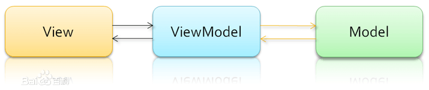
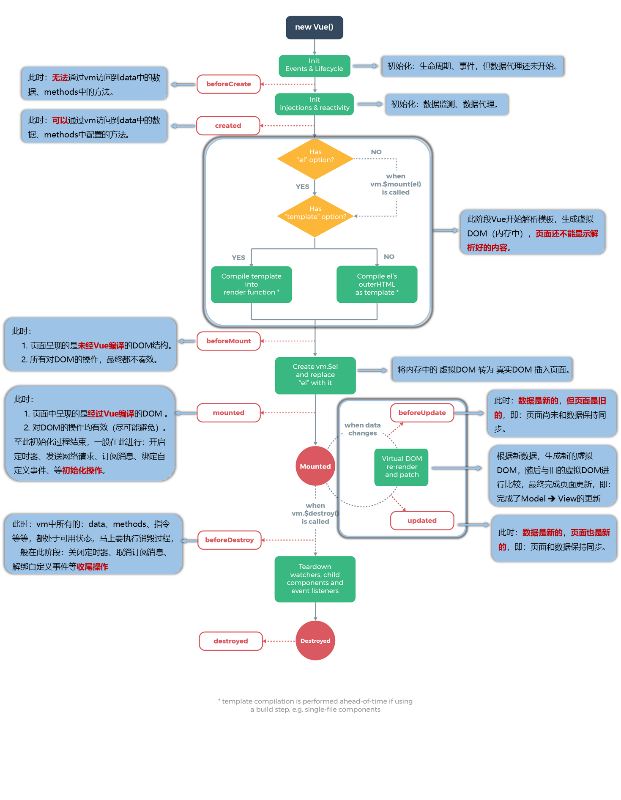
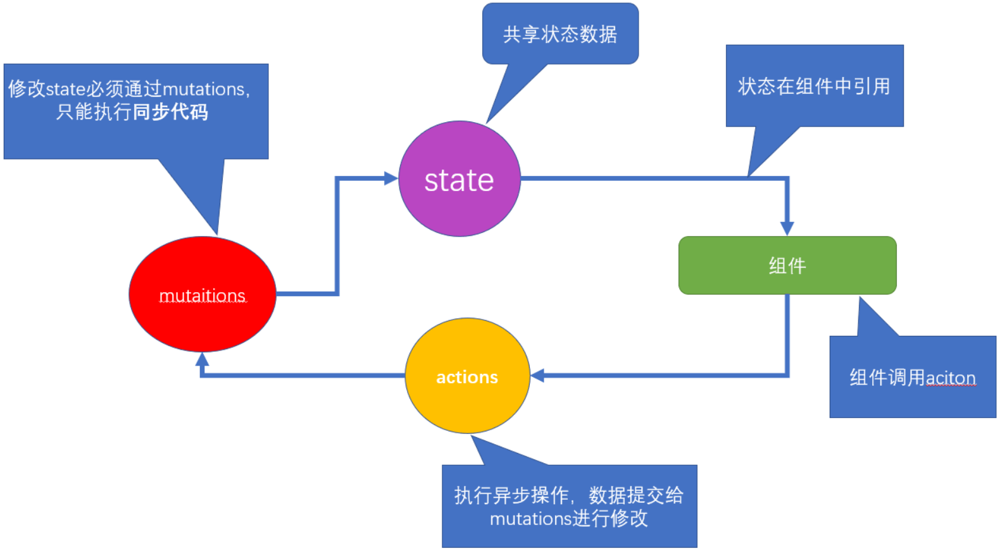

# Vue

> Vue (读音 /vjuː/，类似于 view) 是一套用于构建用户界面的渐进式框架。
> 作者: 尤雨溪(Evan You)

- MVVM，一种软件架构模式，决定了写代码的思想和层次
  - M： model 数据模型 (data 里定义)
  - V： view 视图 （html 页面）
  - VM： ViewModel 视图模型 (vue.js 源码)
    

# Vue2

- `template` 必须, 只能有一个根标签
- 组件样式设置 `scoped`,随机生成的 `data-v`开头的属性

- 这些方法会触发数组改变, v-for 会监测到并更新页面
  - push()
  - pop()
  - shift()
  - unshift()
  - splice()
  - sort()
  - reverse()
- 这些方法不会触发 v-for 更新
  - slice()
  - filter()
  - concat()

## 插值表达式

> 语法: {{ 表达式 }}

```vue
<template>
  <h1>{{ msg }}</h1>
</template>

<script>
export default {
  data() {
    // 定义数据
    return {
      // key相当于变量名
      msg: "hello, vue",
    };
  },
};
</script>
```

## 指令

### v-bind

> 语法：v-bind:属性名="vue 变量"
> 简写：:属性名="vue 变量"

```html
<!-- vue指令-v-bind属性动态赋值 -->
<a v-bind:href="url">我是a标签</a>

```

### v-model

> 语法: v-model="vue 数据变量"
> 双向数据绑定
> 数据变化 -> 视图自动同步
> 视图变化 -> 数据自动同步

```vue
<template>
  <!--
        v-model:是实现vuejs变量和表单标签value属性, 双向绑定的指令
    -->
  <input type="text" v-model="username" />
</template>

<script>
export default {
  data() {
    return {
      username: "",
    };
  },
};
</script>
```

### v-on

> 语法：v-on:事件名="methods 中的函数(实参)"
> 简写: @事件名="methods 中的函数"
> 传参, 通过$event 指代事件对象传给事件处理函数

```html
<button v-on:click="addCountFn(5, $event)">一</button>

<script>
  export default {
    methods: {
      addCountFn(num, e) {
        this.count += num;
        e.preventDefault();
      },
    },
  };
</script>
```

### v-text/v-html

> 语法:
> v-text="vue 数据变量"
> v-html="vue 数据变量"
> 注意: 会覆盖插值表达式

```html
<template>
  <div>
    <p v-text="str"></p>
    <p v-html="str"></p>
  </div>
</template>

<script>
  export default {
    data() {
      return {
        str: "<span>我是一个span标签</span>",
      };
    },
  };
</script>
```

### v-show/v-if

> 语法:
> v-show="vue 变量"
> v-if="vue 变量"
> 原理
> v-show 用的 display:none 隐藏 (频繁切换使用)
> v-if 直接从 DOM 树上移除
> Vue 处理指令时，v-for 比 v-if 具有更高的优先级, 虽然用起来也没报错好使, 但是性能不高

```vue
<template>
  <div>
    <h1 v-show="isOk">v-show的盒子</h1>
    <h1 v-if="isOk">v-if的盒子</h1>

    <div>
      <p v-if="age > 18">我成年了</p>
      <p v-else>还得多吃饭</p>
    </div>
  </div>
</template>

<script>
export default {
  data() {
    return {
      isOk: true,
      age: 15,
    };
  },
};
</script>
```

### v-for

> 语法
> v-for="(值, 索引) in 目标结构"
> v-for="值 in 目标结构"
> 目标结构:
> 可以遍历数组 / 对象 / 数字 / 字符串 (可遍历结构)
> Vue 处理指令时，v-for 比 v-if 具有更高的优先级, 虽然用起来也没报错好使, 但是性能不高

```vue
<template>
  <div id="app">
    <!-- v-for 把一组数据, 渲染成一组DOM -->
    <!-- 口诀: 让谁循环生成, v-for就写谁身上 -->
    <p>学生姓名</p>
    <ul>
      <li v-for="(item, index) in arr" :key="item">{{ index }} - {{ item }}</li>
    </ul>
  </div>
</template>

<script>
export default {
  data() {
    return {
      arr: ["小明", "小欢欢", "大黄"],
    };
  },
};
</script>
```

### v-cloak

> 本质是一个特殊属性，Vue 实例创建完毕并接管容器后，会删掉 v-cloak 属性。
> 配合 `v-cloak `可以解决网速慢时页面展示出{{xxx}}的问题。
> 使用:

```html
<style>
  [v-cloak] {
    display: none;
  }
</style>
```

### v-once

- `v-once`所在节点在初次动态渲染后，就视为静态内容了。
- 以后数据的改变不会引起`v-once`所在结构的更新，可以用于优化性能。

### v-pre

- 跳过其所在节点的编译过程。
- 可利用它跳过:没有使用指令语法、没有使用插值语法的节点，会加快编译。

## 虚拟 DOM

> vue 文件中的 template 里写的标签, 都是模板, 都要被 vue 处理成虚拟 DOM 对象, 才会渲染显示到真实 DOM 页面上

### Diff 算法

- 根元素变了, 删除重建

```html
<div id="box">
  <p class="my_p">123</p>
</div>
<ul id="box">
  <li class="my_p">123</li>
</ul>
```

- 根元素没变, 属性改变, ==元素复用==, 更新属性

```html
<div id="box">
  <p class="my_p">123</p>
</div>
<div id="myBox" title="标题">
  <p class="my_p">123</p>
</div>
```

- 根元素没变, 子元素没变, 元素内容改变
- v-for 不会移动 DOM, 而是尝试复用, 就地更新

<br>

- 有 key - 值为索引
- 因为新旧虚拟 DOM 对比, key 存在就复用此标签更新内容, 如果不存在就直接建立一个新的

## 自定义指令

> https://cn.vuejs.org/v2/guide/custom-directive.html

## Vue 修饰符

> 事件修饰符

1. `prevent: `阻止默认事件（常用）;
2. `stop: `阻止事件冒泡（常用）;
3. `once: `事件只触发一次（常用）;
4. `capture:` 使用事件的捕获模式;
5. `self:` 只有 event.target 是当前操作的元素时才触发事件:
6. `passive: `事件的默认行为立即执行,无需等待事件回调执行完毕;

> 按键修饰符

. Vue 中常用的按键别名:

- 回车 => `enter`
- 删除 => `delete `(捕获“删除”和“退格”键)
- 退出 => `esc`
- 空格 => `space`
- 换行 => `tab `(特殊,必须配合 keydown 去使用)
- 上 => `up`
- 下 => `down`
- 左 => `left`
- 右 => `right`

1. Vue 未提供别名的按健，可以使用按健原始的 key 值去绑定，但注意要转为 kebab-case(短横线命名）
2. 系统修饰键（用法特殊）:ctrl、alt、shift、meta
   (1).配合 keyup 使用:按下修饰健的同时，再按下其他键，随后释放其他健，事件才被触发。
   (2).配合 keydown 使用:正常触发事件。
3. Vue.config. keyCodes.自定义键名=键码,可以去定制按键别名

## 动态样式

### 动态 class

> 语法:
> :class="{类名: 布尔值}"

```html
template>
  <div>
    <!-- 语法:
      :class="{类名: 布尔值}"
      使用场景: vue变量控制标签是否应该有类名
     -->
    <p :class="{red_str: bool}">动态class</p>
  </div>
</template>

```

### 动态 style

> 语法
> :style="{css 属性: 值}"

```html
<template>
  <div>
    <!-- 动态style语法
      :style="{css属性名: 值}"
     -->
    <p :style="{backgroundColor: colorStr}">动态style</p>
  </div>
</template>
```

## Options ApI

### filter(废弃)

> 语法:
> Vue.filter("过滤器名", (值) => {return "返回处理后的值"})
> filters: {过滤器名字: (值) => {return "返回处理后的值"}

```html
<template>
  <div>
    <p>原来的样子: {{ msg }}</p>
    <!-- 2. 过滤器使用
      语法: {{ 值 | 过滤器名字 }}
     -->
    <p>使用翻转过滤器: {{ msg | reverse }}</p>
    <p :title="msg | toUp">鼠标长停</p>
  </div>
</template>

<script>
  export default {
    data() {
      return {
        msg: "Hello, Vue",
      };
    },
    // 方式2: 局部 - 过滤器
    // 只能在当前vue文件内使用
    /*
     语法: 
     filters: {
       过滤器名字 (val) {
         return 处理后的值
       }
     }
  */
    filters: {
      toUp(val) {
        return val.toUpperCase();
      },
    },
  };
</script>
```

> 语法:
> 过滤器传参: vue 变量 | 过滤器(实参)
> 多个过滤器: vue 变量 | 过滤器 1 | 过滤器 2

```html
<template>
  <div>
    <p>原来的样子: {{ msg }}</p>
    <!-- 1.
      给过滤器传值
      语法: vue变量 | 过滤器名(值)
     -->
    <p>使用翻转过滤器: {{ msg | reverse('|') }}</p>
    <!-- 2.
      多个过滤利使用
      语法: vue变量 | 过滤器1 | 过滤器2
     -->
    <p :title="msg | toUp | reverse('|')">鼠标长停</p>
  </div>
</template>

<script>
  export default {
    data() {
      return {
        msg: "Hello, Vue",
      };
    },
    filters: {
      toUp(val) {
        return val.toUpperCase();
      },
    },
  };
</script>
```

### computed

> 计算属性是基于它们的依赖项的值结果进行缓存的，只要依赖的变量不变, 都直接从缓存取结果

```javascript
computed: {
    "计算属性名" () {
        return "值"
    }
}
computed: {
    num(){
      return this.a + this.b
    }
  }
// 完整写法
computed: {
    "属性名": {
        set(值){

        },
        get() {
            return "值"
        }
    }
}
```

### watch

> 可以侦听 data/computed 属性值改变

```html
<script>
  export default {
    data() {
      return {
        name: "",
      };
    },
    // 目标: 侦听到name值的改变
    /*
  语法:
    watch: {
      变量名 (newVal, oldVal){
        // 变量名对应值改变这里自动触发
      }
    }
  */
    watch: {
      // newVal: 当前最新值
      // oldVal: 上一刻值
      name(newVal, oldVal) {
        console.log(newVal, oldVal);
      },
    },
  };
</script>
```

> 深度侦听和立即执行

```javascript
watch: {
    "要侦听的属性名": {
        immediate: true, // 立即执行
        deep: true, // 深度侦听复杂类型内变化
        handler (newVal, oldVal) {

        }
    }
}
```

## 组件

### 注册组件

- 全局注册

```javascript
// 1. 创建组件 - 文件名.vue
// 2. 引入组件
import Pannel from "./components/Pannel";
// 3. 全局 - 注册组件
/*
  语法: 
  Vue.component("组件名", 组件对象)
*/
Vue.component("PannelG", Pannel);
```

- 局部注册

```javascript
import 组件名 from "vue文件路径";

export default {
  components: { 组件名 },
};
```

### 组件通讯

- 父向子-props

```vue
<!-- 父 -->
<Son 属性名="好吃的口水鸡" @事件名="函数;" />
<!-- 子 -->
<script>
export default {
  props: {
    属性名: {
      type: String,
      default: "",
    },
  },
  created() {
    this.$emit("事件名", 参数);
  },
};
</script>
```

- 全局事件总线

```javascript
// main.js
Vue.prototype.$bus = this;
// 组件内
this.$bus.$on("事件名", 参数);
beforeDestroy(){
	// 解绑事件
	this.$bus.$off('事件名')
}
```

### 组件缓存

> keep-alive 组件, 可以让包裹的组件保存在内存中不被销毁
> 生命周期:
> activated - 激活
> deactivated - 失去激活状态

```vue
<div style="border: 1px solid red;">
  <!-- Vue内置keep-alive组件, 把包起来的组件缓存起来 -->
  <keep-alive>
    <组件></组件>
  </keep-alive>
</div>
```

### 组件插槽

> 默认插槽
> 组件内用占位
> 使用组件时夹着的地方, 传入标签替换 slot

```vue
<slot>默认内容</slot>
```

> 具名插槽
> 传入的标签可以分别派发给不同的 slot 位置
> v-slot 可以简化成#使用

```vue
<template>
  <div>
    <slot name="title"></slot>
  </div>
</template>
<template>
  <div id="container">
    <template #title>
      <h4>芙蓉楼送辛渐</h4>
    </template>
  </div>
</template>
```

> 作用域插槽
> 子组件里值, 在给插槽赋值时在父组件环境下使用
> https://cn.vuejs.org/v2/guide/components-slots.html#%E4%BD%9C%E7%94%A8%E5%9F%9F%E6%8F%92%E6%A7%BD

## 生命周期

| 阶段 | 方法名        | 方法名    |
| ---- | ------------- | --------- |
| 创建 | beforeCreate  | created   |
| 挂载 | beforeMount   | mounted   |
| 更新 | beforeUpdate  | updated   |
| 销毁 | beforeDestroy | destroyed |



### 初始化

1.new Vue() – Vue 实例化(组件也是一个小的 Vue 实例)

2.Init Events & Lifecycle – 初始化事件和生命周期函数

3.beforeCreate – 生命周期钩子函数被执行

4.Init injections&reactivity – Vue 内部添加 data 和 methods 等

5.created – 生命周期钩子函数被执行, 实例创建

6.接下来是编译模板阶段 –开始分析

7.Has el option? – 是否有 el 选项 – 检查要挂到哪里

​ 没有. 调用$mount()方法

​ 有, 继续检查 template 选项

### 挂载

1.template 选项检查

​ 有 - 编译 template 返回 render 渲染函数

​ 无 – 编译 el 选项对应标签作为 template(要渲染的模板)

2.虚拟 DOM 挂载成真实 DOM 之前

3.beforeMount – 生命周期钩子函数被执行

4.Create … – 把虚拟 DOM 和渲染的数据一并挂到真实 DOM 上

5.真实 DOM 挂载完毕

6.mounted – 生命周期钩子函数被执行

### 更新

1.当 data 里数据改变, 更新 DOM 之前

2.beforeUpdate – 生命周期钩子函数被执行

3.Virtual DOM…… – 虚拟 DOM 重新渲染, 打补丁到真实 DOM

4.updated – 生命周期钩子函数被执行

5.当有 data 数据改变 – 重复这个循环

### 销毁

1.当$destroy()被调用 – 比如组件 DOM 被移除(例 v-if)

2.beforeDestroy – 生命周期钩子函数被执行

3.拆卸数据监视器、子组件和事件侦听器

4.实例销毁后, 最后触发一个钩子函数

5.destroyed – 生命周期钩子函数被执行

## \$nextTick 和 \$refs

> Vue 更新 DOM-异步的
> 点击 count++, 马上通过"原生 DOM"拿标签内容, 无法拿到新值

```html
<template>
  <div>
    <p>1. 获取原生DOM元素</p>
    <h1 id="h" ref="myH">我是一个孤独可怜又能吃的h1</h1>
    <p>2. 获取组件对象 - 可调用组件内一切</p>
    <Demo ref="de"></Demo>
    <p>3. vue更新DOM是异步的</p>
    <p ref="myP">{{ count }}</p>
    <button @click="btn">点击count+1, 马上提取p标签内容</button>
  </div>
</template>

<script>
  // 目标: 获取组件对象
  // 1. 创建组件/引入组件/注册组件/使用组件
  // 2. 组件起别名ref
  // 3. 恰当时机, 获取组件对象
  import Demo from "./Child/Demo";
  export default {
    mounted() {
      console.log(document.getElementById("h")); // h1
      console.log(this.$refs.myH); // h1

      let demoObj = this.$refs.de;
      demoObj.fn();
    },
    components: {
      Demo,
    },
    data() {
      return {
        count: 0,
      };
    },
    methods: {
      btn() {
        this.count++; // vue监测数据更新, 开启一个DOM更新队列(异步任务)
        console.log(this.$refs.myP.innerHTML); // 0

        // 原因: Vue更新DOM异步
        // 解决: this.$nextTick()
        // 过程: DOM更新完会挨个触发$nextTick里的函数体
        this.$nextTick(() => {
          console.log(this.$refs.myP.innerHTML); // 1
        });
      },
    },
  };
</script>
```

## 动画和过度

> https://cn.vuejs.org/v2/guide/transitions.html

## 响应式数据原理

> 对象属性拦截 (vue2.x)
> Object.defineProperty

```javascript
let data = {};
let _name = "柴柴老师";
Object.defineProperty(data, "name", {
  // 访问name属性就会执行此方法 返回值就是获取到的值
  get() {
    console.log("name属性被获取了");
    return _name;
  },
  // 设置新值就会执行此方法 newVal就是设置的新值
  set(newVal) {
    console.log("name属性被设置新值了");
    console.log(newVal);
    _name = newVal;
  },
});
```

# Vue Cli

> https://cli.vuejs.org/zh/guide/

- 全局安装

```bash
npm install -g @vue/cli
```

- 查看版本

```bash
vue --version
```

- 更新版本

```bash
npm update -g @vue/cli
```

- 创建项目

```bash
vue create vue-demo
```

- 启动服务

```bash
npm run serve
```

# Vue Router

- 通过切换，“隐藏”了的路由组件，默认是被销毁掉的，需要的时候再去挂载。
- 每个组件都有自己的`$route`属性，里面存储着自己的路由信息。
- 整个应用只有一个 router，可以通过组件的`$router`属性获取到。

## 指定展示位置

```vue
<router-view></router-view>
```

## 多级路由

```js
routes: [
  {
    path: "/about",
    component: About,
  },
  {
    path: "/home",
    component: Home,
    children: [
      //通过children配置子级路由
      {
        path: "news/:id?", //此处一定不要写：/news
        component: News,
        name: "news",
      },
      {
        path: "message", //此处一定不要写：/message
        component: Message,
        name: "message",
      },
    ],
  },
];
```

## 接收参数

```js
$route.query.id;
$route.query.title;
$route.params.id;
$route.params.title;
```

## 编程式路由导航

```js
//$router的两个API
this.$router.push({
  name: "xiangqing",
  params: {
    id: xxx,
    title: xxx,
  },
});

this.$router.replace({
  name: "xiangqing",
  params: {
    id: xxx,
    title: xxx,
  },
});
this.$router.forward(); //前进
this.$router.back(); //后退
this.$router.go(); //可前进也可后退
```

## 缓存路由组件

- 缓存单个组件

  ```vue
  <keep-alive include="News"> 
      <router-view></router-view>
  </keep-alive>
  ```

- 缓存多个组件
  ```vue
  <keep-alive :include="['News', 'Message']">
      <router-view></router-view>
  </keep-alive>
  ```

## 生命周期

1.  `activated`路由组件被激活时触发。
2.  `deactivated`路由组件失活时触发。

## 路由守卫

> https://router.vuejs.org/zh/guide/advanced/navigation-guards.html

## 路由模式

1. 对于一个 url 来说，什么是 hash 值？—— #及其后面的内容就是 hash 值。
2. hash 值不会包含在 HTTP 请求中，即：hash 值不会带给服务器。
3. hash 模式：
   1. 地址中永远带着#号，不美观 。
   2. 若以后将地址通过第三方手机 app 分享，若 app 校验严格，则地址会被标记为不合法。
   3. 兼容性较好。
4. history 模式：
   1. 地址干净，美观 。
   2. 兼容性和 hash 模式相比略差。
   3. 应用部署上线时需要后端人员支持，解决刷新页面服务端 404 的问题。

# Vuex

> uex 是一个专为 Vue.js 应用程序开发的状态管理模式。它采用**集中式存储管理应用的所有组件的状态，并以相应的规则保证状态以一种可预测**的方式发生变化。
> https://vuex.vuejs.org/zh/
> 已弃用，建议转 pinia



```javascript
computed:{
	//借助mapState生成计算属性
	...mapState(['sum','school','subject']),
	//借助mapGetters生成计算属性：bigSum（数组写法）
  ...mapGetters(['bigSum'])
}
methods:{
  //靠mapActions生成：incrementOdd、incrementWait（数组形式）
  ...mapActions(['jiaOdd','jiaWait']),
	//靠mapMutations生成：JIA、JIAN（对象形式）
  ...mapMutations(['JIA','JIAN']),
}
```
