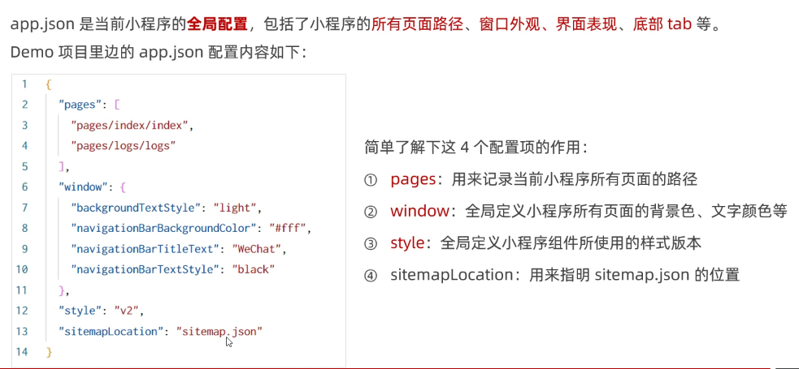

# 小程序简介

- 小程序与普通网页开发的区别


## 项目结构

- 项目的基本组成结构


- 页面的组成部分


## JSON 配置文件

> JSON 是一种数据格式，在实际开发中，JSON 总是以配置文件的形式出现。小程序项目中也不例外：通过不同的 .json 配置文件，可以对小程序项目进行不同级别的配置。

- 小程序项目中有 4 种 json 配置文件，分别是：
  - ① 项目根目录中的 app.json 配置文件
  - ② 项目根目录中的 project.config.json 配置文件
  - ③ 项目根目录中的 sitemap.json 配置文件
  - ④ 每个页面文件夹中的 .json 配置文件

<br>

- **`app.json`**
  

<br>

- **`project.config.json`**
  

<br>

- **`sitemap.json`**
  

<br>

- **`页面的 .json`**
  

<br>

- **新建小程序页面**
  

<br>

- **修改项目首页**
  

## 小程序代码的构成

- **WXML**

> WXML（WeiXin Markup Language）是小程序框架设计的一套标签语言，用来构建小程序页面的结构，其作用类似于网页开发中的 HTML。

- WXML 和 HTML 的区别
  - 标签名称不同
    - HTML （div, span, img, a）
    - WXML（view, text, image, navigator）
  - 属性节点不同
    - `<a href="#">超链接</a>`
    - `<navigator url="/pages/home/home"></navigator>`
  - 提供了类似于 Vue 中的模板语法
    - 数据绑定
    - 列表渲染
    - 条件渲染

<br>

- **WXSS**

> WXSS (WeiXin Style Sheets)是一套样式语言，用于描述 WXML 的组件样式，类似于网页开发中的 CSS。

- WXSS 和 CSS 的区别
  - 新增了 rpx 尺寸单位
    - CSS 中需要手动进行像素单位换算，例如 rem
    - WXSS 在底层支持新的尺寸单位 rpx，在不同大小的屏幕上小程序会自动进行换算
  - 提供了全局的样式和局部样式
    - 项目根目录中的 app.wxss 会作用于所有小程序页面
    - 局部页面的 .wxss 样式仅对当前页面生效
  - WXSS 仅支持部分 CSS 选择器
    - `.class ` 和 `#id`
    - `element`
    - 并集选择器、后代选择器
    - `::after` 和 `::before` 等伪类选择器

<br>

- **JS 逻辑交互**

- 小程序中的 .js 文件

  - 一个项目仅仅提供界面展示是不够的，在小程序中，我们通过 .js 文件来处理用户的操作。例如：响应用户的点击、获取用户的位置等等。

- 小程序中 .js 文件的分类
  - 小程序中的 JS 文件分为三大类，分别是：
    - app.js
      - 是整个小程序项目的入口文件，通过调用 App() 函数来启动整个小程序
    - 页面的 .js 文件
      - 是页面的入口文件，通过调用 Page() 函数来创建并运行页面
    - 普通的 .js 文件
      - 是普通的功能模块文件，用来封装公共的函数或属性供页面使用

# 宿主环境


## 通信模型

- 通信主体
  
- 通信模型
  

## 运行机制

- 启动过程
  
- 页面渲染过程
  

## 组件


### view 和 scroll-view 组件


### swiper 和 swiper-item 组件


### text 和 rich-text 组件


### button 组件


### image 组件


## API


## 协同工作和发布

- **协同工作**


<br>

- **成员管理**


<br>

- **小程序版本**


<br>

- **发布上线**


<br>

- **运营数据**


# WXML 模板语法

## 数据绑定

- **数据绑定的基本原则**
  

<br>

- **在 data 中定义页面的数据**
  

<br>

- **Mustache 语法的格式**
  

<br>

- **Mustache 语法的应用场景**
  

<br>

- **动态绑定内容**
  

<br>

- **动态绑定属性**
  

<br>

- **三元运算**
  

<br>

- **算术运算**
  

## 事件绑定

- **什么是事件**
  

<br>

- **常用事件**
  

<br>

- **事件对象属性**
  

<br>

- **target 和 currentTarget 区别**
  

<br>

- **bindtap 语法格式**
  

<br>

- **在事件处理函数中为 data 中的数据赋值**
  

<br>

- **事件传参**
  

<br>

- **bindinput 语法格式**
  

<br>

- **获取文本框的值**
  

## 条件渲染

- **`wx:if`**
  

<br>

- **`<block>`**
  

<br>

- **`hidden`**
  

<br>

- **`wx:if` 对比 `hidden`**
  

## 列表渲染

- **`wx:for`**
  

<br>

- **设置索引与项的变量名**
  

<br>

- **`wx:key`**
  

# WXSS 模板语法

> WXss (Weixin Style Sheets)是一套样式语言，用于美化 wXML 的组件样式，类似于网页开发中的 CSS。

- **WXSS 和 CSS 的关系**
  

## rpx 尺寸单位

> rpx ( responsive pixel）是微信小程序独有的，用来解决屏适配的尺寸单位:

- **实现原理**
  

<br>

- **rpx 与 px 换算**
  

## 样式导入

> 使用 wxSS 提供的@import 语法，可以导入外联的样式表。

- **@import 语法格式**


## 全局样式和局部样式

- **全局样式**
  > 定义在 app.wxss 中的样式为全局样式，作用于每一个页面。

<br>

- **局部样式**
  

# 全局配置

> 全局配置文件及常用的配置项


## window

- **小程序窗口的组成部分**
  

<br>

- **window 节点常用配置项**
  

<br>

- **设置导航栏标题**
  

<br>

- **设置导航栏背景色**
  

<br>

- **设置导航栏标题颜色**
  

<br>

- **全局下拉刷新功能**
  

<br>

- **下拉刷新时窗口背景色**
  

<br>

- **下拉刷新 loading 样式**
  

<br>

- **上拉触底距离**
  

## tabBar

- **tabBar 简介**
  

<br>

- **tabBar 的 6 个组成部分**
  

<br>

- **tabBar 节点配置项**
  

<br>

- **每个 tab 配置项**
  

# 页面配置

> 小程序中，每个页面都有自己的.json 配置文件，用来对当前页面的窗口外观、页面效果等进行配置。

## 页面配置和全局配置的关系


## 常用配置项


# 网络数据请求

## 请求限制


## 配置 request 合法域名


## 发起请求

- **GET 请求**
  

<br>

- **POST 请求**
  

<br>

- **页面加载时请求**
  

## 跳过 request 合法域名校验


## 跨域及 Ajax


# 页面导航


## 声明式导航

- **导航到 tabBar 页面**
  

<br>

- **导航到非 tabBar 页面**
  

<br>

- **后退导航**
  

## 编程式导航

- **导航到 tabBar 页面**
  

<br>

- **导航到非 tabBar 页面**
  

<br>

- **后退导航**
  

<br>

## 导航传参

- **声明式导航传参**
  

<br>

- **编程式导航传参**
  

# 页面事件

## 下拉刷新

> 下拉刷新是移动端的专有名词，指的是通过手指在屏幕上的下拉滑动操作，从而重新加载页面数据的行为。

- **启用下拉刷新**
  

<br>

- **下拉刷新窗口样式**
  

<br>

- **监听下拉刷新事件**
  在页面的.js 文件中，通过 onPullDownRefresh()函数即可监听当前页面的下拉刷新事件。

<br>

- **停止下拉刷新**
  

## 上拉触底

> 上拉触底是移动端的专有名词，通过手指在屏幕上的上拉滑动操作，从而加载更多数据的行为。

- **监听上拉触底事件**
  

<br>

- **配置上拉触底距离**
  

# 生命周期

- **什么是生命周期**
  

<br>

- **生命周期的分类**
  

## 生命周期函数


<br>

- **生命周期函数的分类**
  

## 应用的生命周期函数


## 页面的生命周期函数


## 组件的生命周期函数


<br>

- **lifetimes 节点**
  

## 组件所在页面的生命周期函数


<br>

- **pageLifetimes 节点**
  

# WXS 脚本

> WXS ( Weixin Script)是小程序独有的一套脚本语言，结合 WXML，可以构建出页面的结构。

- **WXS 应用场景**
  wxml 中无法调用在页面的.js 中定义的函数，但是，wxml 中可以调用 wxs 中定义的函数。因此，小程序中 wxs 的典型应用场景就是“过滤器”。

## wxs 和 JavaScript 的关系


## 内嵌 wxs 脚本


## 外联 wxs 脚本


## WXS 的特点

- **与 Javascript 不同**
  为了降低 wxs (WeiXin Script)的学习成本，wxs 语言在设计时借大量鉴了 JavaScript 的语法。但是本质上，wts 和 javaScript 是完全不同的两种语言

<br>

- **不能作为组件的事件回调**
  

<br>

- **隔离性**
  

<br>

- **性能好**
  

# 自定义组件

## 创建组件


## 引用组件


<br>

- **局部引用**
  

<br>

- **全局引用**
  

<br>

- **引用方式区别**
  

<br>

- **组件和页面的区别**
  

## 样式

- **组件样式隔离**
  
  

<br>

- **修改样式隔离选项**
  

<br>

- **stylelsolation 可选值**
  

## 数据、方法和属性

- **data 数据**
  

<br>

- **methods 方法**
  

<br>

- **properties 属性**
  

<br>

- **data 和 properties 区别**
  

<br>

- **setData 修改 properties 的值**
  

## 数据监听器


## 纯数据字段


## 插槽


<br>

- **单个插槽**
  

<br>

- **多个插槽**
  
  
  

## 父子组件通信


<br>

- **属性绑定**
  
  

<br>

- **事件绑定**
  
  
  
  
  

<br>

- **获取组件实例**
  

## behaviors


<br>

- **behaviors 工作方式**
  

<br>

- **behaviors 创建**
  

<br>

- **behaviors 导入使用**
  

<br>

- **behaviors 节点**
  

<br>

- **同名覆盖和组合规则**
  

# 自定义 TabBar

> https://developers.weixin.qq.com/miniprogram/dev/framework/ability/custom-tabbar.html

- **配置信息**
  - 在 app.json 中的 tabBar 项指定 custom 字段，同时其余 tabBar 相关配置也补充完整。
  - 所有 tab 页的 json 里需声明 usingComponents 项，也可以在 app.json 全局开启。

```javascript
{
  "tabBar": {
    "custom": true,
    "color": "#000000",
    "selectedColor": "#000000",
    "backgroundColor": "#000000",
    "list": [{
      "pagePath": "page/component/index",
      "text": "组件"
    }, {
      "pagePath": "page/API/index",
      "text": "接口"
    }]
  },
  "usingComponents": {}
}
```

- **添加 tabBar 代码文件**

```javascript
custom - tab - bar / index.js;
custom - tab - bar / index.json;
custom - tab - bar / index.wxml;
custom - tab - bar / index.wxss;
```

# 分包

> 分包指的是把一个完整的小程序项目，按照需求划分为不同的子包，在构建时打包成不同的分包，用户在使用时按需进行加载。


## 使用分包


## 独立分包


## 分包预下载


# 扩展插件

## Mobx


```javascript
安装 mobx-miniprogram 和 mobx-miniprogram-bindings ：
npm install --save mobx-miniprogram mobx-miniprogram-bindings

---------------------------------

创建 MobX Store。
// store.js
import { observable, action } from "mobx-miniprogram";

export const store = observable({
// 数据字段
numA: 1,
numB: 2,

// 计算属性
get sum() {
return this.numA + this.numB;
},

// actions
update: action(function () {
const sum = this.sum;
this.numA = this.numB;
this.numB = sum;
}),
});

---------------------------------

在 Component 构造器中使用：
import { storeBindingsBehavior } from "mobx-miniprogram-bindings";
import { store } from "./store";

Component({
behaviors: [storeBindingsBehavior],
data: {
someData: "...",
},
storeBindings: {
store,
fields: {
numA: () => store.numA,
numB: (store) => store.numB,
sum: "sum",
},
actions: {
buttonTap: "update",
},
},
methods: {
myMethod() {
this.data.sum; // 来自于 MobX store 的字段
},
},
});

---------------------------------

在 Page 构造器中使用：
如果小程序基础库版本在 2.9.2 以上，可以直接像上面 Component 构造器那样引入 behaviors 。

如果需要比较好的兼容性，可以使用下面这种方式（或者直接改用 Component 构造器来创建页面）。

import { createStoreBindings } from "mobx-miniprogram-bindings";
import { store } from "./store";

Page({
data: {
someData: "...",
},
onLoad() {
this.storeBindings = createStoreBindings(this, {
store,
fields: ["numA", "numB", "sum"],
actions: ["update"],
});
},
onUnload() {
this.storeBindings.destroyStoreBindings();
},
myMethod() {
this.data.sum; // 来自于 MobX store 的字段
},
});
```

## Api Promise

```javascript
npm install --save miniprogram-api-promise

---------------------------------

import { promisifyAll, promisify } from 'miniprogram-api-promise';

const wxp = {}
// promisify all wx's api
promisifyAll(wx, wxp)
console.log(wxp.getSystemInfoSync())
wxp.getSystemInfo().then(console.log)
wxp.showModal().then(wxp.openSetting())

// compatible usage
wxp.getSystemInfo({success(res) {console.log(res)}})

// promisify single api
promisify(wx.getSystemInfo)().then(console.log)
```
