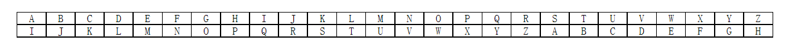

# 信息安全概论

---

## 单元测试一

- 什么是数据加密？简述加密和解密的过程。
  - 数据加密的基本过程包括对称为明文的可读信息进行处理，形成称为密文或密码的代码形式。该过程的逆过程称为解密，即将该编码信息转化为其原来的形式的过程。
- 在凯撒密码中令密钥 k=8，制造一张明文字母与密文字母对照表。
- DES 算法主要有哪几部分？
  - DES 算法采用 56 位的密钥，在 16 轮内完成对 64 位数据块的加密。每轮所用的子密钥由初始密钥分解而来。DES 算法主要分为两部分：置换(初始置换、扩充置换、逆置换)和替代(S 盒)，另外还有基于密码的复杂计算。
- 公开密钥体制的主要特点是什么？
  - (1) 加密能力与解密能力是分开的；(2) 密钥配发简单；(3) 需要保存的密钥量大大减少，N 个用户只需要 N 个；(4) 可满足不相识的人之间保密通信；(5) 可实现数字签名。
- 局域网操作系统有哪些基本服务功能？
  - 局域网必须能为用户提供各种基本服务：文件服务、打印服务、数据库服务、通信服务、分布式服务、网络管理服务、Internet/Intranet 等。
- Linux 操作系统的主要特点有哪些？
  - Linux 是按照 Unix 风格设计的操作系统，所以在源代码级上兼容绝大部分的 Unix 标准。Linux 主要具有：与 Unix 高度兼容、高度的稳定性和可靠性、完全开放源代码，价格低廉和系统安全可靠，绝无后门等特点。
- Windows 操作系统的安全特点是什么？
  - Windows 对象中有一个安全性描述符，安全性描述符上列出了允许用户和组在对象上可以执行的动作。安全性标识符可以用来设置和查询一个对象的安全属性，所有的命名对象、进程和线程都有与之关联的安全描述符。Windows 安全模式的一个最初目标，就是定义一系列标准的安全信息，并把它应用于所有对象的实例。
- Unix 操作系统的文件访问控制是基于什么来完成的？
  - Unix 系统的资源访问控制是基于文件的，为了维护系统的安全性，系统中每一个文件都具有一定的访问权限，只有具有这种访问权限的用户才能访问该文件，否则系统将给出 Permission Denied 的错误信息。
- 计算机系统安全的主要目标是什么？
  - 计算机安全的主要目标是保护计算机资源免受毁坏、替换、盗窃和丢失。
- 计算机系统安全技术标准有哪些？
  - 根据美国国防部开发的计算机安全标准，将安全级别由最低到最高划分为 D 级、C 级、B 级和 A 级，D 级为最低级别，A 级为最高级别。
- 访问控制的含义是什么？
  - 系统访问控制是对进入系统的控制。其主要作用是对需要访问系统及其数据的人进行识别，并检验其合法身份。
- 如何从 Windows xp 系统登录？
  - (1) 交互式登录：通过相应的用户账号和密码在本机登录 (2) 网络登录：输入的账号、密码必须是对方主机上的 (3) 服务登录：采用不同的用户账号登录，可以是域用户账户、本地用户账户或系统账户，不同账户的访问、控制权限不同。 (4) 批处理登录：所有账号要有批处理工作的权利。
- 什么是口令的生命周期？
  - 管理员可以为口令设定生命期，这样当口令生命期到后，系统就会强制用户更改系统密码。
- 简述 NTFS 文件系统的特点？
  - (1) NTFS 可以支持的分区大小可以达到 2TB。 (2) NTFS 是一个可恢复的文件系统。 (3) NTFS 支持对分区、文件夹和文件的压缩。 (4) NTFS 采用了更小的簇，可以更有效率地管理磁盘空间。 (5) 在 NTFS 分区上，可以为共享资源、文件夹以及文件设置访问许可权限。 (6) 在 NTFS 文件系统下可以进行磁盘配额管理。 (7) NTFS 使用一个“变更”日志来跟踪记录文件所发生的变更。
- 用维吉尼亚法加密下段文字：COMPUTER AND PASSWORD SYSTEM，密钥为 KEYWORD，下图为著名的维吉尼亚表。
  - 对照维吉尼亚表得密文为：MSKLIKHB ELZ DRVCAMNR JBCXCI

---

## 单元测试二

- 试分析数据库安全的重要性，说明数据库安全所面临的威胁。
  - 数据库的安全性是指数据库的任何部分都不允许受到恶意侵害，或未经授权的存取与修改。数据库是网络系统的核心部分，有价值的数据资源都存放在其中，这些共享的数据资源既要面对必需的可用性需求，又要面对被篡改、损坏和被窃取的威胁。
- 数据库的安全策略有哪些？简述其要点。
  - (1) 用户标识和鉴定。通过核对用户的名字或身份，决定该用户对系统的使用权。数据库系统不允许一个未经授权的用户对数据库进行操作。 (2) 存取控制。对于存取权限的定义称为授权。这些定义经过编译后存储在数据字典中。每当用户发出数据库的操作请求后，DBMS 查找数据字典，根据用户权限进行合法权检查。若用户的操作请求超出了定义的权限，系统就拒绝此操作。 (3) 数据分级。数据库系统对安全性的处理是把数据分级。这种方案为每一数据对象(文件、记录或字段等)赋予一定的保密级。 (4) 数据加密。为了更好地保证数据的安全性，可用密码存储口令、数据，对远程终端信息用密码传输防止中途非法截获等。我们把原始数据称为明文，用加密算法对明文进行加密。加密算法的输入是明文和密钥，输出是密码文。加密算法可以公开，但加密一定是保密的。
- 数据库管理系统的主要职能有哪些？
  - (1) 有正确的编译功能，能正确执行规定的操作； (2) 能正确执行数据库命令； (3) 保证数据的安全性、完整性，能抵御一定程度的物理破坏，能维护和提交数据库内容； (4) 能识别用户，分配授权和进行访问控制，包括身份识别和验证； (5) 顺利执行数据库访问，保证网络通信功能。
- 简述易地更新恢复技术。
  - 每个关系有一个页表，页表中每一项是一个指针，指向关系中的每一页（块）。当更新时，旧页保留不变，另找一个新页写入新的内容。在提交时，把页表的指针从旧页指向新页，即更新页表的指针。旧页实际上起到了前像的作用。由于存储介质可能发生故障，后像还是需要的。旧页又称影页。
- 简述介质失效后，恢复的一般步骤。
  - (1) 修复系统，必要时更换磁盘； (2) 如果系统崩溃，则重新启动系统； (3) 加载最近的备份； (4) 用运行日志中的后像重做，取最近备份以后提交的所有事务。
- 计算病毒的基本特征是什么？
  - (1) 刻意编写人为破坏 (2) 自我复制能力 (3) 夺取系统控制权 (4) 隐蔽性 (5) 潜伏性 (6) 不可预见性
- 简述检测计算机病毒的常用方法。
  - 比较被检测对象与原始备份的比较法；利用病毒特征代码串的搜索法；病毒体内特定位置的特征字识别法；运用反汇编技术分析被检测对象，确认是否为病毒的分析法。
- 什么是网络病毒，防治网络病毒的要点是什么？
  - 网络病毒是在计算机网络上传播扩散，专门攻击网络薄弱环节、破坏网络资源的计算机病毒。 网络病毒的防治：
    - (1) 使用优秀的防毒软件对电子邮件进行专门的保护 (2) 使用防毒软件同时保护客户机和服务器 (3) 使用特定的 SMTP 杀毒软件
- 网络安全有哪些特征？
  - (1) 保密性：信息不泄露给非授权的用户、实体或过程，或供其利用的特性。 (2) 完整性：数据未经授权不能进行改变的特性。 (3) 可用性：可被授权实体访问并按需求使用的特性，即当需要时应能存取所需的信息。 (4) 可控性：对信息的传播及内容具有控制能力。
- 什么是网络安全的最大威胁？
  - (1) 非授权访问：指一个非授权用户的入侵。 (2) 信息泄露：指造成将有价值的和高度机密的信息暴露给无权访问该信息的人的所有问题。 (3) 拒绝服务：指使系统难以或不能继续执行任务的所有问题。
- 网络安全主要有哪些关键技术？
  - 网络安全的关键技术：主机安全技术、身份认证技术、访问控制技术、密码技术、防火墙技术、安全审计技术、安全管理技术。
- 如何理解协议安全的脆弱性？
  - 网络系统都使用的 TCP/IP 协议、FTP、E-mail、NFS 等都包含着许多影响网络安全的因素，存在许多漏洞。
- 对因特网进行安全管理需要哪些措施？
  - (1) 社会的法律、法规以及企业的规章制度和安全教育等外部软件环境 (2) 技术方面的措施，如网络防毒、信息加密、存储通信、授权、认证以及防火墙技术 (3) 审计和管理措施，这方面措施同时也包含了技术与社会措施。
- 简述计算机病毒攻击的对象及所造成的危害。
  - (1) 攻击系统数据区。攻击部位包括硬盘主引导扇区、Boot 扇区、FAT 表、文件目录。一般来说，攻击系统数据区的病毒是恶性病毒，受损的数据不易恢复。 (2) 攻击文件。病毒对文件的攻击方式很多，如删除、改名、替换内容、丢失簇和对文件加密等。 (3) 攻击内存。病毒额外地占用和消耗内存资源，可导致一些大程序运行受阻。病毒攻击内存的方式有大量占用、改变内存总量、禁止分配和蚕食内存等。 (4) 干扰系统运行，使运行速度下降。如不执行命令、干扰内部命令的执行、虚假报警、打不开文件、内部栈溢出、占用特殊数据区、时钟倒转、重启动、死机、强制游戏、扰乱串并接口等等。病毒激活时，系统时间延迟程序启动，在时钟中纳入循环计数，迫使计算机空转，运行速度明显下降。 (5) 干扰键盘、喇叭或屏幕。如响铃、封锁键盘、换字、抹掉缓存区字符、输入紊乱等。使计算机的喇叭发出响声。病毒扰乱显示，如字符跌落、环绕、倒置、显示前一屏、光标下跌、滚屏、抖动、乱写等。 (6) 攻击 CMOS。在机器的 CMOS 中，保存着系统的重要数据，如系统时钟、磁盘类型和内存容量等，并具有校验和。有的病毒激活时，能够对 CMOS 进行写入动作，破坏 CMOS 中的数据。例如 CIH 病毒破坏计算机硬件，乱写某些主板 BIOS 芯片，损坏硬盘。 (7) 干扰打印机。如假报警、间断性打印或更换字符。 (8) 网络病毒破坏网络系统，非法使用网络资源，破坏电子邮件，发送垃圾信息，占用网络带宽等。
- 简述宏病毒的特征及其清除方法。
  - 宏病毒的特征：
    - (1) 会感染.doc 文档和.dot 模板文件。 (2) 宏病毒的传染通常是 Word 在打开一个带宏病毒的文档或模板时，激活宏病毒。病毒宏将自身复制到 Word 通用模板中，以后在打开或关闭文件时宏病毒就会把病毒复制到该文件中。 (3) 多数宏病毒包含 AutoOpen、AutoClose、AutoNew 和 AutoExit 等自动宏，通过这些自动宏病毒取得文档（模板）操作权。 (4) 宏病毒中总是含有对文档读写操作的宏命令。 (5) 宏病毒在.doc 文档、.dot 模板中以.BFF（Binary File Format）格式存放，这是一种加密压缩格式。
  - 宏病毒的清除：
    - (1) 使用选项“提示保存 Normal 模板” (2) 不要通过 Shift 键来禁止运行自动宏 (3) 查看宏代码并删除 (4) 使用 DisableAutoMacros 宏 (5) 设置 Normal.dot 的只读属性 (6) Normal.dot 的密码保护

---

## 单元测试三

- IPSec 能对应用层提供保护吗？
  - IPSec 是一个工业标准网络安全协议，为 IP 网络通信提供透明的安全服务，保护 TCP/IP 通信免遭窃听和篡改，可以有效抵御网络攻击。IPSec 工作于网络层，对终端站点间所有传输数据进行保护。它对应用层的保护是间接的，保护应用层可采用代理防火墙/保密网关技术。
- 简述防火墙的工作原理。
  - 防火墙是在两个网络之间执行访问控制策略的一个或一组系统，包括硬件和软件，目的是保护网络不被他人侵扰。本质上，它遵循的是一种允许或阻止业务来往的网络通信安全机制，也就是提供可控的过滤网络通信，只允许授权的通信。
- 在主机过滤体系结构防火墙中，内部网的主机想要请求外网的服务，有几种方式可以实现？
  - 两种，一种是使用已经由数据包过滤的服务，另一种是由堡垒主机使用代理服务。
- 构建一个 VPN 系统需要解决哪些关键技术？这些关键技术各起什么作用？
  - (1) 隧道技术：VPN 的核心就是隧道技术。隧道是一种通过互联网络在网络之间传递数据的一种方式。所传递的数据在传送之前被封装在相应的隧道协议里，当到达另一端时被解包。被封装的数据在互联网上传递时所经过的路径是一条逻辑路径。 (2) 加密技术：虚拟专用网上的加密方法主要是发送者在发送数据之前对数据加密，当数据到达接收者时由接收者对数据进行解密的处理过程。 (3) 用户身份认证技术：主要用于远程访问的情况。当一个拨号用户要求建立一个会话时，就要对用户的身份进行鉴定，以确定该用户是否是合法用户以及哪些资源可被使用。 (4) 访问控制技术：确定合法用户对资源的访问权限，以实现对信息资源的最大限度的保护。
- 用 IPSec 机制实现 VPN 时，如果企业内部网使用了私用 IP 地址怎么办？IPSec 该采用何种模式？
  - IPSec 协议通过包封装技术，能够利用 Internet 可路由的地址，封装内部网络的 IP 地址，实现异地网络的互通。 IPSec 应采用传输模式。
- 总结因特网上不安全的因素。
  - 因特网服务的安全隐患：
    - (1) 电子邮件 (2) 文件传输(FTP) (3) 远程登录(Telnet) (4) 用户新闻(Usenet News) (5) 万维网(WWW)
- 列举几个监控工具、Web 统计工具，简要记录其功能。
  - 监控工具：LSC 局域网屏蔽监控系统、AnySpy(网络警察)等 Web 统计工具：微软的 Gatineau、AWStats 等
- 简述黑客是如何攻击一个网站的。
  - 通常黑客攻击有三个阶段：
    - (1) 信息收集。信息收集的目的是为了进入所要攻击的目标网络的数据库。黑客会利用一些公开协议或工具，收集驻留在网络系统中的各个主机系统的相关信息。
    - (2) 系统安全弱点的探测。在收集到攻击目标的一批网络信息之后，黑客会探测网络上的每台主机，以寻求该系统的安全漏洞或安全弱点，黑客可能使用自编程序或利用公开的工具自动扫描驻留在网络上的主机。
    - (3) 网络攻击。黑客收集或探测到一些“有用”信息之后，就可能会对目标系统实施攻击。
- 简述数据完整性的概念及影响数据完整性的主要因素。
  - 数据完整性包括数据地正确性、有效性和一致性。 数据完整性泛指与损坏和丢失相对的数据的状态，它通常表明数据的可靠性与准确性是可信赖的，同时也意味着数据有可能是无效的或不完整的。
    - (1) 正确性。数据在输入时要保证其输入值与定义这个表相应的域的类型一致。 (2) 有效性。在保证数据有效的前提下，系统还要约束数据的有效性。 (3) 一致性。当不同的用户使用数据库时，应该保证他们取出的数据必须一致。
  - 影响数据完整性的因素有五种：硬件故障、网络故障、逻辑问题、意外的灾难性事件和人为的因素。
- 什么是容错与网络冗余技术，实现容错系统的主要方法有哪些？
  - 容错是指当系统出现某些指定的硬件或软件的错误时，系统仍能执行规定的一组程序。
  - 实现容错技术的主要方法有：(1) 空闲备件；(2) 负载平衡；(3) 镜像；(4) 复现；(5) 冗余系统配件；(6) 存储系统的冗余。
  - 网络冗余：在网络系统中作为传输数据介质的线路和其它的网络连接部件，都必须有持续正常运行时间的备用途径。
- 实现存储系统冗余的方法有哪些？
  - 实现存储系统冗余的最为流行的几种方法是：磁盘镜像、磁盘双联和 RAID。
    - (1) 磁盘镜像：磁盘镜像时两个磁盘的格式需相同，即主磁盘和辅助磁盘的分区大小应当是一样的。
    - (2) 磁盘双联：在镜像磁盘对中增加一个 I/O 控制器便称为磁盘双联。它由于对 I/O 总线争用次数的减少而提供了系统的性能。
    - (3) RAID：是一种能够在不经历任何故障时间的情况下更换正在出错的磁盘或已发生故障的磁盘的存储系统，它是保证磁盘子系统非故障时间的一条途径。RAID 的另一个优点是在其上面传输数据的速度远远高于单独一个磁盘上传输数据时的速度。即数据能够从 RAID 上较快地读出来。
- 简述“镜像”的概念。
  - 镜像技术是物理上的镜像原理在计算机技术上的具体应用，它所指的是将数据原样从一台计算机(或服务器)上拷贝到另一台计算机(或服务器)上。
- 网络系统备份的主要目的是什么？
  - 尽可能快地回复计算机或计算机网络系统所需要的数据和系统信息。
- 简述入侵检测系统的工作原理，比较基于主机和基于网络应用的入侵检测系统的优缺点。
  - 入侵检测就是通过从计算机网络或计算机系统中的若干关键点收集信息并对其进行分析，从中发现网络或系统中是否有违反安全策略的行为和遭到袭击的迹象的一种安全技术。
  - 优点：
    - 基于主机：有专门的检测代理，能提供更详尽的相关信息，误报率低，复杂性相对基于网络的要低。 基于网络应用：不需要主机提供严格的审计，对主机资源消耗少，并可提供对网络通用的保护而无需顾及异构主机的不同架构。
  - 缺点：
    - 基于主机：依赖于服务器固有的日志与监控能力，不能确保及时采样到审计。
    - 基于网络应用：由于要检测整个网段的流量，处理的信息量大，容易遭受拒绝服务(DOS)攻击。
- 简述 IP 欺骗技术。
  - IP 电子欺骗攻击是指利用 TCP/IP 本身的缺陷进行的入侵，即用一台主机设备冒充另外一台主机的 IP 地址，与其它设备通信，从而达到某种目的的过程。它不是进攻的结果而是进攻的手段。IP 欺骗者通过使用 RAW Socket 编程，发送带有假冒的源 IP 地址的 IP 数据包，来达到自己的目的。另外，在现在的网上，也有大量的可以发送伪造的 IP 地址的工具可用，使用它可以任意指定源 IP 地址，以免留下自己的痕迹。
  - IP 欺骗技术有如下三个特征：
    - (1) 只有少数平台能够被这种技术攻击，也就是说很多平台都不具有这方面缺陷。 (2) 这种技术出现的可能性比较小，因为这种技术不好理解，也不好操作，只有一些真正的网络高手才能做到这点。 (3) 很容易防备这种攻击方法，如使用防火墙等。
