# 服务器的基本概念与初识 Ajax

---

## 客户端与服务器

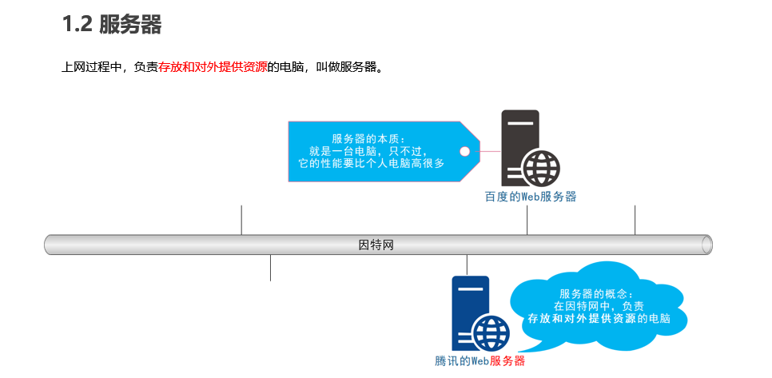

## URL 地址

### URL 地址的概念

- URL（全称是 UniformResourceLocator）中文叫统一资源定位符，用于标识互联网上每个资源的唯一存放位置。
- 浏览器只有通过 URL 地址，才能正确定位资源的存放位置，从而成功访问到对应的资源。
- 常见的 URL 举例：
- http://www.baidu.com
- http://www.taobao.com
- http://www.cnblogs.com/liulongbinblogs/p/11649393.html

### URL 地址的组成部分

- URL 地址一般由三部组成：
- ① 客户端与服务器之间的通信协议
- ② 存有该资源的服务器名称
- ③ 资源在服务器上具体的存放位置

## 客户端与服务器的通信过程

## jQuery 中的 Ajax

- Ajax 的全称是 Asynchronous Javascript And XML（异步 JavaScript 和 XML）。
- 通俗的理解：在网页中利用 XMLHttpRequest 对象和服务器进行数据交互的方式，就是 Ajax。
- 浏览器中提供的 XMLHttpRequest 用法比较复杂，所以 jQuery 对 XMLHttpRequest 进行了封装，提供了一系列 Ajax 相关的函数，极大地降低了 Ajax 的使用难度。
- jQuery 中发起 Ajax 请求最常用的三个方法如下：
- $.get()
- $.post()
- $.ajax()

### $.get()函数的语法

### $.post()函数的语法

### $.ajax()函数的语法

## XMLHttpRequest 的基本使用

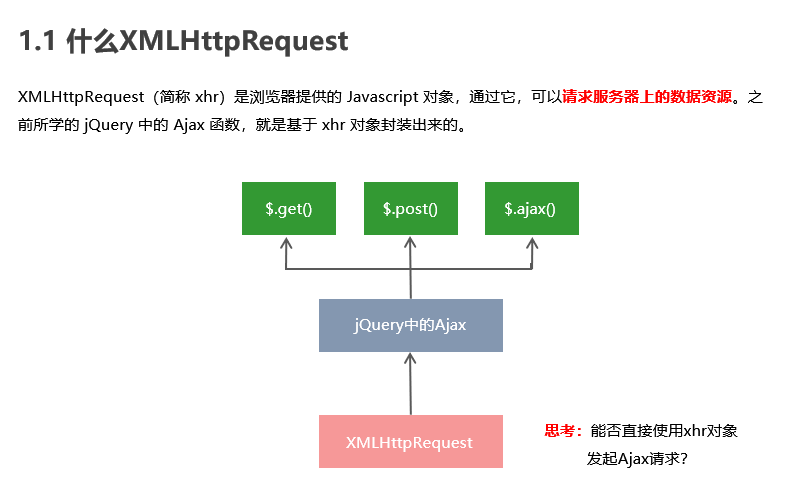

### 使用 xhr 发起 GET 请求

### xhr 发起 POST 请求

### xhr 对象的 readyState 属性

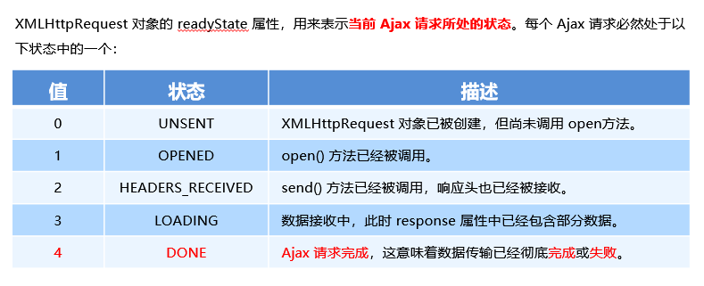

### 查询字符串

### URL 编码与解码

## 数据交换格式

- 数据交换格式，就是服务器端与客户端之间进行数据传输与交换的格式。
- 前端领域，经常提及的两种数据交换格式分别是 XML 和 JSON。其中 XML 用的非常少，所以，我们重点要学习的数据交换格式就是 JSON。
  

### XML

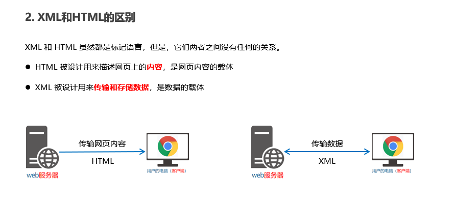

### JSON

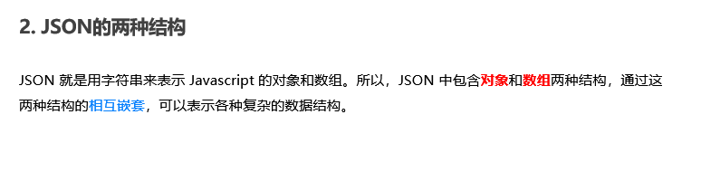

## 封装自己的 Ajax 函数

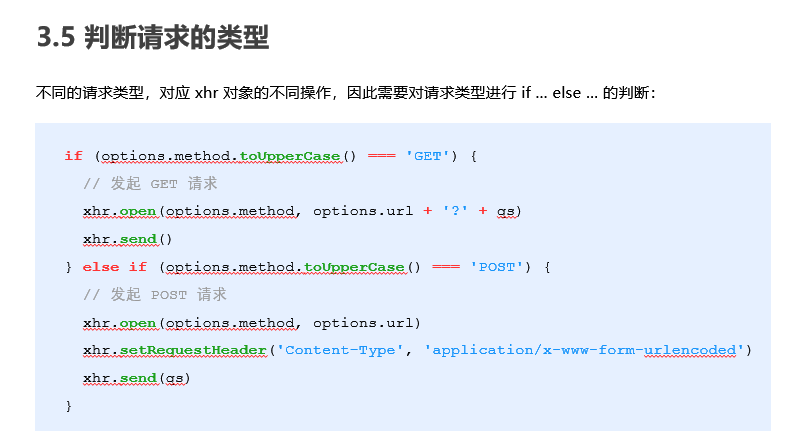

## XMLHttpRequest Level2 的新特性

- 旧版 XMLHttpRequest 的缺点
  - 只支持文本数据的传输，无法用来读取和上传文件
  - 传送和接收数据时，没有进度信息，只能提示有没有完成
- XMLHttpRequest Level2 的新功能
  - 可以设置 HTTP 请求的时限
  - 可以使用 FormData 对象管理表单数据
  - 可以上传文件
  - 可以获得数据传输的进度信息

### 设置 HTTP 请求时限

### FormData 对象管理表单数据

### 上传文件

1. 定义 UI 结构
2. 验证是否选择了文件
3. 向 FormData 中追加文件
4. 使用 xhr 发起上传文件的请求
5. 监听 onreadystatechange 事件
   
   
   
   
   

### 显示文件上传进度

- 新版本的 XMLHttpRequest 对象中，可以通过监听 xhr.upload.onprogress 事件，来获取到文件的上传进度。
- 语法格式如下：
  
  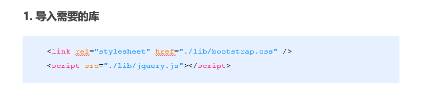
  
  
  

## jQuery 高级用法

### jQuery 实现文件上传

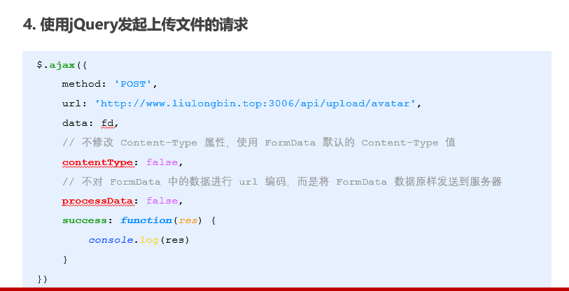

### jQuery 实现 loading 效果

## axios

- Axios 是专注于网络数据请求的库。
- 相比于原生的 XMLHttpRequest 对象，axios 简单易用。
- 相比于 jQuery，axios 更加轻量化，只专注于网络数据请求。

### axios 发起 GET 请求

### axios 发起 POST 请求

### 直接使用 axios 发起请求

## 接口

- 使用 Ajax 请求数据时，被请求的 URL 地址，就叫做数据接口（简称接口）。同时，每个接口必须有请求方式。
- 例如：
  - http://www.liulongbin.top:3006/api/getbooks 获取图书列表的接口(GET 请求)
  - http://www.liulongbin.top:3006/api/addbook 添加图书的接口（POST 请求）

### 接口的请求过程

### 接口测试工具

### 接口文档

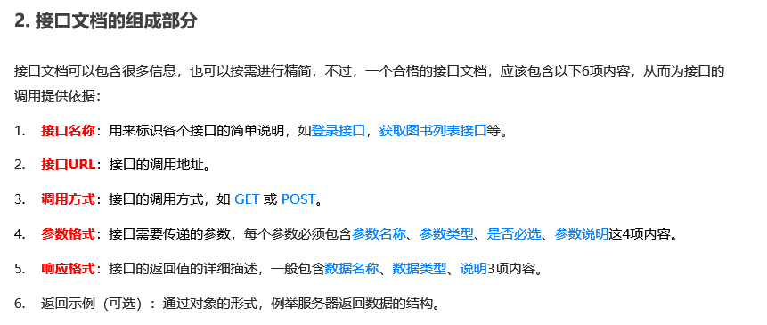

## form 表单的基本使用

### 表单的同步提交及缺点

- 通过点击 submit 按钮，触发表单提交的操作，从而使页面跳转到 action URL 的行为，叫做表单的同步提交。
- 表单同步提交的缺点
  - `<form>`表单同步提交后，整个页面会发生跳转，跳转到 action URL 所指向的地址，用户体验很差。
  - `<form>`表单同步提交后，页面之前的状态和数据会丢失。
- 如果使用表单提交数据，则会导致以下两个问题：

  - 页面会发生跳转
  - 页面之前的状态和数据会丢失

- 解决方案：表单只负责采集数据，Ajax 负责将数据提交到服务器。

## Ajax 提交表单数据

### 监听表单提交事件

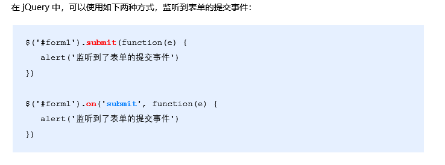

### 阻止表单默认提交行为

### 快速获取表单中的数据

## art-template 模板引擎

- art-template 是一个简约、超快的模板引擎。中文官网首页为 http://aui.github.io/art-template/zh-cn/index.html

### art-template 模板引擎的基本使用

- 导入 art-template
- 定义数据
- 定义模板
- 调用 template 函数
- 渲染 HTML 结构

### art-template 标准语法

- art-template 提供了 {{ }} 这种语法格式，在 {{ }} 内可以进行变量输出，或循环数组等操作，这种 {{ }} 语法在 art-template 中被称为标准语法。
  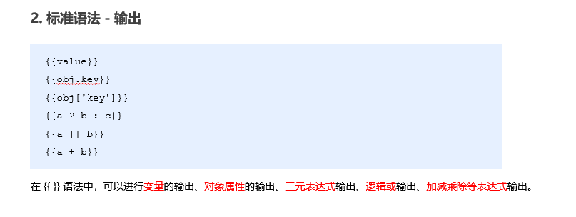
  
  
  
  
  
  

### 模板引擎的实现原理

- 正则与字符串操作
  
  
  
  
  
  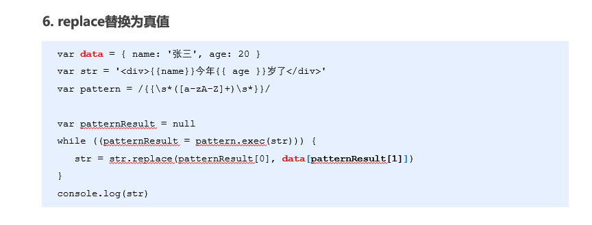

### 实现简易的模板引擎

- 实现步骤
  - 定义模板结构
  - 预调用模板引擎
  - 封装 template 函数
  - 导入并使用自定义的模板引擎
    
    
    
    

## 同源策略

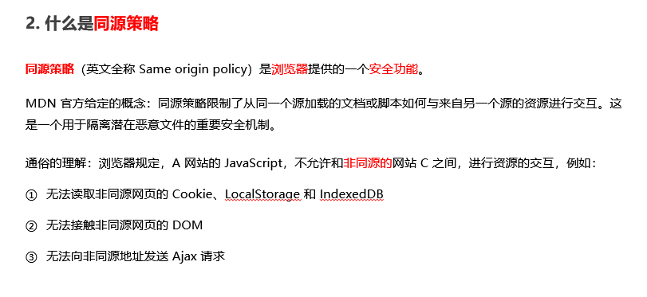

## 跨域

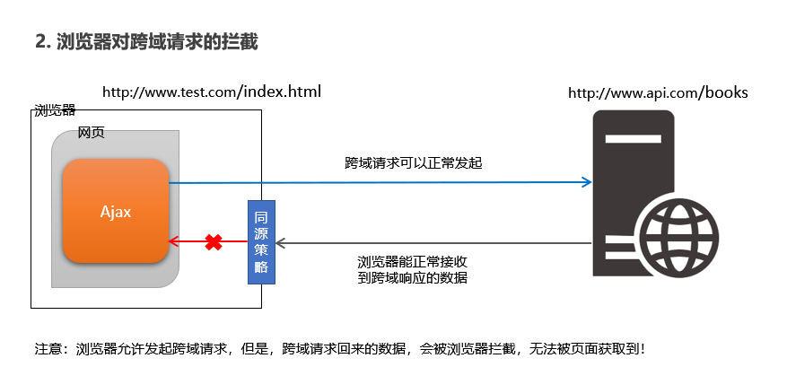

## JSONP

- JSONP (JSON with Padding) 是 JSON 的一种“使用模式”，可用于解决主流浏览器的跨域数据访问的问题。

### JSONP 的实现原理

- 由于浏览器同源策略的限制，网页中无法通过 Ajax 请求非同源的接口数据。但是 `<script>` 标签不受浏览器同源策略的影响，可以通过 src 属性，请求非同源的 js 脚本。
- 因此，JSONP 的实现原理，就是通过 `<script>` 标签的 src 属性，请求跨域的数据接口，并通过函数调用的形式，接收跨域接口响应回来的数据。

### 自己实现一个简单的 JSONP

### JSONP 的缺点

- 由于 JSONP 是通过 `<script>` 标签的 src 属性，来实现跨域数据获取的，所以，JSONP 只支持 GET 数据请求，不支持 POST 请求。
- 注意：JSONP 和 Ajax 之间没有任何关系，不能把 JSONP 请求数据的方式叫做 Ajax，因为 JSONP 没有用到 XMLHttpRequest 这个对象。

### jQuery 中的 JSONP

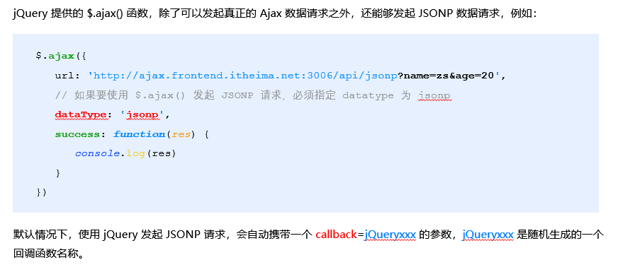

### 自定义参数及回调函数名称

### jQuery 中 JSONP 的实现过程

- jQuery 中的 JSONP，也是通过 `<script>` 标签的 src 属性实现跨域数据访问的，只不过，jQuery 采用的是动态创建和移除 `<script>` 标签的方式，来发起 JSONP 数据请求。
- 在发起 JSONP 请求的时候，动态向 `<header>` 中 append 一个 `<script> `标签；
- 在 JSONP 请求成功以后，动态从 `<header>` 中移除刚才 append 进去的 `<script>` 标签；

## 防抖

- 防抖策略（debounce）是当事件被触发后，延迟 n 秒后再执行回调，如果在这 n 秒内事件又被触发，则重新计时。
- 用户在输入框中连续输入一串字符时，可以通过防抖策略，只在输入完后，才执行查询的请求，这样可以有效减少请求次数，节约请求资源；
  

## 节流

- 节流策略（throttle），顾名思义，可以减少一段时间内事件的触发频率。
- 鼠标连续不断地触发某事件（如点击），只在单位时间内只触发一次；
- 懒加载时要监听计算滚动条的位置，但不必每次滑动都触发，可以降低计算的频率，而不必去浪费 CPU 资源；
  

## HTTP 协议

- HTTP 协议即超文本传送协议 (HyperText Transfer Protocol) ，它规定了客户端与服务器之间进行网页内容传输时，所必须遵守的传输格式。
- 例如：
  - 客户端要以 HTTP 协议要求的格式把数据提交到服务器
  - 服务器要以 HTTP 协议要求的格式把内容响应给客户端
    
    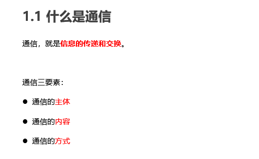
    
    
    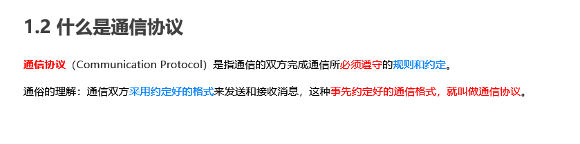
    
    

### HTTP 请求消息

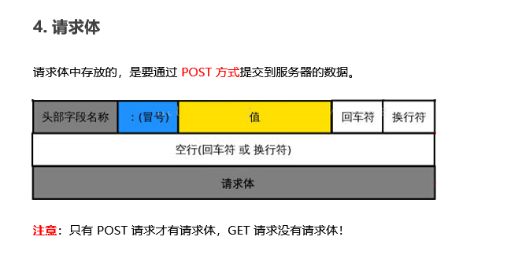

### HTTP 响应消息

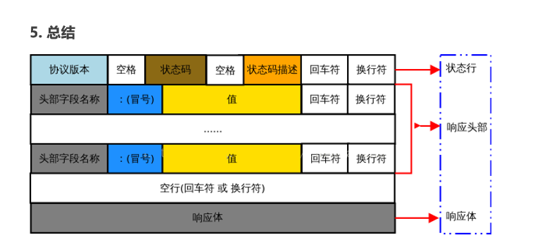

### HTTP 请求方法

### HTTP 响应状态代码

