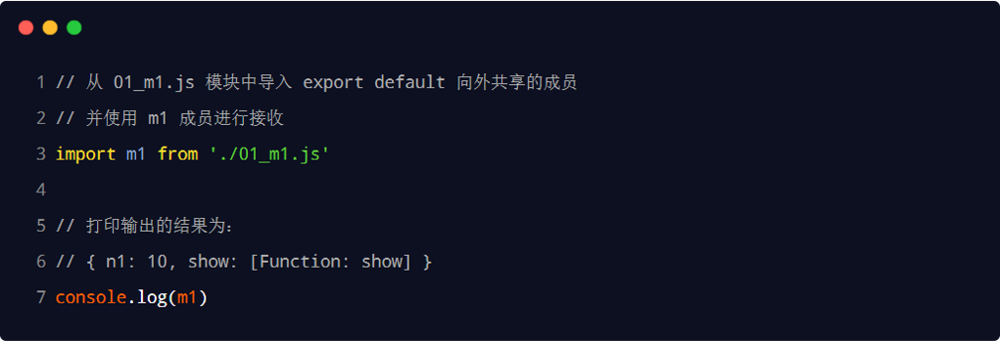
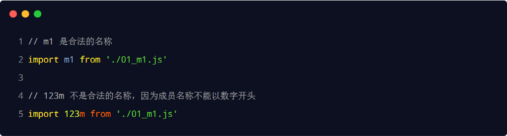
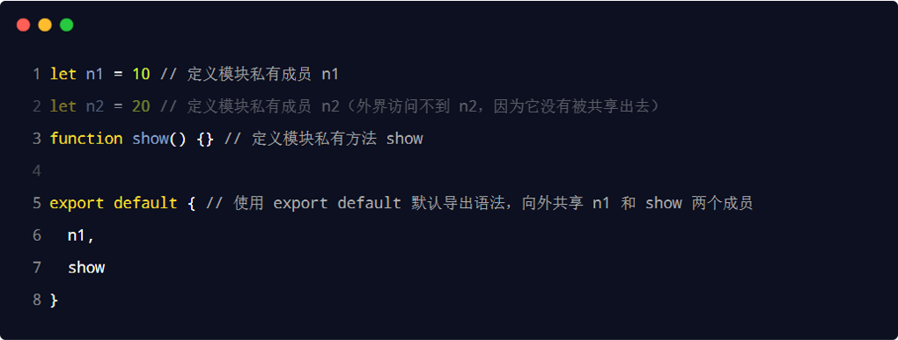
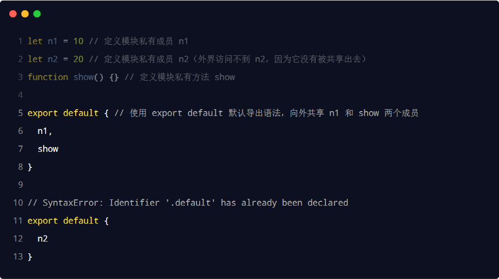
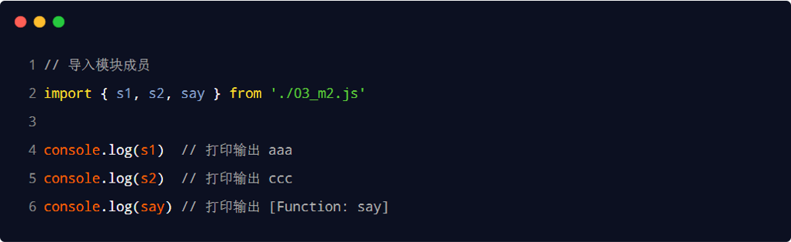
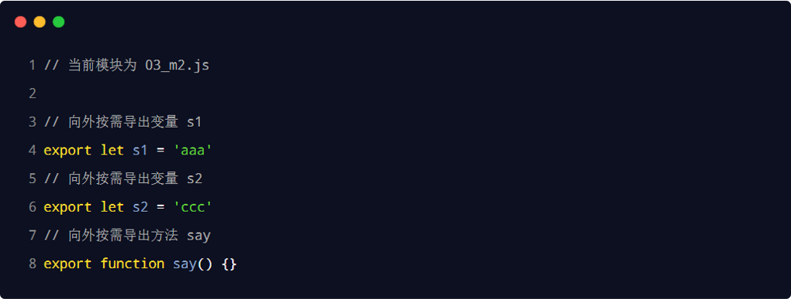
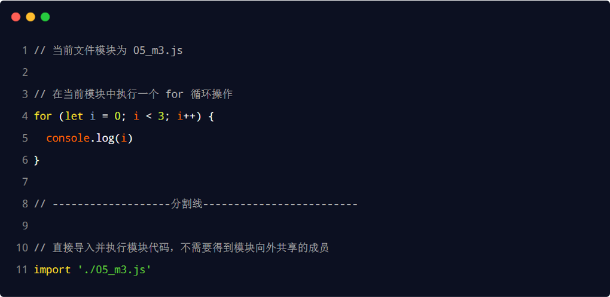

# ES6 模块化与异步编程高级用法

## ES6 模块化

- 模块化的好处：
  - 大家都遵守同样的模块化规范写代码，降低了沟通的成本，极大方便了各个模块之间的相互调用，利人利己。

### node.js 实现模块化

- node.js 遵循了 CommonJS 的模块化规范。其中：
  - 导入其它模块使用 require() 方法
  - 模块对外共享成员使用 module.exports 对象

### 前端模块化规范的分类

- 在 ES6 模块化规范诞生之前，JavaScript 社区已经尝试并提出了 AMD、CMD、CommonJS 等模块化规范。
- 但是，这些由社区提出的模块化标准，还是存在一定的差异性与局限性、并不是浏览器与服务器通用的模块化标准，例如：
  - AMD 和 CMD 适用于浏览器端的 Javascript 模块化
  - CommonJS 适用于服务器端的 Javascript 模块化
- 太多的模块化规范给开发者增加了学习的难度与开发的成本。因此，大一统的 ES6 模块化规范诞生了！

### ES6 模块化规范

- ES6 模块化规范是浏览器端与服务器端通用的模块化开发规范。

- ES6 模块化规范中定义：
  - 每个 js 文件都是一个独立的模块
  - 导入其它模块成员使用 import 关键字
  - 向外共享模块成员使用 export 关键字

### 默认导入/默认导出

- 默认导入的语法： import 接收名称 from '模块标识符'
  
- 默认导入时的接收名称可以任意名称，只要是合法的成员名称即可：
  

   

- 默认导出的语法： export default 默认导出的成员
  
- 每个模块中，只允许使用唯一的一次 export default，否则会报错！
  

### 按需导入/按需导出

- 按需导入的语法： import { s1 } from '模块标识符'
  

- 按需导出的语法： export 按需导出的成员
  

 

- 注意事项
  - 每个模块中可以使用多次按需导出
  - 按需导入的成员名称必须和按需导出的名称保持一致
  - 按需导入时，可以使用 as 关键字进行重命名
  - 按需导入可以和默认导入一起使用

### 直接导入

- 如果只想单纯地执行某个模块中的代码，并不需要得到模块中向外共享的成员。此时，可以直接导入并执行模块代码，示例代码如下：
  
