# ES5 新增方法

ES 的全称是 ECMAScript , 它是由 ECMA 国际标准化组织,制定的一项脚本语言的标准化规范。

## 数组方法

### forEach() 遍历数组

```js
arr.forEach(function (value, index, array) {
  //参数一是:数组元素
  //参数二是:数组元素的索引
  //参数三是:当前的数组
});
//相当于数组遍历的 for循环 没有返回值
```

### filter() 过滤数组

```js
var arr = [12, 66, 4, 88, 3, 7];
var newArr = arr.filter(function (value, index, array) {
  //参数一是:数组元素
  //参数二是:数组元素的索引
  //参数三是:当前的数组
  return value >= 20;
});
console.log(newArr); //[66,88] //返回值是一个新数组
```

### some() 条件查找

```js
some 查找数组中是否有满足条件的元素
 var arr = [10, 30, 4];
 var flag = arr.some(function(value,index,array) {
    //参数一是:数组元素
     //参数二是:数组元素的索引
     //参数三是:当前的数组
     return value < 3;
  });
console.log(flag);//false返回值是布尔值,只要查找到满足条件的一个元素就立马终止循环
```

### some 和 forEach 区别

- 如果查询数组中唯一的元素, 用 some 方法更合适,在 some 里面 遇到 return true 就是终止遍历 迭代效率更高
- 在 forEach 里面 return 不会终止迭代

### trim()去除字符串两端的空格

```js
var str = '   hello   '
console.log(str.trim()）  //hello 去除两端空格
var str1 = '   he l l o   '
console.log(str.trim()）  //he l l o  去除两端空格
```

### 获取对象的属性名

Object.keys(对象) 获取到当前对象中的属性名 ，返回值是一个数组

```js
var obj = {
  id: 1,
  pname: "小米",
  price: 1999,
  num: 2000,
};
var result = Object.keys(obj);
console.log(result); //[id，pname,price,num]
```

### Object.defineProperty

Object.defineProperty 设置或修改对象中的属性

```js
Object.defineProperty(对象，修改或新增的属性名，{
		value:修改或新增的属性的值,
		writable:true/false,//如果值为false 不允许修改这个属性值
		enumerable: false,//enumerable 如果值为false 则不允许遍历
    configurable: false  //configurable 如果为false 则不允许删除这个属性 属性是否可以被删除或是否可以再次修改特性
})
```

## 函数的定义和调用

### 函数的定义方式

1. 方式 1 函数声明方式 function 关键字 (命名函数)

   ```js
   function fn() {}
   ```

2. 方式 2 函数表达式(匿名函数)

   ```js
   var fn = function () {};
   ```

3. 方式 3 new Function()

   ```js
   var f = new Function('a', 'b', 'console.log(a + b)');
   f(1, 2);

   var fn = new Function('参数1','参数2'..., '函数体')
   注意
   /*Function 里面参数都必须是字符串格式
   第三种方式执行效率低，也不方便书写，因此较少使用
   所有函数都是 Function 的实例(对象)
   函数也属于对象
   */
   ```

### 函数的调用

```js
/* 1. 普通函数 */
function fn() {
  console.log("人生的巅峰");
}
fn();
/* 2. 对象的方法 */
var o = {
  sayHi: function () {
    console.log("人生的巅峰");
  },
};
o.sayHi();
/* 3. 构造函数*/
function Star() {}
new Star();
/* 4. 绑定事件函数*/
btn.onclick = function () {}; // 点击了按钮就可以调用这个函数
/* 5. 定时器函数*/
setInterval(function () {}, 1000);
这个函数是定时器自动1秒钟调用一次(
  /* 6. 立即执行函数(自调用函数)*/
  function () {
    console.log("人生的巅峰");
  }
)();
```

## this

### 函数内部的 this 指向

这些 this 的指向，是当我们调用函数的时候确定的。调用方式的不同决定了 this 的指向不同

一般指向我们的调用者.


### 改变函数内部 this 指向

- **call 方法**
  call()方法调用一个对象。简单理解为调用函数的方式，但是它可以改变函数的 this 指向

  应用场景: 经常做继承.

  ```js
  var o = {
    name: "andy",
  };
  function fn(a, b) {
    console.log(this);
    console.log(a + b);
  }
  fn(1, 2); // 此时的this指向的是window 运行结果为3
  fn.call(o, 1, 2); //此时的this指向的是对象o,参数使用逗号隔开,运行结果为3
  ```

- **apply 方法**
  apply() 方法调用一个函数。简单理解为调用函数的方式，但是它可以改变函数的 this 指向。

  应用场景: 经常跟数组有关系

  ```js
  var o = {
    name: "andy",
  };
  function fn(a, b) {
    console.log(this);
    console.log(a + b);
  }
  fn(); // 此时的this指向的是window 运行结果为3
  fn.apply(o, [1, 2]); //此时的this指向的是对象o,参数使用数组传递 运行结果为3
  ```

- **bind 方法**

  bind() 方法不会调用函数,但是能改变函数内部 this 指向,返回的是原函数改变 this 之后产生的新函数

  如果只是想改变 this 指向，并且不想调用这个函数的时候，可以使用 bind

  应用场景:不调用函数,但是还想改变 this 指向

  ```js
  var o = {
    name: "andy",
  };

  function fn(a, b) {
    console.log(this);
    console.log(a + b);
  }
  var f = fn.bind(o, 1, 2); //此处的f是bind返回的新函数
  f(); //调用新函数  this指向的是对象o 参数使用逗号隔开
  ```

### call、apply、bind 三者的异同

- 共同点 : 都可以改变 this 指向
- 不同点:

  - call 和 apply 会调用函数, 并且改变函数内部 this 指向.
  - call 和 apply 传递的参数不一样,call 传递参数使用逗号隔开,apply 使用数组传递
  - bind 不会调用函数, 可以改变函数内部 this 指向.

- 应用场景
  1. call 经常做继承.
  2. apply 经常跟数组有关系. 比如借助于数学对象实现数组最大值最小值
  3. bind 不调用函数,但是还想改变 this 指向. 比如改变定时器内部的 this 指向.

## 严格模式

JavaScript 除了提供正常模式外，还提供了严格模式（strict mode）。ES5 的严格模式是采用具有限制性 JavaScript 变体的一种方式，即在严格的条件下运行 JS 代码。

严格模式在 IE10 以上版本的浏览器中才会被支持，旧版本浏览器中会被忽略。

严格模式对正常的 JavaScript 语义做了一些更改：

1.消除了 Javascript 语法的一些不合理、不严谨之处，减少了一些怪异行为。

2.消除代码运行的一些不安全之处，保证代码运行的安全。

3.提高编译器效率，增加运行速度。

4.禁用了在 ECMAScript 的未来版本中可能会定义的一些语法，为未来新版本的 Javascript 做好铺垫。比如一些保留字如：class,enum,export, extends, import, super 不能做变量名

### 开启严格模式

严格模式可以应用到整个脚本或个别函数中。因此在使用时，我们可以将严格模式分为为脚本开启严格模式和为函数开启严格模式两种情况。

- 情况一 :为脚本开启严格模式

  - 有的 script 脚本是严格模式，有的 script 脚本是正常模式，这样不利于文件合并，所以可以将整个脚本文件放在一个立即执行的匿名函数之中。这样独立创建一个作用域而不影响其他
    script 脚本文件。

    ```js
    (function (){
      //在当前的这个自调用函数中有开启严格模式，当前函数之外还是普通模式
    　　　　"use strict";
           var num = 10;
    　　　　function fn() {}
    })();
    //或者
    <script>
      　"use strict"; //当前script标签开启了严格模式
    </script>
    <script>
      			//当前script标签未开启严格模式
    </script>
    ```

- 情况二: 为函数开启严格模式

  - 要给某个函数开启严格模式，需要把“use strict”; (或 'use strict'; ) 声明放在函数体所有语句之前。

    ```js
    function fn() {
      "use strict";
      return "123";
    }
    //当前fn函数开启了严格模式
    ```

### 严格模式中的变化

严格模式对 Javascript 的语法和行为，都做了一些改变。

```js
'use strict'
num = 10
console.log(num)//严格模式后使用未声明的变量
--------------------------------------------------------------------------------
var num2 = 1;
delete num2;//严格模式不允许删除变量
--------------------------------------------------------------------------------
function fn() {
 console.log(this); // 严格模式下全局作用域中函数中的 this 是 undefined
}
fn();
---------------------------------------------------------------------------------
function Star() {
	 this.sex = '男';
}
// Star();严格模式下,如果 构造函数不加new调用, this 指向的是undefined 如果给他赋值则 会报错.
var ldh = new Star();
console.log(ldh.sex);
----------------------------------------------------------------------------------
setTimeout(function() {
  console.log(this); //严格模式下，定时器 this 还是指向 window
}, 2000);
```

[更多严格模式要求参考](https://developer.mozilla.org/zh-CN/docs/Web/JavaScript/Reference/Strict_mode)

## 高阶函数

高阶函数是对其他函数进行操作的函数，它接收函数作为参数或将函数作为返回值输出。

此时 fn 就是一个高阶函数

函数也是一种数据类型，同样可以作为参数，传递给另外一个参数使用。最典型的就是作为回调函数。

同理函数也可以作为返回值传递回来

## 闭包

闭包（closure）指有权访问另一个函数作用域中变量的函数。简单理解就是 ，一个作用域可以访问另外一个函数内部的局部变量。


### 闭包的作用

作用：延伸变量的作用范围。

```js
function fn() {
  var num = 10;
  function fun() {
    console.log(num);
  }
  return fun;
}
var f = fn();
f();
```

## 递归

**递归：** 如果一个函数在内部可以调用其本身，那么这个函数就是递归函数。简单理解:函数内部自己调用自己, 这个函数就是递归函数

**注意：** 递归函数的作用和循环效果一样，由于递归很容易发生“栈溢出”错误（stack overflow），所以必须要加退出条件 return。

```js
//利用递归函数求1~n的阶乘 1 * 2 * 3 * 4 * ..n
function fn(n) {
  if (n == 1) {
    //结束条件
    return 1;
  }
  return n * fn(n - 1);
}
console.log(fn(3));
```

## 正则表达式

正则表达式（ Regular Expression ）是用于匹配字符串中字符组合的模式。在 JavaScript 中，正则表达式也是对象。

正则表通常被用来检索、替换那些符合某个模式（规则）的文本，例如验证表单：用户名表单只能输入英文字母、数字或者下划线， 昵称输入框中可以输入中文(匹配)。此外，正则表达式还常用于过滤掉页面内容中的一些敏感词(替换)，或从字符串中获取我们想要的特定部分(提取)等 。

### 正则表达式的创建

方式一：通过调用 RegExp 对象的构造函数创建

```js
var regexp = new RegExp(/123/);
console.log(regexp);
```

方式二：利用字面量创建 正则表达式

```js
var rg = /123/;
```

### 测试正则表达式

test() 正则对象方法，用于检测字符串是否符合该规则，该对象会返回 true 或 false，其参数是测试字符串。

```js
var rg = /123/;
console.log(rg.test(123)); //匹配字符中是否出现123  出现结果为true
console.log(rg.test("abc")); //匹配字符中是否出现123 未出现结果为false
```

### 正则表达式中的字符

- **边界符**
  | 边界符 | 说明 |
  | ---- | --------------- |
  | ^ | 表示匹配行首的文本（以谁开始） |
  | $ | 表示匹配行尾的文本（以谁结束） |
  如果 ^和 $ 在一起，表示必须是精确匹配。
- **字符类**
  字符类表示有一系列字符可供选择，只要匹配其中一个就可以了。所有可供选择的字符都放在方括号内。
- **[] 方括号**
  表示有一系列字符可供选择，只要匹配其中一个就可以了
- **量词符**
  量词符用来设定某个模式出现的次数。
  | 量词 | 说明 |
  | ----- | ----------------- |
  | \* | 重复 0 次或更多次 |
  | + | 重复 1 次或更多次 |
  | ? | 重复 0 次或 1 次 |
  | {n} | 重复 n 次 |
  | {n,} | 重复 n 次或更多次 |
  | {n,m} | 重复 n 到 m 次 |

### 预定义类

预定义类指的是某些常见模式的简写方式.

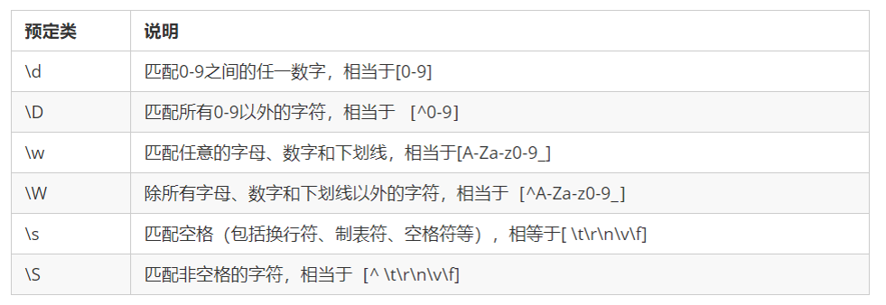

### 正则替换 replace

replace() 方法可以实现替换字符串操作，用来替换的参数可以是一个字符串或是一个正则表达式。

```js
var str = 'andy和red';
var newStr = str.replace('andy', 'baby');
console.log(newStr)//baby和red
//等同于 此处的andy可以写在正则表达式内
var newStr2 = str.replace(/andy/, 'baby');
console.log(newStr2)//baby和red
//全部替换
var str = 'abcabc'
var nStr = str.replace(/a/,'哈哈')
console.log(nStr) //哈哈bcabc
//全部替换g
var nStr = str.replace(/a/a,'哈哈')
console.log(nStr) //哈哈bc哈哈bc
//忽略大小写i
var str = 'aAbcAba';
var newStr = str.replace(/a/gi,'哈哈')//"哈哈哈哈bc哈哈b哈哈"
```

# ES6

ES 的全称是 ECMAScript , 它是由 ECMA 国际标准化组织,制定的一项脚本语言的标准化规范。

## let

```javascript
if (true) {
  let a = 10;
}
console.log(a); // a is not defined
```

**注意：** 使用 let 关键字声明的变量才具有块级作用域，使用 var 声明的变量不具备块级作用域特性。

- **不存在变量提升**

  ```javascript
  console.log(a); // a is not defined
  let a = 20;
  ```

- **暂时性死区**
  利用 let 声明的变量会绑定在这个块级作用域，不会受外界的影响

  ```javascript
  var tmp = 123;
  if (true) {
    tmp = "abc";
    let tmp;
  }
  ```

### 经典面试题

```javascript
var arr = [];
for (var i = 0; i < 2; i++) {
  arr[i] = function () {
    console.log(i);
  };
}
arr[0](); // 2
arr[1](); // 2
```

```javascript
let arr = [];
for (let i = 0; i < 2; i++) {
  arr[i] = function () {
    console.log(i);
  };
}
arr[0](); // 0
arr[1](); // 1
```

## const

声明常量，常量就是值（内存地址）不能变化的量

- **具有块级作用域**

  ```javascript
  if (true) {
    const a = 10;
  }
  console.log(a); // a is not defined
  ```

- **声明常量时必须赋值**

  ```javascript
  const PI; // Missing initializer in const declaration
  ```

- **常量赋值后，值不能修改**
  ```javascript
  const PI = 3.14;
  PI = 100; // Assignment to constant variable.
  ```

const ary = [100, 200];
ary[0] = 'a';
ary[1] = 'b';
console.log(ary); // ['a', 'b'];
ary = ['a', 'b']; // Assignment to constant variable.

## let、const、var 的区别

- 使用 var 声明的变量，其作用域为该语句所在的函数内，且存在变量提升现象
- 使用 let 声明的变量，其作用域为该语句所在的代码块内，不存在变量提升
- 使用 const 声明的是常量，在后面出现的代码中不能再修改该常量的值


## 解构赋值

ES6 中允许从数组中提取值，按照对应位置，对变量赋值，对象也可以实现解构

- **数组解构**

  ```javascript
  let [a, b, c] = [1, 2, 3];
  console.log(a); //1
  console.log(b); //2
  console.log(c); //3
  //如果解构不成功，变量的值为undefined
  ```

- **对象解构**

  ```javascript
  let person = { name: "zhangsan", age: 20 };
  let { name, age } = person;
  console.log(name); // 'zhangsan'
  console.log(age); // 20

  let { name: myName, age: myAge } = person; //  myName myAge 属于别名
  console.log(myName); // 'zhangsan'
  console.log(myAge); // 20
  ```

## 箭头函数

ES6 中新增的定义函数的方式。

```javascript
() => {}; //()：代表是函数； =>：必须要的符号，指向哪一个代码块；{}：函数体
const fn = () => {}; //代表把一个函数赋值给fn
```

函数体中只有一句代码，且代码的执行结果就是返回值，可以省略大括号

```javascript
function sum(num1, num2) {
  return num1 + num2;
}
//es6写法
const sum = (num1, num2) => num1 + num2;
```

如果形参只有一个，可以省略小括号

```javascript
function fn(v) {
  return v;
}
//es6写法
const fn = (v) => v;
```

箭头函数不绑定 this 关键字，箭头函数中的 this，指向的是函数定义位置的上下文 this

```javascript
const obj = { name: "张三" };
function fn() {
  console.log(this); //this 指向 是obj对象
  return () => {
    console.log(this); //this 指向 的是箭头函数定义的位置，那么这个箭头函数定义在fn里面，而这个fn指向是的obj对象，所以这个this也指向是obj对象
  };
}
const resFn = fn.call(obj);
resFn();
```

## 剩余参数

剩余参数语法允许我们将一个不定数量的参数表示为一个数组，不定参数定义方式，这种方式很方便的去声明不知道参数情况下的一个函数

```javascript
function sum(first, ...args) {
  console.log(first); // 10
  console.log(args); // [20, 30]
}
sum(10, 20, 30);
```

- **剩余参数和解构配合使用**
  ```javascript
  let students = ["wangwu", "zhangsan", "lisi"];
  let [s1, ...s2] = students;
  console.log(s1); // 'wangwu'
  console.log(s2); // ['zhangsan', 'lisi']
  ```

## Array 的扩展方法

- **扩展运算符（展开语法）**

  扩展运算符可以将数组或者对象转为用逗号分隔的参数序列

  ```javascript
  let ary = [1, 2, 3];
  ...ary  // 1, 2, 3
  console.log(...ary);    // 1 2 3,相当于下面的代码
  console.log(1,2,3);
  ```

- **扩展运算符可以应用于合并数组**

  ```javascript
  // 方法一
  let ary1 = [1, 2, 3];
  let ary2 = [3, 4, 5];
  let ary3 = [...ary1, ...ary2];
  // 方法二
  ary1.push(...ary2);
  ```

- **将类数组或可遍历对象转换为真正的数组**

  ```javascript
  let oDivs = document.getElementsByTagName("div");
  oDivs = [...oDivs];
  ```

### Array.from()

将伪数组或可遍历对象转换为真正的数组

```javascript
//定义一个集合
let arrayLike = {
  0: "a",
  1: "b",
  2: "c",
  length: 3,
};
//转成数组
let arr2 = Array.from(arrayLike); // ['a', 'b', 'c']
```

方法还可以接受第二个参数，作用类似于数组的 map 方法，用来对每个元素进行处理，将处理后的值放入返回的数组

```javascript
let arrayLike = {
  0: 1,
  1: 2,
  length: 2,
};
let newAry = Array.from(arrayLike, (item) => item * 2); //[2,4]
```

### find()

用于找出第一个符合条件的数组成员，如果没有找到返回 undefined

```javascript
let ary = [
  {
    id: 1,
    name: "张三",
  },
  {
    id: 2,
    name: "李四",
  },
];
let target = ary.find((item, index) => item.id == 2); //找数组里面符合条件的值，当数组中元素id等于2的查找出来，注意，只会匹配第一个
```

### findIndex()

用于找出第一个符合条件的数组成员的位置，如果没有找到返回-1

```javascript
let ary = [1, 5, 10, 15];
let index = ary.findIndex((value, index) => value > 9);
console.log(index); // 2
```

### includes()

判断某个数组是否包含给定的值，返回布尔值。

```javascript
[1, 2, 3]
  .includes(2) // true
  [(1, 2, 3)].includes(4); // false
```

## String 的扩展方法

### 模板字符串

ES6 新增的创建字符串的方式，使用反引号定义

```javascript
let name = `zhangsan`;
```

- **模板字符串中可以解析变量**

  ```javascript
  let name = "张三";
  let sayHello = `hello,my name is ${name}`; // hello, my name is zhangsan
  ```

- **模板字符串中可以换行**

  ```javascript
  let result = {
    name: "zhangsan",
    age: 20,
    sex: "男",
  };
  let html = ` <div>
     <span>${result.name}</span>
     <span>${result.age}</span>
     <span>${result.sex}</span>
  </div> `;
  ```

- **在模板字符串中可以调用函数**

  ```javascript
  let result = {
    name: "zhangsan",
    age: 20,
    sex: "男",
  };
  let html = ` <div>
     <span>${result.name}</span>
     <span>${result.age}</span>
     <span>${result.sex}</span>
  </div> `;
  ```

### startsWith() 和 endsWith()

- startsWith()：表示参数字符串是否在原字符串的头部，返回布尔值
- endsWith()：表示参数字符串是否在原字符串的尾部，返回布尔值

```javascript
let str = "Hello world!";
str.startsWith("Hello"); // true
str.endsWith("!"); // true
```

### repeat()

repeat 方法表示将原字符串重复 n 次，返回一个新字符串

```javascript
"x".repeat(3); // "xxx"
"hello".repeat(2); // "hellohello"
```

## Set 数据结构

Set。它类似于数组，但是成员的值都是唯一的，没有重复的值。

Set 本身是一个构造函数，用来生成 Set 数据结构

```javascript
const s = new Set();
```

Set 函数可以接受一个数组作为参数，用来初始化。

```javascript
const set = new Set([1, 2, 3, 4, 4]); //{1, 2, 3, 4}
```

### Set 实例方法

- add(value)：添加某个值，返回 Set 结构本身
- delete(value)：删除某个值，返回一个布尔值，表示删除是否成功
- has(value)：返回一个布尔值，表示该值是否为 Set 的成员
- clear()：清除所有成员，没有返回值

```javascript
const s = new Set();
s.add(1).add(2).add(3); // 向 set 结构中添加值
s.delete(2); // 删除 set 结构中的2值
s.has(1); // 表示 set 结构中是否有1这个值 返回布尔值
s.clear(); // 清除 set 结构中的所有值
//注意：删除的是元素的值，不是代表的索引
```

### Set 遍历

Set 结构的实例与数组一样，也拥有 forEach 方法，用于对每个成员执行某种操作，没有返回值。

```javascript
s.forEach((value) => console.log(value));
```

## ES6 模块化

- 在 ES6 模块化规范诞生之前，JavaScript 社区已经尝试并提出了 AMD、CMD、CommonJS 等模块化规范。
- 但是，这些由社区提出的模块化标准，还是存在一定的差异性与局限性、并不是浏览器与服务器通用的模块化标准，例如：
  - AMD 和 CMD 适用于浏览器端的 Javascript 模块化
  - CommonJS 适用于服务器端的 Javascript 模块化
- 太多的模块化规范给开发者增加了学习的难度与开发的成本。因此，大一统的 ES6 模块化规范诞生了！

### ES6 模块化规范

- ES6 模块化规范是浏览器端与服务器端通用的模块化开发规范。

- ES6 模块化规范中定义：
  - 每个 js 文件都是一个独立的模块
  - 导入其它模块成员使用 import 关键字
  - 向外共享模块成员使用 export 关键字

### 默认导入/默认导出

- 默认导入的语法： import 接收名称 from '模块标识符'
  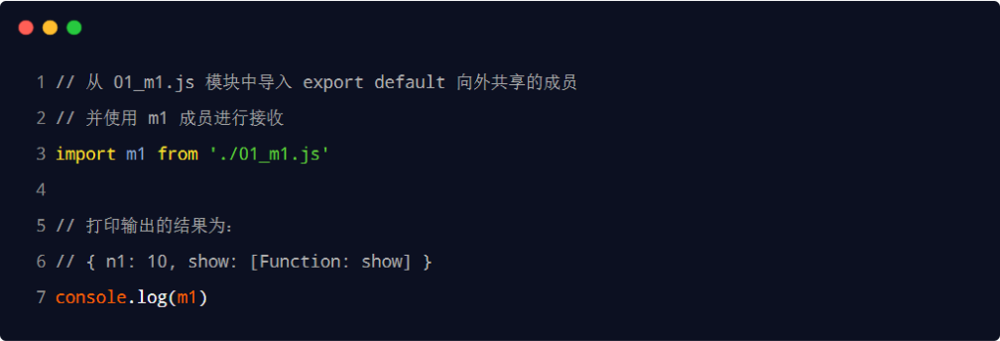
- 默认导入时的接收名称可以任意名称，只要是合法的成员名称即可：
  

  <br>

- 默认导出的语法： export default 默认导出的成员
  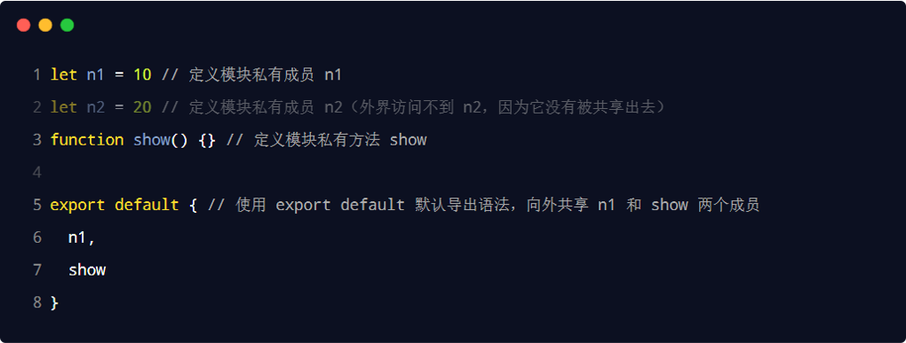
- 每个模块中，只允许使用唯一的一次 export default，否则会报错！
  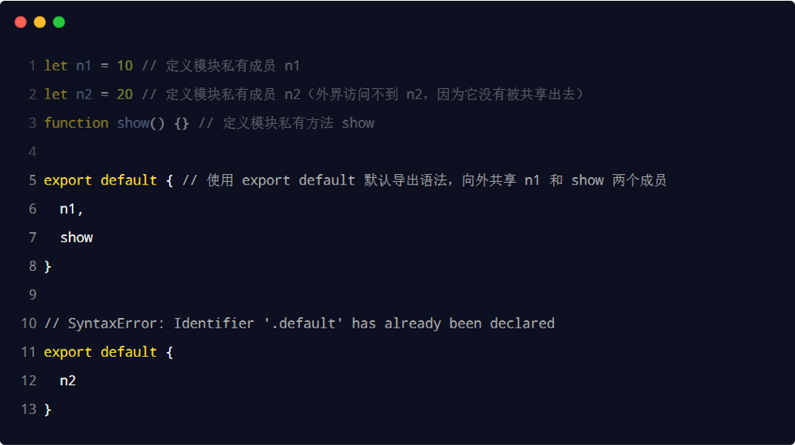

### 按需导入/按需导出

- 按需导入的语法： import { s1 } from '模块标识符'
  

- 按需导出的语法： export 按需导出的成员
  

<br>

- 注意事项
  - 每个模块中可以使用多次按需导出
  - 按需导入的成员名称必须和按需导出的名称保持一致
  - 按需导入时，可以使用 as 关键字进行重命名
  - 按需导入可以和默认导入一起使用

### 直接导入

- 如果只想单纯地执行某个模块中的代码，并不需要得到模块中向外共享的成员。此时，可以直接导入并执行模块代码，示例代码如下：
  

## Promise

- `Promise` 是一个构造函数
  - 我们可以创建 `Promise` 的实例 `const p = new Promise()`
  - new 出来的 `Promise `实例对象，代表一个异步操作
- `Promise.prototype` 上包含一个 `.then()` 方法
  - 每一次 `new Promise() `构造函数得到的实例对象，
  - 都可以通过原型链的方式访问到 `.then()` 方法，例如 `p.then()`
- `.then()` 方法用来预先指定成功和失败的回调函数
  - `p.then(成功的回调函数，失败的回调函数)`
  - `p.then(result => { }, error => { })`
  - 调用 `.then()` 方法时，成功的回调函数是必选的、失败的回调函数是可选的

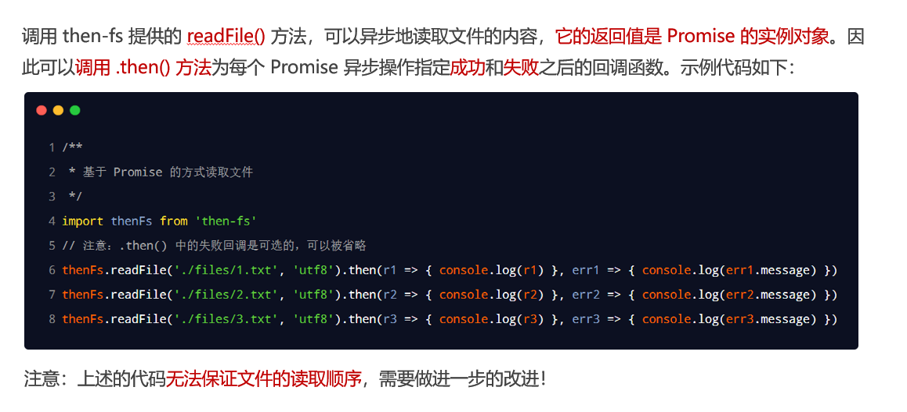
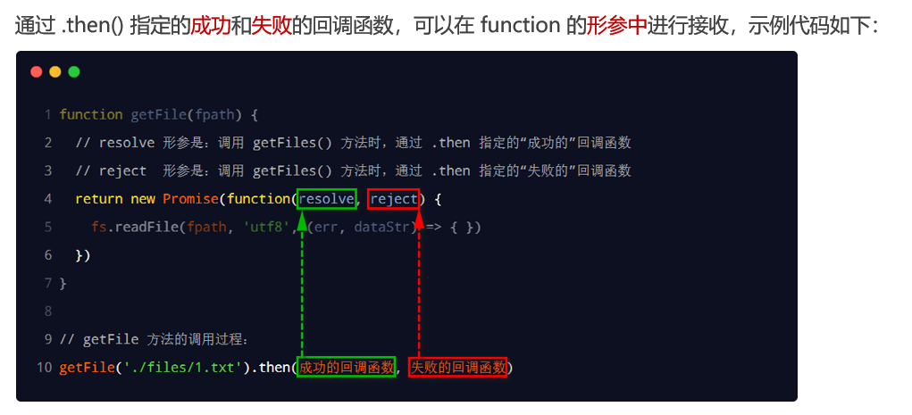


### .then()

如果上一个 `.then() `方法中返回了一个新的 Promise 实例对象，则可以通过下一个 `.then()` 继续进行处理。
通过 `.then()` 方法的链式调用，就解决了回调地狱的问题。
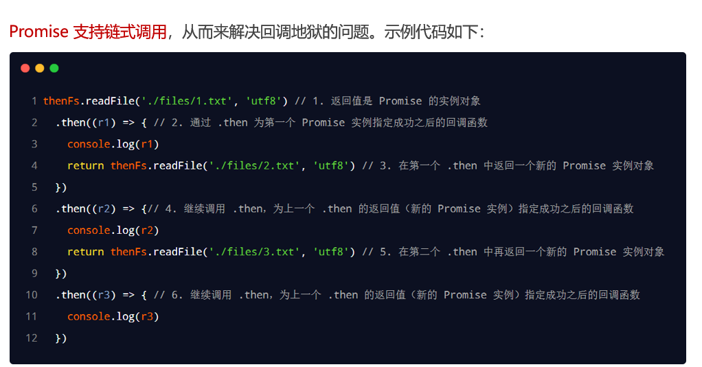

### .catch()

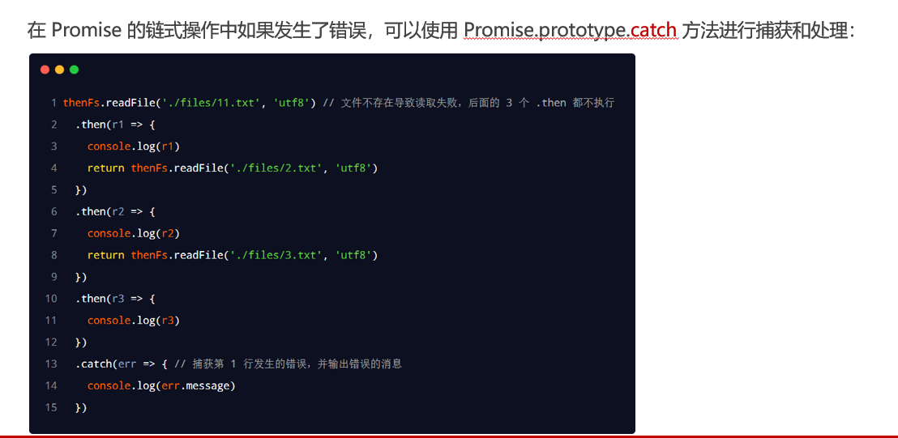
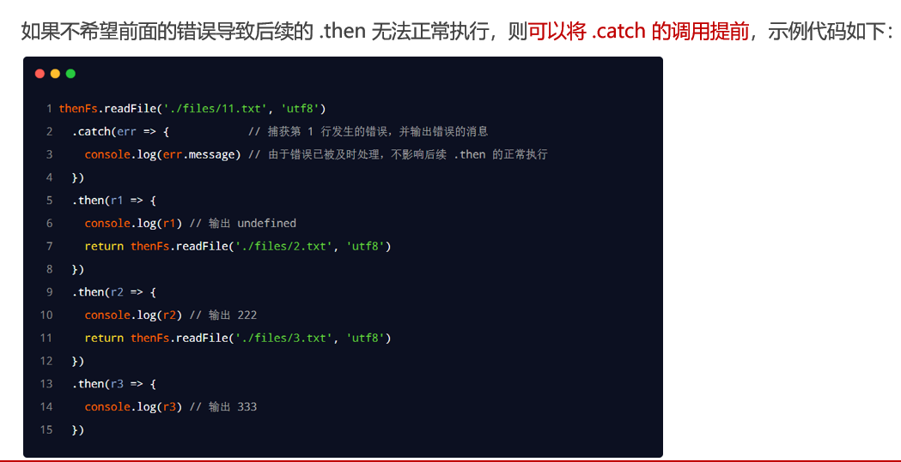

### .all()


### .race()

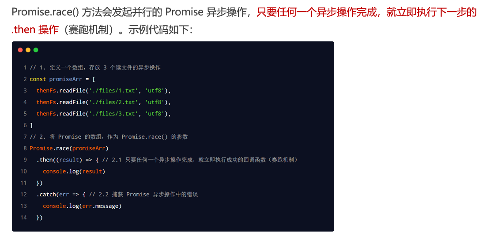

### async/await

> async/await 是 ES8（ECMAScript 2017）引入的新语法，用来简化 Promise 异步操作。

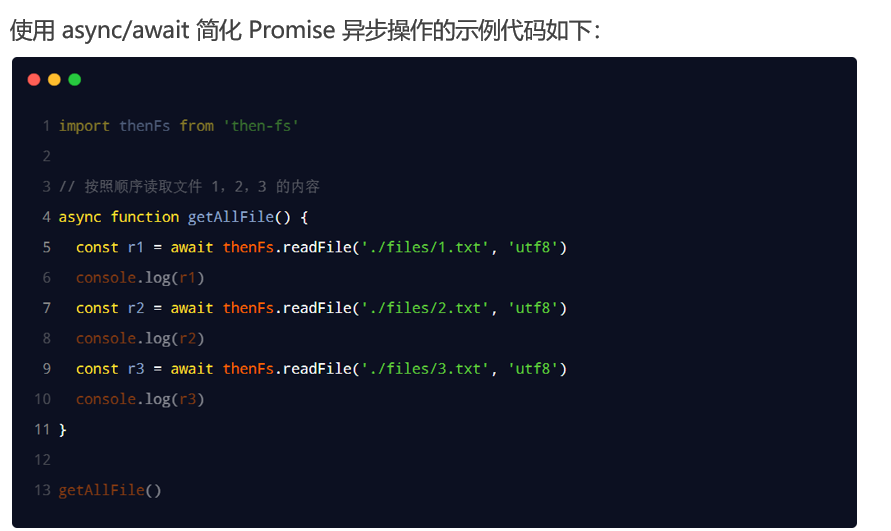

- 注意事项：
  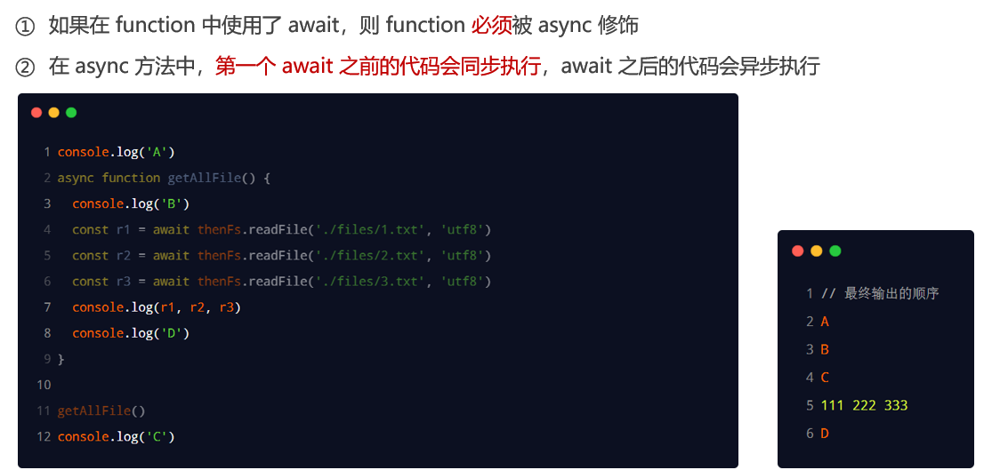

## EventLoop

### JavaScript 是单线程的语言

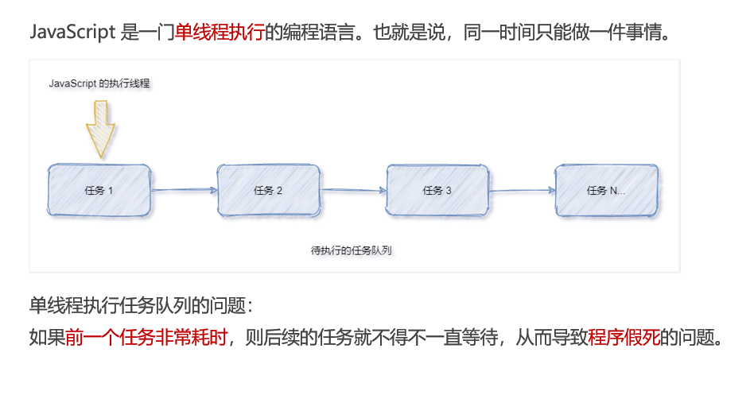

### 同步任务和异步任务

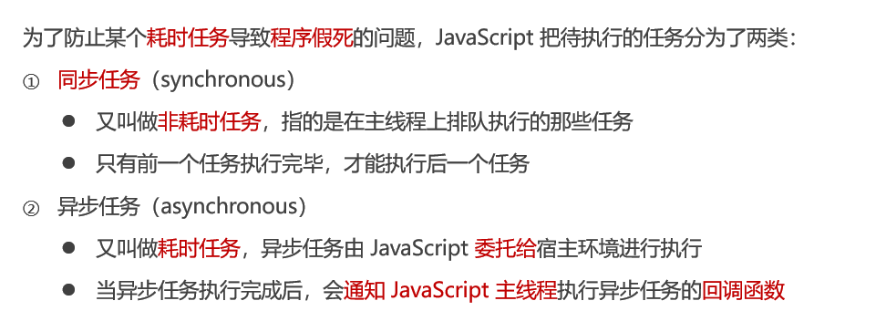

### 同步任务和异步任务的执行过程


### EventLoop 的基本概念


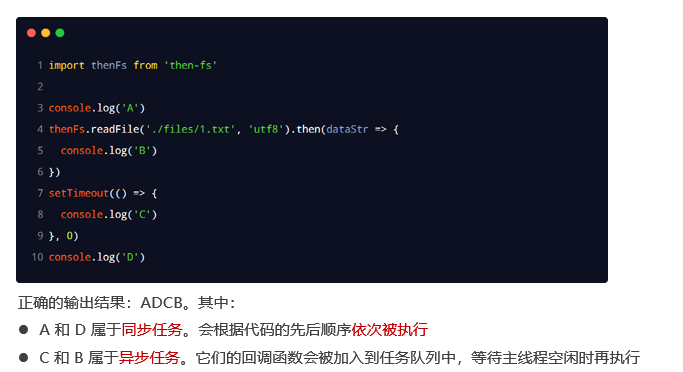

## 宏任务和微任务


### 宏任务和微任务的执行顺序


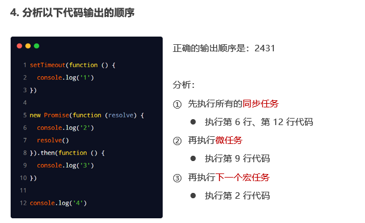
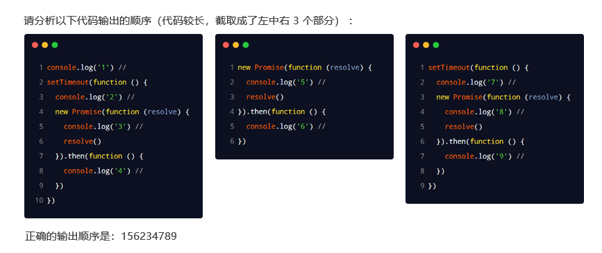
