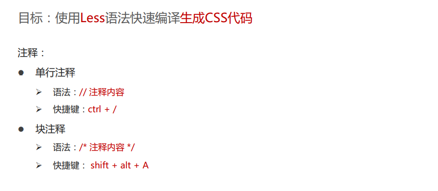
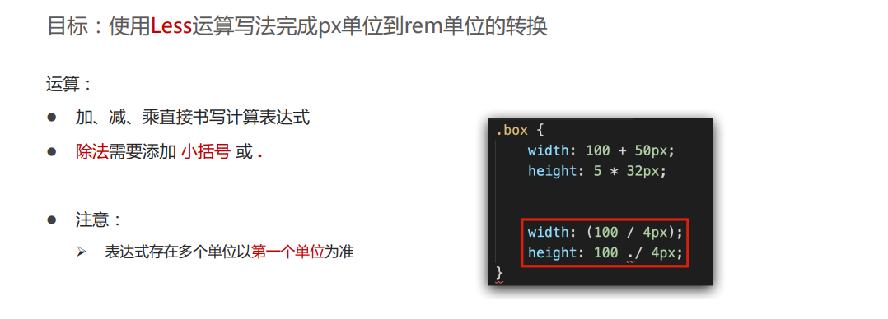
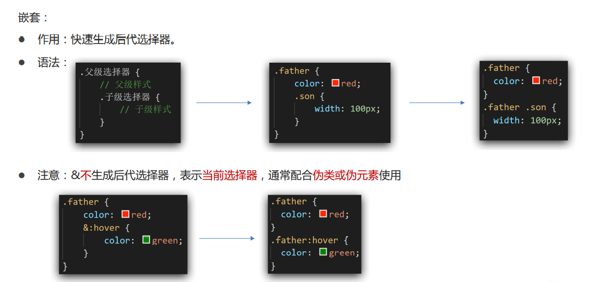
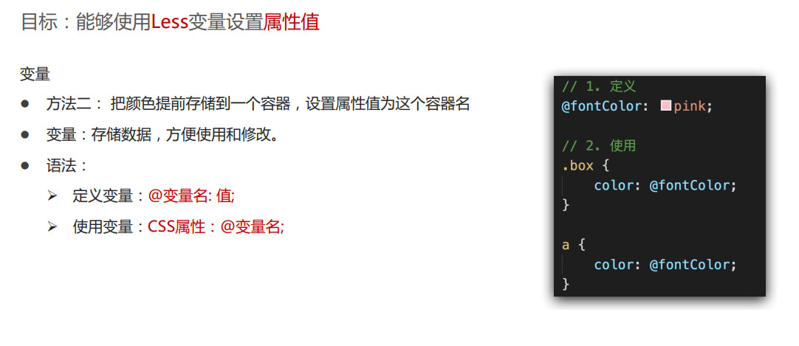
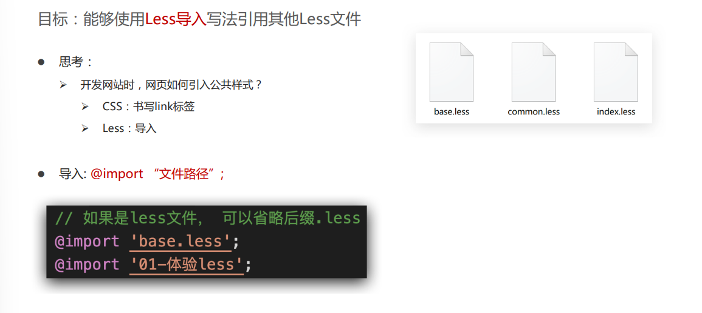
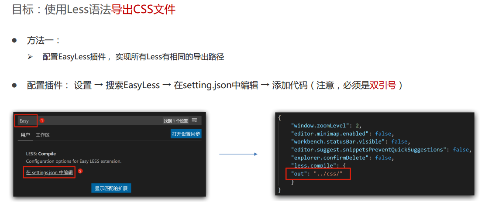
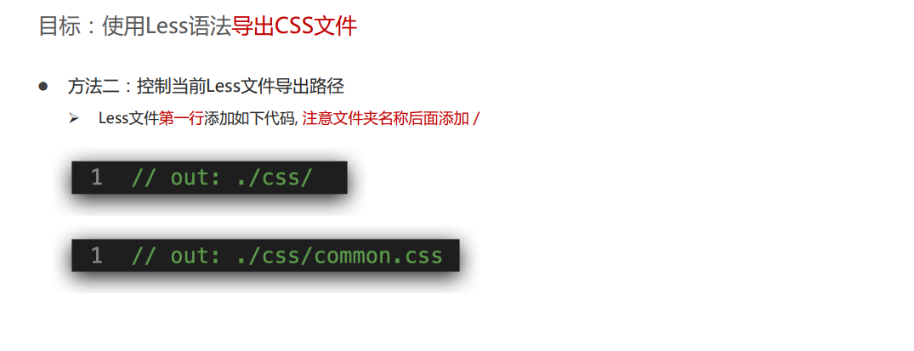
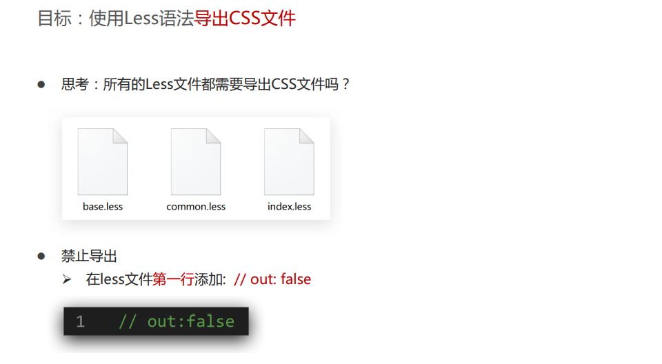

# Less Sass 快速编译生成 CSS 代码

---

## Less

- Less 是一个 CSS 预处理器, Less 文件后缀是.less
- 扩充了 CSS 语言, 使 CSS 具备一定的逻辑性、计算能力.
- 注意：浏览器不识别 Less 代码，目前阶段，网页要引入对应的 CSS 文件。

---

### Less 语法

---

## Sass

- 待补充
