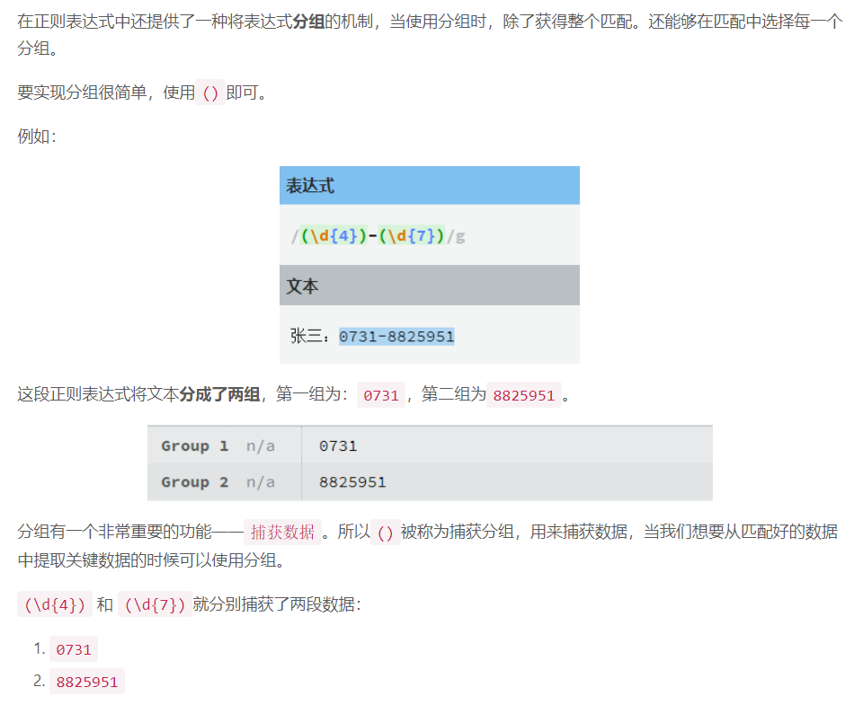
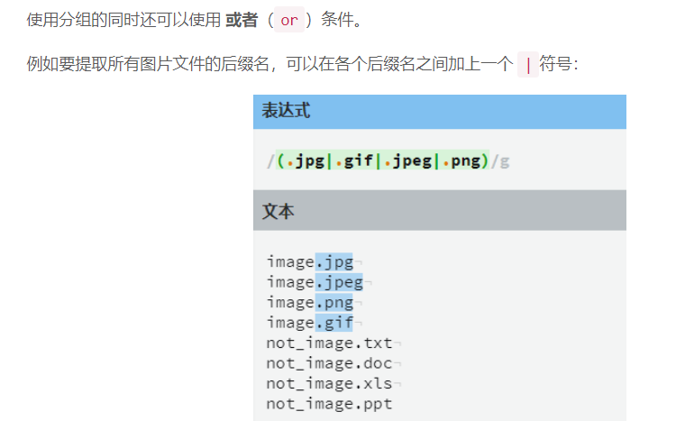
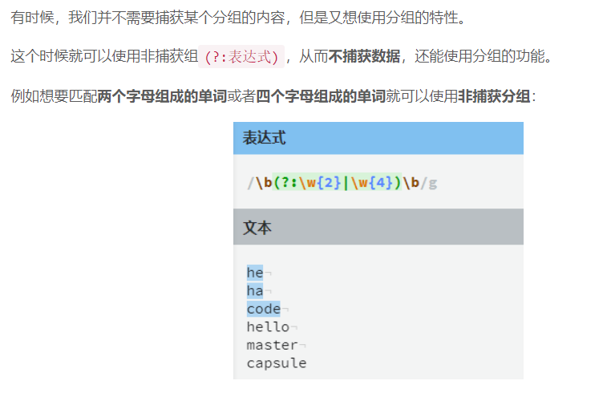
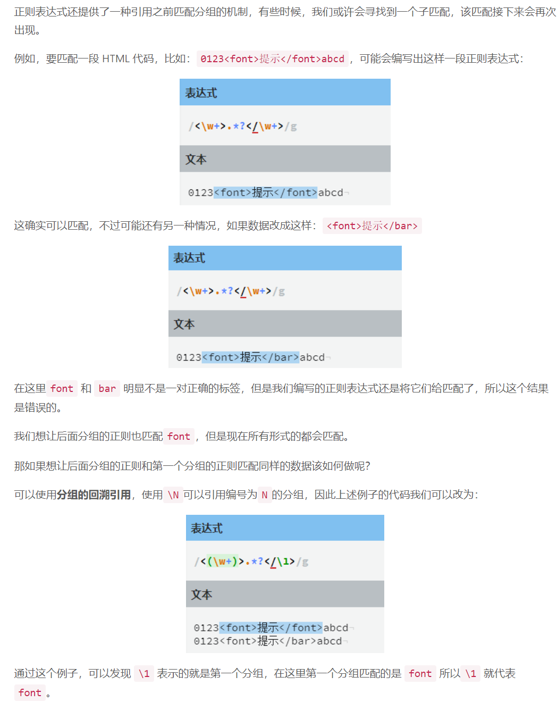
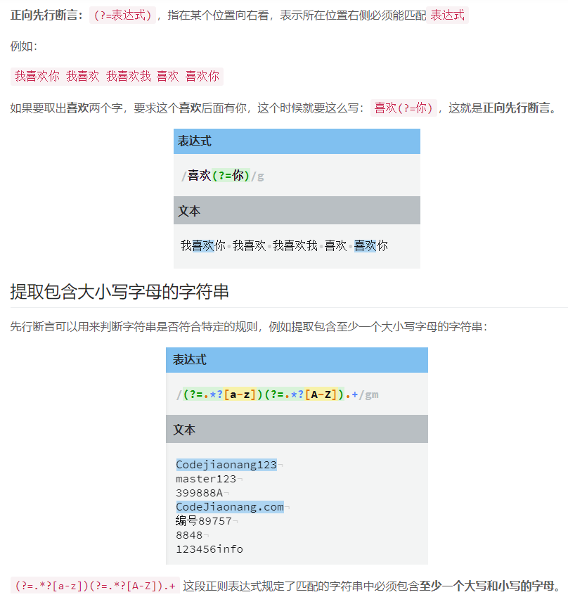
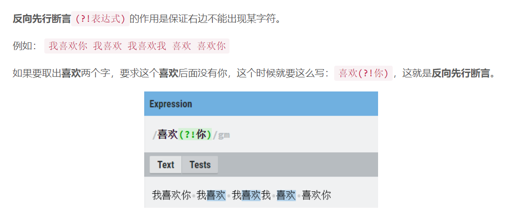
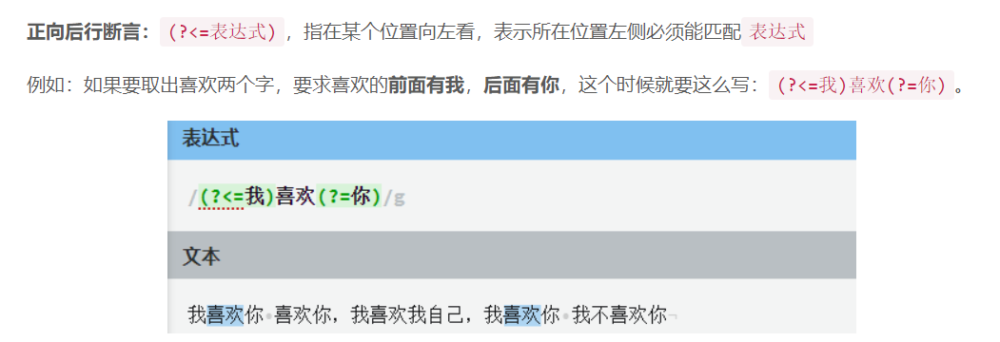
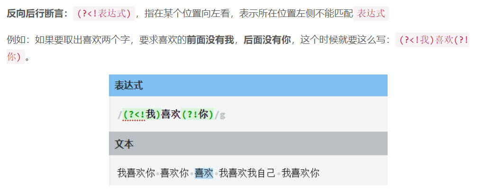

# Regular Expression

> 正则表达式，又称规则表达式。（英语：Regular Expression，在代码中常简写为 regex、regexp 或 RE），计算机科学的一个概念。正则表达式通常被用来检索、替换那些符合某个模式(规则)的文本。

> 许多程序设计语言都支持利用正则表达式进行字符串操作。例如，在 Perl 中就内建了一个功能强大的正则表达式引擎。正则表达式这个概念最初是由 Unix 中的工具软件（例如 sed 和 grep）普及开的。正则表达式通常缩写成“regex”，单数有 regexp、regex，复数有 regexps、regexes、regexen。

> 正则表达式是对字符串操作的一种逻辑公式，就是用事先定义好的一些特定字符、及这些特定字符的组合，组成一个“规则字符串”，这个“规则字符串”用来表达对字符串的一种过滤逻辑。

## 边界符

| 实例 | 描述                           |
| ---- | ------------------------------ |
| `^`  | 表示匹配行首的文本（以谁开始） |
| `$`  | 表示匹配行尾的文本（以谁结束） |

## 字符类

| 实例          | 描述                                  |
| ------------- | ------------------------------------- |
| `[Pp]ython`   | 匹配 `“Python” `或 `“python”`。       |
| `[abcdef]`    | 匹配中括号内的任意一个字母。          |
| `[0-9]`       | 匹配任何数字。类似于 `[0123456789]`。 |
| `[a-z]`       | 匹配任何小写字母。                    |
| `[A-Z]`       | 匹配任何大写字母。                    |
| `[a-zA-Z0-9]` | 匹配任何字母及数字。                  |
| `[^au]`       | 除了 `au` 字母以外的所有字符。        |
| `[^0-9]`      | 匹配除了数字外的字符。                |

## 量词符

| 实例    | 描述                                                                                            |
| ------- | ----------------------------------------------------------------------------------------------- |
| `.`     | 匹配除 `“\n”` 之外的任何单个字符。要匹配包括 `‘\n’` 在内的任何字符，请使用象 `‘[.\n]’` 的模式。 |
| `? `    | 匹配一个字符零次或一次，另一个作用是非贪婪模式                                                  |
| `+`     | 匹配 `1` 次或多次                                                                               |
| `{n} `  | 重复 `n` 次                                                                                     |
| `{n,}`  | 重复 `n` 次或多次                                                                               |
| `{n,m}` | 重复 `n` 到 `m` 次                                                                              |
| `\* `   | 匹配 `0` 次或多次                                                                               |
| `\b `   | 匹配一个长度为 `0` 的子串                                                                       |
| `\d `   | 匹配一个数字字符。等价于 `[0-9]`。                                                              |
| `\D `   | 匹配一个非数字字符。等价于 `[^0-9]`。                                                           |
| `\s `   | 匹配任何空白字符，包括空格、制表符、换页符等等。等价于 `[ \f\n\r\t\v]`。                        |
| `\S `   | 匹配任何非空白字符。等价于 `[^ \f\n\r\t\v]`。                                                   |
| `\w `   | 匹配包括下划线的任何单词字符。等价于`’[A-Za-z0-9_]’`。                                          |
| `\W `   | 匹配任何非单词字符。等价于 `‘[^a-za-z0-9_]‘`。                                                  |

## 分组

### 非捕获分组

### 回溯引用

## 先行断言

> 很多人也称先行断言和后行断言为环视，也有人叫预搜索，其实叫什么无所谓，重要的是知道如何使用它们！

- 先行断言和后行断言总共有四种：
  - 正向先行断言
  - 反向先行断言
  - 正向后行断言
  - 反向后行断言

### 正向先行断言

### 反向先行断言

### 正向后行断言

### 反向后行断言

